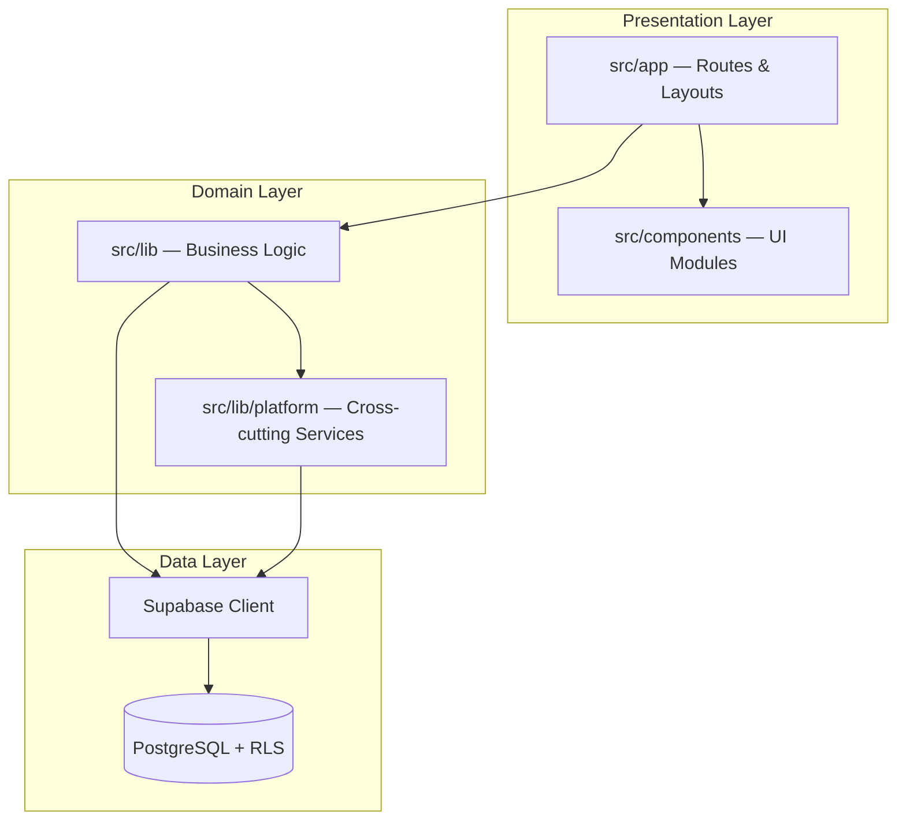
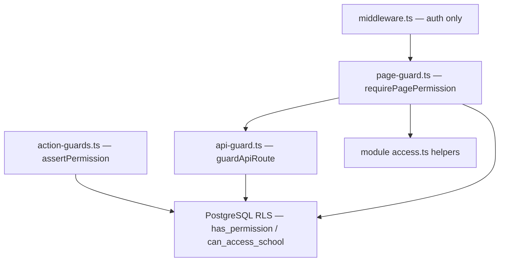
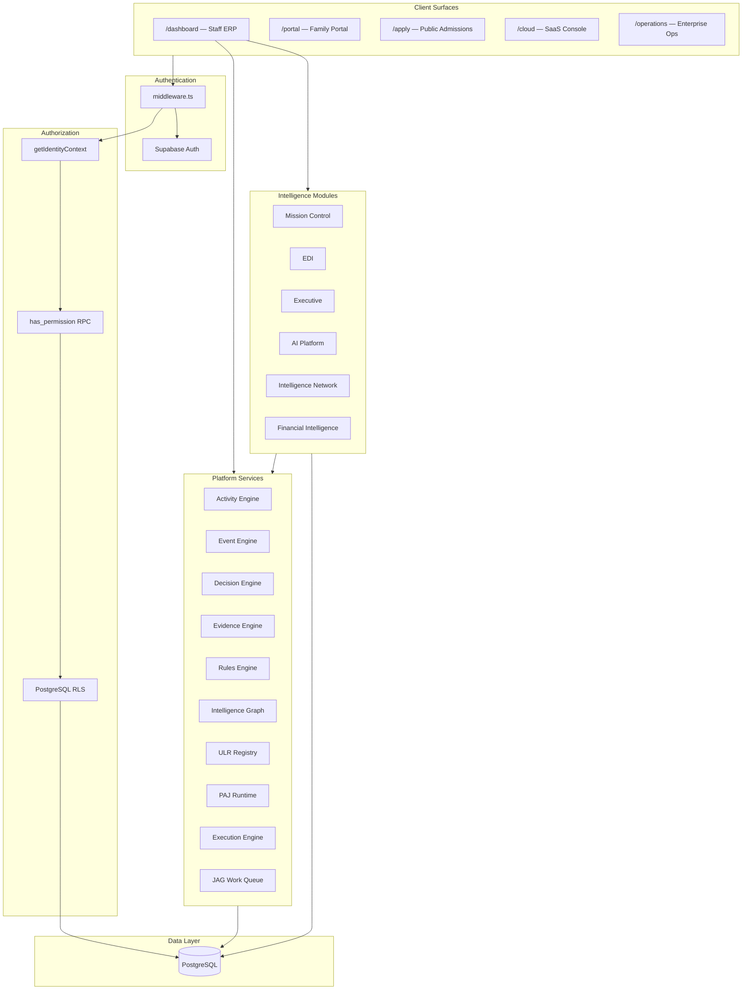

# The JAG OS — Current Architecture Report

**Document:** `CURRENT_ARCHITECTURE_REPORT.md`  
**Prepared by:** Chief Software Architect  
**Date:** July 5, 2026  
**Scope:** Full codebase analysis (read-only)  
**Repository:** `school-platform` (AcademyOS / The JAG OS)

---

## Executive Summary

The JAG OS is a **Next.js 16 App Router** education operating system built as a **server-first React 19** application backed by **Supabase** (PostgreSQL + Auth + RLS). It serves multiple product surfaces from a single monorepo:

| Surface | Route prefix | Audience |
|---------|--------------|----------|
| Staff ERP Dashboard | `/dashboard` | School executives, admissions, finance, HR, teachers |
| Parent/Student Portal | `/portal` | Families and students |
| Public Admissions | `/apply` | Prospective families |
| Cloud Console | `/cloud` | SaaS platform operators |
| Operations Center | `/operations` | Enterprise operations staff |

The architecture is **modular but monolithic**: domain logic lives in `src/lib/`, UI in `src/components/`, and routes in `src/app/`. A **Phase 2 platform services layer** (`src/lib/platform/`) provides cross-cutting engines (activity, events, decisions, evidence, rules, intelligence graph, ULR, PAJ) consumed by ERP modules. Intelligence is distributed across **Mission Control, EDI, Executive, AIP, AIN, and Financial Intelligence** rather than a single module.

**Scale indicators:**
- ~227 route pages, 30 layouts, 26 API handlers
- 154 SQL migrations
- ~740+ files under `src/lib/`
- 11 build-time registry validation scripts (run on every `npm run build`)
- 130+ permission keys in the enterprise RBAC catalog

---

## 1. Overall Application Architecture

### 1.1 Technology Stack

| Layer | Technology |
|-------|------------|
| Framework | Next.js 16.2.9 (App Router) |
| UI | React 19.2.4, Tailwind CSS 4 |
| Database | Supabase PostgreSQL |
| Auth | Supabase Auth via `@supabase/ssr` |
| ORM | None — direct Supabase client queries |
| Types | Manual `src/types/database.ts` mirror |
| Testing | Vitest (unit/integration), Playwright (smoke) |
| Validation | Custom `tsx` registry validators at build time |

### 1.2 Architectural Layers



### 1.3 Server-First Rendering Model

The application follows a strict **server component default**:

- All `page.tsx` and `layout.tsx` files are **async Server Components** (no `"use client"` in route files).
- Data fetching occurs at the server boundary via `createAuthClient()` from `src/lib/supabase/server-auth.ts`.
- Client components are isolated to interactive shells: `DashboardShell`, `Sidebar`, `TopNav`, forms, and navigation state.
- Next.js 15+ async patterns are used: `searchParams: Promise<{...}>` in page props.

### 1.4 Request Lifecycle

```
Browser Request
    → middleware.ts (auth + password-reset gate)
    → Segment layout (auth re-check, permission gate)
    → page.tsx (thin wrapper, often Suspense)
    → *PageContent.tsx or inline async server component (data fetch)
    → Domain lib functions (queries, actions)
    → Supabase client (RLS-enforced)
    → PostgreSQL
```

### 1.5 Platform Services (Phase 2 Foundation)

Canonical cross-cutting services are documented in `docs/architecture/platform-services.md` and exported from `src/lib/platform/services/index.ts`:

| Service | Path | Purpose |
|---------|------|---------|
| Activity Engine | `src/lib/platform/activity/` | Canonical write path for state-change events |
| Relationship Engine | `src/lib/platform/relationships/` | Universal entity relationships |
| Tagging System | `src/lib/platform/tags/` | Org-scoped tags on any entity |
| Notes System | `src/lib/platform/notes/` | Polymorphic notes with visibility |
| Event Engine | `src/lib/platform/events/` | Registry-backed pub/sub with persistence |
| Decision Engine | `src/lib/platform/decision/` | Rule/AI recommendations with audit |
| Knowledge & Evidence Engine (KEE) | `src/lib/platform/evidence/` | Learning evidence per Doc 27 |
| Rules Engine | `src/lib/platform/rules/` | Business rules with explainable evaluation |
| Intelligence Graph | `src/lib/platform/intelligence-graph/` | Persistent relationship layer for traversal |
| Universal Learning Registry (ULR) | `src/lib/platform/ulr/` | Domains → atomic skills learning model |
| Personal Learning Journey (PAJ) | `src/lib/platform/paj/` | Journey lifecycle, mastery, progression |
| Execution Engine | `src/lib/platform/execution-engine/` | Workspace pipeline resolution |
| JAG Work | `src/lib/platform/jag-work/` | Work queue perspectives per workspace |
| Automation / Mission Control | `src/lib/platform/automation/` | Queues, mission control items |
| Operational Loop | `src/lib/platform/operational-loop/` | JAG lifecycle diagnostics |

### 1.6 Build-Time Registry Validation

Every production build runs 10 validation scripts before `next build`:

```
validate:platform, validate:admissions, validate:workflow, validate:decision,
validate:events, validate:intelligence-graph, validate:automation,
validate:ulr, validate:hierarchy, validate:execution-engine
```

This enforces consistency between in-memory registries (ULR, intelligence graph, workflow, rules, events, automation) and their canonical definitions.

### 1.7 Documentation Corpus

Beyond code, the repository contains extensive governance and blueprint documentation (largely untracked in git at time of analysis):

- `docs/blueprints/academy-way-learning-system/` — 50+ learning system blueprints
- `docs/constitution/` — Global education and ecosystem intelligence frameworks
- `docs/governance/jag-knowledge-system/` — Knowledge domains, concept libraries, competency libraries
- `docs/architecture/` — Platform services, profile registry, testing strategy

---

## 2. Route Structure

### 2.1 Top-Level Segments

| Segment | Pages | Layout | Purpose |
|---------|-------|--------|---------|
| `/` | 1 | Root only | Redirects to `/login` |
| `/login` | 2 | Root only | Authentication + password reset |
| `/dashboard` | ~158 | `dashboard/layout.tsx` + 24 nested layouts | Staff ERP |
| `/portal` | 15 | `portal/layout.tsx` | Parent/student portal |
| `/apply` | 5 | `apply/layout.tsx` | Public admissions |
| `/cloud` | 22 | `cloud/layout.tsx` | SaaS cloud console |
| `/operations` | 23 | `operations/layout.tsx` | Enterprise ops center |
| `/admin` | 1 | Root only | Legacy admin scholarship page |
| `/api` | 26 handlers | N/A | Export, import, search, reports |

### 2.2 Layout Hierarchy

```
src/app/layout.tsx (root: html/body, globals.css)
├── /login, /apply, /admin (no segment layout)
├── /dashboard/layout.tsx (auth + DashboardShell)
│   ├── admissions/layout.tsx
│   ├── automation/layout.tsx
│   ├── ceo/layout.tsx
│   ├── certification/layout.tsx
│   ├── compliance/layout.tsx
│   ├── data/layout.tsx
│   ├── employee/layout.tsx
│   ├── executive/layout.tsx
│   ├── finance/layout.tsx
│   ├── hr/layout.tsx
│   ├── integrations/layout.tsx
│   ├── intelligence/layout.tsx
│   ├── mission-control/layout.tsx
│   ├── network/layout.tsx
│   ├── platform/layout.tsx
│   ├── playbooks/layout.tsx
│   ├── projects/layout.tsx
│   ├── scheduling/layout.tsx
│   ├── scholarships/layout.tsx
│   ├── students/layout.tsx
│   ├── tasks/layout.tsx
│   ├── teacher/layout.tsx
│   ├── work/layout.tsx
│   └── workload/layout.tsx
├── /portal/layout.tsx (PortalShell)
├── /cloud/layout.tsx (canAccessCloudConsole)
└── /operations/layout.tsx (canAccessOperationsCenter)
```

### 2.3 Dashboard Route Tree (First Segment)

| Segment | Approx. Routes | Notes |
|---------|----------------|-------|
| `/dashboard` (root) | 1 | Executive Home — metrics + QuickLaunchGrid |
| `admin/` | 25 | Configuration studio, org/users/roles, campuses |
| `admissions/` | 11 | CRM, leads `[id]`, cases `[id]`, workflows |
| `automation/` | 1 | Workflow marketplace |
| `certification/` | 15 | Index redirects to `overview/` |
| `ceo/` | 1 | Redirects to `/dashboard/executive` |
| `compliance/` | 1 | Enterprise compliance center |
| `data/` | 12 | Enterprise Data Platform hub |
| `employee/` | 1 | Self-service portal |
| `executive/` | 18 | Executive Intelligence module |
| `families/[id]/` | 1 | Family detail |
| `finance/` | 4 | Main + `intelligence/`, `executive/`, `families/[id]/` |
| `hr/` | 2 | Main + `employees/[employeeId]/` |
| `integrations/` | 23 | Index redirects to `dashboard/` |
| `intelligence/` | 10 | AI Platform (AIP) hub |
| `mission-control/` | 1 | Operational command center |
| `network/` | 13 | Intelligence Network (AIN) |
| `platform/` | 1 | Diagnostics |
| `playbooks/`, `projects/`, `tasks/`, `work/`, `workload/` | 5 | Work management cluster |
| `scheduling/`, `students/`, `teacher/`, `scholarships/` | Module roots + dynamic routes |
| `search/`, `settings/preferences/` | Utility |
| `workspace-design-system/` | 1 | Internal design system showcase |

### 2.4 Dynamic Route Segments

- `students/[id]`
- `families/[id]`
- `admissions/leads/[id]`, `admissions/leads/new`, `admissions/cases/[id]`
- `finance/families/[id]`
- `hr/employees/[employeeId]`
- `teacher/students/[id]`, `teacher/sessions/[id]`, `teacher/executive`
- `portal/students/[studentId]`
- `apply/portal/[applicationId]`

### 2.5 API Routes (26 handlers)

| Category | Routes |
|----------|--------|
| Reports/Export | `executive/board-export`, `finance/board-export`, `edi/board-report`, `edi/reports`, `compliance/reports`, `work/reports`, `financial-intelligence/reports`, `network/reports`, `certification/reports` |
| Data | `data/import`, `data/export`, `data/docs`, `financial-intelligence/import` |
| Admissions | `admissions/process-communications`, `admissions/funding-export` |
| Platform | `platform/search`, `platform/process-queues` |
| Intelligence | `intelligence/context`, `intelligence/docs` |
| Other | `scholarship`, `ssis/funding-export`, `configuration/export`, `portal/calendar.ics`, `compliance/calendar.ics`, `cloud/docs`, `integrations/docs` |

### 2.6 Page Composition Patterns

**Pattern A — Thin page + `*PageContent` + Suspense** (modernized JAG work-queue modules):

| Page | PageContent |
|------|-------------|
| `executive/page.tsx` | `ExecutivePageContent.tsx` |
| `students/page.tsx` | `StudentsPageContent.tsx` |
| `admissions/page.tsx` | `AdmissionsPageContent.tsx` |
| `scheduling/page.tsx` | `SchedulingPageContent.tsx` |
| `teacher/page.tsx` | `TeacherPageContent.tsx` |
| `finance/page.tsx` | `FinancePageContent.tsx` |
| `finance/intelligence/page.tsx` | `IntelligencePageContent.tsx` |
| `hr/page.tsx` | `HrPageContent.tsx` |
| `compliance/page.tsx` | `CompliancePageContent.tsx` |
| `work/page.tsx` | `WorkPageContent.tsx` |
| `teacher/sessions/[id]/page.tsx` | `InstructionSessionPageContent.tsx` |

**Pattern B — Inline async server page** (most platform sub-pages: integrations, data, intelligence, executive sub-routes, admin).

**Pattern C — Redirect index pages** (`/dashboard/ceo` → executive, `/dashboard/network` → benchmarks, `/dashboard/certification` → overview, `/dashboard/integrations` → dashboard).

**Pattern D — Permission gates** in nested layouts via `requirePagePermission()` or custom `canView*` + `redirect()`.

---

## 3. Dashboard Architecture

### 3.1 Three-Layer Navigation Model

The dashboard sidebar (`src/components/dashboard/Sidebar.tsx`) organizes navigation into:

1. **Modules** — Core ERP functions defined in `DASHBOARD_MODULES` (`src/lib/dashboard/navigation.ts`):

| Module ID | Route | Label |
|-----------|-------|-------|
| executive | `/dashboard` | Executive Home |
| admissions | `/dashboard/admissions` | Admissions |
| students | `/dashboard/students` | Student Success |
| scheduling | `/dashboard/scheduling` | Scheduling |
| teacher | `/dashboard/teacher` | Teacher Workspace |
| scholarships | `/dashboard/scholarships` | Scholarships |
| finance | `/dashboard/finance` | Finance |
| hr | `/dashboard/hr` | Workforce |

2. **Platform** — Cross-cutting capabilities linked from sidebar footer:
   - Mission Control, Executive Intelligence, Compliance, Work Management
   - Workflow Marketplace, Financial Intelligence, Intelligence Network
   - Operations Center, Cloud Console, Intelligence Platform (AIP)
   - Data Platform, Certification Center, Integration Hub
   - Administration, Global Search, My Preferences, Employee Portal

3. **Nested sub-apps** — Each platform area has its own nav shell (`ExecutiveNav`, `AipNav`, `AinNav`, `EdpNav`, `IntHubNav`, `CertNav`, etc.)

### 3.2 Dashboard Shell

`src/app/dashboard/layout.tsx`:
1. Validates Supabase auth (redirect `/login` if missing)
2. Enforces password reset requirement
3. Loads `getIdentityContext()` for permissions, org scope, impersonation
4. Fetches staff notifications
5. Wraps children in `DashboardShell` (client component)

`DashboardShell` provides:
- Responsive sidebar with module/platform navigation
- Top navigation bar with user profile, notifications, logout
- Impersonation banner when active

### 3.3 Executive Home vs Executive Intelligence

Two distinct executive surfaces exist:

| Route | Component | Purpose |
|-------|-----------|---------|
| `/dashboard` | `page.tsx` (inline) | Welcome landing with key metrics (`StatCard`), `QuickLaunchGrid`, link to Executive Intelligence |
| `/dashboard/executive` | `ExecutivePageContent.tsx` | Full Executive Intelligence module with work queue, command center, 16 sub-routes |

`/dashboard/ceo` redirects to `/dashboard/executive`.

### 3.4 Experience System Integration

Modernized modules use the **JAG Experience System** (`src/components/experience-system/`):

- `*ExperienceShell` wrappers (e.g., `ExecutiveExperienceShell`)
- `JagWorkPanel` — work queue rendering
- `JagOrganizationContextBar/Panel` — org scope display
- `MetricCard`, `QuickActions`, `ExecutionPipeline`
- Fed by `executeWorkspace()` + `resolveJagWorkQueue()` from platform engines

### 3.5 Domain Module UI Pattern

Repeated across ~12 product areas:

| Artifact | Examples |
|----------|----------|
| `*Nav.tsx` | `ExecutiveNav`, `AipNav`, `AinNav`, `EdpNav`, `IntHubNav` |
| `*Panels.tsx` | `ExecutivePanels`, `AipPanels`, `AinPanels`, `FiPanels`, `EdiPanels` |
| `*Hub.tsx` | `AipHub`, `AdminHub`, `ConfigStudioHub` |
| `*PageContent.tsx` | Async server components for primary module pages |

### 3.6 Profile Workspace Pattern

Reusable entity profile shell used across students, families, employees, and admissions:

- `src/components/platform/profile-workspace/` — `ProfileWorkspaceShell`, section nav/renderer
- `src/components/platform/profile-sections/` — shared section components
- Lib mirrors: `src/lib/students/profile/`, `families/profile/`, `employees/profile/`, `admissions/profile/`
- Platform abstraction: `src/lib/platform/profile/`, `src/lib/platform/jag-profile/`

---

## 4. Authentication Flow

### 4.1 Provider

**Supabase Auth exclusively** — no Clerk, NextAuth, or other providers in the codebase.

| Client | File | Usage |
|--------|------|-------|
| Browser | `src/lib/supabase/client.ts` | Login, logout, client forms |
| Server (primary) | `src/lib/supabase/server-auth.ts` | All server components, actions, API routes |
| Service role | `src/lib/supabase/server.ts` | **Unused** — potential dead code |

Users in `public.users` share UUID with `auth.users` (migration `002_users_auth_fkey.sql`).

### 4.2 Middleware (Edge Auth Gate)

`middleware.ts` — authentication only, **not authorization**:

1. Creates Supabase server client from request cookies
2. Calls `supabase.auth.getUser()`
3. Protects page prefixes: `/dashboard`, `/cloud`, `/operations`, `/admin`, `/portal`, `/apply/portal`
4. Protects `/api/*` except public allowlist (`src/lib/auth/must-reset-password.ts`)
5. Unauthenticated → redirect `/login?next=<path>` (pages) or `401 JSON` (API)
6. Enforces `user_metadata.must_reset_password` → redirect `/login/reset-required`

### 4.3 Login Flow

```
/login/LoginForm.tsx
    → supabase.auth.signInWithPassword()
    → Check must_reset_password metadata
    → Redirect to /login/reset-required OR next param OR /dashboard
```

### 4.4 Password Reset Gate

- Flag: `user.user_metadata.must_reset_password` in Supabase Auth
- Shared logic: `src/lib/auth/must-reset-password.ts`
- Reset form: `src/app/login/reset-required/ResetRequiredForm.tsx` (≥12 char requirement)
- Enforced at: middleware, dashboard layout, API guard

### 4.5 Logout

Client-side in `TopNav.tsx` and `ShellUserProfile.tsx`:
```
supabase.auth.signOut() → redirect /login
```

### 4.6 Two-Tier Session Model

| Layer | Function | Contains |
|-------|----------|----------|
| Basic | `getSessionUser()` (`src/lib/auth/session.ts`) | Auth identity, role names, `primaryRole`, `roleLabel` |
| Full | `getIdentityContext()` (`src/lib/platform/identity/context.ts`) | Permissions, org assignments, school scope, impersonation, preferences, enterprise admin flags |

**Rule:** Use `getIdentityContext()` for any authorization decision.

### 4.7 Impersonation

- Cookie: `aos_impersonate_session`
- Requires `impersonate.users` permission (CEO/FOUNDER/EXECUTIVE_DIRECTOR)
- `getIdentityContext()` switches `effectiveUserId` to target user
- Logs to `platform_security_events`
- UI banner in `DashboardShell`

### 4.8 Future Auth (Architected, Not Enforced)

- MFA: `src/lib/platform/identity/mfa.ts` — tables/settings exist, no enforcement
- SSO: `src/lib/platform/identity/sso.ts` — provider config exists, email/password remains primary

---

## 5. Role and Permission System

### 5.1 Data Model

**Phase 1** (`001_phase1_core_foundation.sql`):
- `roles`, `user_roles` — many-to-many user ↔ role

**Enterprise Identity Sprint 1.7** (`074_enterprise_identity_foundation.sql`):
- Extended `roles` with `display_name`, `parent_role_id` (inheritance), `is_custom`
- `platform_permissions` — permission catalog (~130 keys)
- `platform_role_permissions` — allow/deny matrix per role
- `user_org_assignments` — multi-school scoping
- `platform_impersonation_sessions`, `user_preferences`, security events

### 5.2 Role Hierarchy

Postgres function `user_role_ids(check_user_id)` recursively walks `roles.parent_role_id`:

```
CEO → EXECUTIVE_DIRECTOR → REGIONAL_DIRECTOR → SCHOOL_LEADER
SCHOOL_LEADER → ADMISSIONS
EMPLOYEE → TEACHER
```

**Enterprise admin roles** (`CEO`, `FOUNDER`, `EXECUTIVE_DIRECTOR`) bypass all permission checks at SQL and application layers.

### 5.3 Permission Catalog

Canonical keys in `src/lib/platform/identity/types.ts` → `PERMISSION_KEYS` / `PermissionKey`.

Sample categories:
- Org/users: `org.view`, `users.manage`, `roles.manage`
- Modules: `admissions.manage`, `finance.view`, `hr.manage`, `students.view`
- Executive: `executive.intelligence`, `executive.board_reports`, `edi.view`
- Platform: `mission_control.access`, `data.admin`, `ai.platform`, `cloud.admin`
- Portal: `portal.parent.access`, `portal.student.access`
- Compliance: `compliance.view`, `compliance.reports`, `ferpa.view_iep`

### 5.4 Permission Resolution

**Database layer:**
- `has_permission(permission_key)` — deny-first, then allow via `user_role_ids()` + `platform_role_permissions`
- `has_role(role_name)` — simple role name check
- `can_access_school(school_id)` — school-scoped RLS

**Application layer** (`src/lib/platform/identity/permissions.ts`):
- `userHasPermission()` — RPC call with `ROLE_PERMISSION_FALLBACK` for undeployed migrations
- `requirePermission()` — returns `{ ok: false, error: "Forbidden" }`
- `loadUserPermissions()` — full permission set
- `getMissionControlModulesForUser()` — permission → dashboard module mapping

### 5.5 Guard Layers



| Guard | File | Usage |
|-------|------|-------|
| Page | `src/lib/platform/identity/page-guard.ts` | 90+ layout/page invocations |
| API | `src/lib/platform/identity/api-guard.ts` | API route handlers |
| Action | `src/lib/platform/identity/action-guards.ts` | Server actions |
| Cloud | `src/lib/cloud-platform/page-guard.ts` | Cloud console |
| Operations | `src/lib/operations-platform/page-guard.ts` | Ops center |
| Domain | `executive/access.ts`, `hr/access.ts`, `portal-access.ts`, etc. | Module-specific |

### 5.6 School-Level Access

- App: `IdentityContext.accessibleSchoolIds` + `canAccessSchool()` in `school-access.ts`
- DB: RLS via `can_access_school()`, `is_assigned_to_school()`, `is_enterprise_admin()`
- Enterprise admins get unrestricted school access

### 5.7 Portal Access

`src/lib/platform/identity/portal-access.ts`:
- Parent: `portal.parent.access` + guardian/family linkage
- Student: `portal.student.access` + `students.user_id` linkage
- Record-level: `assertParentStudentAccess()`, `assertStudentSelfAccess()`

### 5.8 Data Classification

`src/lib/platform/identity/classification.ts` — FERPA/sensitivity tiers via `can_access_classification` RPC.

### 5.9 RBAC Integrity

`042_rbac_integrity_lock.sql` documents required chain:
```
auth.uid() → user_roles → roles → has_role() → is_assigned_to_school() → can_access_school()
```

---

## 6. Database Structure

### 6.1 Overview

- **154 SQL migrations** in `supabase/migrations/`
- **No ORM** — direct Supabase queries with manual TypeScript types
- **RLS everywhere** — policies applied incrementally across migrations
- Local config: `supabase/config.toml` (ports 54321/54322)

### 6.2 Schema Layers

| Layer | Key Migrations | Tables (sample) |
|-------|----------------|-----------------|
| Phase 1 Core | `001` | `schools`, `users`, `roles`, `students`, `student_family_link` |
| Org / SIS | `044`, `053`, `078` | `org_organizations`, `campuses`, `families`, `sis_enrollments` |
| Admissions | `050`, `068` | `admissions_leads`, `admissions_applications`, communication queue |
| Finance / HR | `054`, `055` | `invoices`, `payments`, `positions`, `payroll_records` |
| Platform Automation | `072` | `platform_mission_control_items`, `platform_queue_jobs` |
| Phase 2 Platform Services | `132`–`154` | Activity, events, decisions, evidence, rules, graph, ULR, PAJ |
| Enterprise Identity | `074`, `077` | `platform_permissions`, `platform_role_permissions`, `user_org_assignments` |
| AIP (AI Platform) | `110` | `aip_provider_definitions`, `aip_prompts`, job queue |
| AIN (Intelligence Network) | `126` | `ain_participation_settings`, `ain_benchmark_snapshots` |
| EDI (Executive Decision Intel) | `104` | `edi_recommendations`, `edi_scenarios`, `edi_briefings` |
| Financial Intelligence | `102` | FI-specific analytics tables |
| Integration Hub | `118` | `ihub_events`, connectors, marketplace |
| Certification | `114`–`116` | Certification readiness tables |
| Cloud / Operations | `112`, `124` | SaaS and enterprise ops tables |
| Work Management | `100` | Work items, assignments, reports |

### 6.3 Phase 2 Platform Tables (Migration 132–154)

| Migration | Tables |
|-----------|--------|
| 132–133 | `platform_activity_events`, relationships, tags, notes |
| 138–139 | `platform_event_records` |
| 140–141 | `platform_decision_records` |
| 142–143 | `platform_evidence_records` |
| 144–145 | `platform_rule_evaluation_records` |
| 146–147 | `platform_graph_edges` |
| 148–152 | `platform_ulr_domains`, `_strands`, `_sub_strands`, `_competencies`, atomic skills |
| 153–154 | PAJ journey, enrollment, placement, progress tables |

### 6.4 TypeScript Schema Mirror

`src/types/database.ts` (~2,160 lines):
- Header states: "mirrors supabase/migrations (Phase 1 + Sprint 1)"
- Exports `Database` interface used by `createClient<Database>`
- **Significantly out of date** — missing Phase 2 platform tables, ULR, graph, AIP, AIN, EDI, IHUB, PAJ
- Retains deprecated aliases: `prospects` → `admissions_leads`

### 6.5 RLS Patterns

- Helper functions: `has_role()`, `is_assigned_to_school()`, `can_access_school()`, `has_permission()`
- Policies recreated across multiple migrations (e.g., `students_select_school_scoped` in migrations 024–079)
- Idempotent style: `create table if not exists`, `drop policy if exists`

### 6.6 Dual-Write Legacy

Activity Engine dual-writes to:
- Canonical: `platform_activity_events`
- Legacy: `platform_timeline_events`
- Fan-out: Integration Hub `ihub_events`

Documented in `platform-services.md` as incomplete migration path.

---

## 7. Shared Components

### 7.1 UI Layer Architecture

```
workspace-design-system (primitives, 37 files)
        ↓
experience-system (interaction layer, 19 files)
        ↓
domain modules (*Panels, *Nav, profile workspaces)
        ↓
src/components/ui (minimal shared widgets, 7 files)
```

### 7.2 Workspace Design System (WDS)

`src/components/workspace-design-system/`:
- **Shell:** `GlobalShell`, `ShellHeader`, `ShellNavigation`, `WorkspaceSwitcher`
- **Layout:** `WorkspaceLayout`, `LeftNav`, `InsightPanel`
- **Cards:** `StudentCard`, `CompetencyCard`, `EvidenceCard`, `RecommendationCard`, etc.
- **Data:** `DataTables`, `Charts`, `Timelines`, `ExecutionPipeline`
- **Tokens:** `tokens.ts`, `utils.ts` (`cn()` helper)
- Showcase: `/dashboard/workspace-design-system`

### 7.3 Experience System (XES)

`src/components/experience-system/` — intended consumption layer for all workspaces:
- Navigation: `GlobalNavigation`, `Breadcrumbs`, `UniversalSearch`, `RecentItems`, `Favorites`
- Framework: `PageLayout`, `PageHeader`, `ActionBar`, context/insight/activity regions
- Cards: Re-exports overlapping WDS cards
- Work: `JagWorkPanel`, `ExperienceWorkspaceShell`
- AI: `HumanApprovalGate`

### 7.4 Minimal UI Library

`src/components/ui/` (7 files, custom Tailwind — no shadcn/Radix):
- `PageHeader`, `EmptyState`, `ModuleTabs`, `ViewTabs`
- Funding: `FundingBreakdown`, `FundingSourceCheckboxes`, `FundingSourceBadges`

### 7.5 Dashboard Shell Components

`src/components/dashboard/`:
- `DashboardShell` — main layout wrapper (client)
- `Sidebar` — module + platform navigation (client)
- `TopNav` — user profile, notifications, logout (client)
- `StatCard`, `QuickLaunchGrid`, `ModuleIcons`

### 7.6 Platform Profile Workspace

`src/components/platform/profile-workspace/`:
- `ProfileWorkspaceShell`, `ProfilePrimitives`, section nav/renderer
- Used by: students, families, employees, admissions case profiles

### 7.7 Domain Panel Components

| Domain | Components |
|--------|------------|
| Executive | `ExecutivePanels`, `CommandCenterDashboard`, `OperationalLoopDashboard`, `ExecutiveNav` |
| EDI | `EdiPanels` |
| AIP | `AipHub`, `AipPanels`, `AipNav` |
| AIN | `AinPanels`, `AinNav` |
| FI | `FiPanels` |
| EDP | `EdpHub`, `EdpShell` |
| Integration Hub | `IntHubShell`, `IntHubNav` |
| Certification | `CertNav`, certification panels |
| Admissions | `CommunicationTimeline`, `EnrollmentPacketPanel`, pipeline boards |
| Instruction | `EvidenceLibraryFilters`, session components |

---

## 8. Intelligence-Related Modules

Intelligence is distributed across platform services and release modules, not a single subsystem.

### 8.1 Platform Intelligence Services

| Service | Location | Function |
|---------|----------|----------|
| Intelligence Graph | `src/lib/platform/intelligence-graph/` | Persistent edges, traversal, neighborhood/path queries, providers (activity, events, evidence, rules) |
| Decision Engine | `src/lib/platform/decision/` | Registry-backed recommendations with scoring and audit |
| Rules Engine | `src/lib/platform/rules/` | Explainable business rule evaluation |
| Operational Loop | `src/lib/platform/operational-loop/` | JAG lifecycle diagnostics, gap reports, recovery |
| Execution Engine | `src/lib/platform/execution-engine/` | Workspace pipeline, navigation, recommendations |
| JAG Work | `src/lib/platform/jag-work/` | Per-workspace work queue resolution (executive, students, admissions, finance, HR, scheduling, teacher) |

### 8.2 Release Product Modules

| Module | Lib | DB Prefix | Dashboard |
|--------|-----|-----------|-----------|
| **Mission Control** | `src/lib/platform/automation/` | `platform_mission_control_*` | `/dashboard/mission-control` |
| **EDI** (Executive Decision Intelligence) | `src/lib/edi/` | `edi_*` | `/dashboard/executive/decisions`, scenarios, optimization |
| **Executive** | `src/lib/executive/` | aggregates many tables | `/dashboard/executive/*` |
| **AIP** (AI Platform) | `src/lib/intelligence-platform/` | `aip_*` | `/dashboard/intelligence/*` |
| **AIN** (Intelligence Network) | `src/lib/intelligence-network/` | `ain_*` | `/dashboard/network/*` |
| **Financial Intelligence** | `src/lib/financial-intelligence/` | FI tables | `/dashboard/finance/intelligence` |
| **Scheduling Intelligence** | `src/lib/scheduling/intelligence.ts` | `schedule_conflicts` | scheduling dashboard |
| **HR Analytics** | `src/lib/hr/analytics.ts` | HR tables | executive command center |

### 8.3 Mission Control as Integration Hub

`src/lib/platform/automation/mission-control-compose.ts` aggregates:
- Executive metrics (`executive/command-center.ts`)
- EDI scorecard/briefings
- Operational loop diagnostics
- Activity feed
- Network dashboard
- JAG work items

Multiple modules sync alerts via `sync*ToMissionControl`:
- `financial-intelligence/automation.ts`
- `edi/automation.ts`
- `finance/automation.ts`, `compliance/automation.ts`
- `scheduling/conflicts.ts`, `work/automation.ts`

### 8.4 Learning Intelligence (ULR + PAJ)

| Component | Path | Purpose |
|-----------|------|---------|
| ULR Registry | `src/lib/platform/ulr/` | In-memory + DB persistence for learning hierarchy |
| Structured Literacy Catalog | `src/lib/platform/ulr/catalog/structured-literacy/` | Doc 13 strands, Doc 98 PA competencies |
| PAJ Runtime | `src/lib/platform/paj/` | Journey lifecycle, mastery, progression, evidence processing |
| Instruction | `src/lib/instruction/` | Session delivery, outcomes, canonical progress |

### 8.5 Intelligence API Endpoints

- `POST /api/intelligence/context` — AI context assembly
- `GET /api/intelligence/docs` — documentation
- `GET /api/platform/search` — global search
- `POST /api/platform/process-queues` — queue processing

### 8.6 Intelligence Dashboard Routes

| Area | Routes |
|------|--------|
| Executive Intelligence | `/dashboard/executive` + 17 sub-routes |
| Mission Control | `/dashboard/mission-control` |
| AI Platform (AIP) | `/dashboard/intelligence` (prompts, policies, jobs, costs, providers, etc.) |
| Intelligence Network (AIN) | `/dashboard/network` (benchmarks, recommendations, forecasting, academics, etc.) |
| Financial Intelligence | `/dashboard/finance/intelligence` |
| Integration Hub Intel | `/dashboard/integrations/command-center` |

---

## 9. Executive Dashboard Implementation

### 9.1 Route Map

**Primary entry:** `/dashboard/executive`  
**Layout:** `src/app/dashboard/executive/layout.tsx`  
**Access:** `canAccessExecutiveIntelligence(ctx)` OR `canViewEdi(ctx)`  
**Navigation:** `ExecutiveNav.tsx` (17 items, client component)

### 9.2 Three Rendering Modes (`ExecutivePageContent.tsx`)

**Mode 1 — Default Work Queue** (`?work=<perspective>`, default: `today`):
1. `executeWorkspace({ workspaceKey: "executive", ... })`
2. `generateExecutiveInsights()` + `getCommandCenterMetrics()`
3. `resolveJagWorkQueue()` with executive work perspectives
4. Renders `ExecutiveExperienceShell` with:
   - Nav from execution engine (badged by queue counts)
   - Metric cards: work in queue, compliance alerts, strategic decisions, board ready
   - `JagWorkPanel`, `JagOrganizationContextBar/Panel`, `QuickActions`

**Mode 2 — Legacy Command Center** (`?view=command-center`):
- `CommandCenterDashboard` with enrollment, revenue, insights, deadline analytics, financial intelligence
- Data from `getCommandCenterMetrics()`, `getExecutiveInsights()`, `getExecutiveDeadlineAnalytics()`, `getExecutiveFinancialDashboard()`

**Mode 3 — Operational Loop** (`?view=operational-loop`):
- `OperationalLoopDashboard` with gap reports from `generateSchoolLoopGapReport()`
- JAG lifecycle transition audit

### 9.3 Executive Sub-Routes

| Route | Label | Data Source |
|-------|-------|-------------|
| `/dashboard/executive` | Command Center | Work queue (default) |
| `/dashboard/executive/decisions` | Decisions | EDI engine |
| `/dashboard/executive/recommendations` | Recommendations | EDI recommendations |
| `/dashboard/executive/scenarios` | EDI Scenarios | `edi_scenarios` |
| `/dashboard/executive/optimization` | Optimization | EDI optimization |
| `/dashboard/executive/capacity` | Capacity | Capacity planning |
| `/dashboard/executive/briefings` | Briefings | `edi_briefings` |
| `/dashboard/executive/network` | Network | Network intelligence |
| `/dashboard/executive/kpis` | KPIs | KPI dashboard |
| `/dashboard/executive/forecasting` | Forecasting | Forecasting engine |
| `/dashboard/executive/risk` | Risk | Risk register |
| `/dashboard/executive/strategic` | Strategic Plan | Strategic planning |
| `/dashboard/executive/compliance` | Compliance | Compliance view |
| `/dashboard/executive/grants` | Grants | Grants tracking |
| `/dashboard/executive/benchmarks` | Benchmarks | Benchmark analytics |
| `/dashboard/executive/board` | Board Reports | Board reporting |
| `/dashboard/executive/reports` | Report Studio | Report generation |

### 9.4 Supporting Libraries

| Library | Path | Role |
|---------|------|------|
| Access control | `src/lib/executive/access.ts` | Permission helpers |
| Command center | `src/lib/executive/command-center.ts` | Metrics aggregation |
| Insights | `src/lib/executive/insights.ts` | Insight generation |
| Risk | `src/lib/executive/risk-intelligence.ts` | Risk analysis |
| Reporting | `src/lib/executive/reporting.ts` | Report studio |
| EDI | `src/lib/edi/` | Decision intelligence engine |
| JAG Work | `src/lib/platform/jag-work/resolve-executive-work.ts` | Executive work queue |
| Financial Intel | `src/lib/financial-intelligence/executive.ts` | FI dashboard for command center |

### 9.5 API Integration

`src/app/api/executive/board-export/route.ts` — CSV board export guarded by `executive.board_reports`, `global.reporting`, or `finance.export`.

### 9.6 Relationship to Executive Home

| Aspect | `/dashboard` (Executive Home) | `/dashboard/executive` (Executive Intelligence) |
|--------|-------------------------------|--------------------------------------------------|
| Purpose | Welcome landing, quick metrics | Full decision-support module |
| Permission | Broad module permissions | `executive.intelligence` or EDI access |
| UI | `StatCard` + `QuickLaunchGrid` | Experience System work queue + 17 sub-routes |
| Data | `getDashboardMetrics()` | Command center, EDI, operational loop, JAG work |

---

## 10. Technical Debt

### 10.1 Critical

| Issue | Impact | Location |
|-------|--------|----------|
| **`database.ts` severely out of date** | No compile-time safety for Phase 2+ tables; queries against untyped tables | `src/types/database.ts` |
| **Middleware auth-only** | Logged-in users can hit any protected URL; unauthorized users redirected to `/dashboard` not `/login` | `middleware.ts` |
| **Unused service-role client** | Dead code / potential security footgun if accidentally used | `src/lib/supabase/server.ts` |

### 10.2 High

| Issue | Impact | Location |
|-------|--------|----------|
| **RLS policy churn** | Same policy names recreated across 8+ migrations; hard to determine canonical policy | `supabase/migrations/024`–`079` |
| **Activity dual-write incomplete** | Legacy `platform_timeline_events` + `ihub_events` migration path unfinished | `platform-services.md`, activity engine |
| **Registry-heavy build** | 10 validation scripts on every build; large in-memory registries must stay synchronized | `package.json` build script |
| **Permission fallback hardcoding** | `ROLE_PERMISSION_FALLBACK` masks missing DB migrations in non-production | `permissions.ts` |

### 10.3 Medium

| Issue | Impact | Location |
|-------|--------|----------|
| **Inconsistent page patterns** | Only 11 routes use `*PageContent` + Suspense; most inline async | `src/app/dashboard/` |
| **No loading/error boundaries** | 0 `loading.tsx`, `error.tsx`, `not-found.tsx` files | `src/app/` |
| **Module proliferation without barrels** | ~740 lib files, only ~50 `index.ts` barrels | `src/lib/` |
| **MFA/SSO architected but not enforced** | Security gap for enterprise deployments | `identity/mfa.ts`, `identity/sso.ts` |
| **Certification security gaps** | Not all dashboard routes have `requirePagePermission` | `certification/security-engine.ts` |
| **Supabase snippets folder** | Dev artifacts in repo | `supabase/snippets/` |

### 10.4 Low

| Issue | Impact | Location |
|-------|--------|----------|
| **Deprecated aliases retained** | `prospects`, legacy component re-exports add confusion | `database.ts`, various components |
| **Documentation ahead of implementation** | 50+ blueprint docs not integrated into build/validation | `docs/blueprints/`, `docs/governance/` |
| **No shared component library** | Custom Tailwind only; no Radix/shadcn for accessibility primitives | `src/components/ui/` |

---

## 11. Duplicate Functionality

### 11.1 Intelligence / Recommendation Stacks

Multiple parallel recommendation engines with overlapping concerns:

| Engine | Location | Overlap |
|--------|----------|---------|
| EDI Recommendation Engine | `src/lib/edi/recommendation-engine.ts` | Executive decisions |
| AIN Recommendation Engine | `src/lib/intelligence-network/recommendation-engine.ts` | Network benchmarking |
| Platform Decision Engine | `src/lib/platform/decision/` | Cross-module recommendations |
| Executive Insights | `src/lib/executive/insights.ts` | Command center insights |
| Scheduling Intelligence | `src/lib/scheduling/intelligence.ts` | Conflict recommendations |

**UI duplication:** `/dashboard/executive/recommendations` vs `/dashboard/network/recommendations`

### 11.2 Command Center Surfaces

| Surface | Component | Data |
|---------|-----------|------|
| Mission Control | `MissionControlView.tsx` | `getMissionControlDashboard()` |
| Executive Command Center | `CommandCenterDashboard.tsx` | `getCommandCenterMetrics()` |
| Executive Home | `page.tsx` StatCards | `getDashboardMetrics()` |

All serve similar "organizational health at a glance" purposes with overlapping metrics.

### 11.3 Card / Header Duplication (WDS vs XES)

- Same card names exported from both `workspace-design-system` and `experience-system`
- `PageHeader` exists in `components/ui/PageHeader.tsx` AND `experience-system/framework/PageLayout.tsx`

### 11.4 Profile Workspace Pattern (4× Copy)

Parallel implementations with similar structure:
- `src/lib/students/profile/`
- `src/lib/families/profile/`
- `src/lib/employees/profile/`
- `src/lib/admissions/profile/`

Each has: section registry, envelope, queries, `ProfilePrimitives` (some deprecated in favor of platform version).

### 11.5 Benchmarking / Network Dashboards

| Implementation | Route |
|----------------|-------|
| `executive/network-dashboard.ts` + `ExecutivePanels` | `/dashboard/executive/network` |
| `intelligence-network/benchmark-engine.ts` + `AinPanels` | `/dashboard/network/*` |

### 11.6 Finance Intelligence Split

| Module | Path | Focus |
|--------|------|-------|
| Finance Operations | `src/lib/finance/` | Billing, tuition, payroll |
| Financial Intelligence | `src/lib/financial-intelligence/` | Analytics, forecasting, scenarios |

Route: `/dashboard/finance/intelligence/IntelligencePageContent.tsx` bridges both.

### 11.7 Cloud vs Operations Platforms

Near-mirror product surfaces with overlapping pages:

| Page Type | Cloud (`/cloud`) | Operations (`/operations`) |
|-----------|------------------|----------------------------|
| Dashboard | ✓ | ✓ |
| Analytics | ✓ | ✓ |
| Billing | ✓ | ✓ |
| Customers | ✓ | ✓ |
| Incidents | ✓ | ✓ |
| Marketplace | ✓ | ✓ |
| Licenses | ✓ | ✓ |
| Releases | ✓ | ✓ |
| Subscriptions | ✓ | ✓ |
| Support | ✓ | ✓ |

Separate lib modules (`cloud-platform/`, `operations-platform/`) with similar hub patterns.

### 11.8 Hub/Nav/Panel Pattern (12× Repetition)

Each major product area reimplements:
- `*Nav.tsx` — horizontal sub-navigation
- `*Panels.tsx` — content panels
- `*Hub.tsx` — hub landing (some modules)

Examples: Executive, AIP, AIN, EDP, Integration Hub, Certification, Cloud, Operations, Work, Compliance.

---

## 12. Suggested Improvements

### 12.1 Priority 1 — Foundation (Next 30 Days)

1. **Regenerate `database.ts` from Supabase schema**
   - Use `supabase gen types typescript` or equivalent
   - Cover all Phase 2 platform tables, AIP, AIN, EDI, PAJ, ULR
   - Eliminates largest type-safety gap

2. **Extend middleware authorization**
   - Add coarse role/permission checks at edge for `/cloud`, `/operations`, `/portal`
   - Reduces unauthorized URL probing surface

3. **Consolidate recommendation engines**
   - Define single `RecommendationService` interface in platform layer
   - EDI, AIN, executive insights become providers, not parallel engines

4. **Complete activity dual-write migration**
   - Deprecate `platform_timeline_events` writes
   - Single canonical path through Activity Engine → `ihub_events` fan-out

### 12.2 Priority 2 — Architecture (30–90 Days)

5. **Standardize page composition**
   - Migrate remaining dashboard routes to `page.tsx` + `*PageContent` + Suspense pattern
   - Add `loading.tsx` skeletons for primary modules

6. **Unify command center surfaces**
   - Single `CommandCenterService` feeding Mission Control, Executive, and Executive Home
   - Configurable widget registry instead of three separate metric aggregators

7. **Extract shared Hub/Nav/Panel primitives**
   - `PlatformHubShell`, `PlatformSubNav`, `PlatformPanelGrid` in experience-system
   - Reduce 12× module-specific shell duplication

8. **Profile workspace consolidation**
   - Single `ProfileWorkspaceFactory` with entity-type plugins
   - Retire per-entity `ProfilePrimitives` duplicates

### 12.3 Priority 3 — Scale (90+ Days)

9. **Enforce MFA for enterprise roles**
   - Wire `identity/mfa.ts` to Supabase Auth enforcement
   - Required for CEO/FOUNDER/EXECUTIVE_DIRECTOR

10. **RLS policy audit and consolidation**
    - Single migration that establishes canonical policies
    - Document policy inventory in `docs/architecture/`

11. **Remove dead code**
    - Delete or secure `src/lib/supabase/server.ts` service-role client
    - Clean `supabase/snippets/` dev artifacts

12. **Documentation-to-code validation**
    - Extend build validators to check blueprint doc references against implemented registry keys
    - Bridge gap between 50+ blueprint docs and runtime registries

13. **Cloud/Operations platform merge evaluation**
    - Assess whether two near-identical surfaces should share a single `PlatformOpsShell` with tenant-mode toggle

14. **Adopt accessible component primitives**
    - Evaluate Radix UI or similar for dialogs, dropdowns, tabs
    - Current custom Tailwind-only approach may have accessibility gaps

### 12.4 Architectural Principles Going Forward

| Principle | Rationale |
|-----------|-----------|
| **Platform services first** | New features should consume Activity, Events, Decisions, Evidence, Rules, Graph — not create parallel paths |
| **Server-first default** | Keep data fetching in Server Components; client only for interactivity |
| **Permission at every layer** | Middleware (coarse) → layout (module) → page (action) → RLS (row) |
| **Registry-driven configuration** | Continue build-time validation; extend to documentation references |
| **Experience System consumption** | New workspaces use XES, not raw WDS or ad-hoc layouts |
| **Single source of metrics truth** | One aggregation service, multiple presentation surfaces |

---

## Appendix A — Key File Index

| Concern | Path |
|---------|------|
| Middleware | `middleware.ts` |
| Server auth client | `src/lib/supabase/server-auth.ts` |
| Session (roles) | `src/lib/auth/session.ts` |
| Identity context | `src/lib/platform/identity/context.ts` |
| Permission engine | `src/lib/platform/identity/permissions.ts` |
| Permission catalog | `src/lib/platform/identity/types.ts` |
| Page guards | `src/lib/platform/identity/page-guard.ts` |
| API guards | `src/lib/platform/identity/api-guard.ts` |
| Dashboard navigation | `src/lib/dashboard/navigation.ts` |
| Dashboard shell | `src/components/dashboard/DashboardShell.tsx` |
| Experience System | `src/components/experience-system/index.ts` |
| Platform services | `src/lib/platform/services/index.ts` |
| Platform services doc | `docs/architecture/platform-services.md` |
| Executive page content | `src/app/dashboard/executive/ExecutivePageContent.tsx` |
| Executive access | `src/lib/executive/access.ts` |
| JAG work resolution | `src/lib/platform/jag-work/` |
| Execution engine | `src/lib/platform/execution-engine/` |
| ULR registry | `src/lib/platform/ulr/` |
| Intelligence graph | `src/lib/platform/intelligence-graph/` |
| Database types | `src/types/database.ts` |
| Migrations | `supabase/migrations/` |
| RBAC schema | `supabase/migrations/074_enterprise_identity_foundation.sql` |

---

## Appendix B — Architecture Diagram (Full System)



---

*End of report. This document reflects the codebase state as of July 5, 2026. No files were modified during its production.*
