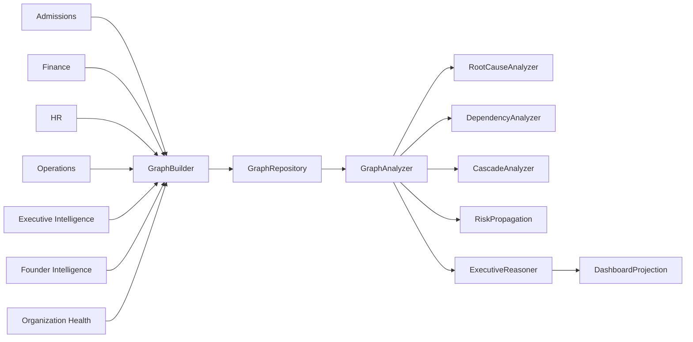

# Sprint 025 — Executive Graph Analyzer

**Status:** Implemented  
**Date:** July 12, 2026  
**Repository:** `school-platform`  
**Branch:** `founder-os-beta`  
**Prerequisite:** Sprint 004 Executive Intelligence Graph · Sprint 021 Founder Intelligence · Sprint 023/024 Organization Health

**Related documents:**

| Document | Relationship |
|----------|--------------|
| [`EXECUTIVE_GRAPH_MODEL.md`](./EXECUTIVE_GRAPH_MODEL.md) | Node/edge/domain model |
| [`EXECUTIVE_GRAPH_REASONING.md`](./EXECUTIVE_GRAPH_REASONING.md) | Analyzer reasoning pipeline |
| [`SPRINT002_EXECUTIVE_INTELLIGENCE_FOUNDATION.md`](./SPRINT002_EXECUTIVE_INTELLIGENCE_FOUNDATION.md) | Executive foundation |
| Package README | `src/lib/platform/intelligence/executive-graph/README.md` |

---

## 0. Sprint Intent

Sprint 025 delivers a **production-ready Executive Graph reasoning engine** that connects Admissions, Finance, HR, Operations, Executive Intelligence, and Founder Intelligence into one unified organizational reasoning graph.

**Design principle:** *Build once on shared contracts. Reason deterministically. Project for executives. Do not replace Sprint 004 — compose upward.*

### 0.1 Architectural Position

## 1. Package surface

Location: `src/lib/platform/intelligence/executive-graph/`

DI entry: `createExecutiveGraphAnalyzer()`  
Also attached on `createIntelligenceService().executiveGraphAnalyzer`

## 2. Definition of Done

- [x] GraphBuilder / GraphRepository / Graph model
- [x] Analyzers + reasoners + scoring engines
- [x] Queries, search, dashboard projection
- [x] Exports + DI wiring
- [x] README + architecture / model / reasoning docs
- [x] Unit tests
- [x] `npx tsc --noEmit` clean for package + restored foundation types
