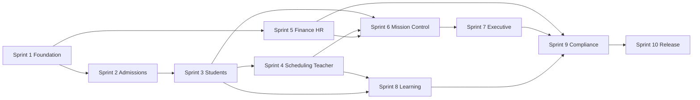

# The JAG OS — Founder's Edition Build Plan

**Document:** `FOUNDERS_EDITION_BUILD_PLAN.md`  
**Role:** Lead Engineer  
**Date:** July 5, 2026  
**Source of truth:** [`CURRENT_ARCHITECTURE_REPORT.md`](./CURRENT_ARCHITECTURE_REPORT.md)  
**Repository:** `school-platform` (The JAG OS)

---

## Purpose

This plan defines what to **keep**, **rename**, **remove or consolidate**, and **ship first** for **The JAG OS Founder's Edition** — a focused, founder-ready release of the staff ERP, family portal, and public admissions surfaces. It is derived entirely from the current architecture report and does not prescribe application code changes in this document.

**Founder's Edition goal:** Give a school founder and their leadership team a coherent operating system for enrollment, student success, instruction, finance, workforce, and executive visibility — without the full enterprise SaaS operator stack or duplicate intelligence surfaces.

---

## 1. Features to Keep (Already Exist)

These capabilities are implemented, aligned with the platform-services architecture, and should remain in Founder's Edition.

### 1.1 Core Platform Foundation

| Capability | Location / Route | Rationale |
|------------|------------------|-----------|
| Next.js App Router, server-first React 19 | `src/app/` | Established rendering and data-fetching model |
| Supabase Auth + SSR client | `middleware.ts`, `src/lib/supabase/server-auth.ts` | Sole auth provider; production-ready login flow |
| Password reset gate | `src/lib/auth/must-reset-password.ts` | Security baseline for new accounts |
| Enterprise RBAC (roles, permissions, org scope) | `src/lib/platform/identity/` | 130+ permission keys; RLS integration |
| Impersonation (founder/CEO support) | `getIdentityContext()`, `DashboardShell` banner | Required for founder-led onboarding and support |
| Build-time registry validation | `package.json` build scripts | Protects ULR, events, rules, execution engine integrity |

### 1.2 Phase 2 Platform Services (Keep All — Consume, Don't Fork)

| Service | Path |
|---------|------|
| Activity Engine | `src/lib/platform/activity/` |
| Relationship, Tags, Notes | `src/lib/platform/relationships/`, `tags/`, `notes/` |
| Event, Decision, Evidence, Rules Engines | `src/lib/platform/events/`, `decision/`, `evidence/`, `rules/` |
| Intelligence Graph | `src/lib/platform/intelligence-graph/` |
| Universal Learning Registry (ULR) | `src/lib/platform/ulr/` |
| Personal Learning Journey (PAJ) | `src/lib/platform/paj/` |
| Execution Engine + JAG Work | `src/lib/platform/execution-engine/`, `jag-work/` |
| Mission Control / Automation | `src/lib/platform/automation/` |
| Operational Loop | `src/lib/platform/operational-loop/` |

### 1.3 Staff ERP — Core Modules (Dashboard)

| Module | Route | Keep Because |
|--------|-------|--------------|
| Executive Home | `/dashboard` | Landing metrics + quick launch for founders |
| Admissions | `/dashboard/admissions` | CRM, leads, cases, workflows — enrollment pipeline |
| Student Success | `/dashboard/students` | SIS hub + profile workspace |
| Scheduling | `/dashboard/scheduling` | Operational scheduling + conflict intelligence |
| Teacher Workspace | `/dashboard/teacher`, `/dashboard/teacher/sessions/[id]` | Instruction delivery + session page |
| Finance | `/dashboard/finance` | Billing, tuition, payroll operations |
| Workforce (HR) | `/dashboard/hr` | Positions, employees, employee profiles |
| Scholarships | `/dashboard/scholarships` | Funding workflow tied to admissions/finance |
| Administration | `/dashboard/admin/*` | Org, users, roles, campuses — founder setup |
| Mission Control | `/dashboard/mission-control` | Single operational command surface |
| Executive Intelligence (trimmed nav) | `/dashboard/executive` | Decision support; keep work-queue default mode |
| Compliance (read/report) | `/dashboard/compliance` | FERPA-aware reporting baseline |
| Global Search | `/dashboard/search` | Cross-module discovery |
| My Preferences | `/dashboard/settings/preferences` | User settings |
| Employee Portal | `/dashboard/employee` | Staff self-service |

### 1.4 Family & Public Surfaces

| Surface | Route | Keep Because |
|---------|-------|--------------|
| Parent/Student Portal | `/portal/*` | Family-facing product |
| Public Admissions | `/apply/*` | Prospective family intake |
| Applicant portal | `/apply/portal/[applicationId]` | Application status for families |

### 1.5 Shared UI & Patterns

| Pattern | Location | Keep Because |
|---------|----------|--------------|
| Dashboard shell (sidebar, top nav, notifications) | `src/components/dashboard/` | Primary navigation model |
| JAG Experience System (XES) | `src/components/experience-system/` | Modernized module shells, `JagWorkPanel` |
| Workspace Design System (WDS) | `src/components/workspace-design-system/` | Shared primitives and tokens |
| Profile workspace | `src/components/platform/profile-workspace/` | Students, families, employees, admissions cases |
| Thin page + `*PageContent` + Suspense | 11 modernized routes | Target pattern for remaining modules |
| `DASHBOARD_MODULES` navigation | `src/lib/dashboard/navigation.ts` | Eight core ERP modules |

### 1.6 Learning & Instruction (Founder Differentiator)

| Capability | Location |
|------------|----------|
| ULR Structured Literacy catalog | `src/lib/platform/ulr/catalog/structured-literacy/` |
| PAJ runtime (journey, mastery, progression) | `src/lib/platform/paj/` |
| Knowledge & Evidence Engine | `src/lib/platform/evidence/` |
| Instruction sessions | `src/lib/instruction/`, `InstructionSessionPageContent.tsx` |

### 1.7 APIs to Keep (Founder's Scope)

| Category | Routes |
|----------|--------|
| Board / executive export | `api/executive/board-export` |
| Finance export | `api/finance/board-export` |
| Admissions processing | `api/admissions/process-communications`, `funding-export` |
| Platform search & queues | `api/platform/search`, `process-queues` |
| Portal calendar | `api/portal/calendar.ics` |
| Scholarship | `api/scholarship` |
| Configuration export | `api/configuration/export` |

---

## 2. Features to Rename for The JAG Branding

Replace legacy **AcademyOS** naming and opaque acronyms in user-facing copy, navigation labels, and documentation. Internal code paths may retain stable keys during Founder's Edition; **UI labels and docs** should use JAG language.

### 2.1 Product & Surface Names

| Current | JAG Founder's Edition Label | Where |
|---------|----------------------------|-------|
| AcademyOS | **The JAG OS** | App title, login, docs, marketing |
| school-platform (repo) | The JAG OS (Founder's Edition) | Release notes, deploy labels |
| Executive Home | **JAG Home** | Sidebar module label (`executive` in `DASHBOARD_MODULES`) |
| Student Success | **JAG Student Success** | Sidebar (optional "Student Success" subtitle) |
| Teacher Workspace | **JAG Teacher Studio** | Sidebar + teacher nav |
| Workforce | **JAG Workforce** | Sidebar (HR module) |

### 2.2 Intelligence & Platform Modules

| Current Acronym | JAG Brand Name | Notes |
|-----------------|----------------|-------|
| EDI (Executive Decision Intelligence) | **JAG Decision Intelligence** | Executive sub-nav: Decisions, Scenarios, Briefings |
| AIP (AI Platform) | **JAG AI Studio** | De-emphasize in Founder's nav; rename when exposed |
| AIN (Intelligence Network) | **JAG Network Intelligence** | Benchmarks/recommendations under executive or network |
| FI (Financial Intelligence) | **JAG Financial Intelligence** | `/dashboard/finance/intelligence` |
| EDP (Enterprise Data Platform) | **JAG Data Hub** | If retained post-consolidation |
| Integration Hub | **JAG Connect** | Connectors and integrations |
| Certification Center | **JAG Certification** | Professional learning / readiness |
| Workflow Marketplace | **JAG Workflow Library** | `/dashboard/automation` |
| Mission Control | **JAG Mission Control** | Already JAG-aligned; ensure consistent casing |
| Executive Intelligence | **JAG Executive Intelligence** | Full module title |
| Cloud Console | **JAG Cloud** (internal only) | Not in Founder's Edition nav |
| Operations Center | **JAG Operations** (internal only) | Not in Founder's Edition nav |

### 2.3 Learning System Terminology

| Current | JAG Label |
|---------|-----------|
| Universal Learning Registry | **JAG Learning Registry** (ULR acceptable in admin/technical views) |
| Personal Learning Journey | **JAG Learning Journey** (PAJ in technical contexts) |
| Knowledge & Evidence Engine | **JAG Evidence** |

### 2.4 Role Labels (Display Names Only)

| Role Key | Suggested Display Name |
|----------|------------------------|
| CEO | **Founder / CEO** |
| FOUNDER | **Founder** |
| EXECUTIVE_DIRECTOR | **Executive Director** |
| SCHOOL_LEADER | **School Leader** |
| SCHOOL_LEADER → ADMISSIONS | **Admissions Lead** |

### 2.5 Rename Execution Checklist (Non-Code)

- [ ] Update `DASHBOARD_MODULES` labels in `src/lib/dashboard/navigation.ts`
- [ ] Update sidebar Platform footer link text in `Sidebar.tsx`
- [ ] Update `ExecutiveNav`, `AipNav`, `AinNav`, and related `*Nav.tsx` titles
- [ ] Update login page and `layout.tsx` metadata title
- [ ] Update `docs/architecture/` and release README to say **The JAG OS Founder's Edition**
- [ ] Retire "AcademyOS" in user-visible strings (grep audit)

---

## 3. Features to Remove or Consolidate

Founder's Edition reduces surface area by **deferring**, **hiding**, or **merging** duplicate or enterprise-SaaS-only capabilities.

### 3.1 Defer Entirely (Out of Founder's Edition)

| Feature | Route / Module | Action |
|---------|----------------|--------|
| Cloud Console | `/cloud/*` (22 pages) | **Remove from nav**; keep code gated for future SaaS tier |
| Operations Center | `/operations/*` (23 pages) | **Remove from nav**; same as Cloud — enterprise operator surface |
| Legacy admin scholarship | `/admin` | **Remove or redirect** to `/dashboard/scholarships` |
| Workspace design system showcase | `/dashboard/workspace-design-system` | **Hide** from production nav (dev-only) |
| CEO redirect stub | `/dashboard/ceo` | **Keep redirect** to executive; remove as nav item |
| `/dashboard/platform` diagnostics | Platform diagnostics | **Founder-admin only** or dev build flag |

**Rationale:** Founder's Edition targets a **single school or small network**, not multi-tenant SaaS operators. Cloud and Operations are near-mirror surfaces (`cloud-platform/` vs `operations-platform/`) with overlapping dashboards, billing, customers, incidents, marketplace, licenses, releases, subscriptions, and support.

### 3.2 Consolidate — Intelligence & Command Centers

| Duplicate | Consolidation Target | Action |
|-----------|---------------------|--------|
| Executive Home metrics + Executive Command Center + Mission Control | **JAG Mission Control** as primary; **JAG Home** as lightweight entry | Merge metric sources behind one aggregation concept (report §11.2) |
| EDI Recommendations + AIN Recommendations + Platform Decision Engine + Executive Insights | **JAG Decision Intelligence** (EDI-backed) | Hide `/dashboard/network/recommendations`; single recommendations surface under executive |
| Executive Network dashboard + AIN Network dashboards | **JAG Network Intelligence** (one entry) | Default to `/dashboard/executive/network` or merged network hub |
| Three recommendation engines (EDI, AIN, platform decision) | Platform Decision Engine as interface; EDI/AIN as providers | Architectural consolidation (Sprint 4+) |
| Command Center view modes on executive (`?view=command-center`, `?view=operational-loop`) | Default **work queue**; Operational Loop linked from Mission Control | Reduce mode proliferation in founder UX |

### 3.3 Consolidate — Finance

| Split | Action |
|-------|--------|
| Finance Operations (`src/lib/finance/`) + Financial Intelligence (`src/lib/financial-intelligence/`) | **Single Finance module** with tab: Operations \| Intelligence |
| Separate `/dashboard/finance/executive` | Merge into Finance Intelligence or Executive board reports |

### 3.4 Consolidate — Work Management Cluster

| Routes | Action |
|--------|--------|
| `/dashboard/playbooks`, `projects`, `tasks`, `work`, `workload` | **Merge into one "JAG Work" hub** under Platform footer, or fold primary actions into Mission Control + module work queues |
| JAG Work platform engine already resolves per-workspace queues | Prefer module-native work queues (executive, admissions, students, etc.) over five separate nav items |

### 3.5 Consolidate — Profile Workspaces

| Parallel implementations | Action |
|--------------------------|--------|
| `students/profile`, `families/profile`, `employees/profile`, `admissions/profile` | **Keep behavior**; plan single `ProfileWorkspaceFactory` post-ship (report §11.4). Founder's Edition: no user-visible duplication — unified profile chrome only |

### 3.6 Trim — Executive Intelligence Sub-Routes

Keep **8** executive sub-routes for Founder's Edition; defer the rest to post-launch.

| Keep | Defer (hide from nav) |
|------|------------------------|
| Command Center (default work queue) | Optimization |
| Decisions | Capacity (unless scheduling-linked) |
| Briefings | Strategic Plan |
| KPIs | Grants |
| Forecasting | Benchmarks (if Network merged) |
| Risk | Report Studio (keep board export API) |
| Board Reports | — |
| Compliance (executive view) | — |

### 3.7 Trim — Platform Footer (Sidebar)

**Founder's Platform links (target: 8):**

1. JAG Mission Control  
2. JAG Executive Intelligence  
3. JAG Compliance  
4. JAG Financial Intelligence (or Finance tab)  
5. JAG Connect (Integration Hub — dashboard only)  
6. JAG Data Hub (read-only subset)  
7. Administration  
8. Global Search  

**Remove from footer:** Cloud Console, Operations Center, JAG AI Studio (full AIP), JAG Network Intelligence (standalone nav), Certification Center, Workflow Library (unless automation is founder-critical), duplicate Work Management entries.

### 3.8 Technical Cleanup (Non-Blocking but Planned)

| Item | Action |
|------|--------|
| Unused service-role Supabase client | Delete or lock down (`src/lib/supabase/server.ts`) |
| Activity dual-write to `platform_timeline_events` | Complete migration to Activity Engine canonical path |
| `database.ts` drift | Regenerate from schema before heavy feature work |
| `supabase/snippets/` | Remove from repo or gitignore |

---

## 4. Minimum Feature Set — Founder's Edition

The smallest shippable product that delivers **"run my school on JAG OS"** for a founder and core staff.

### 4.1 Must Have (P0)

| # | Capability | Acceptance Criteria |
|---|------------|---------------------|
| 1 | **Auth & founder setup** | Login, password reset, admin can create org/school/users/roles |
| 2 | **JAG Home** | Key enrollment, student, finance metrics + quick launch to core modules |
| 3 | **Admissions pipeline** | Public apply, lead/case CRM, communication queue, enrollment packet |
| 4 | **Student Success** | Student roster, profile workspace, family linkage, enrollments |
| 5 | **Scheduling** | Schedules visible; conflict detection surfaces alerts |
| 6 | **JAG Teacher Studio** | Roster, instruction session page, evidence capture hook to KEE |
| 7 | **Finance basics** | Invoices, payments, tuition visibility; board export |
| 8 | **JAG Workforce** | Employee roster, employee profile, positions |
| 9 | **JAG Mission Control** | Unified alerts, queue items, activity feed from core modules |
| 10 | **JAG Executive Intelligence (core)** | Work queue default, KPIs, risk, board reports |
| 11 | **Family portal** | Parent/student access with permission + record-level guards |
| 12 | **RBAC + RLS** | Module permissions enforced at layout; school scoping works |
| 13 | **JAG Learning Registry seed** | Structured Literacy / PA catalog present; PAJ journey can be assigned |
| 14 | **Global search** | Cross-entity search for staff |

### 4.2 Should Have (P1 — Ship if Time Allows)

| # | Capability |
|---|------------|
| 15 | Scholarships + funding export |
| 16 | JAG Financial Intelligence (forecasting tab) |
| 17 | JAG Decision Intelligence (decisions + briefings) |
| 18 | Compliance reports + FERPA classification |
| 19 | Impersonation for founder support |
| 20 | JAG Connect — integration dashboard (read-only) |
| 21 | Operational Loop diagnostics (Mission Control drill-down) |

### 4.3 Won't Have in Founder's Edition (Explicitly Out)

- Cloud Console and Operations Center (multi-tenant operator UI)
- Full AIP (prompts, providers, job costs, policies admin)
- Standalone AIN product surface (benchmarks/forecasting as separate app)
- Certification Center full workflow
- Enterprise Data Platform admin (imports, full EDP hub)
- MFA/SSO enforcement (architected but not required for v1)
- Documentation-to-code validation for 50+ blueprint docs
- Radix/shadcn migration

### 4.4 Founder's Edition Route Footprint (Target)

```
/login, /login/reset-required
/apply/*, /apply/portal/*
/portal/*
/dashboard
/dashboard/admissions/*
/dashboard/students/*, /dashboard/families/*
/dashboard/scheduling/*
/dashboard/teacher/*
/dashboard/finance/*  (operations + intelligence tab)
/dashboard/hr/*
/dashboard/scholarships/*
/dashboard/mission-control
/dashboard/executive  (+ 6–8 sub-routes)
/dashboard/compliance
/dashboard/admin/*
/dashboard/search, /dashboard/settings/preferences
/dashboard/employee
```

**Approximate target:** ~80–90 dashboard routes (down from ~158), 15 portal, 5 apply — focused founder experience.

---

## 5. Prioritized Sprint Plan (10 Sprints)

Assumes **2-week sprints**; adjust velocity to team size. Each sprint ends with a demoable increment.

### Sprint 1 — Foundation & Founder Readiness
**Theme:** Safe baseline + branding pass

- Regenerate or patch `database.ts` for Phase 2 tables used by P0 modules
- Grep and replace user-visible **AcademyOS** → **The JAG OS**
- Update `DASHBOARD_MODULES` and sidebar Platform footer to Founder's target list (hide Cloud, Operations, AIP, standalone AIN)
- Verify middleware + layout auth on all P0 routes; document known auth-only middleware gap
- Founder bootstrap script/docs: org → school → admin user → roles

**Exit criteria:** Founder can log in, see JAG-branded nav with reduced Platform links, complete admin setup.

---

### Sprint 2 — Admissions & Public Apply E2E
**Theme:** Enrollment pipeline

- Public `/apply` flow hardened for production
- Admissions CRM: leads, cases, workflows, communication queue
- Applicant portal status page
- Activity Engine writes on admission state changes
- API: `admissions/process-communications`, `funding-export`

**Exit criteria:** Prospective family applies; admissions staff progresses lead → case → enrolled student stub.

---

### Sprint 3 — Student Success & Families
**Theme:** SIS core

- Student roster + `[id]` profile workspace
- Family profile `/dashboard/families/[id]`
- Guardian linkage, enrollments, platform relationships sync
- Portal parent access to linked students
- Global search includes students and families

**Exit criteria:** Enrolled student visible in SIS; parent sees student in portal.

---

### Sprint 4 — Scheduling & Teacher Studio
**Theme:** Daily operations

- Scheduling dashboard + conflict intelligence alerts → Mission Control sync
- Teacher roster + student detail routes
- Instruction session page (`InstructionSessionPageContent`) with evidence hook to KEE
- JAG Work queue for teacher and scheduling perspectives

**Exit criteria:** Teacher opens session; scheduling conflict appears in Mission Control.

---

### Sprint 5 — Finance & Workforce
**Theme:** Back office

- Finance operations: invoices, payments, tuition views
- Board export APIs wired and permission-guarded
- HR roster + employee profile workspace
- Employee self-service portal smoke-tested

**Exit criteria:** Finance and HR modules usable by scoped roles; board CSV export works.

---

### Sprint 6 — Mission Control & JAG Home Unification
**Theme:** One command surface

- Define single metrics aggregation for JAG Home StatCards and Mission Control (reduce triple overlap)
- Mission Control composes: executive metrics, compliance alerts, admissions/finance/scheduling sync items
- JAG Home QuickLaunchGrid aligned to P0 modules only
- Hide legacy executive `?view=command-center` from default founder path (keep deep link)

**Exit criteria:** Founder opens JAG Home and Mission Control without conflicting numbers or duplicate alert sources.

---

### Sprint 7 — Executive Intelligence (Trimmed)
**Theme:** Decision support without bloat

- Executive default: work queue via Execution Engine + `JagWorkPanel`
- Ship sub-routes: KPIs, Forecasting, Risk, Board Reports, Decisions, Briefings, Compliance
- Hide deferred executive routes from `ExecutiveNav`
- EDI integration for decisions/briefings; defer optimization/capacity/grants/strategic

**Exit criteria:** Executive director completes daily work queue and exports board report.

---

### Sprint 8 — Learning Registry & Evidence
**Theme:** JAG differentiator

- ULR Structured Literacy catalog validated at build
- PAJ: assign journey, record placement/progress for pilot student
- KEE evidence from instruction session persisted and visible on student profile
- Intelligence Graph edges for student ↔ competency/evidence (minimal traversal)

**Exit criteria:** Teacher session produces evidence; student profile shows learning progress against registry.

---

### Sprint 9 — Compliance, Scholarships & Polish
**Theme:** Trust and funding

- Compliance center: reports, calendar export, FERPA classification on sensitive sections
- Scholarships module + API if P1 committed
- Financial Intelligence tab (forecasting only) OR defer with clear "coming soon" if slippage
- Loading skeletons for top 8 module entry pages
- Permission audit on certification/compliance/admissions layouts

**Exit criteria:** Compliance report generates; scholarship path works or is explicitly deferred in release notes.

---

### Sprint 10 — Hardening & Founder's Edition Release
**Theme:** Ship

- E2E Playwright smoke: login → admissions → student → teacher session → portal parent
- Vitest: platform services + identity permission guards for P0 routes
- Remove/hide dev routes (`workspace-design-system`, `/admin` legacy)
- Release notes, founder onboarding guide, known limitations doc
- Tag release: **The JAG OS Founder's Edition v1.0**

**Exit criteria:** Smoke tests green; founder onboarding doc complete; deploy to production environment.

---

### Sprint Dependency Graph



---

## 6. Risks That Could Delay Shipping

| Risk | Severity | Mitigation |
|------|----------|------------|
| **`database.ts` out of date** — untyped Phase 2 queries, silent runtime errors | **Critical** | Sprint 1 regeneration; block new features on typed client for touched tables |
| **Middleware auth-only** — unauthorized users reach protected URLs | **High** | Layout guards already exist; add coarse permission checks for `/portal`, `/cloud`; accept layout-level enforcement for Founder's if edge work slips |
| **RLS policy churn** — ambiguous canonical policies across 154 migrations | **High** | Test with non-admin roles in Sprint 3–5; document policy inventory for P0 tables |
| **Registry build failures** — 10 validators on every build | **High** | Freeze registry changes in Sprint 10; assign owner for ULR/hierarchy/execution-engine validators |
| **Metric duplication** — JAG Home vs Mission Control vs Executive show different numbers | **Medium** | Sprint 6 unification; single `getFounderDashboardMetrics()` concept |
| **Intelligence module scope creep** — pressure to ship full AIP/AIN | **Medium** | Hold to §3.1 defer list; executive-embedded network/decisions only |
| **Profile workspace quad duplication** — bugs fixed in one entity not others | **Medium** | Shared `ProfileWorkspaceShell` only for Founder's; defer factory refactor |
| **Activity dual-write incomplete** — timeline vs activity inconsistency | **Medium** | Read from canonical Activity Engine in Mission Control; defer legacy table removal |
| **Permission fallback masking missing migrations** — `ROLE_PERMISSION_FALLBACK` in non-prod | **Medium** | Deploy full identity migration to staging; integration test real RPC |
| **No loading/error boundaries** — poor UX on slow queries | **Low–Medium** | Add skeletons to 8 entry pages in Sprint 9 |
| **MFA/SSO not enforced** — enterprise security expectations | **Low** for Founder's v1 | Document as known limitation; roadmap item |
| **Documentation ahead of implementation** — stakeholder expects blueprint features | **Medium** | Publish Founder's scope doc; link to deferred blueprint index |
| **Single-founder bottleneck** — one person runs all roles in UAT | **Medium** | Seed multi-role test users in Sprint 1 bootstrap |

---

## 7. Quick Wins (Under One Day Each)

Each item is independently shippable in **≤1 day** without destabilizing the codebase.

| # | Quick Win | Effort | Impact |
|---|-----------|--------|--------|
| 1 | **Rename user-visible strings** — AcademyOS → The JAG OS in login, metadata, sidebar | 2–4 hrs | Immediate brand coherence |
| 2 | **Hide Cloud & Operations** from Platform footer in `Sidebar.tsx` | 1–2 hrs | Cuts founder confusion |
| 3 | **Redirect `/admin`** to `/dashboard/scholarships` or remove link | 1 hr | Removes legacy surface |
| 4 | **Trim `ExecutiveNav`** — comment out or feature-flag deferred sub-routes | 2–3 hrs | Simpler executive UX |
| 5 | **Update `DASHBOARD_MODULES` labels** — JAG Home, JAG Teacher Studio, JAG Workforce | 1 hr | Branding alignment |
| 6 | **Hide workspace-design-system** route from nav (keep route for dev) | 1 hr | Cleaner production sidebar |
| 7 | **Add `loading.tsx`** to `/dashboard`, `/dashboard/students`, `/dashboard/admissions` | 3–4 hrs | Perceived performance |
| 8 | **Document founder bootstrap** — markdown runbook for org/school/user setup | 2–3 hrs | Unblocks Sprint 1 demo |
| 9 | **Audit Platform footer links** — remove Certification, standalone AIN, AIP from sidebar | 2 hrs | Matches Founder's scope |
| 10 | **Fix `/dashboard/ceo` redirect** label — ensure no nav item says "CEO" | 30 min | Consistency with JAG Executive |
| 11 | **Portal login smoke test** — verify parent role lands on correct home | 2 hrs | Catches access regressions early |
| 12 | **Run existing validators** — `npm run validate:platform` etc.; fix any red scripts | 2–4 hrs | Green build confidence |
| 13 | **Release notes stub** — `FOUNDERS_EDITION.md` with P0 checklist and out-of-scope list | 2 hrs | Stakeholder alignment |
| 14 | **Impersonation banner copy** — "Viewing as [user] — JAG Support Mode" | 1 hr | Founder-appropriate language |
| 15 | **QuickLaunchGrid curation** — show only P0 modules on JAG Home | 2 hrs | Focused founder landing |

---

## Appendix — Success Metrics for Founder's Edition v1.0

| Metric | Target |
|--------|--------|
| P0 routes functional under non-admin roles | 100% |
| Public apply → enrolled student path | E2E pass |
| Parent portal student visibility | E2E pass |
| Teacher instruction session → evidence on profile | E2E pass |
| Mission Control alert from scheduling conflict | Demonstrated |
| Board report export | CSV download with permission gate |
| User-visible "AcademyOS" strings | 0 |
| Cloud/Operations in founder nav | 0 links |
| Build validators | All green on `main` |

---

## Related Documents

| Document | Purpose |
|----------|---------|
| [`CURRENT_ARCHITECTURE_REPORT.md`](./CURRENT_ARCHITECTURE_REPORT.md) | Full codebase architecture (source of truth) |
| [`platform-services.md`](./platform-services.md) | Phase 2 platform services contracts |
| [`platform-profile-workspace.md`](./platform-profile-workspace.md) | Profile workspace pattern |
| [`platform-testing-strategy.md`](./platform-testing-strategy.md) | Vitest + Playwright strategy |

---

*This build plan reflects the architecture state documented in `CURRENT_ARCHITECTURE_REPORT.md` as of July 5, 2026. Application code was not modified during its production.*
