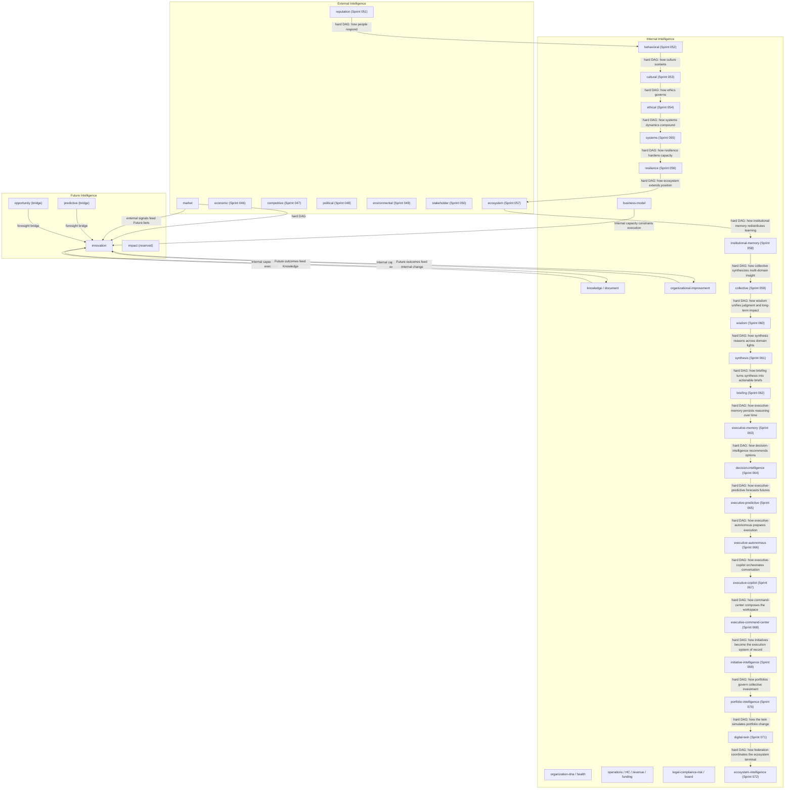

# Intelligence Layer Model

## Purpose

A three-layer mental model for placing intelligence domains in JAG OIOS. Use
this when deciding where a new domain belongs, what it may hard-depend on, and
how it should soft-read peer context.

## The three layers

### Internal Intelligence

People, operations, finance, knowledge, documents, and governance/compliance
**inside** the organization.

Examples (active unless noted):

- human-capital, operations, revenue, funding
- knowledge, document
- legal-compliance-risk (governance inside the walls)
- organizational-improvement, business-model, customer
- board-governance, organization-health, organization-dna
- financial, founder, executive, executive-graph, executive-decision
- behavioral (Sprint 052) — Internal-facing behavioral intelligence after External reputation (how people respond to strategy)
- cultural (Sprint 053) — Internal-facing cultural intelligence after behavioral (mission, values, engagement, psychological safety)
- ethical (Sprint 054) - Internal/governance-adjacent ethical intelligence after cultural (fairness, transparency, AI ethics, human impact)
- systems (Sprint 055) - Internal/cross-cutting systems dynamics after ethical (dependencies, feedback loops, cascading effects)
- resilience (Sprint 056) - Internal/adaptive capacity after systems (readiness, recovery, continuity, long-term adaptability)
- institutional-memory (Sprint 058) - Institutional memory layer after Ecosystem External network (synthesize, validate, redistribute organizational learning; Sprint 040 knowledge remains frozen mid-pipeline)
- collective (Sprint 059) - Collaborative synthesis layer after institutional-memory (consensus, distributed expertise, multi-domain synthesis for executive recommendation quality)
- wisdom (Sprint 060) - JAG v1.0 judgment capstone after collective (executive judgment, trade-offs, uncertainty, long-term impact)
- synthesis (Sprint 061) - Executive Synthesis Intelligence after wisdom (cross-domain correlation, root cause, prioritization, executive brief)
- briefing (Sprint 062) - Executive Briefing Intelligence after synthesis (morning briefs, decision/opportunity queues, role personalization, actionable cards)
- executive-memory (Sprint 063) - Executive Memory Intelligence after briefing (decision/brief archive, timeline, relationship graph, lessons, retention)
- decision-intelligence (Sprint 064) - Decision Intelligence after executive-memory (multi-option recommendations, scorecards, policy-aware approvals)
- executive-predictive (Sprint 065) - Predictive Intelligence after decision-intelligence (organizational forecasts, scenarios, emerging signals, decision-impact foresight)
- executive-autonomous (Sprint 066) - Autonomous Intelligence after executive-predictive (execution plans, approvals, readiness — human-in-the-loop only)
- executive-copilot (Sprint 067) - Executive Copilot after executive-autonomous (conversational orchestration over the executive stack)
- executive-command-center (Sprint 068) - Executive Command Center after executive-copilot (role-prioritized workspace; widgets project domain soft-reads)
- initiative-intelligence (Sprint 069) - Initiative Intelligence after executive-command-center (living strategic initiatives with measurable progress)
- portfolio-intelligence (Sprint 070) - Portfolio Intelligence after initiative-intelligence (enterprise portfolio governance)
- digital-twin (Sprint 071) - Organizational Digital Twin after portfolio-intelligence (strategic sandbox simulations)
- ecosystem-intelligence (Sprint 072) - Ecosystem Intelligence Federation after digital-twin (terminal federation layer)

### External Intelligence

Market, competitors, economy, regulations, and customer demand **outside** the
walls.

Examples:

- market (Sprint 043) — shipped External domain
- economic (Sprint 046) — shipped External domain
- competitive (Sprint 047) — shipped External domain
- political (Sprint 048) — shipped External domain
- environmental (Sprint 049) — shipped External domain
- stakeholder (Sprint 050) — shipped External / relationship stakeholder layer (after environmental)
- reputation (Sprint 051) — shipped External / relationship reputation layer (after stakeholder; Behavioral 052 hard-depends on reputation)
- ecosystem (Sprint 057) - External/network layer after Resilience (partnerships, networks, dependencies, strategic position)
### Future Intelligence

Innovation, scenarios, foresight, strategy — **what comes next**.

Examples:

- innovation (Sprint 044) — first Future Intelligence domain
- predictive (bridges toward Future)
- opportunity (bridge between present capture and Future bets)
- impact (Sprint 045) — shipped Future Intelligence domain
- strategic roadmaps (capability within innovation; future standalone strategy domains)

## Why this taxonomy helps

1. **Placement clarity** — When a sprint proposes a domain, ask: does it reason
   about inside capacity, outside signals, or next bets? That answers package
   naming, pipeline position, and soft/hard dependency defaults.
2. **Dependency discipline** — Hard DAG edges should usually flow
   Internal → External → Future (or stay within a layer). Soft reads may cross
   layers without reordering the pipeline.
3. **Product storytelling** — Dashboards and briefs can group by layer so
   leadership sees “how we run,” “what’s outside,” and “what we bet on next.”

## How layers interact



```
Domains → Wisdom → Executive Synthesis → Executive Briefing
```


- **External → Future:** Outside signals (white space, disruption, demand)
  inform which bets Future should prioritize. Innovation hard-depends on
  `market` for this reason.
- **External reputation → Internal behavioral:** Reputation (051) is the hard
  predecessor of Behavioral (052). Behavioral soft-reads stakeholder, human-capital,
  customer, decision, opportunity, predictive, and knowledge so leadership can
  anticipate how people actually respond to strategy without circular imports.
- **Internal behavioral → Internal cultural:** Behavioral (052) is the hard
  predecessor of Cultural (053). Cultural soft-reads behavioral, stakeholder,
  human-capital, decision, opportunity, knowledge, and predictive so leadership can
  strengthen mission, values, engagement, and psychological safety without circular imports.
- **Internal cultural -> Internal ethical:** Cultural (053) is the hard
  predecessor of Ethical (054). Ethical soft-reads cultural, behavioral,
  legal-compliance-risk, decision, opportunity, predictive, and reputation so leadership can
  evaluate decisions and AI recommendations against fairness, transparency, and human impact without circular imports.
- **Internal ethical -> Internal systems:** Ethical (054) is the hard
  predecessor of Systems (055). Systems soft-reads operations, legal-compliance-risk,
  predictive, decision, economic, behavioral, ethical, and opportunity so leadership can
  anticipate second- and third-order consequences of strategy without circular imports.
- **Internal systems -> Internal resilience:** Systems (055) is the hard
  predecessor of Resilience (056). Resilience soft-reads systems, operations,
  legal-compliance-risk, economic, decision, predictive, and opportunity so leadership can
  strengthen readiness, recovery, and adaptive capacity without circular imports.
  Technology/Security soft-reads use Operations and Legal Compliance Risk as proxies
  (no standalone technology/security packages).
- **Internal resilience -> External ecosystem:** Resilience (056) is the hard
  predecessor of Ecosystem (057). Ecosystem soft-reads stakeholder, competitive,
  market, systems, resilience, opportunity, decision, and predictive so leadership can
  strengthen partnerships, networks, and strategic position without circular imports.
- **External ecosystem -> Terminal institutional memory:** Ecosystem (057) is the hard
  predecessor of Institutional Memory (058). Institutional Memory soft-reads Knowledge
  (Sprint 040 frozen mid-pipeline), ecosystem, resilience, systems, stakeholder, cultural,
  ethical, opportunity, executive-decision, and predictive so leadership can synthesize,
  validate, and redistribute organizational learning without regenerating Sprint 040.
- **Institutional memory -> Collective synthesis:** Institutional Memory (058) is the hard
  predecessor of Collective (059). Collective soft-reads institutional-memory, knowledge,
  executive-decision, predictive, behavioral, cultural, stakeholder, systems, opportunity,
  ecosystem, resilience, ethical, market, competitive, human-capital, and operations so
  leadership can combine multi-domain insights, consensus, and distributed expertise without
  circular imports.
- **Collective -> Wisdom terminal (JAG v1.0):** Collective (059) is the hard predecessor of
  Wisdom (060). Wisdom soft-reads collective and upstream domains so leadership can unify
  judgment, trade-offs, uncertainty, and long-term impact without circular imports. See
  [JAG_V1_INTELLIGENCE_GRAPH.md](./JAG_V1_INTELLIGENCE_GRAPH.md).
- **Internal → Future:** Capacity, knowledge coverage, improvement momentum, and
  business-model fit constrain what Future can execute. Soft reads only —
  Internal domains do not become hard predecessors of Future unless pipeline
  data requires it.
- **Future → Internal:** Validated experiments, scaled ideas, and roadmap
  outcomes feed back into improvement initiatives and knowledge artifacts.

## Soft vs hard dependencies by layer

| From → To | Prefer | Notes |
|-----------|--------|-------|
| Within Internal | Soft context attachments | Hard edges only for clear pipeline data needs |
| Internal → External | Soft | External should not hard-depend on every Internal product module |
| External → Future | Hard when Future needs External as predecessor | Innovation → hard `market` |
| Internal → Future | Soft | Knowledge, improvement, business-model light types |
| Bridge domains (predictive, opportunity, decision) → Future | Soft | Foresight / capture bridges |
| Future → Internal | Soft / knowledge contribution | Outcomes as drafts and context, not DAG reverse edges |

## Innovation placement (Sprint 044)

| Aspect | Value |
|--------|-------|
| Layer | Future Intelligence |
| Hard dependency | `market` (External) |
| Soft External | Market light baseline (also via hard predecessor context) |
| Soft Internal | Knowledge, Document, Business Model, Organizational Improvement |
| Soft bridges | Predictive, Opportunity, Executive Decision |
| Pipeline | `… → legal-compliance-risk → market → innovation` (terminal) |

## Related docs

- [INTELLIGENCE_DOMAIN_MODEL.md](./INTELLIGENCE_DOMAIN_MODEL.md) — catalog and status
- [FUTURE_SPRINT_GUIDELINES.md](./FUTURE_SPRINT_GUIDELINES.md) — sprint non-negotiables
- [SPRINT044_INNOVATION_INTELLIGENCE.md](./SPRINT044_INNOVATION_INTELLIGENCE.md)
- [INNOVATION_INTELLIGENCE.md](./INNOVATION_INTELLIGENCE.md)
