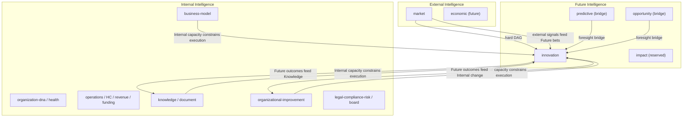

# Intelligence Layer Model

## Purpose

A three-layer mental model for placing intelligence domains in JAG OIOS. Use
this when deciding where a new domain belongs, what it may hard-depend on, and
how it should soft-read peer context.

## The three layers

### Internal Intelligence

People, operations, finance, knowledge, documents, and governance/compliance
**inside** the organization.

Examples (active unless noted):

- human-capital, operations, revenue, funding
- knowledge, document
- legal-compliance-risk (governance inside the walls)
- organizational-improvement, business-model, customer
- board-governance, organization-health, organization-dna
- financial, founder, executive, executive-graph, executive-decision

### External Intelligence

Market, competitors, economy, regulations, and customer demand **outside** the
walls.

Examples:

- market (Sprint 043) — shipped External domain
- future economic intelligence
- regulatory scan extensions beyond the consolidated legal-compliance-risk surface

### Future Intelligence

Innovation, scenarios, foresight, strategy — **what comes next**.

Examples:

- innovation (Sprint 044) — first Future Intelligence domain
- predictive (bridges toward Future)
- opportunity (bridge between present capture and Future bets)
- impact (reserved)
- strategic roadmaps (capability within innovation; future standalone strategy domains)

## Why this taxonomy helps

1. **Placement clarity** — When a sprint proposes a domain, ask: does it reason
   about inside capacity, outside signals, or next bets? That answers package
   naming, pipeline position, and soft/hard dependency defaults.
2. **Dependency discipline** — Hard DAG edges should usually flow
   Internal → External → Future (or stay within a layer). Soft reads may cross
   layers without reordering the pipeline.
3. **Product storytelling** — Dashboards and briefs can group by layer so
   leadership sees “how we run,” “what’s outside,” and “what we bet on next.”

## How layers interact

- **External → Future:** Outside signals (white space, disruption, demand)
  inform which bets Future should prioritize. Innovation hard-depends on
  `market` for this reason.
- **Internal → Future:** Capacity, knowledge coverage, improvement momentum, and
  business-model fit constrain what Future can execute. Soft reads only —
  Internal domains do not become hard predecessors of Future unless pipeline
  data requires it.
- **Future → Internal:** Validated experiments, scaled ideas, and roadmap
  outcomes feed back into improvement initiatives and knowledge artifacts.

## Soft vs hard dependencies by layer

| From → To | Prefer | Notes |
|-----------|--------|-------|
| Within Internal | Soft context attachments | Hard edges only for clear pipeline data needs |
| Internal → External | Soft | External should not hard-depend on every Internal product module |
| External → Future | Hard when Future needs External as predecessor | Innovation → hard `market` |
| Internal → Future | Soft | Knowledge, improvement, business-model light types |
| Bridge domains (predictive, opportunity, decision) → Future | Soft | Foresight / capture bridges |
| Future → Internal | Soft / knowledge contribution | Outcomes as drafts and context, not DAG reverse edges |

## Innovation placement (Sprint 044)

| Aspect | Value |
|--------|-------|
| Layer | Future Intelligence |
| Hard dependency | `market` (External) |
| Soft External | Market light baseline (also via hard predecessor context) |
| Soft Internal | Knowledge, Document, Business Model, Organizational Improvement |
| Soft bridges | Predictive, Opportunity, Executive Decision |
| Pipeline | `… → legal-compliance-risk → market → innovation` (terminal) |

## Related docs

- [INTELLIGENCE_DOMAIN_MODEL.md](./INTELLIGENCE_DOMAIN_MODEL.md) — catalog and status
- [FUTURE_SPRINT_GUIDELINES.md](./FUTURE_SPRINT_GUIDELINES.md) — sprint non-negotiables
- [SPRINT044_INNOVATION_INTELLIGENCE.md](./SPRINT044_INNOVATION_INTELLIGENCE.md)
- [INNOVATION_INTELLIGENCE.md](./INNOVATION_INTELLIGENCE.md)
