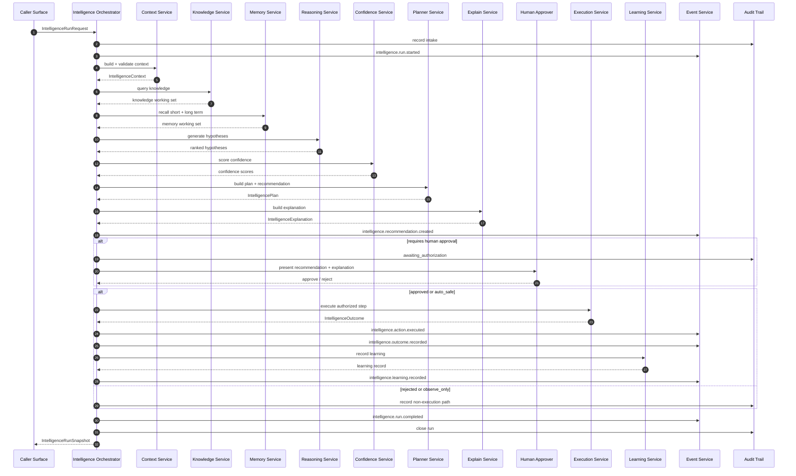
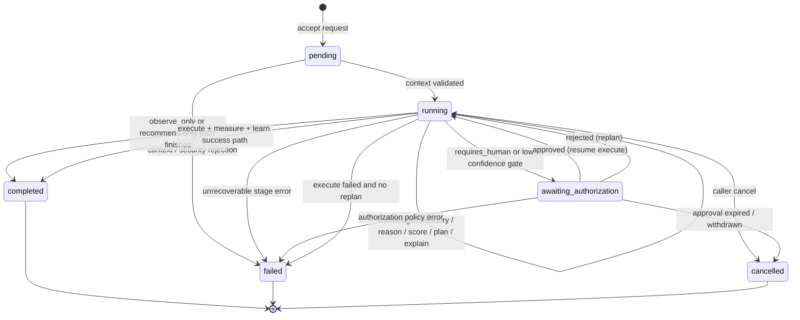

# JAG Intelligence Orchestrator
### The Single Cognitive Pipeline of AcademyOS

Version: 1.0
Status: Governing Architecture
Owner: JAG Platform
Priority: Critical

**Document:** `JAG_ORCHESTRATION_ARCHITECTURE.md`  
**Repository:** `school-platform` (The JAG OS)  
**Scope:** Design only — no application code in this document

**Related documents:**

| Document | Relationship |
|----------|--------------|
| [`JAG_INTELLIGENCE_ARCHITECTURE.md`](./JAG_INTELLIGENCE_ARCHITECTURE.md) | Cognitive operating system — domains, agents, shared services |
| [`JAG_SUCCESS_INTELLIGENCE.md`](./JAG_SUCCESS_INTELLIGENCE.md) | Success / support case lifecycle that must use this pipeline |
| [`JAG_IMPLEMENTATION_ROADMAP.md`](./JAG_IMPLEMENTATION_ROADMAP.md) | Build phases that implement orchestrator capabilities |
| [`PLATFORM_CONTRACT.md`](./PLATFORM_CONTRACT.md) | Platform service contracts and tenancy rules |

---

# 1. Purpose

The JAG Intelligence Orchestrator is the **single mandatory pipeline** through which every intelligence request in AcademyOS must pass.

No domain intelligence — Executive, Operational, Financial, Mission, Decision, Compliance, Success, or Learning — may reason, recommend, or act outside this pipeline.

The Orchestrator exists to guarantee that every cognitive operation is:

• contextualized

• evidence-backed

• confidence-scored

• explainable

• authorized

• auditable

• tenant-isolated

• capable of learning from its outcome

JAG is not a collection of chatbots.

JAG is one cognitive system with many specialized domains.

The Orchestrator is the nervous system that keeps that system coherent.

---

# 2. Design Principles

1. **One pipeline.** Every intelligence request follows the same stage sequence. Domains specialize content, not control flow.

2. **Context before cognition.** No reasoning begins until tenant, actor, permissions, and session scope are resolved.

3. **Evidence before recommendation.** Hypotheses and actions must cite knowledge, memory, and evidence.

4. **Confidence before action.** Low-confidence paths recommend, escalate, or gather more evidence — they do not silently execute.

5. **Authorization before side effects.** Execution is guidance until authority and human gates allow mutation.

6. **Explanation is mandatory.** Every recommendation must answer what, why, evidence, confidence, alternatives, impact, and next step.

7. **Outcomes feed learning.** Every completed run improves future runs for the same organization.

8. **Events are first-class.** Pipeline transitions emit durable events for graph, audit, and downstream consumers.

9. **Fail closed on tenancy and security.** Ambiguous tenant scope or missing permission aborts the run.

10. **Humans remain sovereign.** Sensitive, destructive, or irreversible actions always require human approval.

---

# 3. Responsibilities

The Orchestrator is responsible for:

• Accepting intelligence run requests from any surface (dashboard, portal, API, agent, case engine, cron)

• Resolving and validating cognitive context

• Sequencing shared cognitive services in fixed order

• Enforcing authority and human approval gates

• Emitting pipeline events

• Recording audit trail entries

• Returning a structured run snapshot (hypotheses, recommendation, explanation, outcome)

• Handing measured outcomes to the learning loop

The Orchestrator is **not** responsible for:

• Domain-specific business rules (owned by domain intelligence modules)

• UI rendering

• Direct database schema design

• Model training or provider selection (delegated to future AI integration adapters)

• Bypassing platform permissions, RLS, or tenant boundaries

---

# 4. Pipeline Stages

Every intelligence request advances through the following stages in order.

Stages may short-circuit to failure, cancellation, or awaiting-authorization states, but they may not be reordered or skipped without an explicit, audited exception policy (none in Phase 1).

```
Receive Request
      ↓
Build Context
      ↓
Retrieve Knowledge
      ↓
Assemble Memory
      ↓
Reason (Generate Hypotheses)
      ↓
Score Confidence
      ↓
Plan (Recommend Action)
      ↓
Explain
      ↓
Authorize / Await Human Approval (if required)
      ↓
Execute (if authorized)
      ↓
Measure Outcome
      ↓
Learn
      ↓
Emit Completion Events + Audit Close
```

Alignment with the foundation decision pipeline:

| Orchestrator Stage | Foundation Stage Key |
|--------------------|----------------------|
| Build Context / Observe | `observe`, `understand` |
| Retrieve Knowledge / Assemble Memory | `collect_evidence` |
| Reason | `generate_hypotheses` |
| Score Confidence | `score_confidence` |
| Plan | `recommend_action` |
| Execute | `execute` |
| Measure Outcome | `measure_outcome` |
| Learn | `learn`, `improve` |

---

# 5. Context Building

Context building is the first cognitive gate.

No downstream stage may run without a validated `IntelligenceContext`.

Context must resolve:

• Organization id (tenant)

• School id (when school-scoped)

• Actor (user id, role keys)

• Domain (executive, operational, financial, mission, decision, compliance, success, learning)

• Session / conversation / workflow identifiers when present

• Permission set applicable to the run

• Locale and metadata required for explanation and communication

Rules:

• Missing organization for a tenant-bound request → fail closed

• Actor without required permission for the domain intent → fail closed

• Cross-tenant identifiers in input → reject

• Context is immutable for the duration of a run once validated (amendments create a new run or audited context revision)

---

# 6. Knowledge Retrieval

Knowledge retrieval gathers institutional and graph-backed facts relevant to the intent.

Sources may include:

• Platform Intelligence Graph / Knowledge Graph nodes and edges

• Evidence records (Knowledge & Evidence Engine)

• Policies, playbooks, and registered knowledge artifacts

• Domain registries (ULR, rules, decisions, workflows)

• Prior case resolutions and pattern keys (Success Intelligence)

Rules:

• Retrieval is scoped strictly to the validated tenant context

• Results are ranked for relevance; raw dumps are not passed to reasoning

• Every knowledge node used later in explanation must remain referenceable by id

• Absence of knowledge is a first-class signal (low confidence), not a silent empty success

---

# 7. Memory Assembly

Memory assembly combines short-term and long-term memory into a working set for reasoning.

**Short-term memory**

• Current session

• Conversation turns

• Active workflow state

• In-flight case or run identifiers

**Long-term memory**

• Historical decisions and outcomes

• Successful and failed interventions

• Organizational behavioral patterns

• Relationship summaries

• Institutional knowledge extracted by the learning loop

Rules:

• Short-term memory is session-bounded and may expire

• Long-term memory is tenant-bounded and durable

• Memory entries used in reasoning must be cited in the explanation evidence summary

• Memory must never leak across organizations

---

# 8. Reasoning

Reasoning transforms intent, knowledge, and memory into ranked hypotheses.

Responsibilities:

• Interpret the request (understand)

• Generate candidate explanations / causes / options

• Attach evidence references to each hypothesis

• Produce reasoning notes suitable for audit and explanation

• Select a primary hypothesis when confidence separation is clear

Rules:

• Reasoning does not execute side effects

• Reasoning does not invent evidence; unsupported claims must be marked speculative and lower confidence

• Domain modules may supply domain-specific hypothesis generators, but they run under Orchestrator control

• Multiple hypotheses are preferred over a single unjustified conclusion

---

# 9. Confidence Scoring

Confidence scoring evaluates how strongly evidence and reasoning support each hypothesis and the eventual recommendation.

Confidence levels:

• `high`

• `medium`

• `low`

• `unknown`

Scoring must consider:

• Evidence completeness and quality

• Hypothesis separation (score gap)

• Memory / pattern reinforcement from prior outcomes

• Authority risk of the proposed action

• Data freshness and source reliability

Rules:

• `unknown` or `low` confidence blocks auto-execution of mutating actions

• Confidence factors must be structured and explainable (key, label, contribution, reason)

• Calibration after outcomes is owned by the learning loop and confidence service — not ad hoc UI logic

---

# 10. Planning

Planning converts ranked hypotheses into an ordered, authority-aware action plan.

A plan contains:

• Ordered steps

• Action keys

• Authority posture per step (`observe_only`, `recommend`, `auto_safe`, `requires_human`, `forbidden`)

• Dependencies between steps

• Primary recommendation

Rules:

• Plans are proposals until authorization clears

• `forbidden` steps are never scheduled for execution

• `requires_human` steps pause the run in `awaiting_authorization`

• Replanning is allowed after new evidence, failed steps, or human rejection — and must be audited

---

# 11. Execution Guidance

Execution is the only stage that may produce side effects.

The Orchestrator provides **execution guidance** to the execution service:

• Which step or recommendation to run

• Whether the run is dry-run

• Who authorized it

• What authority class applies

Rules:

• Observe-only and recommend postures never mutate state

• `auto_safe` actions may execute without additional human approval when policy allows

• Destructive, irreversible, financial, permission-changing, or PII-exporting actions require human approval

• Execution results produce an `IntelligenceOutcome` (success/failure, summary, metrics)

• Partial execution of multi-step plans must record which steps completed, skipped, or failed

---

# 12. Explainability

Explainability is not optional and is not a post-hoc log line.

Every recommendation and completed run must produce an `IntelligenceExplanation` that answers:

• What happened?

• Why?

• What evidence was used?

• What is the confidence?

• What alternatives were considered?

• What impact is expected?

• What is the recommended next step?

• What caveats apply?

Rules:

• Explanations are generated before human approval whenever a recommendation is shown

• Explanations must be understandable to the target role (executive, teacher, parent, operator)

• Explanations are stored with the run for audit replay

---

# 13. Learning

Learning closes the cognitive loop.

After outcomes are measured, the Orchestrator invokes the learning service to record:

• Domain

• Recommendation and outcome linkage

• Success or failure

• Pattern key (when classifiable)

• Tenant scope

• Summary suitable for future memory and knowledge upsert

Rules:

• Learning never writes across tenants

• Failed runs and rejected recommendations are learning signals, not discarded noise

• Learning may update long-term memory and knowledge nodes, subject to the same security controls

• Learning must not silently raise authority of future auto-actions without policy review

---

# 14. Event Emission

The Orchestrator emits domain events at pipeline boundaries so the rest of the platform can react without coupling to internal stages.

Canonical event types include:

• `intelligence.run.started`

• `intelligence.hypothesis.generated`

• `intelligence.recommendation.created`

• `intelligence.action.executed`

• `intelligence.outcome.recorded`

• `intelligence.learning.recorded`

• `intelligence.case.opened` / `intelligence.case.resolved` (when case engine participates)

• `intelligence.run.completed`

Rules:

• Events carry organization id, school id, run id, and opaque payload metadata

• Events must not contain secrets or unnecessary PII

• Event emission failure must be logged to the audit trail; it must not corrupt tenant data, but completion without events is a degraded state requiring ops attention

---

# 15. Audit Trail

Every run produces an immutable audit trail covering:

• Request intake (intent, domain, actor, scope)

• Context validation result

• Knowledge and memory references used

• Hypotheses and confidence scores

• Plan and recommendation

• Explanation snapshot

• Authorization decisions and approver identity

• Execution attempts (including dry-run)

• Outcomes

• Learning records written

• Errors, cancellations, and escalations

Rules:

• Audit entries are tenant-scoped and permission-gated for read access

• Audit is append-only for a given run id

• Audit must support reconstruction of “why did JAG recommend X?” without re-running models

---

# 16. Security

Security controls apply at every stage.

Required controls:

• Role-based permissions for initiating runs and approving actions

• Evidence and decision auditing

• PII minimization in prompts, events, and explanations

• No covert channel between tenants via shared caches, embeddings, or model context

• Secrets never enter reasoning payloads

• Provider / AI adapters (future) must honor the same permission and redaction contracts as deterministic services

Fail-closed defaults:

• Deny on missing permission

• Deny on ambiguous tenant scope

• Deny auto-execution on insufficient confidence or authority

---

# 17. Tenant Isolation

Tenant isolation is a hard invariant of the Orchestrator.

Invariants:

• One run operates in exactly one organization scope (plus optional school scope)

• Knowledge, memory, cases, learning, and audit queries are filtered by that scope

• Zero cross-tenant exposure in working sets, embeddings, or cached reasoning artifacts

• Platform operators with break-glass access use separate audited paths — not the normal Orchestrator run path

• Multi-org “enterprise rollup” views are composition of per-tenant runs or authorized aggregate services — never a mixed-tenant cognitive context

---

# 18. Human Approval Points

Human approval is a first-class pipeline state: `awaiting_authorization`.

Approval is required when any of the following hold:

• Step authority is `requires_human`

• Confidence is `low` or `unknown` and the action would mutate state

• Action is destructive, irreversible, financial, compliance-sensitive, or changes permissions

• Policy explicitly marks the action key as human-gated

• Escalation from Success Intelligence or Compliance Intelligence

Approval records must capture:

• Approver user id

• Timestamp

• Decision (approve / reject / request more evidence)

• Optional note

Rejection returns the run to planning or closes it as cancelled/failed per policy — it never silently executes.

---

# 19. Failure Handling

Failures are expected and must be handled uniformly.

Failure classes:

• **Context failure** — invalid tenant, actor, or permissions → abort immediately

• **Retrieval failure** — knowledge/memory unavailable → degrade to low confidence or abort if critical path

• **Reasoning failure** — no viable hypothesis → explain inability and recommend human review

• **Planning failure** — no authorized plan → recommend only / escalate

• **Authorization timeout** — remain `awaiting_authorization` or expire to cancelled per policy

• **Execution failure** — record outcome failure, stop or replan, learn from failure

• **Learning / event failure** — record audit warning; do not erase successful prior stages

Rules:

• Partial progress is preserved in the run snapshot

• Users receive an explanation of failure, not a bare error code, when the surface is interactive

• Automated retries are allowed only for idempotent, non-mutating stages or explicitly idempotent safe actions

---

# 20. Sequence Diagram



---

# 21. State Machine

Run status values:

• `pending`

• `running`

• `awaiting_authorization`

• `completed`

• `failed`

• `cancelled`



Stage progression inside `running` is linear unless replanning returns the run to planning after an audited trigger.

---

# 22. Future AI Integration

The Orchestrator is AI-ready but not AI-dependent.

Future AI adapters may participate in:

• Natural language understanding of intent

• Hypothesis generation

• Evidence ranking

• Explanation narrative drafting

• Pattern extraction for learning

Non-negotiable rules for AI integration:

• AI is a **stage assistant**, never a bypass around the Orchestrator

• AI outputs enter the same confidence, explanation, authority, and audit controls as deterministic outputs

• Prompts and completions are tenant-scoped, redacted, and auditable

• Model choice is an adapter concern; pipeline order is not

• Autonomous execution authority is granted by policy and confidence — not by model self-assessment alone

• Offline / degraded mode must still allow deterministic domain rules to operate through the same pipeline

---

# 23. Extensibility Rules

Domains and future modules may extend JAG Intelligence only under these rules:

1. **No parallel pipelines.** New intelligence features plug into Orchestrator stages; they do not invent alternate control flows.

2. **Domain packs, not forks.** Domains contribute hypothesis generators, knowledge sources, action catalogs, and policies — registered and discoverable.

3. **Stable contracts.** Inputs and outputs of each stage use the shared intelligence foundation types. Breaking changes require versioned engine upgrades.

4. **Events over direct calls.** Downstream consumers subscribe to intelligence events rather than reaching into Orchestrator internals.

5. **Authority is declarative.** New action keys declare authority class and human-gate policy at registration time.

6. **Explainability cannot be disabled.** Domain packs may enrich explanations; they may not omit them.

7. **Tenant isolation cannot be opted out.** Extension points receive only the validated context scope.

8. **Tests prove stage order.** Extensibility is accepted only when automated tests demonstrate the mandatory stage sequence and approval gates still hold.

9. **Case engine is a client.** Success Intelligence cases invoke the Orchestrator; they are not a second brain.

10. **Documentation before code.** New stage behaviors update this governing document before implementation lands.

---

# Long-Term Goal

The Orchestrator makes JAG predictable.

Every organization experiences the same cognitive discipline: observe, understand, evidence, reason, score, plan, explain, authorize, act, learn.

Specialized intelligence domains make JAG powerful.

The Orchestrator makes JAG trustworthy.

Trust is the product.
