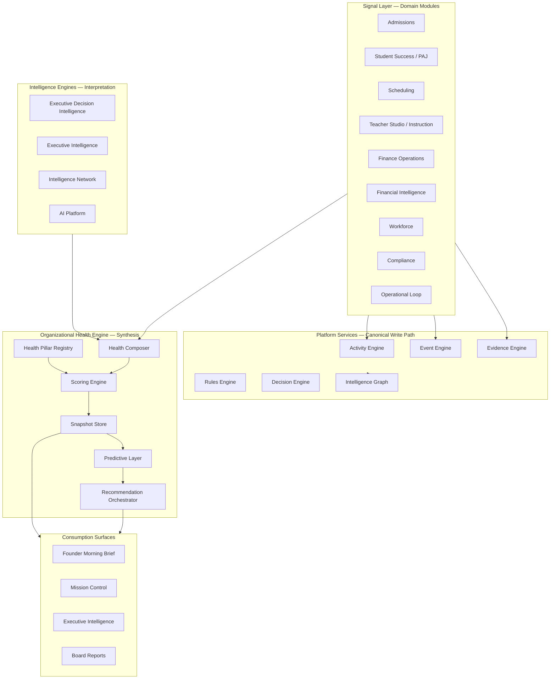
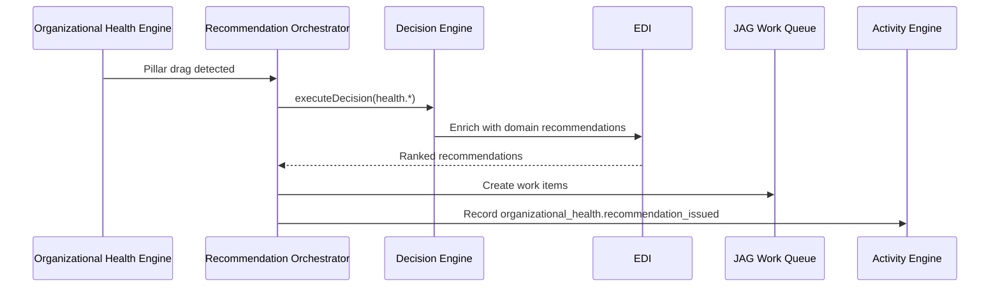

# The JAG Organizational Health™ Engine

**Document:** `ORGANIZATIONAL_HEALTH_ENGINE.md`  
**Sprint:** 3 — The JAG Organizational Health™  
**Date:** July 5, 2026  
**Status:** Architecture specification (design only — no application code)  
**Repository:** `school-platform` (The JAG OS)

**Related documents:**

| Document | Relationship |
|----------|--------------|
| [`CURRENT_ARCHITECTURE_REPORT.md`](./CURRENT_ARCHITECTURE_REPORT.md) | Runtime inventory and duplication analysis |
| [`platform-services.md`](./platform-services.md) | Phase 2 platform service contracts |
| [`FOUNDERS_EDITION_BUILD_PLAN.md`](./FOUNDERS_EDITION_BUILD_PLAN.md) | Founder's scope and sprint roadmap |
| [`SPRINT1_IMPLEMENTATION.md`](./SPRINT1_IMPLEMENTATION.md) | Branding and Founder Morning Brief baseline |
| [`THE-JAG-ECOSYSTEM-INTELLIGENCE-CONSTITUTION.md`](../constitution/ecosystem-intelligence/THE-JAG-ECOSYSTEM-INTELLIGENCE-CONSTITUTION.md) | Constitutional Pulse, Voices, Recommendation Engine |

---

## Executive Summary

**The JAG Organizational Health™ Engine** (OHE) is the canonical synthesis layer that turns distributed operational, financial, learning, and governance signals into a single, explainable picture of enterprise health.

Today, health is computed in **three parallel places** with overlapping inputs:

| Surface | Location | Output |
|---------|----------|--------|
| EDI Executive Scorecard | `src/lib/edi/scorecard.ts` → `edi_scorecard_snapshots` | 10 dimension scores + `overallEnterpriseHealth` |
| JAG OEI™ | `mission-control-compose.ts` → `buildOei()` | 7 rolled-up dimensions + index |
| Mission Health | `MissionControlView` | `operationalHealthScore`, priorities, `aiBrief` |

OHE **does not replace** domain intelligence modules. It **unifies** their outputs behind one registry-driven model, one scoring contract, and one write path — consumed by Mission Control, Executive Intelligence, the Founder Morning Brief, and board reporting.

**Design principle:** *Observe once, score once, explain everywhere.*

---

## 1. The Organizational Health Framework

### 1.1 Definition

Organizational Health is the **multi-dimensional, time-bounded, org-scoped condition** of a school or enterprise network across learning, operations, people, finance, family experience, compliance, and strategic alignment.

It is **not**:

- A single KPI dashboard
- A replacement for module-level analytics
- An autonomous decision system

It **is**:

- The runtime embodiment of **The JAG™ Pulse™** (Ecosystem Intelligence Constitution §4)
- The aggregation authority for **Ecosystem Command Center** consumption (Mission Control compose layer)
- The evidentiary foundation for executive recommendations, briefings, and predictive alerts

### 1.2 Architectural Position



### 1.3 Ecosystem Intelligence Cycle Alignment

OHE spans the constitutional meta-loop:

| Cycle Phase | OHE Responsibility |
|-------------|-------------------|
| **Observe** | Ingest normalized signals from modules and platform services |
| **Understand** | Score pillars, detect drift, classify severity |
| **Recommend** | Emit governed recommendations (never auto-execute) |
| **Implement** | *Out of scope* — delegated to JAG Work and module workflows |
| **Measure Again** | Compare post-action snapshots to baseline; close recommendation loops |
| **Learn** | Write validated deltas to Organizational Memory |
| **Improve** | Adjust pillar weights, thresholds, and industry profiles |

### 1.4 Scope Boundaries

| In scope | Out of scope (delegated) |
|----------|--------------------------|
| Health pillar registry and weights | Instructional session delivery |
| Daily/weekly snapshot computation | Individual student mastery grading |
| Cross-pillar synthesis (Pulse index) | Payroll calculation |
| Predictive drift and risk projection | Admissions CRM mutations |
| Recommendation orchestration and disclosure | Cloud/Operations SaaS operator health |

### 1.5 Canonical Runtime Home (planned)

| Artifact | Proposed path | Notes |
|----------|---------------|-------|
| OHE types and registry | `src/lib/platform/organizational-health/` | Build-time validated pillar registry |
| Composer | `src/lib/platform/organizational-health/compose.ts` | Replaces ad-hoc scorecard + OEI duplication |
| Scoring | `src/lib/platform/organizational-health/scoring.ts` | Weighted, explainable, clamped 0–100 |
| Snapshots | `platform_organizational_health_snapshots` (new migration) | Supersedes direct EDI-only writes over time |
| Public export | `src/lib/platform/services/index.ts` | Alongside Activity, Decision, Evidence engines |

**Migration rule:** `edi_scorecard_snapshots` remains readable during transition; OHE becomes the single writer.

---

## 2. Default Health Pillars

Default pillars align with **The JAG™ Pulse™** constitutional dimensions (EI Constitution §4.2) and map to **existing runtime scorecard fields** where implemented.

### 2.1 Pillar Catalog

| Pillar Key | Display Name | Constitutional Pulse Dimension | Current Runtime Proxy |
|------------|--------------|-------------------------------|------------------------|
| `learning` | Learning Health | Learning | `student_success`, PAJ mastery, KEE evidence rates |
| `operational` | Operational Health | Operational Health | Operational Loop completion, Mission Control open items |
| `family_experience` | Family Experience | Family Experience | `parent_engagement`, portal engagement, comms SLA |
| `educator_experience` | Educator Experience | Educator Experience | `teacher_effectiveness`, workload, compliance burden |
| `student_experience` | Student Experience | Student Experience | Attendance, success score, intervention response |
| `financial_sustainability` | Financial Sustainability | Financial Sustainability | `financial_health`, AR, cash flow, unit economics |
| `organizational_capacity` | Organizational Capacity | Organizational Capacity | `capacity`, staffing levels, schedule utilization |
| `community_engagement` | Community Engagement | Community Engagement | Pipeline contribution, partnerships (partial) |
| `innovation` | Innovation | Innovation | Playbook adoption, experiment yield (future) |
| `research` | Research | Research | Evidence generation, outcome studies (future) |
| `mission_alignment` | Mission Alignment | Mission Alignment | Strategic goal progress, equity access signals |
| `compliance_integrity` | Compliance Integrity | *(cross-cutting)* | `compliance`, obligations overdue, FERPA classification |
| `enterprise_risk` | Enterprise Risk | *(cross-cutting)* | `risk`, risk register, critical MC items |

**Founder's Edition default (8 visible pillars):**

1. Learning Health  
2. Operational Health  
3. Financial Sustainability  
4. Family Experience  
5. Educator Experience  
6. Organizational Capacity  
7. Compliance Integrity  
8. Mission Alignment  

Remaining pillars are computed but hidden until data maturity supports them.

### 2.2 Pillar Structure

Each pillar is a registry entry:

```typescript
// Illustrative — not implemented
interface HealthPillarDefinition {
  key: string;
  label: string;
  description: string;
  constitutionalDimension: string;
  defaultWeight: number;          // 0.0–1.0, sum = 1.0 per profile
  signalProviders: string[];    // engine keys that contribute
  requiredMetrics: string[];      // minimum metrics for valid score
  drilldownGrains: ("day" | "week" | "month" | "semester" | "year")[];
  orgGrains: ("school" | "program" | "campus" | "network")[];
}
```

### 2.3 Indices Produced

| Index | Formula (conceptual) | Consumer |
|-------|---------------------|----------|
| **Organizational Health Index (OHI)** | Weighted mean of active pillar scores | Founder Morning Brief hero, board cover |
| **Operational Excellence Index (OEI)** | Weighted subset: operational, capacity, educator, compliance | Mission Control Mission Health |
| **Learning Vitality Index (LVI)** | Weighted subset: learning, student experience, research | Executive Intelligence KPIs |
| **Sustainability Index (SI)** | Weighted subset: financial, risk, mission alignment | Financial Intelligence executive tab |

OEI today (`buildOei()` in `mission-control-compose.ts`) becomes a **view** over OHE, not an independent calculation.

---

## 3. How Each Intelligence Engine Contributes Data

Engines **contribute** normalized **Health Signals** — typed metric envelopes with provenance, freshness, and confidence.

### 3.1 Signal Contract

```typescript
// Illustrative — not implemented
interface HealthSignal {
  signalKey: string;
  pillarKey: string;
  value: number | string | boolean;
  unit: "score" | "count" | "currency" | "percent" | "days" | "ratio";
  observedAt: string;
  schoolId: string | null;
  organizationId: string;
  sourceEngine: string;
  sourceEntityType?: string;
  sourceEntityId?: string;
  confidence: "high" | "medium" | "low" | "estimated";
  explain?: string;
}
```

### 3.2 Contribution Matrix

| Intelligence Engine | Runtime Path | Primary Pillars Fed | Key Signals Contributed |
|--------------------|--------------|---------------------|---------------------------|
| **Executive Decision Intelligence (EDI)** | `src/lib/edi/` | financial, risk, capacity, mission | Scorecard dimensions, ROI programs, scenario outputs, `edi_recommendations` risk levels |
| **Executive Intelligence** | `src/lib/executive/` | all pillars (orchestration) | `executive_insights`, deadline analytics, KPI actuals, strategic goal progress |
| **Financial Intelligence (FI)** | `src/lib/financial-intelligence/` | financial_sustainability, enterprise_risk | Operating margin, EBITDA, forecast variance, program profitability, `financialRisks` |
| **Operational Intelligence** | Mission Control + Operational Loop | operational, organizational_capacity | Loop stage counts, gap reports, failed transitions, scheduling conflicts, queue depth |
| **Governance Intelligence** | Compliance + Hierarchy + Knowledge Governance | compliance_integrity, mission_alignment | Obligation status, hierarchy binding completeness, policy violations, audit classification |
| **Learning Intelligence (PAJ / ULR / KEE)** | `src/lib/platform/paj/`, `ulr/`, `evidence/` | learning, student_experience, research | Mastery progression, evidence capture rate, competency coverage, intervention effectiveness |
| **Workforce Intelligence** | `src/lib/hr/analytics.ts` | educator_experience, organizational_capacity | Staffing levels, payroll YTD, certification gaps, substitute coverage |
| **Admissions Intelligence** | `src/lib/admissions/executive-metrics.ts` | community_engagement, financial (forecast) | Pipeline velocity, conversion rates, forecasted tuition |
| **Scheduling Intelligence** | `src/lib/scheduling/intelligence.ts` | operational, organizational_capacity | Conflict count, utilization, coverage gaps |
| **Intelligence Network (AIN)** | `src/lib/intelligence-network/` | community_engagement, learning (benchmark) | Benchmark snapshots, peer percentile ranks |
| **AI Platform (AIP)** | `src/lib/intelligence-platform/` | innovation (governance) | Job success rates, policy compliance, cost anomalies |
| **Platform Decision Engine** | `src/lib/platform/decision/` | enterprise_risk, operational | Decision outcomes, confidence scores, rule evaluation records |
| **Rules Engine** | `src/lib/platform/rules/` | compliance_integrity, operational | Rule pass/fail rates, explainable violations |
| **Activity / Event / Graph** | Platform services | all (provenance) | Event frequency, relationship traversal, audit completeness |

### 3.3 Contribution Rules

1. **No engine writes pillar scores directly** — only OHE Scoring Engine writes scores.
2. **Dual-write legacy paths retire** — `computeExecutiveScorecard()` becomes a contributor adapter, then a read-only view.
3. **Stale signals degrade confidence** — signals older than configured TTL reduce pillar confidence, not silently pass.
4. **School scope is mandatory** — network rollups are explicit aggregation, never implicit cross-school leakage (RLS preserved).

---

## 4. How Each Intelligence Engine Consumes Data

Engines **consume** OHE outputs to avoid recomputing health locally.

### 4.1 Consumption Contract

```typescript
// Illustrative — not implemented
interface OrganizationalHealthSnapshot {
  organizationId: string;
  schoolId: string;
  snapshotDate: string;
  ohi: number;
  oei: number;
  lvi: number;
  si: number;
  pillars: Record<string, PillarScore>;
  trend: Record<string, number | null>;  // 7d / 30d / 90d delta
  topDrags: PillarDrag[];                  // lowest pillars with explain
  topRisks: HealthRisk[];                  // cross-pillar risk items
  dataQuality: "complete" | "partial" | "insufficient";
}
```

### 4.2 Consumption Matrix

| Intelligence Engine | Consumes | Use |
|--------------------|----------|-----|
| **Executive Decision Intelligence** | Full snapshot + pillar trends | Scenario baselines, board briefings, recommendation scoring context |
| **Executive Intelligence** | OHI, top drags, insights correlation | Work queue prioritization, KPI center targets, forecasting guardrails |
| **Financial Intelligence** | `financial_sustainability`, `enterprise_risk`, SI | Executive financial panel, scenario stress tests |
| **Operational Intelligence (Mission Control)** | OEI, operational pillar, priorities | Mission Health banner, `aiBrief` narrative, priority ranking |
| **Governance Intelligence** | `compliance_integrity`, `mission_alignment` | Compliance calendar, obligation escalation, board governance reports |
| **Organizational Memory** | Snapshot diffs + validated recommendation outcomes | Playbook promotion, threshold tuning, historical success patterns |
| **Platform Decision Engine** | Pillar scores as decision facts | `executeDecision()` evidence bundle enrichment |
| **JAG Work Queue** | `topRisks`, `topDrags`, decisions | Executive/admissions/finance work item priority boosts |
| **Intelligence Network** | OHI + pillar set (anonymized) | Benchmark participation, peer percentile |
| **AI Platform** | Snapshot summaries (governed prompts) | Context assembly for `/api/intelligence/context` |
| **Founder Morning Brief** | OHI trend, top 2 drags, brief narrative | Hero health chip, Today's Brief enrichment |
| **Board Export APIs** | Full snapshot + pillar CSV | `api/executive/board-export`, `api/finance/board-export` |

### 4.3 Read API (planned)

| Function | Purpose |
|----------|---------|
| `composeOrganizationalHealth(ctx, schoolId)` | Latest snapshot + live signal merge |
| `getOrganizationalHealthHistory(schoolId, range)` | Trend charts |
| `getPillarDrilldown(pillarKey, grain, scope)` | Constitutional drill-down (EI §4.3) |
| `subscribeHealthDrift(orgId, thresholds)` | Event Engine publish on threshold breach |

---

## 5. Health Scoring Methodology

### 5.1 Scoring Pipeline


### 5.2 Normalization

| Signal Type | Normalization Approach |
|-------------|------------------------|
| Percent metrics (attendance, utilization) | Direct clamp 0–100 |
| Trend metrics (enrollment % change) | Anchor at 70 = neutral; slope capped |
| Count metrics (compliance alerts, critical items) | Penalty function: `100 - (count × weight)` |
| Financial ratios (margin) | Calibrated per industry profile baseline |
| Boolean gates (RLS integrity, policy pass) | 100 or 0 with override rules for partial |

All scores use `clamp(0, 100)` consistent with `edi/scorecard.ts`.

### 5.3 Pillar Score Formula

```
pillarScore = Σ (normalizedSignal_i × signalWeight_i) / Σ signalWeight_i
```

- Weights are defined per pillar in the **Health Pillar Registry**.
- Missing required signals → `dataQuality: partial`; pillar marked `estimated`.
- If fewer than 50% of required signals present → pillar excluded from OHI (not zero-inflated).

### 5.4 Index Formula

```
OHI = Σ (pillarScore_j × pillarWeight_j) / Σ pillarWeight_j
```

Only **active pillars** for the org's industry profile participate.

### 5.5 Trend Computation

| Horizon | Method |
|---------|--------|
| 7-day | Compare to prior snapshot or rolling mean |
| 30-day | Linear regression slope on daily snapshots |
| 90-day | Seasonally adjusted for enrollment cycles (school calendar aware) |

Trend is stored as percentage-point delta on each index and pillar.

### 5.6 Explainability Requirements

Every published score must include:

| Field | Purpose |
|-------|---------|
| `drivers` | Top 3 signals that increased score |
| `drags` | Top 3 signals that decreased score |
| `methodVersion` | Registry version for audit |
| `profileKey` | Industry configuration applied |

This satisfies Ecosystem Intelligence **EI-P4** (explainability) and Decision Engine disclosure patterns.

### 5.7 Relationship to Current Scorecard

| Current (`edi_scorecard_snapshots`) | OHE Target |
|-------------------------------------|------------|
| `financial_health` | `pillars.financial_sustainability.score` |
| `enrollment_health` | Derived signal under `community_engagement` + `financial` forecast |
| `student_success` | `pillars.learning.score` |
| `teacher_effectiveness` | `pillars.educator_experience.score` |
| `compliance` | `pillars.compliance_integrity.score` |
| `overall_enterprise_health` | `ohi` |
| `dimensions` JSON blob | Structured `signals[]` + `explain` per pillar |

---

## 6. Relationships to Adjacent Systems

### 6.1 Strategic Plan

**Tables:** `executive_strategic_goals`, linked initiatives, KPI keys (`src/lib/executive/types.ts`)

| Direction | Relationship |
|-----------|--------------|
| Strategic Plan → OHE | Goals define target values for `mission_alignment` signals; initiative progress feeds pillar inputs |
| OHE → Strategic Plan | Low `mission_alignment` generates executive insights and JAG Work items linked to goal IDs |
| Cadence | Quarterly goal reviews consume 90-day OHI trend; monthly leadership reviews consume 30-day |

**Rule:** Strategic goals do not directly set OHI — they inform **targets** and **recommendation priority**, preventing OKR gaming of health scores.

### 6.2 Governance Intelligence

**Runtime:** Compliance center, hierarchy runtime (`src/lib/platform/hierarchy/`), knowledge governance docs

| Direction | Relationship |
|-----------|--------------|
| Governance → OHE | Obligation overdue counts, policy audit results, hierarchy binding status → `compliance_integrity` |
| OHE → Governance | Compliance pillar drift triggers governance briefings and board compliance sections |
| Authority | Governance policies may adjust pillar weights via Configuration Studio — not ad-hoc code |

Governance Intelligence is the **policy and obligation interpretation layer**; OHE is the **quantified health outcome**.

### 6.3 Executive Intelligence

**Route:** `/dashboard/executive` · **Lib:** `src/lib/executive/`, `ExecutivePageContent.tsx`

| Direction | Relationship |
|-----------|--------------|
| Executive → OHE | Insights, KPIs, forecasts, risk register are signal providers |
| OHE → Executive | Default work queue ordering uses `topDrags` and `topRisks`; command center metrics reference OHI instead of recomputing |
| UI | KPI center shows pillar drill-down links; forecasting uses SI as guardrail |

Executive Intelligence remains the **decision workspace**; OHE is the **health truth layer** it consumes.

### 6.4 Financial Intelligence

**Route:** `/dashboard/finance/intelligence` · **Lib:** `src/lib/financial-intelligence/`

| Direction | Relationship |
|-----------|--------------|
| FI → OHE | Profitability, forecasts, scenarios, program ROI → `financial_sustainability`, `enterprise_risk` |
| OHE → FI | SI trend and financial pillar drags surface on FI executive dashboard; stress scenarios use OHI shock inputs |
| Consolidation | Founder's Edition single Finance module tab reads OHE for the health chip — not a second score |

### 6.5 Operational Intelligence

**Runtime:** Mission Control compose (`mission-control-compose.ts`), Operational Loop, scheduling conflicts, JAG Work

| Direction | Relationship |
|-----------|--------------|
| Operational → OHE | Loop gaps, MC feed, queue metrics, scheduling conflicts → `operational`, `organizational_capacity` |
| OHE → Operational | Mission Health `operationalHealthScore` = OEI; priorities ranked by pillar drag severity |
| Cadence | Operational Intelligence refreshes on queue processing (`processAllPlatformQueues`) and OHE snapshot schedule |

This is the highest-frequency contributor — operational signals may update intraday; pillar snapshots remain daily by default.

### 6.6 Organizational Memory

**Conceptual home:** JAG Knowledge System + validated outcomes (EI Constitution §6–7, Doc 60 Content Lifecycle)

| Memory Type | OHE Interaction |
|-------------|-----------------|
| **Activity / Event records** | Provenance trail for every signal |
| **Evidence records (KEE)** | Learning pillar evidentiary depth |
| **Decision records** | Recommendation outcome tracking for Measure Again |
| **Intelligence Graph edges** | Cross-entity health traversal (student ↔ competency ↔ outcome) |
| **Playbooks** | Promoted when recommendation + OHE delta validate improvement |
| **EDI briefings** | Historical brief archive compared to subsequent snapshots |

**Write rule:** OHE may **read** Organizational Memory freely; it **writes** only:

- `platform_organizational_health_snapshots`
- Activity events (`organizational_health.snapshot_computed`, `organizational_health.drift_detected`)
- Decision Engine audit entries when recommendations are issued

Validated learning updates to Playbooks flow through the Ecosystem Intelligence Cycle — not direct OHE mutation of knowledge assets.

---

## 7. Predictive Analytics Strategy

### 7.1 Objectives

| Objective | Horizon | Output |
|-----------|---------|--------|
| **Drift detection** | 7–14 days | Alert when pillar crosses warning threshold |
| **Risk projection** | 30 days | Ranked list of likely pillar declines |
| **Capacity forecasting** | 60–90 days | Enrollment vs staffing vs schedule stress |
| **Financial stress** | 90 days | Cash and AR trajectory scenarios |
| **Mission goal attainment** | Semester | Probability of strategic goal on-track |

### 7.2 Methods (phased)

| Phase | Technique | Data Required |
|-------|-----------|---------------|
| **P0 — Founder's Edition** | Threshold rules + rolling averages + slope | Daily snapshots, 30-day history |
| **P1** | Scenario comparison (existing EDI scenarios) | FI forecast + admissions pipeline |
| **P2** | Peer-adjusted benchmarks (AIN) | Network participation opt-in |
| **P3** | Graph-augmented features (Intelligence Graph) | Entity relationship density, loop failure patterns |
| **P4** | AIP-assisted narrative forecasts | Governed prompts with evidence citations |

### 7.3 Predictive Outputs

```typescript
// Illustrative — not implemented
interface HealthProjection {
  pillarKey: string;
  horizon: "7d" | "30d" | "90d";
  projectedScore: number;
  confidence: number;
  drivers: string[];
  recommendedPreventiveActions: string[];
}
```

### 7.4 Publishing Rules

1. Projections are **advisory** — displayed with confidence bands, never as single-point certainty.
2. Projections that would change priority ranking must pass Rules Engine gating (`rules.health.projection_display`).
3. Failed predictions feed **Measure Again** — model thresholds adjust via Organizational Memory.

### 7.5 Integration with `projectedProblems`

Mission Control `aiBrief.projectedProblems` (7d / 30d / 90d horizons) becomes a **consumer** of OHE `HealthProjection[]`, replacing ad-hoc string assembly in `buildAiBrief()`.

---

## 8. AI Recommendation Framework

### 8.1 Authority Model

Aligned with Ecosystem Intelligence **EI-P6**: *recommendations inform; humans decide.*

| Layer | Responsibility |
|-------|----------------|
| **OHE Detect** | Identify pillar drag, drift, projection breach |
| **Recommendation Orchestrator** | Select engine(s), assemble disclosure package |
| **EDI / Platform Decision Engine** | Score and rank competing actions |
| **JAG Work Queue** | Surface actionable items with owners |
| **Human** | Approve, defer, or reject |

### 8.2 Recommendation Types

| Type | Trigger | Primary Engine |
|------|---------|----------------|
| `pillar_recovery` | Pillar below warning for 3+ days | EDI |
| `operational_remediation` | Loop gap or MC critical item | Operational Intelligence |
| `financial_correction` | SI drift or AR spike | Financial Intelligence |
| `compliance_remediation` | Obligation overdue | Governance Intelligence |
| `strategic_realignment` | Mission alignment off-track vs goal | Executive Intelligence |
| `learning_intervention` | LVI decline + evidence gap | PAJ / KEE |

### 8.3 Required Disclosure Package

Every OHE-originated recommendation includes (EI Constitution §6.2):

| Element | Source |
|---------|--------|
| Why it exists | Pillar drag + signal keys |
| Supporting evidence | Signal values, snapshot IDs, graph links |
| Confidence | Decision Engine `computeDecisionConfidence()` |
| Expected impact | Projected pillar delta from scenario engine |
| Implementation effort | JAG Work effort estimate |
| Time to improvement | Predictive horizon |
| Historical patterns | Organizational Memory playbook matches |
| Related competencies | ULR keys (when learning-related) |
| Related playbooks | Knowledge System asset IDs |

### 8.4 Orchestration Flow



### 8.5 De-duplication

OHE becomes the **single front door** for health-driven recommendations. Parallel engines (EDI, AIN, executive insights) remain as **providers**, not independent publishers of duplicate health alerts. This addresses architecture report §11.1 duplication.

---

## 9. Configuration Model for Different Industries

### 9.1 Industry Profiles

Stored in Configuration Studio (`config_sections`) — not hard-coded.

| Profile Key | Target Org Type | Active Pillars | Weight Emphasis |
|-------------|-----------------|----------------|-----------------|
| `k12_private` | Independent/private school | 8 Founder's pillars | Learning + Family + Financial |
| `k12_public_charter` | Charter network | + community, compliance | Compliance + Capacity |
| `microschool` | Single-site founder-led | 6 pillars (drop community, research) | Operational + Learning |
| `hybrid_virtual` | Virtual/hybrid academy | + educator, innovation | Educator Experience + Operational |
| `tutoring_center` | Supplemental education | learning, financial, capacity | Learning + Financial |
| `enterprise_network` | Multi-school network | all 13 pillars | Mission + Risk + Community |

### 9.2 Configuration Keys (proposed)

| Section | Key | Purpose |
|---------|-----|---------|
| `organizational_health` | `profile_key` | Active industry profile |
| `organizational_health` | `pillar_weights` | JSON override per pillar |
| `organizational_health` | `warning_threshold` | Default 65 |
| `organizational_health` | `critical_threshold` | Default 45 |
| `organizational_health` | `snapshot_cadence` | `daily` (default), `hourly` (enterprise) |
| `organizational_health` | `visible_pillars` | UI subset for Founder's nav |
| `organizational_health` | `benchmark_opt_in` | AIN participation |
| `branding` | `organizational_health_label` | Display: "Organizational Health" (configurable) |

### 9.3 Calibration

Each profile ships **default signal weights** and **financial baselines** (e.g., operating margin neutral point). Schools may tune ±15% per signal without breaking registry validation.

### 9.4 Build-Time Validation

Extend `npm run validate:platform` with `validate:organizational-health`:

- Pillar registry keys unique
- Weights sum to 1.0 per profile
- Every `signalProvider` resolves to registered engine
- No orphan pillars in `visible_pillars`

---

## 10. Dashboard and Founder Morning Brief Integration

### 10.1 Surface Map

| Surface | Route | OHE Integration |
|---------|-------|-----------------|
| **Founder Morning Brief** | `/dashboard` | Primary daily health consumption for executives |
| **Mission Control** | `/dashboard/mission-control` | OEI + operational drill-down |
| **Executive Intelligence** | `/dashboard/executive` | Full pillar board + work queue |
| **Financial Intelligence** | `/dashboard/finance/intelligence` | SI + financial pillar |
| **Compliance** | `/dashboard/compliance` | Compliance pillar detail |
| **Board Reports** | `/dashboard/executive/board` | Snapshot export |

### 10.2 Founder Morning Brief (Sprint 2 baseline → OHE enhancement)

**Current implementation** (`getFounderMorningBrief()`):

- Priorities from `composeMissionControlCommandCenter()`
- AI Brief from `buildAiBrief()`
- Decisions from executive JAG Work queue
- Six `StatCard` metrics from `getDashboardMetrics()`

**OHE integration (planned — no code in Sprint 3 doc):**

| Section | Enhancement |
|---------|-------------|
| **Hero** | Add OHI chip with 7-day trend arrow; color by threshold |
| **Priorities** | Rank by pillar drag severity, not only MC severity |
| **Today's Brief** | Narrative sourced from OHE `composeHealthBrief()` — merges EDI briefings + top drags |
| **Decisions Waiting** | Unchanged JAG Work source; boosted when `enterprise_risk` critical |
| **Key Metrics** | Remain six operational counts; add optional "Health at a glance" link to pillar strip |
| **New (optional P1)** | Collapsed 8-pillar sparkline row for executives only |

**Role gate:** Unchanged — `EXECUTIVE_LEADERSHIP_ROLES` in `src/lib/executive/access.ts`.

**Branding:** `founder_workspace_label` remains configurable; default "Founder Morning Brief". Add optional `organizational_health_label` for pillar section heading.

### 10.3 Mission Control Integration

Replace independent `buildOei()` + `getLatestScorecard()` chain with:

```
composeMissionControlCommandCenter()
  └── composeOrganizationalHealth()  // single call
        ├── oei, ohi
        ├── health.priorities
        └── health.aiBrief inputs
```

Mission Health banner shows:

- **Operational Health** → OEI  
- **Organizational Health** → OHI (new label)  
- Financial status chip → `financial_sustainability` band (healthy / warning / critical)

### 10.4 Metrics Unification (Build Plan Sprint 6)

OHE resolves the triple duplication documented in `CURRENT_ARCHITECTURE_REPORT.md` §11.2:

| Before | After |
|--------|-------|
| `getDashboardMetrics()` | Remains for raw operational counts (not health scores) |
| `getCommandCenterMetrics()` | Feeds OHE signal collection |
| `computeExecutiveScorecard()` | Adapter → OHE contributor |
| `buildOei()` | OHE index view |

### 10.5 Snapshot Schedule

| Tier | Cadence | Trigger |
|------|---------|---------|
| Founder's Edition | Daily 05:00 org timezone | Cron / `process-queues` |
| On-demand | Executive login | `getFounderMorningBrief()` cache miss |
| Enterprise | Hourly operational pillar refresh | Mission Control queue processing |

---

## Appendix A — Implementation Waves (Post-Design)

| Wave | Deliverable | Dependency |
|------|-------------|------------|
| **Wave 1** | Pillar registry + `composeOrganizationalHealth()` + snapshot table | Sprint 3 approval |
| **Wave 2** | Migrate EDI scorecard writer to OHE; Mission Control consumer switch | Wave 1 |
| **Wave 3** | Founder Morning Brief OHI chip + pillar strip | Wave 2 |
| **Wave 4** | Predictive projections + drift events | 30-day snapshot history |
| **Wave 5** | Industry profiles in Configuration Studio | Wave 1 |
| **Wave 6** | Recommendation Orchestrator + deduplication | Waves 2–4 |

---

## Appendix B — Proposed Schema (Reference Only)

```sql
-- Illustrative — not migrated in Sprint 3
create table public.platform_organizational_health_snapshots (
  id uuid primary key default gen_random_uuid(),
  organization_id uuid not null,
  school_id uuid not null references public.schools(id) on delete cascade,
  snapshot_date date not null default current_date,
  profile_key text not null default 'k12_private',
  ohi numeric(5,2) not null,
  oei numeric(5,2) not null,
  lvi numeric(5,2),
  si numeric(5,2),
  pillars jsonb not null default '{}'::jsonb,
  signals jsonb not null default '[]'::jsonb,
  trends jsonb not null default '{}'::jsonb,
  explain jsonb not null default '{}'::jsonb,
  data_quality text not null default 'complete',
  method_version text not null,
  created_at timestamptz not null default now(),
  unique (school_id, snapshot_date, profile_key)
);
```

---

## Appendix C — Glossary

| Term | Meaning |
|------|---------|
| **OHE** | Organizational Health Engine — this system |
| **OHI** | Organizational Health Index — primary composite score |
| **OEI** | Operational Excellence Index — operations-focused composite |
| **LVI** | Learning Vitality Index — learning-focused composite |
| **SI** | Sustainability Index — finance/risk composite |
| **Pulse** | Constitutional enterprise health concept (EI §4) |
| **Signal** | Normalized metric input to a pillar |
| **Pillar** | Weighted health dimension |
| **Profile** | Industry-specific pillar and weight configuration |

---

*This document defines the engine that will become the core health synthesis layer of The JAG OS. No application code was written during its production.*
