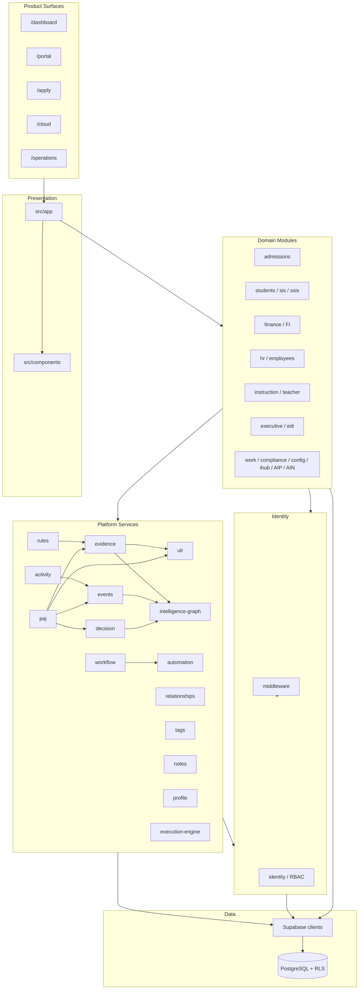

# Sprint 000 — Platform Contract

**Status:** Analysis only (no code or files modified)  
**Stack:** Next.js 16.2.9 App Router · React 19 · Tailwind 4 · Supabase PostgreSQL (no ORM)  
**Primary sources:** `docs/architecture/CURRENT_ARCHITECTURE_REPORT.md`, `docs/architecture/platform-services.md`, `src/lib/platform/`, `supabase/migrations/`, `package.json`

---

## Maturity legend

| Level | Meaning |
|-------|---------|
| **Complete** | Pattern exists, is documented, and is the default path |
| **Partial** | Engine/pattern exists; adoption, enforcement, or coverage is uneven |
| **Missing** | No real platform standard or infrastructure |

---

## 1. Platform architecture

| Field | Content |
|-------|---------|
| **Current implementation** | Modular monolith: routes in `src/app/`, UI in `src/components/`, domain logic in `src/lib/{module}/`, cross-cutting engines in `src/lib/platform/`, data via Supabase client + RLS. Five surfaces: `/dashboard`, `/portal`, `/apply`, `/cloud`, `/operations`. Server-first React; client islands for shells/forms. |
| **Maturity** | **Complete** (shape) / **Partial** (platform adoption) |
| **Required standard** | Presentation → Domain → Platform → Identity → Supabase → PostgreSQL. Domain mutations must go through platform services (activity, relationships, tags, notes, events where applicable). No parallel “shadow platforms.” |
| **Gaps** | Platform engines exist; many modules bypass them. Intelligence split across EDI / AIP / AIN / Executive / Mission Control. Cloud vs Operations near-duplicate. Docs/blueprints ahead of runtime. |
| **Recommended action** | Freeze this layering as the contract; Sprint 001 audits adoption and adds enforcement validators. |

---

## 2. Core platform services and responsibilities

| Service | Path | Responsibility | Maturity |
|---------|------|----------------|----------|
| Activity Engine | `src/lib/platform/activity/` | Canonical state-change write path | **Partial** |
| Relationship Engine | `src/lib/platform/relationships/` | Universal entity relationships | **Partial** |
| Tagging | `src/lib/platform/tags/` | Org-scoped tags | **Complete** |
| Notes | `src/lib/platform/notes/` | Polymorphic notes + visibility | **Complete** |
| Event Engine | `src/lib/platform/events/` | Registry pub/sub + persistence | **Partial** |
| Decision Engine | `src/lib/platform/decision/` | Rule/AI decisions + audit | **Partial** |
| KEE (Evidence) | `src/lib/platform/evidence/` | Doc 27 evidence records | **Partial** |
| Rules Engine | `src/lib/platform/rules/` | Explainable rule evaluation | **Partial** |
| Intelligence Graph | `src/lib/platform/intelligence-graph/` | Persistent graph edges | **Partial** |
| ULR | `src/lib/platform/ulr/` | Learning registry (domains→skills) | **Partial** |
| PAJ | `src/lib/platform/paj/` | Learning journey runtime (no UI) | **Partial** |
| Workflow | `src/lib/platform/workflow/` | State machines, instances, approvals | **Partial** |
| Automation / Mission Control | `src/lib/platform/automation/` | Queues, triggers, MC items | **Partial** |
| Execution Engine | `src/lib/platform/execution-engine/` | Workspace pipeline resolution | **Partial** |
| Hierarchy | `src/lib/platform/hierarchy/` | Org/school hierarchy refs | **Partial** |
| Profile Framework | `src/lib/platform/profile/` | Entity-agnostic profiles | **Complete** |
| Identity | `src/lib/platform/identity/` | RBAC, guards, MFA/SSO stubs | **Complete** (RBAC) / **Partial** (MFA) |
| Diagnostics | `src/lib/platform/diagnostics/` | Registry + health probes | **Complete** |
| Parent Communication | `src/lib/platform/parent-communication/` | Portal delivery + audit | **Partial** |
| Shared | `src/lib/platform/shared/` | Entity types, context helpers | **Complete** |

Barrel: `src/lib/platform/services/index.ts`  
Doc: `docs/architecture/platform-services.md`

| Field | Content |
|-------|---------|
| **Required standard** | New cross-cutting capability lands under `src/lib/platform/{service}/` with catalog, persistence, RLS, build validator, and integration tests before domain use. |
| **Gaps** | `recordActivity` only appears in a few `actions.ts` files (students + platform tags/notes/relationships). Module integration contract is documented but not enforced. |
| **Recommended action** | Adoption matrix + build-time contract check in Sprint 001. |

---

## 3. Folder structure standards

| Field | Content |
|-------|---------|
| **Current implementation** | `src/app/` routes; `src/components/{domain\|workspace-design-system\|experience-system\|platform}/`; `src/lib/{module}/` + `src/lib/platform/`; `src/types/database.ts`; `supabase/migrations/`; `scripts/validate-*.mts`; `tests/integration/`, `tests/smoke/`; `docs/{architecture,blueprints,constitution,governance}/`. Alias `@/*` → `./src/*`. |
| **Maturity** | **Complete** |
| **Required standard** | Business logic never in `page.tsx`. Server actions in `src/lib/{module}/actions.ts`. Platform-only code under `src/lib/platform/`. No new top-level packages without architecture approval. |
| **Gaps** | Some domain folders blur platform vs module (e.g. admissions-local notification stores). |
| **Recommended action** | Codify folder rules in this contract; reject PRs that put engines outside `platform/`. |

---

## 4. Database conventions

| Field | Content |
|-------|---------|
| **Current implementation** | SQL-first Supabase. UUID PKs (`gen_random_uuid()`). `organization_id` / `school_id` tenancy. `snake_case`. `platform_*` prefix for platform tables. RLS via `can_access_school()` / `has_permission()`. Soft delete uneven (`is_deleted` on notes; evidence uses status). Types mirrored in `src/types/database.ts`. |
| **Maturity** | **Complete** (conventions) / **Partial** (types sync, soft-delete universality) |
| **Required standard** | Every table: UUID PK, timestamps, tenant keys where applicable, RLS from day one, types regenerated after migrate. Prefer status/lifecycle over ad-hoc soft delete unless entity needs it. |
| **Gaps** | Manual type regen; fragmented RLS history (~157 migrations); soft-delete not universal. |
| **Recommended action** | Type-regen checklist; RLS inventory doc; soft-delete policy decision. |

---

## 5. Migration conventions

| Field | Content |
|-------|---------|
| **Current implementation** | `supabase/migrations/{NNN}_{description}.sql` (and some `release*` names). Often foundation + `*_rls.sql` pairs. Idempotent patterns common. Verify via `scripts/verify-migration-audit.mjs`. |
| **Maturity** | **Complete** (process) / **Partial** (naming consistency) |
| **Required standard** | Monotonic numeric prefix; one concern per migration; RLS with or immediately after foundation; never edit applied migrations; verify against linked DB. |
| **Gaps** | Mixed naming eras; many incremental RLS fix migrations. |
| **Recommended action** | Freeze naming to `{NNN}_{area}_{intent}.sql`; document “no rewrite applied SQL.” |

---

## 6. API conventions

| Field | Content |
|-------|---------|
| **Current implementation** | ~26 handlers under `src/app/api/**/route.ts`. Auth via `guardApiRoute()` / session middleware. Errors as `{ error: string }`. In-memory rate limit. Cron via `CRON_SECRET`. Public paths whitelisted. |
| **Maturity** | **Partial** |
| **Required standard** | Prefer server actions for app mutations. APIs for exports, cron, webhooks, docs. Unified envelope: `{ error, code?, details? }`. Always `guardApiRoute` unless explicitly public. |
| **Gaps** | No OpenAPI; no shared error schema; rate limit not multi-instance safe. |
| **Recommended action** | Shared API response helper + error codes in Sprint 001. |

---

## 7. Server Action conventions

| Field | Content |
|-------|---------|
| **Current implementation** | `"use server"` in `src/lib/**/actions.ts` (~35 files). `assertPermission` / `assertAnyPermission`. FormData inputs. Return `{ error }` or success payload. `revalidatePath` after mutations. Context helpers in `shared/context.ts`. |
| **Maturity** | **Complete** (pattern) / **Partial** (platform side-effects) |
| **Required standard** | Every mutating action: (1) permission assert, (2) `recordActivity` with catalog type, (3) relationships/tags/notes via platform APIs when applicable, (4) no thrown business errors—return `{ error }`. |
| **Gaps** | Most domain `actions.ts` skip `recordActivity`. |
| **Recommended action** | Adoption audit + optional lint/validator for mutation → activity. |

---

## 8. React component conventions

| Field | Content |
|-------|---------|
| **Current implementation** | Server Components default. Client for shells/forms/nav. Tailwind 4 only (no Radix/shadcn). WDS + XES design systems. Naming: `*PageContent`, `*Shell`, `*Panel`. Branding via `BrandingProvider`. Next 16 async `searchParams`. |
| **Maturity** | **Complete** (server-first) / **Partial** (a11y primitives) |
| **Required standard** | No `"use client"` on `page.tsx`/`layout.tsx`. Data fetch on server. Interactive UI as islands. Follow existing WDS/XES; don’t invent a third design system. |
| **Gaps** | Sparse `loading.tsx`; no shared accessible primitive kit. |
| **Recommended action** | Keep Tailwind+WDS; add loading boundaries for heavy routes later—not Sprint 001. |

---

## 9. Workflow conventions

| Field | Content |
|-------|---------|
| **Current implementation** | `src/lib/platform/workflow/` with types, execute, persistence (`136`/`137` migrations), registry + `validate:workflow`. Admissions is primary consumer. Actions include `run_automation`, `send_notification`, `record_audit`. |
| **Maturity** | **Partial** |
| **Required standard** | New lifecycle state machines register in platform workflow registry; domain catalogs reference platform definitions; transitions go through `executeWorkflowTransition`. |
| **Gaps** | Limited domain adoption beyond admissions. |
| **Recommended action** | Document when to use workflow vs activity-only; migrate next domain carefully. |

---

## 10. Audit conventions

| Field | Content |
|-------|---------|
| **Current implementation** | Multiple writers: `platform_audit_events`, activity `classification: "audit"`, compliance audit log, workflow history, event/decision persistence, automation/operational-loop audit helpers. Actor fields: `actor_user_id` / `actorId`, `occurred_at`. |
| **Maturity** | **Partial** (coverage) / **Complete** (field conventions where used) |
| **Required standard** | Security-sensitive and compliance mutations must write durable audit (DB). Prefer Activity Engine audit class + domain-specific compliance log when required. No audit-only `console.log`. |
| **Gaps** | Several parallel audit stores; no single “which audit for what” matrix enforced. |
| **Recommended action** | Publish audit routing matrix (identity / compliance / activity / workflow). |

---

## 11. Activity / Event conventions

| Field | Content |
|-------|---------|
| **Current implementation** | Activity: `ACTIVITY_EVENT_CATALOG`, `recordActivity` → `platform_activity_events` + legacy timeline dual-write + Integration Hub fan-out. Events: registry, `publishEvent`, optional `platform_event_records`, replay APIs, build validator. |
| **Maturity** | **Partial** |
| **Required standard** | State changes → Activity (catalogued). Cross-service intelligence/replay → Event Engine. No ad-hoc timeline inserts. |
| **Gaps** | Dual-write legacy timeline; incomplete module adoption; event publish optional and uneven. |
| **Recommended action** | Deprecation plan for `platform_timeline_events`; require activity on mutations. |

---

## 12. Evidence conventions

| Field | Content |
|-------|---------|
| **Current implementation** | Doc 27 types in `evidence/types.ts` + `EVIDENCE_TYPE_CATALOG`. `recordEvidence` → `platform_evidence_records`, ULR key validation, graph sync. Statuses: active / superseded / expired. Instruction is primary consumer. Tests exist. |
| **Maturity** | **Partial** |
| **Required standard** | All learning evidence through KEE; competency/skill keys must validate against ULR; no module-local evidence tables for new work. |
| **Gaps** | Limited consumers; blueprint docs ahead of broad runtime use. |
| **Recommended action** | Keep KEE as sole write path; expand catalog only via registry + tests. |

---

## 13. Notification conventions

| Field | Content |
|-------|---------|
| **Current implementation** | Parallel stores: admissions staff notifications, portal family notifications, parent-communication deliverer, workflow `send_notification`, SendGrid email, UI bells/lists. |
| **Maturity** | **Partial** |
| **Required standard** | Single platform notification interface (channel + audience + template + audit). Domain modules call platform, not invent tables. |
| **Gaps** | No unified `src/lib/platform/notifications/`. |
| **Recommended action** | Design interface in Sprint 001; implement later. |

---

## 14. Security / RBAC conventions

| Field | Content |
|-------|---------|
| **Current implementation** | Middleware session + password-reset gate. Layout/page/action/API guards. 130+ `PERMISSION_KEYS`. DB `has_permission`, role permissions, RLS. Super-role bypass. `ROLE_PERMISSION_FALLBACK`. Impersonation supported. MFA/SSO present but not fully enforced. |
| **Maturity** | **Complete** (model) / **Partial** (enforcement edges) |
| **Required standard** | Every page/action/API declares permissions. New permissions added to catalog + migration seed. No relying on fallback in production. RLS required for all tenant data. |
| **Gaps** | Fallback can mask missing migrations; MFA not enforced; some route/permission mismatches (e.g. executive / school leader). |
| **Recommended action** | Fix known RBAC mismatches; treat fallback as deploy failure signal. |

---

## 15. Configuration conventions

| Field | Content |
|-------|---------|
| **Current implementation** | Env: Supabase keys, SendGrid, vault, cron, app URL. Org/school `config` jsonb. Configuration Studio module. Branding in `branding_config`. Minimal `next.config.ts`. `vercel.json` cron. |
| **Maturity** | **Partial** |
| **Required standard** | Documented env contract; fail-fast validation at boot for required secrets; module toggles via Configuration Studio; no secrets in repo. |
| **Gaps** | No zod/env schema validation. |
| **Recommended action** | Add env schema validation in Sprint 001. |

---

## 16. Branding conventions

| Field | Content |
|-------|---------|
| **Current implementation** | `OrganizationBranding` types, defaults, resolve/load, `BrandingProvider`. Org-level colors, logos, product/surface labels. Audit doc exists. |
| **Maturity** | **Complete** (pipeline) / **Partial** (school-level) |
| **Required standard** | UI product names/labels from branding resolve—not hard-coded product strings in new UI. |
| **Gaps** | Mostly org-level, not per-school. |
| **Recommended action** | Keep org branding as contract; school override only if product requires it. |

---

## 17. Logging conventions

| Field | Content |
|-------|---------|
| **Current implementation** | No structured logger. Ad-hoc `console` (including TEMP auth logging in dashboard layout). Durable audit preferred via DB. |
| **Maturity** | **Missing** |
| **Required standard** | Structured logs (level, request/correlation id, actor, school). Never log secrets/PII. Prefer audit tables for security events. |
| **Gaps** | No pino/winston/OTel; TEMP console in critical path. |
| **Recommended action** | Remove TEMP logs immediately; pick logging approach next sprint after contract. |

---

## 18. Testing conventions

| Field | Content |
|-------|---------|
| **Current implementation** | Build: 11 registry validators. Vitest integration (~24) with mock Supabase. Playwright smoke (unauthenticated). Strategy doc: `platform-testing-strategy.md`. |
| **Maturity** | **Complete** (layers) / **Partial** (E2E depth) |
| **Required standard** | New platform service: catalog validator + integration tests. New registry: build gate. Mutations: mock-client tests for activity/audit side effects. |
| **Gaps** | No authenticated Playwright; mocks skip RLS. |
| **Recommended action** | One authenticated smoke fixture in Sprint 001 if capacity. |

---

## 19. Performance standards

| Field | Content |
|-------|---------|
| **Current implementation** | Server-first fetch; `cache()` on auth client; `Promise.all` in layouts; some Suspense; GIN search on activity; build-time registry validation. In-memory rate limits. Sparse loading UI. |
| **Maturity** | **Partial** |
| **Required standard** | Fetch at server boundary; parallelize independent queries; avoid N+1; no unbounded client waterfalls; indexes for hot filters; rate limits must work multi-instance for production APIs. |
| **Gaps** | Cold compile on heavy routes; missing loading states; in-memory rate limit. |
| **Recommended action** | Document budgets; defer Redis/rate-limit infra past Sprint 001. |

---

## 20. Coding standards

| Field | Content |
|-------|---------|
| **Current implementation** | TS `strict`. ESLint `eslint-config-next`. No Prettier. Tailwind v4 `@theme`. Absolute `@/` imports. snake_case DB / camelCase TS / kebab routes. AGENTS.md: read Next dist docs. |
| **Maturity** | **Complete** (TS/ESLint) / **Partial** (format consistency) |
| **Required standard** | Strict TS; lint clean on PR; match existing module patterns; no new UI libraries without approval; follow Next 16 APIs from local docs. |
| **Gaps** | No Prettier; lint warnings still present historically. |
| **Recommended action** | Keep ESLint as gate; Prettier optional later. |

---

## A. Dependency diagram

**Consumption rule:** Domain mutations → Activity (+ relationships/tags/notes). Persist paths on Event / Decision / Evidence / Rules → Intelligence Graph sync.

---

## B. Architectural risks

1. **Platform contract not enforced** — documented module integration; most actions skip Activity.
2. **Types drift** — `database.ts` can lag ~157 SQL migrations.
3. **Fragmented RLS** — hard to reason about as a single security model.
4. **Legacy timeline dual-write** — two activity histories until cutover.
5. **Parallel intelligence stacks** — EDI / AIP / AIN / Executive / Mission Control overlap.
6. **Cloud ≈ Operations duplication** — maintenance and RBAC drift risk.
7. **No production logging** — TEMP console on auth-critical paths.
8. **In-memory rate limiting** — ineffective across serverless instances.
9. **RBAC fallback** — can hide failed permission migrations.
10. **Service-role client surface** — elevated privilege misuse risk if broadened.
11. **Docs ahead of code** — blueprints/constitutions vs partial PAJ/ULR runtime.
12. **Notification fragmentation** — inconsistent delivery/audit.
13. **Test gap on RLS** — mocked Supabase never proves policies.
14. **Known permission/route mismatches** — e.g. executive access for some seeded roles.

---

## C. Platform contract files (rarely change)

Treat these as **constitutional**. Changes require architecture review.

### Runtime registries & catalogs
- `src/lib/platform/identity/types.ts` — permission catalog  
- `src/lib/platform/shared/entity-types.ts` — entity types  
- `src/lib/platform/activity/catalog.ts` — activity events  
- `src/lib/platform/events/registry/registry.ts` — event definitions  
- `src/lib/platform/evidence/catalog.ts` / `evidence/types.ts` — Doc 27  
- `src/lib/platform/workflow/types.ts` — workflow enums  
- `src/lib/platform/ulr/registry/registry.ts` — ULR  
- `src/lib/platform/profile/registry.ts` — profile kinds/sections  
- `src/lib/platform/rules/catalog/` · `decision/catalog/` · `hierarchy/catalog/` · `execution-engine/catalog/` · `automation/catalog/` · `intelligence-graph/catalog/`  
- `src/lib/branding/types.ts`  
- `src/lib/platform/services/index.ts` — public platform barrel  
- `src/types/database.ts` — schema mirror (regen only, not hand-edit)

### Build validators
- `scripts/validate-platform-registry.mts`  
- `scripts/validate-platform-workflow-registry.mts`  
- `scripts/validate-platform-decision-registry.mts`  
- `scripts/validate-platform-event-registry.mts`  
- `scripts/validate-platform-intelligence-graph-registry.mts`  
- `scripts/validate-platform-automation-registry.mts`  
- `scripts/validate-platform-ulr-registry.mts`  
- `scripts/validate-platform-hierarchy-registry.mts`  
- `scripts/validate-platform-execution-engine.mts`  
- `scripts/validate-admissions-registry.mts`  

### SQL / identity foundations
- `supabase/migrations/001_phase1_core_foundation.sql`  
- `supabase/migrations/037_can_access_school_function.sql` / `038_policies_use_can_access_school.sql`  
- `supabase/migrations/042_rbac_integrity_lock.sql`  
- `supabase/migrations/074_enterprise_identity_foundation.sql`  
- Platform persistence/RLS pair `132`–`154` (activity through PAJ)

### Architecture docs (spec contracts)
- `docs/architecture/platform-services.md`  
- `docs/architecture/platform-profile-registry.md`  
- `docs/architecture/platform-profile-workspace.md`  
- `docs/architecture/platform-testing-strategy.md`  
- `docs/architecture/CURRENT_ARCHITECTURE_REPORT.md`  
- Doc 12 (ULR) / Doc 27 (Evidence) under `docs/blueprints/academy-way-learning-system/`

---

## D. Recommended Sprint 001 scope

**Theme:** Enforce the Platform Contract — no new product features.

### P0 (must)
1. **Persist this contract** as the Sprint 000 deliverable (e.g. `docs/architecture/PLATFORM_CONTRACT.md`) when you authorize a write.  
2. **Module integration audit** — which `actions.ts` call `recordActivity` / platform relationships/tags/notes; publish adoption matrix.  
3. **Regenerate & verify `database.ts`** against linked schema; typecheck green.  
4. **Remove TEMP auth `console` logging** in dashboard layout.  
5. **Fix known RBAC/route mismatches** called out in stabilization docs (e.g. executive / school leader).

### P1 (should)
6. **Contract validator** — build script that fails when mutating actions omit Activity (or at least when new catalog types are missing).  
7. **Timeline dual-write deprecation plan** — Activity-only target state + cutover steps.  
8. **Unified API error envelope** across the ~26 handlers.  
9. **Env validation** — required secrets fail fast.

### P2 (if capacity)
10. **Notification service interface design** (no full rewrite).  
11. **RLS policy inventory** from migration audit.  
12. **One authenticated Playwright smoke** for a critical dashboard path.

### Explicitly out of scope
PAJ UI, new profile kinds, Cloud/Ops merge, Redis rate limits, Radix adoption, full blueprint implementation, Prettier rollout.

---

**Verdict:** The platform shape is real and largely Complete; the binding gap is **enforcement and universal adoption** of Activity/Events/Evidence/Notifications and production logging. Sprint 001 should lock the contract and close the highest-risk adoption/security gaps—not ship new modules.
