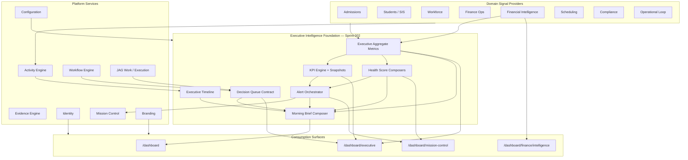

# Sprint 002 — Executive Intelligence Foundation

**Status:** Architecture & implementation plan only (no application code)  
**Date:** July 9, 2026  
**Repository:** `school-platform` (The JAG OS)  
**Prerequisite:** Sprint 000 Platform Contract · Sprint 001 Branding / Founder Morning Brief baseline

**Related documents:**

| Document | Relationship |
|----------|--------------|
| [`PLATFORM_CONTRACT.md`](./PLATFORM_CONTRACT.md) | Layering, engine adoption, identity standards |
| [`platform-services.md`](./platform-services.md) | Phase 2 engine APIs |
| [`ORGANIZATIONAL_HEALTH_ENGINE.md`](./ORGANIZATIONAL_HEALTH_ENGINE.md) | Full OHE (planned Sprint 3) — Sprint 002 ships interim health composers |
| [`FOUNDERS_EDITION_BUILD_PLAN.md`](./FOUNDERS_EDITION_BUILD_PLAN.md) | Sprint 6–7 Mission Control / Executive trim targets |
| [`FINANCIAL_INTELLIGENCE_PHASE0_ARCHITECTURE.md`](./financial-intelligence/FINANCIAL_INTELLIGENCE_PHASE0_ARCHITECTURE.md) | GL spine (deferred — FI BI layer only in Sprint 002) |
| [`SPRINT1_IMPLEMENTATION.md`](./SPRINT1_IMPLEMENTATION.md) | Founder Morning Brief runtime baseline |

---

## 0. Sprint Intent

Sprint 002 establishes the **Executive Intelligence Foundation**: a single, platform-aligned contract for how executive surfaces observe, score, alert, queue decisions, and summarize financial/operational health.

This sprint does **not** invent parallel intelligence systems. It **unifies and contracts** what already exists:

| Existing runtime | Role in Sprint 002 |
|------------------|--------------------|
| Founder Morning Brief (`morning-brief.ts`) | Canonical brief composer — extended, not replaced |
| Executive KPI Center (`kpi-center.ts` + `executive_kpi_*`) | Snapshot writer + registry contract |
| Executive Insights + Mission Control items | Unified alert path |
| JAG Work + Execution Engine | Canonical Decision Queue |
| Activity Engine feed | Canonical Executive Timeline |
| Financial Intelligence (`getExecutiveFinancialDashboard`) | FI Summary + Cash Flow Summary sources |
| EDI scorecard / Mission Health / OEI | Interim health score adapters until OHE Sprint 3 |
| Branding + Configuration | Labels, widget visibility, go-live gates |
| Identity | Permission matrix for all executive surfaces |

**Design principle:** *Compose once, consume everywhere. Write through platform services. Score with explainability. Never auto-execute executive decisions.*

### 0.1 Architectural Position



### 0.2 Layering Rules (Platform Contract)

1. Presentation → Domain → Platform → Identity → Supabase → PostgreSQL.
2. Executive mutations (insight resolve, decision record, alert acknowledge, KPI snapshot write) **must** call `recordActivity`.
3. Decision lifecycle transitions **should** use Workflow Engine where an approval/defer path exists.
4. Learning evidence remains KEE-owned; executive health may **read** evidence rates as signals — never write fake evidence.
5. Branding resolves all executive surface labels; Configuration governs feature flags / widget enablement.
6. Full Organizational Health Engine (OHE) remains Sprint 3. Sprint 002 ships **interim health composers** that match OHE pillar keys so migration is a swap, not a rewrite.

### 0.3 Canonical Runtime Homes (planned — implement in later coding sprints)

| Concern | Proposed path | Notes |
|---------|---------------|-------|
| Aggregate metrics | `src/lib/executive/aggregate-metrics.ts` | Single `getExecutiveAggregateMetrics()` |
| KPI snapshot job | `src/lib/executive/kpi-snapshots.ts` + cron API | Writes `executive_kpi_snapshots` |
| Alert orchestrator | `src/lib/executive/alerts.ts` | Dedupes insights → MC items → FI alerts |
| Health composers | `src/lib/executive/health/` | Campus / Staffing / Admissions interim scores |
| Decision queue contract | Document + thin adapter over `resolveJagWorkQueue` | No second queue store |
| Activity catalog extensions | `src/lib/platform/activity/catalog.ts` | Executive / EDI / FI event types |

---

## 1. Capability Designs

For each capability: data sources, activity events, platform services, update frequency, permissions, dashboard components, performance considerations.

---

### 1. Executive Morning Brief

**Purpose:** First-viewport executive orientation on `/dashboard` — health snapshot, top priorities, decisions waiting, financial pulse, and branded narrative. One composition, not a dashboard of widgets.

**Current baseline:** `getFounderMorningBrief()` already composes Mission Control priorities, AI brief, and JAG Work decisions for leadership roles.

#### Data sources

| Source | Runtime | Fields used |
|--------|---------|-------------|
| Mission Control compose | `composeMissionControlCommandCenter` | Critical/high priorities, Mission Health / OEI, activity stream head |
| Executive Aggregate Metrics *(new contract)* | Command Center + FI + admissions + HR rollups | Enrollment, attendance, collection, open criticals |
| JAG Work queue | `resolveJagWorkQueue` perspectives `needs_human_decision`, `strategic_decisions` | Decisions waiting (≤5) |
| Executive insights | `getExecutiveInsights` | Brief narrative enrichment |
| EDI briefings | `getLatestBriefings` (via MC `aiBrief`) | Structured brief sections |
| Interim health composers | Campus / Staffing / Admissions / SI proxy | Hero health chips |
| FI executive rollup | `getExecutiveFinancialDashboard` | Cash / margin one-liners |
| Branding | `OrganizationBranding` | `founderWorkspaceLabel`, CTA labels |

#### Activity events consumed

| Event type | Use in brief |
|------------|--------------|
| `admissions.*` (inquiry, stage, decision, enrollment) | Pipeline velocity chip / admissions health drag |
| Finance payment / invoice events *(catalog gap — add)* | Cash pulse freshness |
| `platform.*` tag/note/relationship (low priority) | Not shown in brief |
| Executive insight / decision / alert events *(new)* | “What changed overnight” strip |

**Read path:** Brief reads Activity via Mission Control `activityStream` (already `getActivityFeed`) — do not query domain tables for the overnight strip.

#### Platform services used

| Service | Role |
|---------|------|
| **Identity** | `hasExecutiveLeadershipRole` / `canAccessExecutiveIntelligence` gate |
| **Mission Control** | Priority feed + AI brief shell |
| **JAG Work / Execution Engine** | Decision queue slice |
| **Activity Engine** | Overnight timeline strip |
| **Branding** | Hero product/workspace naming |
| **Configuration** | Optional brief section toggles (`mission_control` / `executive` config keys) |
| **Financial Intelligence** | Cash / margin summary line |
| **Workflow** | Indirect — decision items may link to workflow instances |

#### Update frequency

| Layer | Cadence |
|-------|---------|
| Page load compose | On every `/dashboard` request (server component) |
| Underlying MC items / insights | Near-real-time on write; brief is read-time merge |
| Health / KPI snapshots | Daily snapshot; brief prefers latest snapshot + live criticals |
| Overnight activity strip | Last 12–18 hours from Activity Engine |

#### Required permissions

| Permission / role | Access |
|-------------------|--------|
| Executive leadership roles (`FOUNDER`, `CEO`, `EXECUTIVE_DIRECTOR`, `PRESIDENT`, `SUPERINTENDENT`) | Full executive brief sections |
| `executive.intelligence` OR `executive.dashboard` OR `global.reporting` | Intelligence sections without leadership role |
| Non-executive authenticated users | Founder dashboard cards only (`executive: null`) — existing behavior |
| `fi.view` / `finance.executive` | Financial pulse line (hide if lacking) |
| `mission_control.access` | Not required for brief if leadership role (match MC compose exception) |

#### Dashboard components

| Component | Surface | Notes |
|-----------|---------|-------|
| Hero brand + OHI/health chip | `/dashboard` | Brand-first; one headline; one supporting sentence |
| Priorities list (≤5 critical/high) | Same | From MC; deep-link to Mission Control |
| Decisions waiting (≤5) | Same | From Decision Queue contract |
| Financial pulse (cash + margin) | Same | Permission-gated |
| Overnight activity strip (≤8) | Same | Activity Engine |
| CTA group | Same | Mission Control + Executive Intelligence (branded labels) |

**Hero budget:** Brand, one headline, one sentence, one CTA group, health chip. No stat strips, schedules, or secondary marketing in first viewport (aligns with Founder's Edition + design rules).

#### Performance considerations

- Keep `Promise.all` fan-out ≤ existing pattern (founder dashboard + MC compose + insights).
- Cap priorities/decisions/activity at 5–8 items.
- Prefer **snapshot reads** for health/KPI; live queries only for critical MC counts and decision queue.
- Do not call full FI profitability matrix on home — use `getExecutiveFinancialDashboard` summary fields only (or a thinner `getFinancialPulse()` adapter).
- Cache aggregate metrics per `(orgId, schoolId)` for 60–120s in-process only if measured p95 regresses; otherwise rely on snapshot tables.

---

### 2. Executive KPI Engine

**Purpose:** Registry-driven KPI definitions with scored actuals, targets, status, and historical snapshots — single source for `/dashboard/executive/kpis`, Morning Brief chips, and alert thresholds.

**Current baseline:** `getKpiCenter()` computes live from Command Center / finance / HR / instruction / admissions; `executive_kpi_snapshots` exists but is under-written; `prior_value` is always null.

#### Data sources

| KPI key (existing / planned) | Source module | Function / table |
|------------------------------|---------------|------------------|
| `enrollment_growth` | Command Center | `getCommandCenterMetrics` |
| `attendance_rate` | Command Center / SIS | metrics |
| `avg_success_score` | Students / PAJ | metrics |
| `reading_growth` | Instruction | `getExecutiveInstructionDashboard` |
| `staff_retention` | HR | `getWorkforceAnalytics` (invert turnover) |
| `collection_rate` | Finance | `getFinanceExecutiveDashboard` |
| `operating_margin` | Finance / FI | finance + FI school financials |
| `grant_utilization` | Finance / scholarships | *(often null today — mark partial)* |
| `student_retention` | SIS | *(gap — define signal or keep unknown)* |
| `parent_engagement` | Portal / comms | *(gap)* |
| Admissions conversion | Admissions | `getExecutiveAdmissionsMetrics` |
| Cash / days-cash proxy | FI | `cashPosition` / payment rollups |

Definitions: `executive_kpi_definitions` (active, sorted).  
History: `executive_kpi_snapshots`.

#### Activity events consumed

| Event | Effect on KPI Engine |
|-------|----------------------|
| Domain operational events | Indirect — refresh live compute on next read |
| `executive.kpi_snapshot_written` *(new)* | Audit + timeline |
| Threshold breach from snapshot job | Emits alert via Alert Orchestrator |

KPI Engine does **not** subscribe to every domain event in Sprint 002; it runs on **schedule + on-demand read**.

#### Platform services used

| Service | Role |
|---------|------|
| **Configuration** | Org-level enable/disable of KPI keys; target overrides (future) |
| **Identity** | `executive.intelligence`, `executive.dashboard`, `global.reporting` |
| **Activity Engine** | Snapshot write + breach events |
| **Event Engine** *(P1)* | Optional `publishEvent` on snapshot for graph/replay |
| **Mission Control** | Breach → MC item via Alert Orchestrator |
| **Branding** | KPI center page title via `intelligenceEngineLabel` |

#### Update frequency

| Mode | Cadence |
|------|---------|
| Live compose (`getKpiCenter`) | On page load / API |
| Snapshot writer | **Daily** (school-local morning, cron + `CRON_SECRET`) |
| Board / trend charts | Read snapshots (12–36 periods) |
| Alert evaluation | On snapshot write + optional hourly critical recheck |

#### Required permissions

| Permission | Access |
|------------|--------|
| `executive.intelligence` / `executive.dashboard` / `global.reporting` | View KPI center |
| `executive.strategic` | Edit targets / definitions *(if exposed)* |
| `founder.override` / enterprise admin | Manage definitions |
| School-scoped RLS | Snapshot rows by `school_id` |

#### Dashboard components

| Component | Route |
|-----------|-------|
| KPI status table (actual / target / trend / status) | `/dashboard/executive/kpis` |
| Category filter chips | Same |
| Sparkline / history (from snapshots) | Same |
| Drill-down links to health pillars / modules | Same |
| Brief “KPI watch” (≤3 off-track) | Morning Brief |

#### Performance considerations

- Snapshot job must **not** recompute full program profitability for every KPI — reuse FI school-level rollups.
- Parallelize domain fetches with hard timeouts; mark KPI `unknown` on partial failure rather than failing the page.
- Index `(school_id, kpi_key, snapshot_date)` on snapshots (verify migration 094).
- Avoid N+1 history queries — batch history for visible KPI keys.

---

### 3. Executive Alerts

**Purpose:** Single orchestrated alert path so executives do not see the same risk as an insight, an MC item, and an FI alert with three severities.

**Current baseline (fragmented):**

- `executive_insights` (+ sync to MC)
- `fi_financial_alerts` (+ sync to MC)
- `platform_mission_control_items`
- EDI recommendations with risk levels
- Admissions automation failures → MC

#### Data sources

| Producer | Store today | Sprint 002 contract |
|----------|-------------|---------------------|
| Executive Insights generator | `executive_insights` | Producer → Alert Orchestrator |
| FI automation | `fi_financial_alerts` | Producer → Alert Orchestrator |
| EDI recommendations (critical) | `edi_recommendations` | Producer → Alert Orchestrator |
| Operational Loop / scheduling conflicts | MC items | Already MC-native |
| KPI threshold breaches | *(new from snapshots)* | Producer → Alert Orchestrator |
| Health score drops | Interim composers | Producer → Alert Orchestrator |

**Canonical queue for operators:** `platform_mission_control_items`  
**Canonical intelligence record:** keep domain tables for provenance; orchestrator owns **dedupe key** + MC linkage.

#### Activity events consumed / emitted

| Direction | Event |
|-----------|-------|
| Consume | Domain severity signals via producers (not raw activity fan-in in Sprint 002) |
| Emit | `executive.alert_raised`, `executive.alert_acknowledged`, `executive.alert_resolved` *(new catalog)* |
| Emit | Existing MC create path should also `recordActivity` |

#### Platform services used

| Service | Role |
|---------|------|
| **Mission Control** | Canonical open-item queue |
| **Activity Engine** | Audit trail for raise/ack/resolve |
| **Workflow Engine** | Escalation path for critical alerts past SLA *(optional Sprint 002 slice)* |
| **Identity** | `executive.risk_view`, `mission_control.access`, `fi.view` for financial class |
| **Configuration** | Severity thresholds, mute windows |
| **Branding** | Alert module labels in MC |

#### Update frequency

| Class | Cadence |
|-------|---------|
| Critical operational | On write (near real-time) |
| Financial / KPI | On snapshot / FI compute / import |
| Health drift | Daily with snapshot job; immediate if drop ≥ configured delta |
| Dedup sweep | On orchestrator write (same `dedupe_key` upsert) |

#### Required permissions

| Permission | Access |
|------------|--------|
| `mission_control.access` OR leadership role | View / act on MC-backed alerts |
| `executive.risk_view` / `executive.intelligence` | View executive insight class |
| `fi.view` / `fi.executive` | View financial alert class |
| `edi.view` | View EDI-originated alerts |
| Acknowledge / resolve | Same as view + module mutate permission |

#### Dashboard components

| Component | Surface |
|-----------|---------|
| Priority lists (critical/high/medium/low) | Mission Control |
| Attention chips | Mission Control + Morning Brief |
| Risk register cross-link | `/dashboard/executive/risk` |
| Alert detail drawer (provenance, recommended action, href) | MC / Executive |

#### Performance considerations

- Dedupe before insert — never triple-write three open items for one underlying fact.
- Cap MC feed queries with severity filters; brief only pulls critical/high.
- Async sync from FI/EDI producers; page reads should not trigger full insight regeneration.

---

### 4. Executive Decision Queue

**Purpose:** One queue of human decisions for executives — approve, reject, defer, escalate — without a second work-item database.

**Current baseline:** `resolveJagWorkQueue` + Execution Engine workspace `executive` + EDI `edi_recommendations` + Morning Brief `decisionsWaiting`.

#### Data sources

| Source | Perspective / store |
|--------|---------------------|
| JAG Work / Execution Engine | `needs_human_decision`, `strategic_decisions`, `awaiting_review`, `board_ready` |
| EDI recommendations | Open recommendations linked via `mission_control_item_id` |
| Executive insights with recommended actions | Injected into JAG Work input today |
| Compliance alerts / MC criticals | Work-queue boost signals |
| Workflow approval tasks | Admissions + future executive decision workflows |

#### Activity events consumed / emitted

| Event | Role |
|-------|------|
| `edi.decision_recorded` *(new)* | Decision outcome audit |
| `executive.decision_deferred` / `_escalated` *(new)* | Lifecycle |
| Workflow transition events | When decision is workflow-backed |
| Admissions `admissions.decision_recorded` | Appears when executive workspace includes admissions decisions |

#### Platform services used

| Service | Role |
|---------|------|
| **JAG Work** | Canonical queue API |
| **Execution Engine** | `executeWorkspace({ workspaceKey: "executive" })` |
| **Workflow Engine** | Approve/reject/defer state machine for EDI decisions *(Sprint 002 target: register definition; wire record path)* |
| **Decision Engine (platform)** | Optional explainable rule pre-score — not auto-execute |
| **Mission Control** | Linked operational items |
| **Identity** | `edi.manage` / `edi.executive` / `executive.intelligence` |
| **Activity Engine** | Mandatory on decision mutation |
| **Evidence Engine** | Out of scope for executive decisions (learning-only); may attach links as metadata only |

#### Update frequency

| Layer | Cadence |
|-------|---------|
| Queue resolve | On page load (Executive + Morning Brief) |
| Item state | On user action (server action) |
| Priority boosts from health/alerts | On compose using latest snapshots |

#### Required permissions

| Permission | Access |
|------------|--------|
| `executive.intelligence` / leadership | View executive queue |
| `edi.manage` / `edi.executive` | Act on EDI recommendations |
| `edi.board` | Board-ready perspective |
| Module-specific permissions | Acting on admissions/finance-origin items |

#### Dashboard components

| Component | Route |
|-----------|-------|
| `JagWorkPanel` (default executive mode) | `/dashboard/executive` |
| Decisions waiting strip | `/dashboard` Morning Brief |
| Decisions list / cards | `/dashboard/executive/decisions` |
| Perspective tabs | today / highest / awaiting / needs decision / strategic / board |

#### Performance considerations

- Resolve queue once per request; pass slices to Brief vs Executive (do not double-resolve).
- Limit engine recommendations injection size.
- Workflow instance lookup by entity — indexed; avoid scanning all instances.

---

### 5. Executive Timeline

**Purpose:** Chronological, permission-aware feed of what changed across the enterprise for executive context — not a student profile timeline clone.

**Current baseline:** Mission Control `activityStream` via Activity Engine `getActivityFeed`; legacy `platform_timeline_events` dual-write still exists.

#### Data sources

| Source | Role |
|--------|------|
| `platform_activity_events` | **Canonical** read |
| Mission Control compose | Already surfaces stream |
| Filtered module keys | `admissions`, `finance`, `sis`, `identity`, `platform`, plus new `executive` / `edi` / `fi` |

#### Activity events consumed

All catalogued events with `visibility` appropriate to executive roles. Sprint 002 **adds** catalog entries:

| New event type | When |
|----------------|------|
| `executive.insight_generated` | Insight producer |
| `executive.alert_raised` / `_acknowledged` / `_resolved` | Alert Orchestrator |
| `executive.kpi_snapshot_written` | Daily job |
| `executive.health_score_computed` | Health composers |
| `edi.decision_recorded` | Decision queue actions |
| `edi.briefing_published` | Briefing write |
| `fi.alert_raised` / `_resolved` | FI automation |

#### Platform services used

| Service | Role |
|---------|------|
| **Activity Engine** | Sole read API for timeline |
| **Identity** | Visibility + school scope |
| **Mission Control** | Embed stream panel |
| **Branding** | Timeline section label |
| **Evidence Engine** | Not a timeline source (learning evidence stays on student surfaces) |

#### Update frequency

| Surface | Cadence |
|---------|---------|
| Mission Control stream | On load; optional soft refresh |
| Morning Brief overnight strip | Last 12–18h on load |
| Executive Timeline page *(if exposed)* | Paginated on load |

#### Required permissions

| Permission | Access |
|------------|--------|
| `mission_control.access` OR leadership / `executive.intelligence` | View executive-scoped feed |
| Audit classification events | `founder.override` / compliance roles as today |
| School scoping | RLS + `accessibleSchoolIds` |

#### Dashboard components

| Component | Surface |
|-----------|---------|
| Activity stream list | Mission Control |
| Overnight strip | Morning Brief |
| Optional full timeline | Executive sub-view or MC expanded |

#### Performance considerations

- **Deprecate dual-read** of `platform_timeline_events` for executive surfaces — Activity only.
- Cursor/keyset pagination; default limit 25–50.
- Index `(organization_id, created_at desc)` / school filters (verify Phase 2 migration).
- Exclude high-chatter `platform` tag events from executive default filter.

---

### 6. Financial Intelligence Summary

**Purpose:** Executive-grade FI rollup — EBITDA, margins, top/bottom programs, forecast, open financial risks — consumed by Morning Brief, Executive, and FI intelligence page.

**Current baseline:** `getExecutiveFinancialDashboard()` already aggregates school financials, program profitability, break-even summary, forecast, finance ops dashboard, open FI alerts.

#### Data sources

| Source | Runtime |
|--------|---------|
| School financials | `computeSchoolFinancials` → `fi_profitability_snapshots` |
| Program / class profitability | `computeProgramProfitability`, `computeClassProfitability` |
| Break-even | `computeBreakEvenAnalysis` / `summarizeBreakEven` |
| Forecast | `getFinancialForecastSummary` |
| Finance ops | `getFinanceExecutiveDashboard` (AR, collection, billed/collected) |
| Alerts | `fi_financial_alerts` unresolved count |
| Scenarios *(link only)* | `fi_scenarios` — not computed on summary path |

**Out of scope for Sprint 002:** Native GL Phase 0. Summary continues on operational + imported truth with explicit `confidence: estimated` where heuristics apply (e.g. payroll % of revenue in school financials).

#### Activity events consumed / emitted

| Event | Role |
|-------|------|
| Payment / invoice domain events *(add to catalog if missing)* | Freshness for cash |
| `fi.alert_raised` / `_resolved` | Alert path |
| `fi.summary_computed` *(optional)* | Snapshot audit |

#### Platform services used

| Service | Role |
|---------|------|
| **Financial Intelligence** | Primary composer |
| **Identity** | `fi.view`, `fi.executive`, `finance.executive`, `executive.intelligence` |
| **Mission Control** | Financial alerts |
| **Activity Engine** | Mutations + optional summary write |
| **Configuration** | FI module enablement / go-live |
| **Branding** | `financialIntelligenceLabel` |
| **KPI Engine** | Consumes margin / collection as KPI actuals |
| **Workflow** | Not required for summary read |

#### Update frequency

| Layer | Cadence |
|-------|---------|
| On-demand executive summary | Page load (FI + Executive) |
| Profitability snapshot upsert | On `computeSchoolFinancials` |
| Morning Brief pulse | Read summary fields only; daily snapshot preferred |
| Import-triggered recompute | After QuickBooks/CSV import |

#### Required permissions

| Permission | Access |
|------------|--------|
| `fi.view` / `fi.executive` / `finance.executive` | Full FI summary |
| `executive.intelligence` | Rollup on executive surfaces |
| `fi.scenarios` | Scenario links only |
| `fi.manage` | Imports / allocation rules |

#### Dashboard components

| Component | Route |
|-----------|-------|
| Executive financial panel (EBITDA, margin, cash, risks) | `/dashboard/finance/intelligence` + Executive |
| Top/bottom programs list | FI page |
| Classes below break-even count | FI page |
| Forecast revenue/payroll | FI + Forecasting route |
| Brief financial pulse | Morning Brief |

#### Performance considerations

- **Split APIs:** `getFinancialPulse()` (cheap) vs full `getExecutiveFinancialDashboard()` (expensive).
- Morning Brief and aggregate metrics must call the pulse path only.
- Program profitability sort capped; do not load class-level matrix on home.
- Break-even compute should be skippable when only pulse is needed (today summary always calls it — contract to make optional).

---

### 7. Campus Health Score

**Purpose:** 0–100 explainable score for a campus/school site reflecting operational readiness, utilization, enrollment pressure, and local risk — interim OHE `organizational_capacity` + `operational` blend until Sprint 3.

#### Data sources

| Signal | Source |
|--------|--------|
| Schedule utilization / conflicts | `scheduling/intelligence` / EDI capacity (`campusUtilizationPct`) |
| Enrollment vs capacity | SIS students + sections |
| Open MC criticals for school | Mission Control |
| Attendance rate | Command Center metrics |
| Compliance alerts local | Compliance / Command Center |
| Network dashboard by school | `getNetworkDashboardBySchool` (MC compose) |

Pillar mapping (OHE-aligned keys): primarily `operational` + `organizational_capacity`; secondary `compliance_integrity`.

#### Activity events consumed

| Event | Signal impact |
|-------|---------------|
| Scheduling conflict / coverage events | Utilization / conflict counts |
| Enrollment lifecycle | Capacity pressure |
| MC item create/resolve | Open critical penalty |
| `executive.health_score_computed` | Emit after score write |

#### Platform services used

| Service | Role |
|---------|------|
| **Mission Control** | Critical item counts |
| **Activity Engine** | Provenance + score event |
| **Identity** | School/campus scope |
| **Configuration** | Capacity targets |
| **Hierarchy** | Campus/school binding |
| **KPI Engine** | May expose campus score as KPI |
| **Evidence Engine** | Not used (not learning score) |

#### Update frequency

| Mode | Cadence |
|------|---------|
| Snapshot | Daily with KPI/health job |
| Live compose | On Executive / MC when drilling into campus |
| Alert | On drop ≥ threshold vs prior snapshot |

#### Required permissions

| Permission | Access |
|------------|--------|
| `executive.intelligence` / `mission_control.access` / leadership | View |
| Campus-scoped assignments | RLS / org assignments |
| `global.reporting` | Network rollup |

#### Dashboard components

| Component | Surface |
|-----------|---------|
| Campus score gauge + drivers/drags | Mission Control network / Executive |
| Per-campus row in network map | MC |
| Brief chip when campus is top drag | Morning Brief |

#### Performance considerations

- Score from **precomputed snapshot** for lists; live only for single-campus drilldown.
- Reuse EDI capacity planning outputs — do not re-query all sections per campus on home.

---

### 8. Staffing Health Score

**Purpose:** 0–100 score for workforce sustainability — staffing levels, vacancies, turnover, certification risk, substitute load — maps to OHE `educator_experience` + `organizational_capacity`.

#### Data sources

| Signal | Source |
|--------|--------|
| Active headcount | `getWorkforceAnalytics` → `staffingLevels` |
| Vacancies | `hr_job_postings` open |
| Turnover rate | HR analytics |
| Expiring certifications (90d) | `employee_certifications` |
| Substitute usage 30d | `substitute_assignments` |
| Payroll cost pressure | Payroll YTD vs FI revenue *(optional)* |
| EDI staffing briefing / teacher domain recs | `edi/briefings` staffing slice |

#### Activity events consumed

| Event | Role |
|-------|------|
| HR hire / separation *(add catalog if missing)* | Headcount freshness |
| Certification status changes | Risk signal |
| `executive.health_score_computed` | Emit |

#### Platform services used

| Service | Role |
|---------|------|
| **Identity** | HR + executive permissions |
| **Activity Engine** | Score + HR mutations |
| **Mission Control** | Staffing alerts |
| **Workflow** | Hiring / certification renewal workflows (consume status, don’t rebuild) |
| **Configuration** | Target staffing ratios |
| **KPI Engine** | `staff_retention` linkage |
| **Evidence Engine** | Unused |

#### Update frequency

| Mode | Cadence |
|------|---------|
| Daily snapshot | With health job |
| HR dashboard live | On `/dashboard/hr` analytics |
| Alert | Vacancy spike / cert expiry cluster |

#### Required permissions

| Permission | Access |
|------------|--------|
| HR view permissions + `executive.intelligence` | Executive staffing score |
| `edi.view` | EDI staffing recommendations |
| Restrict PII | Score aggregates only on executive surfaces — no employee lists in Brief |

#### Dashboard components

| Component | Surface |
|-----------|---------|
| Staffing score + vacancy/turnover/certs chips | Executive / MC |
| Link to Workforce module | CTA |
| Brief inclusion only if score is a top drag or critical alert | Morning Brief |

#### Performance considerations

- Analytics query already multi-table — snapshot daily; Brief reads snapshot.
- Never expand employee rows on executive home.

---

### 9. Admissions Health Score

**Purpose:** 0–100 score for enrollment pipeline health — velocity, conversion, stage bottlenecks, forecasted tuition — maps to OHE `community_engagement` + financial forecast contribution.

#### Data sources

| Signal | Source |
|--------|--------|
| Funnel / stage counts | `getExecutiveAdmissionsMetrics` |
| Acceptance / enrollment conversion | Same |
| Avg days inquiry → acceptance | Same |
| Forecasted tuition / funding | Same |
| Pipeline velocity | `computePipelineVelocity` |
| Failed admissions automations | MC items (admissions module) |
| Workflow instance delays | Admissions workflow engine |

#### Activity events consumed

| Event | Role |
|-------|------|
| `admissions.inquiry_created` | Inflow |
| `admissions.stage_changed` | Velocity / bottleneck |
| `admissions.decision_recorded` | Conversion |
| `admissions.enrollment_completed` | Yield |
| Automation failure → MC | Penalty |

#### Platform services used

| Service | Role |
|---------|------|
| **Workflow Engine** | Admissions case orchestration (primary consumer already) |
| **Activity Engine** | Catalogued admissions events + score emit |
| **Mission Control** | Automation / SLA alerts |
| **Identity** | Admissions + executive permissions |
| **KPI Engine** | Enrollment growth / conversion KPIs |
| **Configuration** | Pipeline stage registry / targets |
| **Evidence Engine** | Unused |

#### Update frequency

| Mode | Cadence |
|------|---------|
| Daily snapshot | Health job |
| Admissions executive widgets | On load |
| Alert | Conversion drop / stage SLA breach |

#### Required permissions

| Permission | Access |
|------------|--------|
| Admissions view + `executive.intelligence` | Score on executive surfaces |
| Leadership roles | Brief chip |
| School scope | Leads/applications RLS |

#### Dashboard components

| Component | Surface |
|-----------|---------|
| Admissions health gauge + funnel spark | Executive / Admissions executive widgets |
| Bottleneck stage callout | Same |
| Forecasted tuition line | FI Summary adjacent |
| Brief chip when top drag | Morning Brief |

#### Performance considerations

- `getExecutiveAdmissionsMetrics` is already heavy (many parallel selects) — **snapshot daily**; Brief must not call full metrics.
- Reuse snapshot for KPI `enrollment_growth` companion signals where possible.

---

### 10. Cash Flow Summary

**Purpose:** Executive cash position and near-term cash movement summary — collected payments, AR pressure, forecast tuition vs payroll, open cash-related alerts.

**Current baseline:** `cashPosition` / `cashFlow` from school financials (YTD payments sum); FI scenarios expose `projected_cash_flow`; EDI financial decisions include `cash_flow_improvement` types. Heuristic — not GL cash.

#### Data sources

| Source | Runtime |
|--------|---------|
| Payments YTD / period | `payments` via `computeSchoolFinancials` |
| AR / collection rate | `getFinanceExecutiveDashboard` |
| Forecast tuition & payroll | `getFinancialForecastSummary` |
| FI alerts (cash / collection class) | `fi_financial_alerts` |
| Scenario projected cash flow | `fi_scenario_results` (link, not default compute) |
| EDI financial decisions | `cash_flow_improvement` recommendations |

**Explicit limitation:** Until FI Phase 0 GL, label confidence as **estimated** and show methodology note for board surfaces.

#### Activity events consumed / emitted

| Event | Role |
|-------|------|
| Payment recorded *(catalog)* | Cash freshness |
| `fi.alert_raised` (collection/cash) | Alerts |
| Invoice / refund events | Movement |

#### Platform services used

| Service | Role |
|---------|------|
| **Financial Intelligence** | Primary numbers |
| **Identity** | `fi.*` / `finance.executive` / `executive.intelligence` |
| **Mission Control** | Cash/collection alerts |
| **KPI Engine** | Collection rate; future days-cash-on-hand |
| **Activity Engine** | Payment + summary audit |
| **Configuration** | Fiscal calendar / period |
| **Branding** | FI labels |
| **Workflow** | Collections workflows (status only) |

#### Update frequency

| Mode | Cadence |
|------|---------|
| Pulse | On Brief / Executive load from snapshot or cheap query |
| Full summary | FI page load |
| After payment import / QB sync | Recompute school financials |
| Daily snapshot | Health/KPI job stores cash metrics JSON |

#### Required permissions

| Permission | Access |
|------------|--------|
| `fi.view` / `fi.executive` / `finance.executive` | Full cash summary |
| `executive.intelligence` | Pulse on executive surfaces |
| Hide from roles without finance rights | Even if leadership — optional stricter gate via Configuration |

#### Dashboard components

| Component | Surface |
|-----------|---------|
| Cash position + collection rate + forecast delta | FI Intelligence + Executive |
| Open cash/collection alerts | MC + FI |
| Brief one-line pulse | Morning Brief |
| Scenario deep-link | FI scenarios |

#### Performance considerations

- Payment aggregation should be period-bounded and indexed by `payment_date`.
- Do not run scenario engine for default Cash Flow Summary.
- Share pulse DTO with Financial Intelligence Summary to avoid duplicate finance queries in one request.

---

## 2. Cross-Cutting Contracts

### 2.1 Executive Aggregate Metrics

Single function conceptually named `getExecutiveAggregateMetrics(ctx, schoolId)` feeding:

- Morning Brief
- Mission Control metrics grid
- Executive Command Center metrics
- KPI live actuals (where snapshot missing)

**Rule:** Home, Mission Control, and Executive must not each invent enrollment/attendance/critical counts.

### 2.2 Interim Health Score Contract

```text
HealthScore {
  key: "campus" | "staffing" | "admissions" | "financial_sustainability" | ...
  score: 0–100
  confidence: high | medium | low | estimated
  drivers: [{ signalKey, contribution }]
  drags: [{ signalKey, contribution }]
  observedAt, schoolId, methodVersion
}
```

Sprint 3 OHE replaces writers; consumers keep this shape.

### 2.3 Alert Dedupe Key

```text
dedupe_key = hash(schoolId, alertClass, entityType, entityId, signalKey)
```

Orchestrator upserts MC item; domain rows store `mission_control_item_id`.

### 2.4 Activity Catalog Additions (required for DoD)

Register executive / EDI / FI event types listed in §1.5 and §1.3 before producers ship.

### 2.5 Permission Matrix (summary)

| Capability | Minimum view | Act / manage |
|------------|--------------|--------------|
| Morning Brief (exec sections) | Leadership OR `executive.intelligence` | N/A (compose) |
| KPI Engine | `executive.dashboard` / `executive.intelligence` | `executive.strategic` |
| Alerts | `mission_control.access` OR exec + class perms | Ack with module perm |
| Decision Queue | `executive.intelligence` / `edi.view` | `edi.manage` / `edi.executive` |
| Timeline | MC access OR `executive.intelligence` | N/A |
| FI Summary / Cash Flow | `fi.view` / `finance.executive` | `fi.manage` |
| Health scores | `executive.intelligence` / MC | N/A |

---

## 3. Delivery Addenda

### A. Suggested Build Order

| Step | Work | Why this order |
|------|------|----------------|
| **A1** | Executive Aggregate Metrics contract + wire Home / MC / Executive to one reader | Stops number drift; unblocks Brief/KPI |
| **A2** | Activity catalog extensions + `recordActivity` on EDI decision / insight / FI alert / MC create paths | Platform Contract compliance; Timeline truth |
| **A3** | KPI snapshot daily job + history API for KPI center | Enables trends, alerts, Brief watch list |
| **A4** | Alert Orchestrator (dedupe → MC) for insights + FI + KPI breaches | One alert UX |
| **A5** | Decision Queue contract doc + shared resolve helper (Brief + Executive); Workflow definition for EDI decide/defer | One queue |
| **A6** | Financial pulse API split + Cash Flow Summary DTO | Protects home performance |
| **A7** | Interim health composers: Admissions → Staffing → Campus (dependency: metrics + snapshots) | Scores need stable inputs |
| **A8** | Morning Brief composition upgrade (health chips, pulse, overnight strip, permission-gated FI) | Consumes A1–A7 |
| **A9** | Configuration toggles + Branding label audit on new sections | Founder's Edition polish |
| **A10** | RBAC seed verification for executive / FI / EDI / MC matrix | Stabilization |

**Explicit deferrals:** Full OHE (`platform_organizational_health_*`), FI GL Phase 0, dashboard layout builder UI, AIP/AIN expansion, dual-write table drop.

### B. Estimated Complexity

| Capability | Complexity | Notes |
|------------|------------|-------|
| 1. Morning Brief | **M** | Mostly composition; depends on others |
| 2. KPI Engine | **M–L** | Snapshot job + partial KPI gaps |
| 3. Executive Alerts | **L** | Dedup across 3–4 producers |
| 4. Decision Queue | **M** | Contract + workflow wire; queue exists |
| 5. Executive Timeline | **S–M** | Catalog + filter; Activity exists |
| 6. FI Summary | **S–M** | Exists; pulse split + confidence labeling |
| 7. Campus Health Score | **M** | Signal assembly + explainability |
| 8. Staffing Health Score | **S–M** | HR analytics exist |
| 9. Admissions Health Score | **M** | Heavy metrics; must snapshot |
| 10. Cash Flow Summary | **S–M** | Exists; honesty about heuristics |
| **Cross-cutting aggregate + RBAC** | **M** | High leverage |
| **Sprint 002 overall** | **L** | Unification > greenfield; still multi-surface |

Scale: **S** < 2 eng-days · **M** 2–5 · **L** 5–10 · epic > 10.

### C. Dependencies on Existing Services

| Service | Dependency strength | Sprint 002 need |
|---------|---------------------|-----------------|
| **Activity Engine** | **Hard** | Catalog + write adoption + timeline reads |
| **Mission Control** | **Hard** | Alerts queue + Brief priorities + stream |
| **Identity** | **Hard** | All gates; seed fixes |
| **JAG Work / Execution Engine** | **Hard** | Decision Queue |
| **Financial Intelligence** | **Hard** | FI Summary + Cash Flow + KPI inputs |
| **Branding** | **Hard** | Surface labels |
| **Configuration** | **Medium** | Toggles / targets / go-live |
| **Workflow Engine** | **Medium** | EDI decision lifecycle |
| **EDI** | **Medium** | Recommendations, briefings, capacity signals |
| **Evidence Engine** | **Low** | Optional learning-rate signal later; not required for DoD |
| **Event Engine** | **Low–Medium** | P1 publish on snapshots |
| **Intelligence Graph** | **Low** | Follow-on from events |
| **OHE (Sprint 3)** | **Soft** | Interim scores must use OHE keys |
| **FI GL Phase 0** | **None (deferred)** | Document confidence limits |

### D. Risks

| Risk | Severity | Mitigation |
|------|----------|------------|
| Metric disagreement across Home / MC / Executive persists | **High** | A1 aggregate metrics as hard dependency before UI polish |
| Alert storms / duplicate MC items | **High** | Orchestrator dedupe keys; single writer to MC per fact |
| Home page latency from FI + admissions heavy queries | **High** | Pulse APIs + daily snapshots; budget p95 |
| Treating heuristic cash/EBITDA as audit-grade | **High** | `confidence: estimated` + board disclaimer until GL |
| OHE Sprint 3 rewrite of health scores | **Medium** | Interim contract matches OHE `HealthScore` shape |
| Activity dual-write confusion | **Medium** | Executive reads Activity only; defer table drop |
| RBAC fallback masking missing seeds | **Medium** | A10 seed verification; staging without fallback |
| Workflow adoption incomplete for decisions | **Medium** | Ship Activity audit even if workflow wire slips; track as exit debt |
| Scope creep into full AIP/AIN/OHE/GL | **Medium** | Hold deferrals in §A; Founder's Edition trim |
| Evidence Engine misuse for executive “proof” | **Low** | Explicit non-use except learning signals |

### E. Definition of Done — Sprint 002

Sprint 002 is **done** when all of the following are true (architecture accepted now; implementation verified in the coding phase):

1. **Single metrics path:** Home, Mission Control, and Executive Command Center read enrollment / attendance / critical counts / collection from one aggregate metrics module (no divergent formulas).
2. **KPI snapshots:** Daily job writes `executive_kpi_snapshots` for active definitions; KPI center shows `prior_value` / trend from history for at least the core funded KPIs.
3. **Alert dedupe:** Insight, FI alert, and KPI breach producers go through one orchestrator; a single underlying fact yields ≤1 open Mission Control item.
4. **Decision Queue contract:** Morning Brief and Executive default mode use the same `resolveJagWorkQueue` helper/perspectives; decision mutations `recordActivity` with catalogued types.
5. **Executive Timeline:** Mission Control + Brief overnight strip read **only** Activity Engine; new executive/EDI/FI event types exist in `ACTIVITY_EVENT_CATALOG`.
6. **FI Summary + Cash Flow:** Documented pulse vs full summary split; Cash Flow Summary exposes confidence/methodology; Brief uses pulse only.
7. **Health scores:** Campus, Staffing, and Admissions composers produce explainable 0–100 scores with drivers/drags, daily snapshots, and OHE-aligned keys — consumed by Brief chips and MC/Executive without a third ad-hoc formula.
8. **Permissions:** Matrix in §2.5 enforced at layout/server action; FI pulse hidden without finance/FI rights; RBAC seeds verified for founder/executive/school-leader paths used in Founder's Edition.
9. **Branding / Configuration:** New sections use branding labels; configuration can disable optional brief modules without code changes.
10. **Non-goals held:** No GL Phase 0 implementation; no full OHE table migration; no new parallel work-queue store; no application feature work beyond what this foundation enables in follow-on sprints.
11. **Docs:** This document remains the Sprint 002 source of truth; implementation PRs reference capability IDs (§1.1–§1.10).
12. **Validation:** Smoke paths for `/dashboard`, `/dashboard/mission-control`, `/dashboard/executive`, `/dashboard/executive/kpis`, `/dashboard/finance/intelligence` agree on shared metrics within defined tolerance; activity events appear for decision and alert actions.

---

## 4. Mapping to Founder's Edition & OHE

| Founder's plan | Sprint 002 contribution |
|----------------|-------------------------|
| Sprint 6 — Mission Control & Home unification | Aggregate metrics + Alert Orchestrator + Timeline Activity-only |
| Sprint 7 — Executive Intelligence trimmed | Decision Queue contract + KPI snapshots + Brief upgrade |
| OHE Sprint 3 | Interim health composers become OHE signal providers / views |

---

## 5. Open Questions (resolve before coding)

1. Should leadership roles without `fi.view` see estimated cash on Morning Brief, or strict hide?
2. Is Campus Health scored per `campuses` row or per `schools` row when single-campus schools dominate?
3. Minimum KPI set that must leave `unknown` status before snapshot job is considered green?
4. Workflow-backed EDI decisions: blocking for Sprint 002 exit, or acceptable as documented debt if Activity audit ships?

---

*End of Sprint 002 architecture & implementation plan.*
