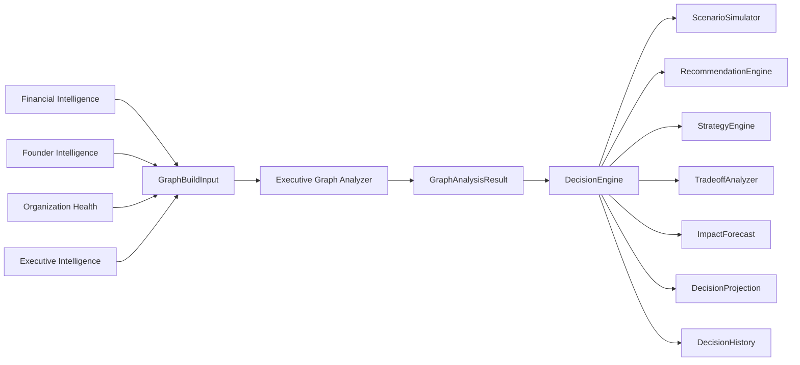

# Sprint 026 — Executive Decision Intelligence

**Status:** Implemented  
**Date:** July 12, 2026  
**Repository:** `school-platform`  
**Branch:** `founder-os-beta`  
**Prerequisite:** Sprint 025 Executive Graph Analyzer · Sprint 021 Founder Intelligence · Sprint 023/024 Organization Health · Sprint 012 Decision Intelligence

**Related documents:**

| Document | Relationship |
|----------|--------------|
| [`EXECUTIVE_DECISION_INTELLIGENCE.md`](./EXECUTIVE_DECISION_INTELLIGENCE.md) | Architecture + pipeline |
| [`EXECUTIVE_DECISION_VERIFICATION.md`](./EXECUTIVE_DECISION_VERIFICATION.md) | Verification checklist |
| [`EXECUTIVE_GRAPH_ANALYZER.md`](./EXECUTIVE_GRAPH_ANALYZER.md) | Upstream graph engine |
| Package README | `src/lib/platform/intelligence/executive-decision/README.md` |

---

## 0. Sprint Intent

Sprint 026 delivers a **production-ready Executive Decision Intelligence engine** that sits on top of the Executive Graph and allows JAG to simulate strategic decisions before they are made.

**Design principle:** *Simulate before deciding. Score tradeoffs deterministically. Project full executive recommendations. Compose upward from the graph — do not regenerate Sprint 012 or 025.*

### 0.1 Architectural Position



## 1. Package surface

Location: `src/lib/platform/intelligence/executive-decision/`

DI entry: `createExecutiveDecisionIntelligence()`  
Also attached on `createIntelligenceService().executiveDecision`

## 2. Capabilities

| What-if | Scenario kind |
|---------|---------------|
| Enrollment drops 10% | `enrollment_drop` |
| Payroll increases 8% | `payroll_increase` |
| Open another campus? | `campus_expansion` |
| Hire now or later? | `hiring_timing` |
| Highest ROI initiative? | `strategic_initiative` |

## 3. Definition of Done

- [x] DecisionModels / DecisionDTOs / contracts
- [x] DecisionEngine + ScenarioSimulator + RecommendationEngine
- [x] StrategyEngine + TradeoffAnalyzer + ImpactForecast
- [x] DecisionConfidence + DecisionScoring + DecisionQueries + DecisionProjection
- [x] DecisionHistory + ScenarioRepository + ExecutiveDecisionService
- [x] Exports + DI wiring via `createIntelligenceService`
- [x] README + architecture + verification docs + CHANGELOG
- [x] Unit tests
- [x] `npx tsc --noEmit` clean
- [x] No circular imports (contracts leaf; graph → decision only)

## 4. Suggested git commit message

```
feat(intelligence): add Sprint 026 Executive Decision Intelligence

Introduce graph-backed what-if decision engine with scenario simulation,
strategy ROI ranking, tradeoff analysis, and full executive recommendations.
```
