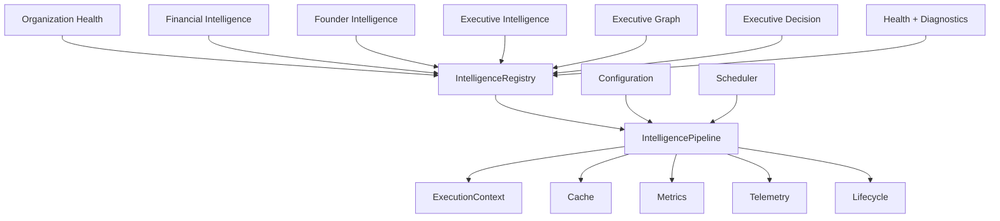

# Sprint 027 — Intelligence Platform Infrastructure

**Status:** Implemented  
**Date:** July 12, 2026  
**Repository:** `school-platform`  
**Branch:** `founder-os-beta`  
**Prerequisite:** Sprint 021–026 intelligence modules

**Related documents:**

| Document | Relationship |
|----------|--------------|
| [`INTELLIGENCE_PLATFORM_INFRASTRUCTURE.md`](./INTELLIGENCE_PLATFORM_INFRASTRUCTURE.md) | Architecture + pipeline |
| [`INTELLIGENCE_PLATFORM_VERIFICATION.md`](./INTELLIGENCE_PLATFORM_VERIFICATION.md) | Verification checklist |
| Package README | `src/lib/platform/intelligence/infrastructure/README.md` |

---

## 0. Sprint Intent

Sprint 027 delivers the **shared platform infrastructure** that every intelligence module uses for registration, dependency ordering, execution, lifecycle, metrics, cache, health, diagnostics, telemetry, scheduling, and versioning.

**Design principle:** *One platform runtime. Modules plug in. Compose upward from existing packages — do not regenerate Sprint 021–026.*

### 0.1 Architectural Position



## 1. Package surface

Location: `src/lib/platform/intelligence/infrastructure/`

DI entry: `createIntelligencePlatform()`  
Also attached on `createIntelligenceService().intelligencePlatform`

## 2. Capabilities

| Capability | Implementation |
|------------|----------------|
| Automatic module registration | Providers + `registerProviders` |
| Dependency ordering | Topological sort in registry |
| Execution pipeline | Ordered module execution |
| Lifecycle management | Initialize / ready / running / shutdown |
| Execution timing | Stage timings + metrics |
| Metrics collection | Increment / gauge / timing |
| Cache support | TTL cache with hit/miss telemetry |
| Diagnostics | Aggregated health + versions + events |
| Health monitoring | Per-module + platform aggregate |
| Telemetry events | Typed platform event bus |
| Module versioning | Semver-compatible records |

## 3. Definition of Done

- [x] IntelligenceModule + IntelligenceRegistry + IntelligencePipeline
- [x] ExecutionContext + Provider + Lifecycle
- [x] Cache + Metrics + Telemetry + Events
- [x] Scheduler + Configuration + Health + Diagnostics + Versioning
- [x] Adapters for OH / Financial / Founder / Executive / Graph / Decision
- [x] Exports + DI wiring via `createIntelligenceService`
- [x] README + architecture + verification docs + CHANGELOG
- [x] Unit tests
- [x] `npx tsc --noEmit` clean
- [x] No circular imports

## 4. Suggested git commit message

```
feat(intelligence): add Sprint 027 Intelligence Platform Infrastructure

Introduce shared module registry, dependency-ordered pipeline, lifecycle,
cache, metrics, telemetry, health, diagnostics, and versioning used by all
intelligence modules.
```
