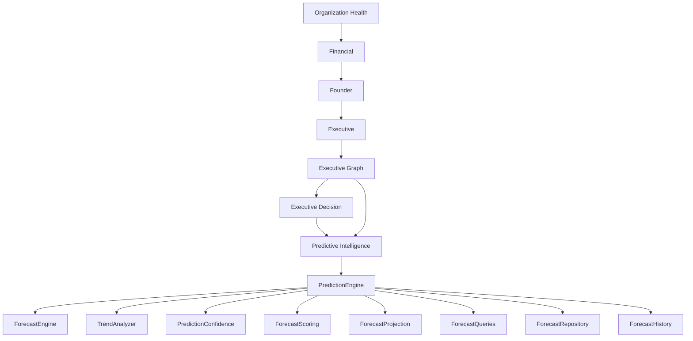

# Sprint 028 — Predictive Intelligence

**Status:** Implemented  
**Date:** July 12, 2026  
**Repository:** `school-platform`  
**Branch:** `founder-os-beta`  
**Prerequisite:** Sprint 021–027 intelligence modules + platform infrastructure

**Related documents:**

| Document | Relationship |
|----------|--------------|
| [`PREDICTIVE_INTELLIGENCE.md`](./PREDICTIVE_INTELLIGENCE.md) | Architecture + pipeline |
| [`PREDICTIVE_INTELLIGENCE_VERIFICATION.md`](./PREDICTIVE_INTELLIGENCE_VERIFICATION.md) | Verification checklist |
| Package README | `src/lib/platform/intelligence/predictive-intelligence/README.md` |

---

## 0. Sprint Intent

Sprint 028 delivers the **forecasting layer** that predicts future organizational outcomes using historical intelligence, Executive Graph relationships, and Executive Decision simulations.

**Design principle:** *Compose upward from Executive Graph + Decision + Platform Infrastructure — do not regenerate Sprint 021–027.*

### 0.1 Architectural Position



## 1. Package surface

Location: `src/lib/platform/intelligence/predictive-intelligence/`

DI entry: `createPredictiveIntelligence()`  
Also attached on `createIntelligenceService().predictiveIntelligence`  
Platform module id: `predictive`

## 2. Capabilities

| Capability | Implementation |
|------------|----------------|
| 30/90/180/365-day forecasts | `ForecastEngine` + horizons |
| Trend analysis | `TrendAnalyzer` |
| Accelerating / declining detection | `TrendDirection` |
| Threshold crossings | `detectThresholds` |
| Confidence intervals | `ForecastPoint` |
| Emerging risks | `EmergingRisk` |
| Preventive actions | `PreventiveAction` |
| Multi-scenario forecasts | baseline / optimistic / pessimistic / stress |
| Graph + Decision integration | DI + platform adapter |

## 3. Definition of Done

- [x] PredictionEngine + ForecastEngine + TrendAnalyzer
- [x] ForecastRepository + PredictionModels + ForecastQueries
- [x] ForecastProjection + PredictionConfidence + ForecastScoring + ForecastHistory
- [x] PredictionService + createPredictiveIntelligence DI
- [x] Platform module adapter `predictive`
- [x] Exports + wiring via createIntelligenceService / createIntelligencePlatform
- [x] README + architecture + verification docs + CHANGELOG
- [x] Unit tests
- [x] `npx tsc --noEmit` clean
- [x] No circular imports

## 4. Suggested git commit message

```
feat(intelligence): add Sprint 028 Predictive Intelligence

Introduce multi-horizon forecasting with trend analysis, threshold
crossings, emerging risks, and preventive actions on top of Executive
Graph and Decision intelligence.
```
