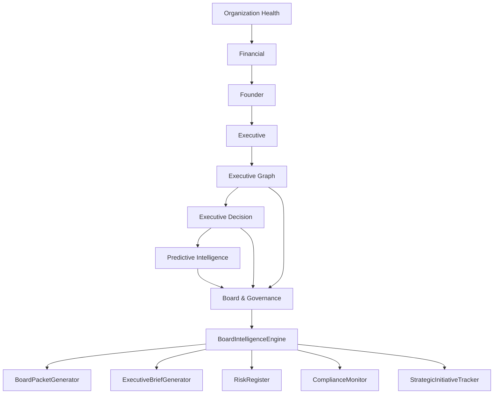

# Sprint 029 — Board & Governance Intelligence

**Status:** Implemented  
**Date:** July 12, 2026  
**Repository:** `school-platform`  
**Branch:** `founder-os-beta`  
**Prerequisite:** Sprint 021–028 intelligence modules + platform infrastructure

**Related documents:**

| Document | Relationship |
|----------|--------------|
| [`BOARD_GOVERNANCE_INTELLIGENCE.md`](./BOARD_GOVERNANCE_INTELLIGENCE.md) | Architecture + pipeline |
| [`BOARD_GOVERNANCE_INTELLIGENCE_VERIFICATION.md`](./BOARD_GOVERNANCE_INTELLIGENCE_VERIFICATION.md) | Verification checklist |
| Package README | `src/lib/platform/intelligence/board-governance/README.md` |

---

## 0. Sprint Intent

Sprint 029 delivers the **governance layer** that converts Executive Intelligence into board-ready reporting, strategic oversight, compliance monitoring, and governance workflows.

**Design principle:** *Compose upward from Executive Graph + Decision + Predictive + Platform Infrastructure — do not regenerate Sprint 021–028.*

### 0.1 Architectural Position



## 1. Package surface

Location: `src/lib/platform/intelligence/board-governance/`

DI entry: `createBoardGovernanceIntelligence()`  
Also attached on `createIntelligenceService().boardGovernance`  
Platform module id: `board-governance`

## 2. Capabilities

| Capability | Implementation |
|------------|----------------|
| Monthly Board Packet | `BoardPacketGenerator` |
| Quarterly Strategic Review | packet kind + initiative tracker |
| Executive KPI Summary | `BoardKPIDashboard` |
| Financial Summary | packet kind `financial_summary` |
| Risk Heat Map | `RiskRegister.heatMap` |
| Strategic Initiative Status | `StrategicInitiativeTracker` |
| Governance Dashboard | `GovernanceDashboard` |
| Mission Scorecard | `ExecutiveScorecards` + packet |
| Compliance Summary | `ComplianceMonitor` |
| Executive Briefing | `ExecutiveBriefGenerator` |
| Graph + Decision + Predictive integration | DI + platform adapter |

## 3. Definition of Done

- [x] BoardIntelligenceEngine + GovernanceEngine
- [x] BoardPacketGenerator + ExecutiveBriefGenerator
- [x] CommitteeReporting + StrategicInitiativeTracker
- [x] GovernanceDashboard + BoardKPIDashboard
- [x] RiskRegister + ComplianceMonitor + ExecutiveScorecards
- [x] ResolutionTracker + GovernanceCalendar
- [x] BoardQueries + GovernanceProjection + GovernanceRepository + GovernanceModels
- [x] GovernanceService + createBoardGovernanceIntelligence DI
- [x] Platform module adapter `board-governance`
- [x] Exports + wiring via createIntelligenceService / createIntelligencePlatform
- [x] README + architecture + verification docs + CHANGELOG
- [x] Unit tests
- [x] `npx tsc --noEmit` clean
- [x] No circular imports

## 4. Suggested git commit message

```
feat(intelligence): add Sprint 029 Board & Governance Intelligence

Introduce board packets, executive briefs, risk/compliance oversight,
initiative tracking, and governance dashboards on top of Predictive
and Executive Decision intelligence.
```
