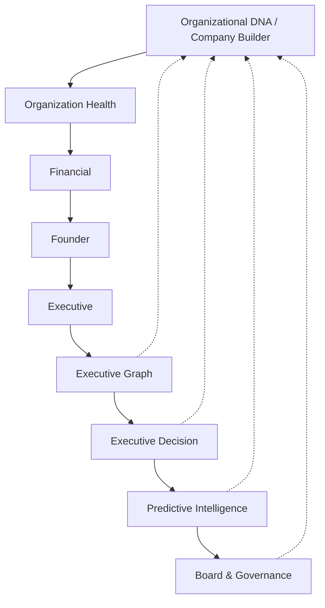

# Sprint 030 — Organizational DNA & Company Builder

**Status:** Implemented  
**Date:** July 12, 2026  
**Repository:** `school-platform`  
**Branch:** `founder-os-beta`  
**Prerequisite:** Sprint 021–029 intelligence modules + platform infrastructure

**Related documents:**

| Document | Relationship |
|----------|--------------|
| [`ORGANIZATIONAL_DNA.md`](./ORGANIZATIONAL_DNA.md) | Architecture + pipeline |
| [`ORGANIZATIONAL_DNA_VERIFICATION.md`](./ORGANIZATIONAL_DNA_VERIFICATION.md) | Verification checklist |
| Package README | `src/lib/platform/intelligence/organization-dna/README.md` |

---

## 0. Sprint Intent

Sprint 030 delivers the **foundational organizational profile** ("Organizational DNA") and **Company Builder** that every future intelligence domain will use — from first idea through startup, growth, maturity, succession, acquisition, or exit.

**Design principle:** *Compose as the foundational substrate — do not regenerate Sprint 021–029. Extend DI + platform module registration only.*

### 0.1 Architectural Position



## 1. Package surface

Location: `src/lib/platform/intelligence/organization-dna/`

DI entry: `createOrganizationDnaIntelligence()`  
Also attached on `createIntelligenceService().organizationDna`  
Platform module id: `organization-dna` (first in default pipeline)

## 2. Capabilities

| Capability | Implementation |
|------------|----------------|
| Organizational DNA | Composer + `OrganizationService.build` |
| Executive Blueprint | `OrganizationBlueprint` |
| Organizational Roadmap | `ExecutiveRoadmap` |
| Business Model | `BusinessModelEngine` |
| Lean Canvas | `LeanCanvasGenerator` |
| SWOT | `SwotGenerator` |
| Value Proposition | `ValuePropositionBuilder` |
| Customer Personas | `CustomerPersonaBuilder` |
| Company Readiness Report | `CompanyReadinessAssessment` + scoring |
| Executive Priorities | `ExecutivePriorities` |
| Organizational Score | `OrganizationalScore` |
| Initial KPI recommendations | `KpiRecommendations` |
| Stage detection (7 stages) | `OrganizationStageDetector` |

## 3. Definition of Done

- [x] OrganizationDNA + OrganizationProfile + CompanyBuilder
- [x] OrganizationStageDetector + OrganizationLifecycle
- [x] BusinessModelEngine + BusinessPlanBuilder + LeanCanvas + SWOT
- [x] ValueProposition + CustomerPersonas + Revenue + Funding + GTM
- [x] CompanyReadinessAssessment + ReadinessScoring
- [x] ExecutiveRoadmap + OrganizationBlueprint
- [x] Goals / Constraints / Capabilities / Culture / Mission / Vision / Values
- [x] OrganizationService + createOrganizationDnaIntelligence DI
- [x] Platform module adapter `organization-dna`
- [x] Exports + wiring via createIntelligenceService / createIntelligencePlatform
- [x] README + architecture + verification docs + CHANGELOG
- [x] Unit tests
- [x] `npx tsc --noEmit` clean
- [x] No circular imports

## 4. Suggested git commit message

```
feat(intelligence): add Sprint 030 Organizational DNA & Company Builder

Introduce foundational Organizational DNA, Company Builder artifacts,
stage detection, readiness scoring, and executive blueprint/roadmap
as the substrate for all future intelligence domains.
```
