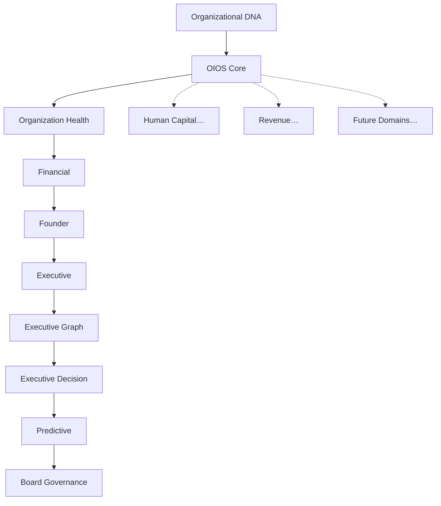

# Sprint 031 — JAG OIOS Core Architecture

**Status:** Implemented  
**Date:** July 12, 2026  
**Repository:** `school-platform`  
**Branch:** `founder-os-beta`  
**Prerequisite:** Sprint 021–030 intelligence modules + platform infrastructure + Organizational DNA

**Related documents:**

| Document | Relationship |
|----------|--------------|
| [`JAG_OIOS_ARCHITECTURE.md`](./JAG_OIOS_ARCHITECTURE.md) | Permanent OIOS architecture |
| [`INTELLIGENCE_DOMAIN_MODEL.md`](./INTELLIGENCE_DOMAIN_MODEL.md) | Domain registry + extension model |
| [`DIGITAL_TWIN_ARCHITECTURE.md`](./DIGITAL_TWIN_ARCHITECTURE.md) | Organizational digital twin |
| [`AI_AGENT_ARCHITECTURE.md`](./AI_AGENT_ARCHITECTURE.md) | Agent architecture on OIOS |
| [`ORGANIZATIONAL_LIFECYCLE.md`](./ORGANIZATIONAL_LIFECYCLE.md) | Lifecycle model |
| [`FUTURE_SPRINT_GUIDELINES.md`](./FUTURE_SPRINT_GUIDELINES.md) | How future domains register |
| [`OIOS_CORE_VERIFICATION.md`](./OIOS_CORE_VERIFICATION.md) | Verification checklist |
| Package README | `src/lib/platform/oios/README.md` |

---

## 0. Sprint Intent

Sprint 031 establishes the **permanent Organizational Intelligence Operating System (OIOS)** architecture that every future intelligence domain, AI agent, workflow, and application will follow.

**Design principle:** *Compose the operating system above Organizational DNA — do not regenerate Sprint 021–030. Extend DI + platform module registration only.*

### 0.1 Architectural Position



## 1. Package surface

Location: `src/lib/platform/oios/`

DI entry: `createOiosOperatingSystem()`  
Also attached on `createIntelligenceService().oios`  
Platform module id: `oios-core` (depends on `organization-dna`)

## 2. Capabilities

| Capability | Implementation |
|------------|----------------|
| Organization Operating System | `OrganizationOperatingSystem` |
| Intelligence Domain Registry | `IntelligenceDomainRegistry` |
| Organizational Digital Twin | `OrganizationalDigitalTwin` |
| Lifecycle / State / Context | `OrganizationalLifecycle`, `OrganizationalStateEngine`, `OrganizationalContext` |
| Memory / Knowledge Graph | `OrganizationalMemory`, `OrganizationalKnowledgeGraph` |
| Capabilities / Improvement | `OrganizationCapabilitiesRegistry`, `OrganizationImprovementEngine`, `ContinuousImprovementLoop` |
| Health / Maturity / Scorecard | `OrganizationalHealthIndex`, `OrganizationMaturityModel`, `OrganizationScorecard` |
| Strategy / Execution / Ops | `OrganizationObjectives`, `OrganizationStrategy`, `OrganizationExecutionModel`, `OrganizationOperatingModel` |
| Governance surfaces | `OrganizationConfiguration`, `OrganizationPolicies`, `OrganizationStandards`, `OrganizationGovernanceModel` |
| Benchmarking | `OrganizationBenchmarking` |

## 3. Definition of Done

- [x] `src/lib/platform/oios/` package with all core components
- [x] `createOiosOperatingSystem` DI factory + `OiosStack`
- [x] Platform module adapter `oios-core`
- [x] Wired via `createIntelligenceService` / `createIntelligencePlatform`
- [x] Architecture docs (6 permanent + sprint + verification)
- [x] Unit tests
- [x] `npx tsc --noEmit` clean
- [x] No circular imports

## 4. Suggested git commit message

```
feat(oios): add Sprint 031 JAG OIOS Core Architecture

Establish the permanent Organizational Intelligence Operating System
layer with digital twin, domain registry, improvement loop, and DI
integration for all future intelligence domains.
```
