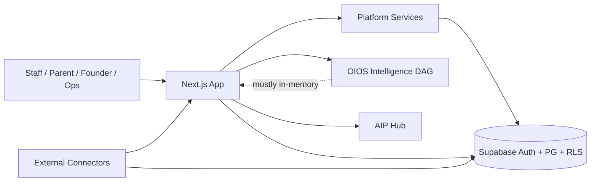

# 01 — System Architecture

**Phase:** AcademyOS 1.0 Release Phase A (read-only)  
**Date:** 2026-07-17

---

## 1. Architectural style

**Modular monolith** with:

- Presentation via Next.js App Router (RSC-default pages)
- Domain/application logic in `src/lib/**`
- Cross-cutting **Platform Services** in `src/lib/platform/**`
- Persistence and tenancy via Supabase PostgreSQL + RLS
- No separate microservice mesh; integrations are in-process connectors + vault patterns

Runtime production dependencies are intentionally lean: `next`, `react`, `react-dom`, `@supabase/ssr`, `@supabase/supabase-js`.

---

## 2. Logical layers

```
┌─────────────────────────────────────────────────────────────┐
│  Presentation                                                │
│  src/app (routes, layouts) · src/components (UI modules)     │
├─────────────────────────────────────────────────────────────┤
│  Application / Product Domains                               │
│  admissions · finance · hr · sis/ssis · edi · portal · …     │
├─────────────────────────────────────────────────────────────┤
│  Platform Services (cross-cutting)                           │
│  identity/IAM · activity · events · decision · evidence ·    │
│  rules · workflow · ULR · PAJ · intelligence-graph · …       │
├─────────────────────────────────────────────────────────────┤
│  Organizational Intelligence (OIOS)                          │
│  src/lib/platform/intelligence/* (39-module DAG → wisdom)    │
├─────────────────────────────────────────────────────────────┤
│  Data & Identity Providers                                   │
│  Supabase Auth · PostgreSQL · RLS · Storage                  │
└─────────────────────────────────────────────────────────────┘
```

### Request path (typical protected page)

1. `middleware.ts` — session (`getUser`), password-reset gate, catalog route authorization  
2. Segment `layout.tsx` — product shell + often additional permission/page guards  
3. `page.tsx` — thin RSC entry (often Suspense)  
4. Domain loaders / server actions in `src/lib/**`  
5. Supabase client queries under RLS  

---

## 3. Product surfaces and routing

| Surface | Route roots | Gate theme |
|---------|-------------|------------|
| AcademyOS ERP | `/dashboard/**` | `ACADEMYOS_ACCESS` + module permissions |
| JAG | `/exec/**`, `/dashboard/jag/**` | `JAG_ACCESS` (founder protection) |
| Portal | `/portal/**`, `/apply/portal/**` | Portal parent/student permissions |
| Apply | `/apply/**` | Public + portal authenticated subset |
| Cloud | `/cloud/**` | Cloud console access helpers |
| Operations | `/operations/**` | Operations center access |
| Platform admin | `/platform/**`, `/organizations`, `/users`, `/settings` | Platform administration permissions |
| AIP UI | `/dashboard/intelligence/**` | Intelligence platform governance (not OIOS pipeline UI) |
| API | `/api/**` | Auth + public allowlist exceptions |

**Scale (approximate, current tree):** ~268 `page.tsx` routes; ~28 API `route.ts` handlers; nested dashboard layouts per module (admissions, finance, executive, certification, integrations, etc.).

Middleware matcher covers dashboard, exec, cloud, operations, admin, portal, organizations, users, settings, platform, apply/portal, and `/api/*`.

---

## 4. Platform services inventory

Canonical barrel: `src/lib/platform/services/index.ts`.

| Service | Path | Persistence posture |
|---------|------|---------------------|
| Activity | `platform/activity` | Product DB writes |
| Relationships | `platform/relationships` | Migrated + RLS |
| Tags / Notes | `platform/tags`, `platform/notes` | Migrated + RLS |
| Events | `platform/events` | Registry + persistence |
| Decision | `platform/decision` | Registry + persistence |
| Evidence (KEE) | `platform/evidence` | Migrated + RLS |
| Rules | `platform/rules` | Migrated + RLS |
| Intelligence Graph | `platform/intelligence-graph` | Graph edges persistence |
| ULR / PAJ | `platform/ulr`, `platform/paj` | Migrated; RLS hardened in mig 171 |
| Workflow | `platform/workflow` | Definitions/instances persistence |
| Automation | `platform/automation` | Queues / mission control |
| Hierarchy / Execution | `platform/hierarchy`, `execution-engine` | Registry + runtime |
| Executive metrics/alerts/decisions | `executive-*` | Mixed KPI snapshots + product tables |
| Identity / IAM | `platform/identity`, `platform/iam` | Catalog + org isolation |

Build validators (examples): `validate:platform`, `validate:workflow`, `validate:decision`, `validate:events`, `validate:intelligence-graph`, `validate:ulr`, `validate:hierarchy`, `validate:execution-engine`, `validate:admissions`, `validate:automation`.

---

## 5. Intelligence architecture (OIOS)

### 5.1 Pipeline

Authoritative module order: `INTELLIGENCE_MODULE_IDS` in  
`src/lib/platform/intelligence/infrastructure/types.ts` (39 modules, terminal **`wisdom`**).

Layers (conceptual):

1. Foundation — organization-dna, oios-core, organization-health  
2. Product / financial / human capital / funding / opportunity / …  
3. External / market / competitive / political / environmental  
4. Behavioral / cultural / ethical / systems / resilience / ecosystem  
5. Memory — institutional-memory  
6. Collective → Wisdom  

### 5.2 Composition

- Domain packages: types → contracts → models/engines → service → factory → infrastructure adapter  
- Soft integration via `*ResultLight` DTOs (avoid hard package cycles)  
- DI: thin `create-service.ts` + `registration/{foundation,product,external,relationship,systems,memory,wisdom,cognitive,...}.ts`  
- Shared primitives: `intelligence/common/` (scoring, ids, in-memory repository, publisher registry, scope, confidence)

### 5.3 Product consumption (current)

- Exec Command Center loads stacks via `src/lib/exec/intelligence.ts` → process singleton  
- Wisdom UI: `src/app/exec/wisdom/page.tsx` → `loadExecWisdom()`  
- Default exec scope is resolved via `getExecRuntime()` (tenant-bound or explicit demo); wisdom provenance uses widget `dataMode` + shell banner (C-A2)  
- AIP (`src/lib/intelligence-platform`) is a **separate** prompt/provider/queue governance product  

---

## 6. Authentication and authorization

| Concern | Location |
|---------|----------|
| Session middleware | `middleware.ts` (`@supabase/ssr` server client) |
| Password reset gate | `src/lib/auth/must-reset-password.ts` |
| Login throttle | `src/lib/auth/login-throttle.ts` |
| Authz snapshot | `src/lib/platform/identity/load-authz-snapshot.ts` |
| Route catalog authz | `src/lib/platform/identity/route-authorization.ts` |
| Permission engine | `authorization-service.ts`, permission catalog |
| Founder / finance gates | `founder-protection.ts`, `financial-security.ts` |
| MFA enforce path | `mfa-enforce.ts`, `/login/mfa-required` (B.1) |
| API guards / tenant assert | `api-guard.ts`, `tenant-access.ts` |
| Server Supabase clients | `src/lib/supabase/*` (anon vs service-role discipline post B.1) |

Constitutional rule: **permission-only** authorization; roles expand to permissions and must not be checked as string gates in feature code.

---

## 7. Data architecture

- **~172** SQL migrations under `supabase/migrations/` (head: `172_b1_security_remediation.sql`)  
- Domain tables generally school/org scoped with RLS helpers (`can_access_school`, finance-specific helpers post B.1, etc.)  
- Platform persistence for workflow/events/decision/evidence/ULR/PAJ/graph  
- **Gap:** OIOS domain assessment payloads largely **not** mirrored as durable org-scoped tables; repositories commonly wrap shared in-memory stores  

Manual TypeScript database mirror: `src/types/database.ts` (no ORM).

---

## 8. Integrations

Connectors and hub under `src/lib/integration-hub/`, `src/lib/platform/integrations/`, and exec feed helpers (`src/lib/exec/*` for Square/Plaid/QuickBooks reconciliation patterns). Vault crypto requires production encryption key (B.1). Several connectors have unit tests; live production readiness varies by connector.

---

## 9. Testing and quality gates

| Gate | Mechanism |
|------|-----------|
| Unit / integration | Vitest (`tests/unit`, `tests/integration`) — ~118 test files observed |
| Smoke | Playwright (`test:smoke`) |
| Typecheck | `tsc --noEmit` (+ test project) |
| Lint | ESLint (Next config) |
| Registry integrity | `tsx scripts/validate-*.mts` on `build` |
| Certification helpers | `src/lib/certification/*`, phase-e unit tests |
| CI (GitHub Actions) | lint, typecheck, build+validators, **unit**, **integration**, Playwright smoke |
| Live RLS / authenticated E2E | Documented in Phase E; not fully executed as enterprise proof |

---

## 10. Documentation architecture

Large corpus under `docs/architecture/`, `docs/security/`, `docs/launch/`, `docs/governance/`, `docs/performance/`. Strength: governance depth. Weakness: **staleness risk** — older canonical reports may disagree with live module lists and post-remediation reality. Phase A package is the release-phase architecture snapshot; prefer it + constitution + ADRs over July 5–13 historical audits for “current truth.”

---

## 11. System context (C4-style)



---

## Finding references

See risk register IDs **C-A1**, **H-A4**, **H-A5**, **M-A2**, **I-A1** for architecture-level issues tied to this system map.
