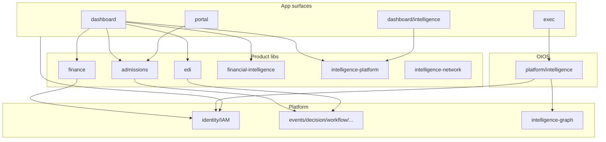

# 02 — Module Dependency Report

**Phase:** AcademyOS 1.0 Release Phase A (read-only)  
**Date:** 2026-07-17

---

## 1. Dependency direction (intended)

```
app / components
    → product libs (admissions, finance, hr, …)
    → platform services (identity, events, workflow, …)
    → intelligence infrastructure / domain contracts
    → supabase clients / leaf types
```

**Allowed:** product → platform; platform → supabase; intelligence domain → common/contracts/lights.  
**Discouraged:** domain package → foreign domain implementations; UI → deep private internals across product lines; role-string checks bypassing identity engine.

---

## 2. Intelligence DAG (authoritative)

Source: `INTELLIGENCE_MODULE_IDS`  
(`src/lib/platform/intelligence/infrastructure/types.ts`)

```
organization-dna → oios-core → organization-health → financial → founder
→ executive → executive-graph → executive-decision → predictive → board-governance
→ human-capital → revenue → funding → opportunity → organizational-improvement
→ business-model → operations → customer → knowledge → document
→ legal-compliance-risk → market → innovation → impact → economic
→ competitive → political → environmental → stakeholder → reputation
→ behavioral → cultural → ethical → systems → resilience → ecosystem
→ institutional-memory → collective → wisdom
```

### Hard vs soft edges

| Edge type | Mechanism | Cycle risk |
|-----------|-----------|------------|
| Hard DAG | Adapter `dependencies: string[]` + topo-sort | Detected (`CYCLIC_DEPENDENCY`) |
| Soft | `*ResultLight` keys / learning-loop destinations | Conceptual only; no import cycle |

Stabilization validation previously reported **no circular imports** in `common/`, `registration/`, and `create-service` (madge). Phase A reaffirmation: leaf-types pattern remains the primary cycle firewall.

---

## 3. DI composition graph

| Entry | Depends on | Role |
|-------|------------|------|
| `createIntelligenceService()` | `registration/compose` + cognitive domain factories | Public DI root (thin post-A1) |
| `composeIntelligenceStacks()` | Layer registration modules | Wires 39 stacks |
| `createIntelligencePlatform()` / infrastructure pipeline | Module adapters | Runtime execution order |
| `getExecIntelligence()` | Performance singleton + React `cache` | Exec UI access |

**Improvement vs historical audit:** `create-service.ts` is no longer a ~1,300-line god factory; wiring is modular under `src/lib/platform/intelligence/registration/`.

---

## 4. Hotspots (high fan-in / fan-out)

| Hotspot | Nature | Coupling assessment |
|---------|--------|---------------------|
| `platform/identity/*` | Fan-in from middleware, layouts, actions | **Appropriate** centralization |
| `platform/services/index.ts` | Barrel re-exports many engines | Convenient; risk of accidental broad imports |
| `intelligence/infrastructure/*` | Fan-in from all adapters | Expected pipeline hub |
| `intelligence/common/*` | Fan-in from repositories/models | Desired after A2–A3 |
| `lib/supabase/*` | Universal data access | Expected; client misuse is a security concern (mitigated in B.1) |
| `lib/exec/intelligence.ts` | Fan-out to entire intelligence container | Exec surface tightly bound to full DI graph |
| Dual `workflow` vs `workflows` | Parallel engines | Cognitive + import ambiguity |
| Dual `executive-graph` packages | Documented in ADR-A1-001 | Intentional but high onboarding cost |
| Dual finance stacks | Documented in ADR-A1-002 | Ops vs platform engines |

---

## 5. Cross-product dependency map



**Observation:** “Intelligence” is not one module. Operators and developers encounter at least:

1. OIOS pipeline (`platform/intelligence`)  
2. AIP hub (`intelligence-platform`)  
3. Intelligence Network (`intelligence-network`)  
4. EDI / executive product tables (`edi`, `executive`, `platform/executive-*`)  
5. Financial Intelligence (`financial-intelligence`)  

This is a **naming and dependency-education** problem more than a hard cycle problem.

---

## 6. Circular dependency assessment

| Area | Status | Severity if open |
|------|--------|------------------|
| Late intelligence packages (hard imports) | **No evidence of hard cycles** | — |
| Soft conceptual cycles via lights | Present by design | Low |
| Leaf boundary exceptions (`organization/types`, `decision/types` → context builder) | Residual | Medium |
| `organization-health` adapter `dependencies: []` | Fragile ordering | Medium |
| App ↔ lib | Standard Next patterns; no package cycle tool enforced repo-wide | Informational |

### Finding

**DEP-01 (Medium)** — Fragile DAG edge: `organization-health` declares empty hard dependencies, relying on registration/topo tie-break rather than explicit `["organization-dna"]` or `["oios-core"]`.

**Affected files:**  
`src/lib/platform/intelligence/infrastructure/modules/organization-health.ts`

**DEP-02 (Medium)** — Mild leaf-boundary violations where types import context builder implementations.

**Affected files:**  
`src/lib/platform/intelligence/organization/types.ts`  
`src/lib/platform/intelligence/decision/types.ts`  
(and related context imports)

**DEP-03 (High — naming, not cycle)** — Dual `CompetitiveIntelligence` classes in market vs competitive packages create import ambiguity risk.

**Affected files:**  
`src/lib/platform/intelligence/market/competitive-intelligence.ts`  
`src/lib/platform/intelligence/competitive/competitive-intelligence.ts`

---

## 7. Platform registry dependency integrity

| Check | Status |
|-------|--------|
| 39 module IDs ↔ adapters | Pass (design invariant) |
| Build validators for registries | Pass (wired in `package.json` `build`) |
| OIOS catalog vs MODULE_IDS | Intentional mismatch (dormant `legal`/`compliance`/`risk`; `oios-core` platform-only) |
| Terminal module `wisdom` | Pass |
| Cycle detection in registry | Pass |

---

## 8. Broader npm / runtime graph

Production dependency graph is **minimal** (strength for enterprise supply-chain posture). Dev tooling adds Vitest, Playwright, ESLint, TypeScript, Tailwind, tsx.

No Redis/queue broker/service mesh in core runtime — background work uses platform queue processing patterns (`/api/platform/process-queues`) and in-process structures.

---

## 9. Recommendations (dependency-specific)

1. Add explicit hard dependency for `organization-health`.  
2. Keep soft-read peers off the hard DAG.  
3. Prefer ADR-documented import paths for dual stacks; add lint/path rules if drift recurs.  
4. Rename market competitive class or namespace exports to eliminate `CompetitiveIntelligence` collision.  
5. Document a single “Intelligence Surfaces” map in onboarding (OIOS vs AIP vs Network vs EDI).  

Detailed remediation waves: `07_PRIORITIZED_REMEDIATION_PLAN.md`.
