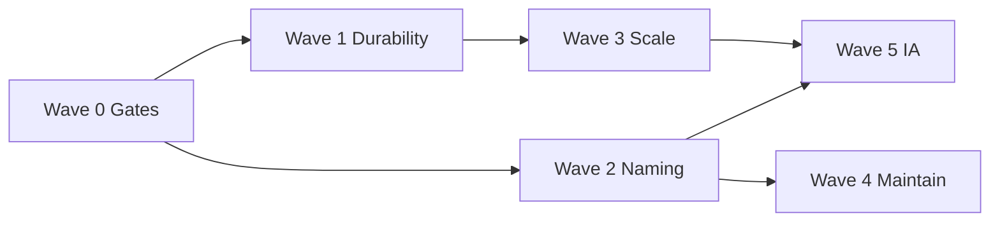

# 07 — Prioritized Remediation Plan

**Phase:** AcademyOS 1.0 Release Phase A (read-only)  
**Date:** 2026-07-17  
**Constraint:** This plan is guidance only — Phase A does not implement fixes.

---

## Principles

1. **Do not reopen Stabilization A1–A5** architecture churn unless a Critical/High gate requires it.  
2. Prefer **product contracts, persistence, provenance, and naming clarity** over regenerating frozen OIOS packages.  
3. Coordinate with **Security B.1 ops gates** (migrations + live tenant tests) — architecture cannot declare full enterprise readiness alone.  
4. Every wave needs: owner, acceptance criteria, and “done means.”

---

## Wave 0 — Release gates (immediate, before production claims)

**Goal:** Prevent false “enterprise intelligence / production ready” claims.

| ID | Action | Severity | Acceptance criteria |
|----|--------|----------|---------------------|
| C-A2 | Explicit demo vs tenant mode on all `/exec` surfaces | Critical | No silent `exec-demo-org` in production builds; provenance visible |
| C-A3 | Ratify Production Intelligence Contract | Critical | Written contract lists prod modules, durability, authz, provenance |
| H-A9 | Apply migrations `171`+`172` all envs + checklist | High | Security B.1 checklist green; evidence attached |
| H-A8 | Pin Phase A + constitution as current architecture truth | High | Historical audits bannered; index links updated |
| H-A10 | Add `npm run test` (unit) to CI or document intentional omission | High | PR pipeline gates unit suite (or signed waiver) |
| M-A16 | Reconcile migration authority to **172** in cert/ops docs | Medium | No script/doc cites obsolete migration ceilings |

**Exit:** Leadership can state what is production vs demo without ambiguity.

---

## Wave 1 — Durability & tenancy for intelligence (P0 architecture)

**Goal:** Close C-A1 / H-A5 or formally accept session-only semantics.

### Option A — Persist (recommended for enterprise claim)

| Step | Work | Affected areas |
|------|------|----------------|
| 1 | Schema for org-scoped intelligence results + history | `supabase/migrations/` |
| 2 | RLS using org membership / JAG gates | migrations + policies |
| 3 | Repository adapters implementing common interfaces | `intelligence/common`, domain repos |
| 4 | Bind exec loaders to authz org/school | `src/lib/exec/**` |
| 5 | Integration tests for cross-tenant deny | `tests/integration/**` |

### Option B — Session/demo only (acceptable if marketed honestly)

| Step | Work |
|------|------|
| 1 | Product flag `INTELLIGENCE_MODE=session\|demo\|persistent` |
| 2 | UI + API hard labels; disable durable claims |
| 3 | Process isolation documentation for deploy topology |
| 4 | Acceptance tests that labels always render |

**Exit:** C-A1 closed or formally accepted under Option B with sign-off.

---

## Wave 2 — Cognitive load reduction (P0/P1)

**Goal:** Reduce High naming/boundary defects without large refactors.

| Priority | ID | Action | Effort |
|----------|----|--------|--------|
| P0 | H-A1 | Publish Intelligence Surfaces map (OIOS / AIP / Network / EDI / FI / Exec) | S |
| P0 | H-A2 | Rename `platform/workflows` → e.g. `executive-workflows` | M |
| P0 | H-A3 | Rename market `CompetitiveIntelligence` | S |
| P0 | H-A11 | Narrow intelligence public barrel; ban app-level mega-import | M |
| P1 | H-A12 | Split `mission-control-compose` into facet ports | M |
| P1 | H-A6/H-A7 | ESLint/path rules enforcing ADR canonical imports | S–M |
| P1 | M-A13/M-A14 | Canonical identity path + shell authz map | M |
| P1 | M-A5 | OIOS vs MODULE_IDS comparison table in one canonical doc | S |

**Exit:** New engineers can identify the correct package in ≤5 minutes for common tasks.

---

## Wave 3 — Scalability of pipeline (P1)

**Goal:** Address H-A4 without changing domain math.

| Step | Action |
|------|--------|
| 1 | Identify independent sibling sets in DAG |
| 2 | Parallelize safe siblings in pipeline runtime |
| 3 | Cache intermediate module results (memory → Redis only if multi-node) |
| 4 | Async job path for full wisdom runs; UI consumes job status |
| 5 | Performance budgets documented (link Phase C) |

**Affected files:** `infrastructure/pipeline.ts`, `performance/**`, process-queues API.

**Exit:** Full-graph p95 within agreed budget on reference hardware/staging.

---

## Wave 4 — Maintainability debt (P2)

**Goal:** Reduce Medium duplication without domain regeneration.

| ID | Action |
|----|--------|
| M-A1 | Extract shared `ResultLightBase` |
| M-A3 | Explicit `organization-health` dependencies |
| M-A4 | Leaf context types extraction |
| M-A7 | Freeze or unify codegen scripts |
| M-A9 | Generate DB types in CI |
| M-A12 | Expand route-policy consistency tests |
| L-* | Rename files/folders on touch |

**Exit:** Medium item count reduced ≥40% or explicitly deferred with freeze rationale.

---

## Wave 5 — Product IA consolidation (P2/P3)

**Goal:** Long-term reduction of H-A1.

| Track | Action |
|-------|--------|
| Exec | Single Command Center IA consuming OIOS outcomes |
| AIP | Remain governance/runtime for LLM providers — not a second OIOS |
| EDI / FI | Keep product tables; deep-link from Exec rather than parallel “truth” |
| Network | Benchmarks/network clearly labeled as comparative, not OIOS wisdom |

**Exit:** One executive narrative path; other modules are clearly supporting.

---

## Sequencing diagram

---

## Suggested ownership

| Wave | Primary owner | Secondary |
|------|---------------|-----------|
| 0 | Release / Architect + Security | Eng leads |
| 1 | Platform / Intelligence eng | DBA / Supabase |
| 2 | Platform eng | Docs |
| 3 | Performance + Intelligence | SRE |
| 4 | Platform eng | — |
| 5 | Product + Design + Architect | Eng |

---

## What not to do next

| Anti-pattern | Why |
|--------------|-----|
| Regenerate all late OIOS domains for cleanup | Freeze cost; Stabilization already extracted commons |
| Merge ADR dual stacks “quickly” | High regression risk without product epic |
| Claim GO based on library test green alone | Durability/provenance/ops gates still open |
| Add new intelligence domains before Waves 0–1 | Increases debt surface |

---

## Definition of CONDITIONAL GO clearance → GO

Architecture Phase A **GO** requires:

1. C-A1 resolved (persist **or** signed session/demo contract)  
2. C-A2 resolved (tenant binding + provenance)  
3. C-A3 contract ratified and reflected in UI/API  
4. H-A9 ops security gates closed  
5. H-A1 map published; H-A2/H-A3 renames merged or scheduled with dates  
6. Scorecard Architecture ≥ 80 and Enterprise Readiness ≥ 75  

Until then, remain **CONDITIONAL GO**.
