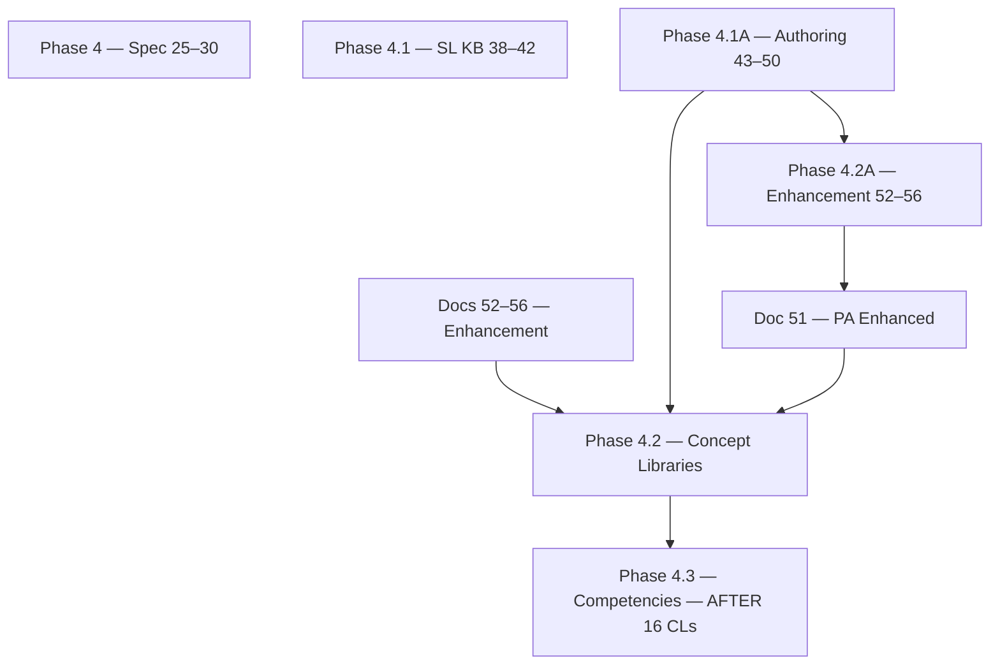

# The Academy Way Learning System™ — Implementation Blueprint

**Status:** Architecture & Instructional Design Only — No Code, No Migrations  
**Version:** 5.0 (JAG Knowledge Domains + SL Concept Libraries Complete)  
**Effective:** June 27, 2026  
**Governing Baseline:** AcademyOS Constitution v2.0 · Global Education Amendment (Docs A–D) · Master Implementation Roadmap v3.0 · Architectural Addendum No. 1 · **The JAG Knowledge System™ (Docs 57–61)**

---

## Branding Hierarchy

| Layer | Role |
|-------|------|
| **The JAG™** | Owns all instructional knowledge assets (IP) |
| **The Academy Way™** | Educational philosophy |
| **AcademyOS** | Technology platform — **consumes** JAG assets |
| **The Academy schools** | Implementation sites |

> AcademyOS shall consume these assets. AcademyOS shall not own these assets.

**JAG Governance Index:** [`docs/governance/jag-knowledge-system/00-JAG-KNOWLEDGE-SYSTEM-INDEX.md`](../../governance/jag-knowledge-system/00-JAG-KNOWLEDGE-SYSTEM-INDEX.md)

---

## Blueprint Index

### Phase 1 — Core Learning Framework

| Document | Title | File |
|----------|-------|------|
| **1** | The Academy Way Learning Framework™ | `01-ACADEMY-WAY-LEARNING-FRAMEWORK.md` |
| **2** | Complete Learning Registry Design | `02-LEARNING-REGISTRY-DESIGN.md` |
| **3** | Student Learning Journey Model | `03-STUDENT-LEARNING-JOURNEY-MODEL.md` |
| **4** | AI Venture Lab™ Curriculum Framework | `04-AI-VENTURE-LAB-FRAMEWORK.md` |
| **5** | Life Lab™ Curriculum Framework | `05-LIFE-LAB-FRAMEWORK.md` |
| **6** | Mastery Philosophy | `06-MASTERY-PHILOSOPHY.md` |

### Phase 2 — Student Success, Family Success & Opportunity Intelligence

| Document | Title | File |
|----------|-------|------|
| **7** | Graduation Readiness Engine™ | `07-GRADUATION-READINESS-ENGINE.md` |
| **8** | Family Journey™ Learning Pathways | `08-FAMILY-JOURNEY-LEARNING-PATHWAYS.md` |
| **9** | Student Opportunity Engine™ | `09-STUDENT-OPPORTUNITY-ENGINE.md` |
| **10** | Digital Portfolio™ | `10-DIGITAL-PORTFOLIO.md` |
| **11** | Mastery Transcript™ | `11-MASTERY-TRANSCRIPT.md` |

### Phase 3 — Universal Learning Registry™

| Document | Title | File |
|----------|-------|------|
| **12** | Universal Learning Registry™ Architecture | `12-UNIVERSAL-LEARNING-REGISTRY-ARCHITECTURE.md` |
| **13** | Structured Literacy (Wilson) Registry | `13-STRUCTURED-LITERACY-WILSON-REGISTRY.md` |
| **14** | Real-Life Math™ Registry | `14-REAL-LIFE-MATH-REGISTRY.md` |
| **15** | LitLab™ Registry | `15-LITLAB-REGISTRY.md` |
| **16** | Earthology™ Registry | `16-EARTHOLOGY-REGISTRY.md` |
| **17** | Life Lab™ & AI Venture Lab™ Registry | `17-LIFE-LAB-AI-VENTURE-LAB-REGISTRY.md` |

### Phase 3.5 — Learning Science & Instructional Intelligence Framework™

| Document | Title | File |
|----------|-------|------|
| **18** | The Academy Way Instructional Framework™ | `18-INSTRUCTIONAL-FRAMEWORK.md` |
| **19** | Learning Profile Framework™ | `19-LEARNING-PROFILE-FRAMEWORK.md` |
| **20** | Intervention Framework™ | `20-INTERVENTION-FRAMEWORK.md` |
| **21** | Assessment Framework™ | `21-ASSESSMENT-FRAMEWORK.md` |
| **22** | The Academy Way Instructional Playbook™ | `22-INSTRUCTIONAL-PLAYBOOK.md` |
| **23** | Learning Analytics Framework™ | `23-LEARNING-ANALYTICS-FRAMEWORK.md` |
| **24** | The Academy Way Research Framework™ | `24-RESEARCH-FRAMEWORK.md` |

### Phase 4 — Canonical Competency Library Specification™

| Document | Title | File |
|----------|-------|------|
| **25** | Canonical Competency Specification™ | `25-CANONICAL-COMPETENCY-SPECIFICATION.md` |
| **26** | Assessment Item Standard™ | `26-ASSESSMENT-ITEM-STANDARD.md` |
| **27** | Evidence Standard™ | `27-EVIDENCE-STANDARD.md` |
| **28** | Instructional Resource Standard™ | `28-INSTRUCTIONAL-RESOURCE-STANDARD.md` |
| **29** | AI Instructional Coach™ | `29-AI-INSTRUCTIONAL-COACH.md` |
| **30** | Competency Library Governance™ | `30-COMPETENCY-LIBRARY-GOVERNANCE.md` |

### Phase 4.1 — Structured Literacy Knowledge Base™ (Gold Standard)

| Document | Title | File |
|----------|-------|------|
| **38** | Structured Literacy Knowledge Map™ | `38-STRUCTURED-LITERACY-KNOWLEDGE-MAP.md` |
| **39** | Structured Literacy Learning Relationships™ | `39-STRUCTURED-LITERACY-LEARNING-RELATIONSHIPS.md` |
| **40** | Structured Literacy Assessment Framework™ | `40-STRUCTURED-LITERACY-ASSESSMENT-FRAMEWORK.md` |
| **41** | Structured Literacy AI Coach™ | `41-STRUCTURED-LITERACY-AI-COACH.md` |
| **42** | Structured Literacy Parent Success Framework™ | `42-STRUCTURED-LITERACY-PARENT-SUCCESS-FRAMEWORK.md` |

### Phase 4.1A — Competency Authoring System™

| Document | Title | File |
|----------|-------|------|
| **43** | Competency Authoring Methodology™ | `43-COMPETENCY-AUTHORING-METHODOLOGY.md` |
| **44** | Atomic Skill Authoring Guide™ | `44-ATOMIC-SKILL-AUTHORING-GUIDE.md` |
| **45** | Progression Authoring Guide™ | `45-PROGRESSION-AUTHORING-GUIDE.md` |
| **46** | Cross-Domain Connection Standard™ | `46-CROSS-DOMAIN-CONNECTION-STANDARD.md` |
| **47** | AI Metadata Standard™ | `47-AI-METADATA-STANDARD.md` |
| **48** | Quality Assurance Framework™ | `48-QUALITY-ASSURANCE-FRAMEWORK.md` |
| **49** | Publishing Pipeline™ | `49-PUBLISHING-PIPELINE.md` |
| **50** | Reference Implementation Guide™ | `50-REFERENCE-IMPLEMENTATION-GUIDE.md` |

### Phase 4.2A — Concept Library Enhancement™

| Document | Title | File |
|----------|-------|------|
| **52** | Cognitive Science Profile™ | `52-COGNITIVE-SCIENCE-PROFILE.md` |
| **53** | Brain Development Profile™ | `53-BRAIN-DEVELOPMENT-PROFILE.md` |
| **54** | Instructional Decision Model™ | `54-INSTRUCTIONAL-DECISION-MODEL.md` |
| **55** | AI Reasoning Profile™ | `55-AI-REASONING-PROFILE.md` |
| **56** | Concept Library Quality Standard™ | `56-CONCEPT-LIBRARY-QUALITY-STANDARD.md` |

### The JAG™ — Knowledge System Governance (57–61)

| Document | Title | File |
|----------|-------|------|
| **57–61** | JAG Knowledge System, IP, Graph, Lifecycle, Governance | [`00-JAG-KNOWLEDGE-SYSTEM-INDEX.md`](../../governance/jag-knowledge-system/00-JAG-KNOWLEDGE-SYSTEM-INDEX.md) |

### The JAG™ — Knowledge Domains Governance (78–83)

| Document | Title | File |
|----------|-------|------|
| **78** | The JAG Knowledge Domains™ | [`78-THE-JAG-KNOWLEDGE-DOMAINS.md`](../../governance/jag-knowledge-system/78-THE-JAG-KNOWLEDGE-DOMAINS.md) |
| **79** | The JAG Knowledge Asset Classification™ | [`79-THE-JAG-KNOWLEDGE-ASSET-CLASSIFICATION.md`](../../governance/jag-knowledge-system/79-THE-JAG-KNOWLEDGE-ASSET-CLASSIFICATION.md) |
| **80** | The JAG Publication Framework™ | [`80-THE-JAG-PUBLICATION-FRAMEWORK.md`](../../governance/jag-knowledge-system/80-THE-JAG-PUBLICATION-FRAMEWORK.md) |
| **81** | The JAG Professional Learning Framework™ | [`81-THE-JAG-PROFESSIONAL-LEARNING-FRAMEWORK.md`](../../governance/jag-knowledge-system/81-THE-JAG-PROFESSIONAL-LEARNING-FRAMEWORK.md) |
| **82** | The JAG Handbook Framework™ | [`82-THE-JAG-HANDBOOK-FRAMEWORK.md`](../../governance/jag-knowledge-system/82-THE-JAG-HANDBOOK-FRAMEWORK.md) |
| **83** | The JAG Knowledge Maturity Model™ | [`83-THE-JAG-KNOWLEDGE-MATURITY-MODEL.md`](../../governance/jag-knowledge-system/83-THE-JAG-KNOWLEDGE-MATURITY-MODEL.md) |

### Phase 4.2 — Structured Literacy Concept Libraries™ (JAG Assets) — COMPLETE

| Document | Title | File |
|----------|-------|------|
| **51** | Phonological Awareness *(Enhanced v1.1.0)* | `51-CONCEPT-LIBRARY-PHONOLOGICAL-AWARENESS.md` |
| **62** | Phonemic Awareness | [`concept-libraries/62-…`](../../governance/jag-knowledge-system/concept-libraries/62-CONCEPT-LIBRARY-PHONEMIC-AWARENESS.md) |
| **84–97** | Alphabetic Principle → Transfer *(14 libraries)* | [`concept-libraries/`](../../governance/jag-knowledge-system/concept-libraries/) |

*Full index: [`00-JAG-KNOWLEDGE-SYSTEM-INDEX.md`](../../governance/jag-knowledge-system/00-JAG-KNOWLEDGE-SYSTEM-INDEX.md) · 16 of 16 complete · CLQS panel pending*

---

## Phase 4.2A Theme

**Concept Library Enhancement™ — Permanent Enhancement Standard**

Before authoring remaining Concept Libraries, Phase 4.2A establishes mandatory enhancement sections that every library must include:

- **Cognitive Science Profile** (Doc 52) — 12 demand domains
- **Brain Development Profile** (Doc 53) — high-level neuroscience
- **Instructional Decision Model** (Doc 54) — when/how to teach
- **AI Reasoning Profile** (Doc 55) — platform reasoning rules
- **Concept Library Quality Standard** (Doc 56) — 8-review publication gate

**Document 51 revised to v1.1.0** as enhanced template exemplar.

**Next:** CLQS panel review on all 16 SL concept libraries → `published_blueprint` → Phase 4.3 competency authoring.

---

## Phase 4.2 Theme

**Structured Literacy Concept Libraries™ — Permanent Knowledge Assets**

A **Concept Library** is the canonical instructional knowledge model for one instructional concept. Competencies and atomic skills are **derived from** concept libraries — not authored independently.

Phase 4.2 populates concept libraries beginning with **Phonological Awareness** (Document 51) — the first permanent Concept Library in AcademyOS.

| Status | Rule |
|--------|------|
| **This phase** | Concept library blueprints only |
| **Not yet** | Competencies, atomic skills, assessment items |
| **Sequence** | Complete all 16 SL concept libraries before competency authoring |
| **Content** | Educational science, OG principles, public research — no Wilson copyrighted content |

**Concept library queue:** Phonological Awareness ✓ · Phonemic Awareness · Alphabetic Principle · Sound-Symbol Correspondence · Decoding · Encoding · Orthographic Mapping · Morphology · Fluency · Vocabulary · Syntax · Comprehension · Written Expression · Automaticity · Generalization · Transfer

---

## Phase 4.1A Theme

**Competency Authoring System™ — Universal Authoring Process**

Before populating the Universal Learning Registry™, Phase 4.1A defines the **methodology used to author every competency** — one universal process guaranteeing consistency across all learning domains.

Phase 4.1A delivers:
- Complete competency creation process with multi-stakeholder review (Document 43)
- Atomic skill writing standards (Document 44)
- Progression authoring — linear, spiral, recursive, branching, acceleration, intervention (Document 45)
- Cross-domain connection standard (Document 46)
- Required AI metadata on every competency (Document 47)
- Quality assurance gates (Document 48)
- Publishing pipeline state machine (Document 49)
- Reference implementation template from Structured Literacy (Document 50)

**This is NOT curriculum. This is NOT a competency library.**

**Explicitly excluded:** Competencies, Atomic Skills, code, implementation.

**Next phase (4.2 — IN PROGRESS):** Concept Libraries — Document 51 complete; 15 remaining before competency authoring (Phase 4.3+).

---

## Phase 4.1 Theme

**Structured Literacy Knowledge Base™ — Gold Standard Reference Implementation**

Phase 4.1 establishes the canonical SL knowledge layer (Documents 38–42). Phase 4.1A adds the universal authoring system that governs how that knowledge becomes ULR competencies.

---

## Complete Authoring Stack

| Layer | Documents | Purpose |
|-------|-----------|---------|
| **Specification** | 25–30 | What competencies must contain |
| **Knowledge Base** | 38–42 | SL concepts, graph, assessment, AI, parents |
| **JAG Governance** | 57–61, 78–83 | IP, domains, publication, PL, maturity |
| **Concept Libraries** | 51, 62, 84–97 | SL domain complete — 16 libraries |
| **Enhancement standards** | 52–56 | Mandatory profiles + CLQS |
| **Authoring System** | 43–50 | How to create, QA, and publish competencies |
| **Competency population** | After 16 CLs + CLQS | Phase 4.3+ |

---

## Dependency Graph

---

## Roadmap Placement

| Blueprint Area | Primary Roadmap Wave |
|----------------|---------------------|
| ULR architecture (Phase 3) | Wave 3 |
| Instructional intelligence (Phase 3.5) | Wave 3 design → Wave 6 |
| Authoring standards (Phase 4) | Wave 6 design authority |
| SL Knowledge Base (Phase 4.1) | Wave 6 — gold standard reference |
| **Competency Authoring System (Phase 4.1A)** | **Wave 6 — authoring authority** |
| **Concept Library Enhancement (Phase 4.2A)** | **Wave 6 — enhancement authority** |
| **JAG Knowledge Domains (Docs 78–83)** | **Wave 6 — domain organization layer** |
| **SL Concept Libraries (Phase 4.2)** | **Wave 6 — 16 of 16 complete** |
| **SL competency population** | **After 16 concept libraries complete** |
| Remaining domain libraries | Wave 6+ sequential |
| Global locale overlays | Global Education Amendment |
| ARI research validation | Wave 6.5 |

**Prerequisite:** Wave 1 (KEE + Event/Decision persistence) before registry implementation.

---

## Constitutional Alignment

- Part II — Platform Registry Framework · Configuration Studio (Doc 49)
- Part V — Family Journey™ (Docs 42, 43 parent review)
- Part VI — Student Success™
- Part VI-A — Learning Intelligence™ (Docs 29, 41, 47)
- Part VI-B — Learning Science (Docs 18–50)
- Part VI-D — Neurodiverse Profiles
- Part VI-F — Wilson Framework (Docs 13, 40, 48 Wilson review)
- Part VII-E — Scheduling Intelligence
- Part VIII — KEE (Doc 27, 49 pilot evidence)
- Global Education Amendment — Docs A–D
- Wave 6.5 — ARI (Doc 24)

---

## Authoring System Summary

| Standard | Document | Governs |
|----------|----------|---------|
| Authoring process | 43 | End-to-end competency creation |
| Atomic skills | 44 | Skill naming, metadata, criteria |
| Progressions | 45 | Linear, spiral, branch, intervention paths |
| Cross-domain links | 46 | Inter-domain competency references |
| AI metadata | 47 | Rules, confidence, explainability |
| Quality assurance | 48 | All review gates |
| Publishing | 49 | Draft → archived lifecycle |
| Reference template | 50 | SL gold standard for all domains |

---

## Domain Registry Summary

| Domain Key | Registry Doc | Library Priority |
|------------|--------------|------------------|
| `domain.structured_literacy` | 13 | **1 — Concept Libraries 4.2, then competencies** |
| `domain.real_life_math` | 14 | 2 |
| `domain.litlab` | 15 | 3 |
| `domain.earthology` | 16 | 4 |
| `domain.life_lab` | 17 | 5 |
| `domain.ai_venture_lab` | 17 | 6 |

---

*JAG Governance Docs 57–61, 78–83 complete. SL Concept Libraries 51, 62, 84–97 complete (16 total). CLQS panel → published_blueprint → Phase 4.3 competency authoring.*
