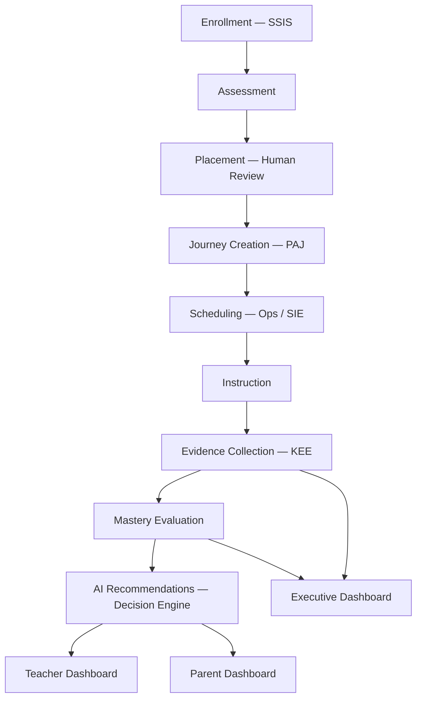
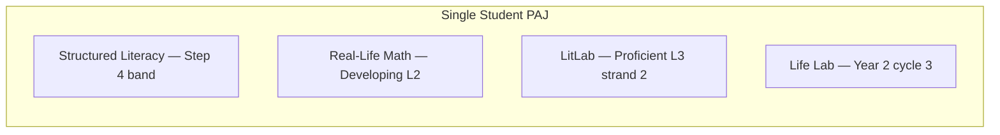

# DOCUMENT 3 — Student Learning Journey Model

**Project:** The Academy Way Learning System™  
**Status:** Implementation Blueprint — Lifecycle & Integration Model

---

## 1. Journey Lifecycle Overview

```
Enrollment
    ↓
Assessment
    ↓
Placement (Learning Journey Placement™)
    ↓
Journey Creation (Personal Academic Journey™)
    ↓
Scheduling (Instructional time assignment)
    ↓
Instruction (Evidence-generating activities)
    ↓
Evidence Collection (KEE)
    ↓
Mastery Evaluation (Level update)
    ↓
AI Recommendations (Decision Engine)
    ↓
Parent Dashboard (Family Portal)
    ↓
Teacher Dashboard (Teacher Workspace)
    ↓
Executive Dashboard (Executive Intelligence)
```

Each stage produces **Platform Events**, **Activity records**, and **Canonical Evidence** where applicable.

---

## 2. Stage Specifications

### 2.1 Enrollment

| Attribute | Specification |
|-----------|---------------|
| **Trigger** | SSIS lifecycle → `enrolled` |
| **Input** | Student record, program track (Virtual / HS), guardian links |
| **Action** | Initialize PAJ shell; identify required domains by program |
| **Output** | `learning.journey.created` event |
| **Integration** | SSIS (Part VI), Family Journey (Part V) |
| **Evidence** | Enrollment decision ref from admissions (AGP Wave 4.5) |

**Required domains by program:**

| Program | Default Domains |
|---------|-----------------|
| Academy Virtual | Structured Literacy, Real-Life Math, LitLab, Earthology |
| Academy HS | Life Lab, AI Venture Lab + Virtual domains as needed |

---

### 2.2 Assessment

| Attribute | Specification |
|-----------|---------------|
| **Purpose** | Baseline evidence for placement |
| **Types** | Universal screening, domain placement assessments |
| **Wilson** | VI-F.13 screening + placement probes |
| **Output** | Canonical evidence records (`measurement.assessment`) |
| **Workflow** | `learning_assessment_scheduling` (Scheduling ops + AGP if pre-enrollment) |

**Assessment does not equal placement** — assessment produces evidence; placement is a decision.

---

### 2.3 Placement

| Attribute | Specification |
|-----------|---------------|
| **Process** | Learning Journey Placement™ (Document 1 §4) |
| **Decision** | Pathway + starting competency band per domain |
| **Human gate** | Teacher / specialist review required |
| **Output** | Placement record + `learning.placement.completed` |
| **Integration** | Decision Engine (placement recommendation), Workflow (review) |

| Input | Output |
|-------|--------|
| Assessment evidence | Recommended placement |
| Prior school records | Transfer placement (evidence-weighted) |
| Wilson screening | Step band recommendation (SL domain) |

---

### 2.4 Journey Creation

| Attribute | Specification |
|-----------|---------------|
| **Artifact** | Personal Academic Journey™ record |
| **Contains** | Domain enrollments, pathways, starting positions, cycle assignment |
| **Profile** | Student Profile section `learning_journey` populated |
| **Graph** | Intelligence Graph edges: student → domain → pathway |

**PAJ Record (conceptual):**

| Field | Description |
|-------|-------------|
| `journey_id` | UUID |
| `student_id` | Student |
| `program_track` | virtual, hs, hybrid |
| `domain_enrollments[]` | `{ domainKey, pathwayKey, placementId, status }` |
| `current_cycle_id` | Active learning cycle |
| `created_at` | Timestamp |

---

### 2.5 Scheduling

| Attribute | Specification |
|-----------|---------------|
| **Owner** | Instructional Scheduling (Part VII ops) + SIE (Wave 7+) |
| **Assigns** | Session times, groups, teachers, rooms |
| **Does not assign** | Mastery level or pathway advancement |
| **Constraints** | Academy Way rules, Wilson dosage, WCSS, funding (FIP) |
| **Output** | `instructional_sessions` linked to domain + competency focus |

**Integration map:**

| Scheduling Element | Journey Element |
|--------------------|-----------------|
| Section `academy_subject` | Domain key |
| Session plan focus skills | Atomic skill IDs |
| Group roster | Students at similar placement band (not grade) |

---

### 2.6 Instruction

| Attribute | Specification |
|-----------|---------------|
| **Delivery** | Virtual (:50 sessions), HS labs, tutoring, therapy adjacency |
| **Session record** | Skills targeted, fidelity (Wilson), attendance |
| **Wilson** | VI-F session model — category-coded, not proprietary lesson content |
| **Output** | Session delivery evidence, attendance events |

---

### 2.7 Evidence Collection

| Attribute | Specification |
|-----------|---------------|
| **Sources** | Teacher observation, assessment, artifact, parent log, system capture |
| **Pipeline** | Capture → Canonical Evidence (KEE) → skill_keys[] linkage |
| **Minimum** | Per registry `minimum_evidence_count` + `evidence_types[]` |
| **Event** | `learning.evidence.recorded` |

**Evidence triggers mastery recalculation** — async via Automation Engine job.

---

### 2.8 Mastery

| Attribute | Specification |
|-----------|---------------|
| **Engine** | Mastery evaluation service (conceptual — Wave 3) |
| **Input** | Linked evidence + registry success criteria |
| **Output** | Updated skill/competency mastery level |
| **Human gate** | Educator confirmation when registry requires |
| **Events** | `learning.mastery.updated`, `learning.competency.mastered` |
| **Philosophy** | Document 6 — evidence determines level |

**Stagnation detection:** No level change > org threshold → intervention workflow.

---

### 2.9 AI Recommendations

| Attribute | Specification |
|-----------|---------------|
| **Engine** | Platform Decision Engine + AIP (Wave 6+ production) |
| **Types** | Next skill, intervention, reassessment, home activity, schedule |
| **Requirements** | Explainability, evidence refs, confidence, alternatives |
| **Human gate** | Accept / modify / reject — reason captured |
| **Event** | `learning.recommendation.created`, `learning.recommendation.decided` |

**Recommendations do not auto-change mastery or placement.**

---

### 2.10 Parent Dashboard

| Attribute | Specification |
|-----------|---------------|
| **Surface** | Family Portal `/portal/learning` |
| **Audience** | Guardians |
| **Content** | Domain progress, mastery visualization, home activities, messages |
| **Language** | Plain language, skill-based, strength-focused |
| **Wilson** | Home practice, reading minutes (VI-F.16) |
| **Privacy** | FERPA tier; no internal AI model details |

---

### 2.11 Teacher Dashboard

| Attribute | Specification |
|-----------|---------------|
| **Surface** | Teacher Workspace `/dashboard/teacher` + journey views |
| **Content** | Cohort mastery heatmap, evidence capture, AI review queue |
| **Actions** | Record evidence, confirm mastery, request placement review |
| **Wilson** | Session fidelity, dosage, Step progress |

---

### 2.12 Executive Dashboard

| Attribute | Specification |
|-----------|---------------|
| **Surface** | Executive Intelligence |
| **Content** | Domain mastery distributions, velocity trends, placement audit |
| **Metrics** | Mastery velocity, evidence sufficiency, intervention rates |
| **Not primary** | % on grade level — replaced by outcome-aligned metrics |
| **Research** | ARI cross-campus comparisons (Wave 6.5) |

---

## 3. End-to-End Flow Diagram



---

## 4. Parallel Domain Journeys

Students progress **independently per domain**:



Scheduling coordinates **time** across domains; PAJ coordinates **content progress** per domain.

---

## 5. Reassessment & Pathway Change

| Trigger | Workflow |
|---------|----------|
| Regression evidence | `learning_reassessment` |
| Stagnation alert | MTSS + placement review |
| Transfer records | Placement update with evidence |
| Wilson exit/re-entry | VI-F.13 reassessment |
| Parent/educator request | Manual reassessment workflow |

All pathway changes: evidence package + human approval + Activity audit.

---

## 6. Integration Checklist (Per Stage)

| Stage | Events | Activity | KEE | Workflow | Decision | Graph |
|-------|--------|----------|-----|----------|----------|-------|
| Enrollment | ✓ | ✓ | ✓ | ✓ | | ✓ |
| Assessment | ✓ | ✓ | ✓ | ✓ | | |
| Placement | ✓ | ✓ | ✓ | ✓ | ✓ | ✓ |
| Journey Creation | ✓ | ✓ | | | | ✓ |
| Scheduling | ✓ | ✓ | | ✓ | ✓ | ✓ |
| Instruction | ✓ | ✓ | ✓ | | | |
| Evidence | ✓ | ✓ | ✓ | | | ✓ |
| Mastery | ✓ | ✓ | ✓ | ✓ | | ✓ |
| AI Rec | ✓ | ✓ | ✓ | ✓ | ✓ | |
| Dashboards | | ✓ | read | | read | read |

---

## 7. Roadmap Implementation Mapping

| Journey Stage | Roadmap Wave |
|---------------|--------------|
| Enrollment, Profile section | Wave 2–3 |
| Assessment, Placement, PAJ | Wave 3 |
| Registry-driven mastery | Wave 3 + Wave 6 |
| KEE evidence pipeline | Wave 1 (prerequisite) |
| AI Recommendations | Wave 6+ |
| Scheduling integration | Wave 2 ops, Wave 7 intel |
| Dashboards | Wave 3 (teacher/parent), Wave 5–6 (executive) |

---

*End of Document 3 — Student Learning Journey Model*
