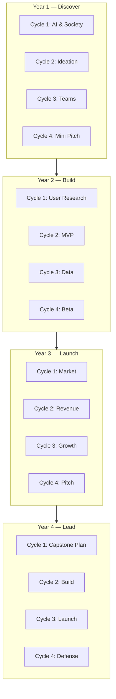

# DOCUMENT 4 — AI Venture Lab™ Curriculum Framework

**Project:** The Academy Way Learning System™  
**Domain Key:** `domain.ai_venture_lab`  
**Track:** Academy High School  
**Status:** Implementation Blueprint — Four-Year Curriculum Architecture

---

## 1. Charter

**AI Venture Lab™** prepares students to **create, launch, and lead ethical AI-enabled ventures** — replacing traditional quarterly course silos with **Learning Cycles** and **evidence-based mastery**.

Students graduate with a **venture portfolio**, demonstrated competencies, and capstone outcomes — not seat-time credits alone.

---

## 2. Design Principles

| Principle | Application |
|-----------|-------------|
| **Learning Cycles, not quarters** | 4–5 cycles per year; mastery spans cycles |
| **Project-based evidence** | Every cycle produces portfolio artifacts |
| **Ethical AI first** | AI literacy and ethics strand precedes tooling |
| **Real ventures** | Progression from simulation → school venture → capstone |
| **Mastery graduation** | Graduation outcomes = competency mastery, not hours |

---

## 3. Four-Year Progression Overview

| Year | Theme | Focus |
|------|-------|-------|
| **Year 1** | **Discover** | AI literacy, ideation, team basics |
| **Year 2** | **Build** | Product development, data, MVP |
| **Year 3** | **Launch** | Go-to-market, finance, growth |
| **Year 4** | **Lead** | Capstone venture, mentorship, graduation portfolio |

---

## 4. Learning Cycles (Replace Quarters)

### 4.1 Cycle Structure

| Attribute | Specification |
|-----------|---------------|
| **Duration** | 8 weeks (configurable 6–10) |
| **Cycles/year** | 4 (+ optional summer cycle) |
| **Per cycle** | 1 major project milestone + evidence portfolio update |
| **Cycle end** | Review, reflection, AI summary — not auto-promotion |

### 4.2 Four-Year Cycle Map (Sample)

| Year | Cycle 1 | Cycle 2 | Cycle 3 | Cycle 4 |
|------|---------|---------|---------|---------|
| **Y1** | AI & Society | Ideation Lab | Team Formation | Mini Pitch |
| **Y2** | User Research | MVP Build | Data & Metrics | Beta Launch |
| **Y3** | Market Strategy | Revenue Model | Growth Experiments | Investor Pitch |
| **Y4** | Capstone Plan | Capstone Build | Capstone Launch | Portfolio Defense |

---

## 5. Strands & Competencies

### 5.1 Strand: AI Literacy & Ethics — `domain.ai_venture_lab.strand.ai_literacy`

| Competency Key | Year | Description |
|----------------|------|-------------|
| `...ai_literacy.foundations` | Y1 | How AI works; capabilities & limits |
| `...ai_literacy.ethics` | Y1 | Bias, privacy, responsible use |
| `...ai_literacy.tools` | Y2 | Practical AI tools for ventures |
| `...ai_literacy.policy` | Y3 | Regulation, governance, societal impact |

**Sample atomic skills:** `AW-AV-01-001` Explain ML vs rules-based systems; `AW-AV-01-005` Identify bias in training data examples.

---

### 5.2 Strand: Entrepreneurship — `domain.ai_venture_lab.strand.entrepreneurship`

| Competency | Year | Focus |
|------------|------|-------|
| `...entrepreneurship.ideation` | Y1 | Problem discovery, validation |
| `...entrepreneurship.business_model` | Y2 | Canvas, value proposition |
| `...entrepreneurship.validation` | Y3 | Market testing, pivot decisions |
| `...entrepreneurship.scaling` | Y4 | Growth strategy, operations |

---

### 5.3 Strand: Product Development — `domain.ai_venture_lab.strand.product_development`

| Competency | Year | Focus |
|------------|------|-------|
| `...product.user_research` | Y2 | Interviews, personas, journeys |
| `...product.design` | Y2 | Wireframes, prototypes |
| `...product.engineering` | Y2–Y3 | MVP development (no-code → code pathways) |
| `...product.iteration` | Y3 | Feedback loops, versioning |

---

### 5.4 Strand: Data & Decision Making — `domain.ai_venture_lab.strand.data_decision`

| Competency | Year | Focus |
|------------|------|-------|
| `...data.collection` | Y2 | Metrics definition, tracking |
| `...data.analysis` | Y3 | Interpretation, dashboards |
| `...data.decisions` | Y3 | Evidence-based venture decisions |

---

### 5.5 Strand: Marketing & Growth — `domain.ai_venture_lab.strand.marketing_growth`

| Competency | Year | Focus |
|------------|------|-------|
| `...marketing.brand` | Y3 | Brand, messaging, audience |
| `...marketing.channels` | Y3 | Digital marketing fundamentals |
| `...marketing.growth` | Y3 | Experiments, funnel metrics |

---

### 5.6 Strand: Venture Finance — `domain.ai_venture_lab.strand.finance_venture`

| Competency | Year | Focus |
|------------|------|-------|
| `...finance_venture.budgeting` | Y2 | Venture budget, runway |
| `...finance_venture.revenue` | Y3 | Pricing, revenue models |
| `...finance_venture.funding` | Y4 | Pitch decks, funding sources |

**Cross-link:** Life Lab Financial Literacy strand (`domain.life_lab`).

---

### 5.7 Strand: Team Leadership — `domain.ai_venture_lab.strand.leadership_teams`

| Competency | Year | Focus |
|------------|------|-------|
| `...leadership.collaboration` | Y1 | Roles, norms, conflict |
| `...leadership.project_mgmt` | Y2 | Sprints, deliverables |
| `...leadership.mentorship` | Y4 | Mentor others, lead teams |

---

### 5.8 Strand: Capstone & Portfolio — `domain.ai_venture_lab.strand.capstone`

| Competency | Year | Focus |
|------------|------|-------|
| `...capstone.proposal` | Y4 C1 | Capstone plan approved |
| `...capstone.execution` | Y4 C2–C3 | Venture launch evidence |
| `...capstone.defense` | Y4 C4 | Portfolio defense mastered |

---

## 6. Scope & Sequence (Four-Year)

**Prerequisites:** Year N+1 cycle 1 unlocked when ≥80% of prior year strand competencies at Proficient (org-configurable).

---

## 7. Projects (By Year)

| Year | Project Type | Evidence Output |
|------|--------------|-----------------|
| **Y1** | Mini venture pitch (team) | Pitch deck, reflection |
| **Y2** | MVP with users | Prototype, user feedback log |
| **Y3** | Market launch | Metrics dashboard, iteration log |
| **Y4** | Capstone venture | Full portfolio, launch evidence |

---

## 8. Capstones

### 8.1 Year 4 Capstone Requirements

| Element | Requirement |
|---------|-------------|
| **Venture** | Student-led AI-enabled venture (real or simulated with external users) |
| **Team** | Lead role demonstrated |
| **Ethics** | Ethics review passed |
| **Finance** | Budget and revenue model documented |
| **Launch** | Minimum viable launch evidence |
| **Defense** | Portfolio defense before panel |

### 8.2 Capstone Competency

`domain.ai_venture_lab.strand.capstone.defense` — requires educator + panel confirmation.

---

## 9. Assessments

| Assessment Type | When | Purpose |
|-----------------|------|---------|
| `venture_placement` | Entry | Pathway placement |
| `project_rubric` | Each cycle | Project mastery evidence |
| `peer_review` | Y2+ | Collaboration evidence |
| `pitch_evaluation` | Y1, Y3, Y4 | Presentation competency |
| `portfolio_review` | Each year end | Cross-cycle progress |
| `capstone_defense` | Y4 C4 | Graduation gate |

---

## 10. Portfolio

### 10.1 Portfolio Structure

| Section | Content |
|---------|---------|
| **Ventures** | All venture projects Y1–Y4 |
| **Artifacts** | Decks, prototypes, metrics, media |
| **Reflections** | Cycle reflections |
| **Competencies** | Mastery map visualization |
| **Recommendations** | Mentor letters, AI summaries (reviewed) |

### 10.2 Portfolio Platform Integration

- Artifacts → KEE `artifact.product` evidence  
- Student Profile + Parent Portal view  
- Export for college/career applications  

---

## 11. Graduation Outcomes

Student **graduates AI Venture Lab track** when:

| Outcome | Criteria |
|---------|----------|
| **Core competencies** | All Y1–Y3 strand required competencies at Proficient (L3) |
| **Capstone** | Capstone defense competency mastered |
| **Portfolio** | Complete four-year portfolio |
| **Ethics** | AI ethics competency at Proficient |
| **Leadership** | Team leadership Y4 competency at Proficient |

Graduation = **mastery outcomes**, not credit hours — though hours may be reported for external compliance via Configuration Studio mapping.

---

## 12. Evidence & AI Integration

| Capability | Use |
|------------|-----|
| **KEE** | All project artifacts, rubrics, reflections |
| **Decision Engine** | Next project suggestion, team role recommendation |
| **Life Lab cross-links** | Finance, communication, self-advocacy |
| **ARI** | Venture program effectiveness research (Wave 6.5) |

---

## 13. Scheduling Notes

- Life Lab + Venture Lab may share HS block scheduling  
- Cycle boundaries drive project deadlines — not report card quarters  
- Virtual collaboration sessions for team ventures  

---

*End of Document 4 — AI Venture Lab™ Curriculum Framework*
