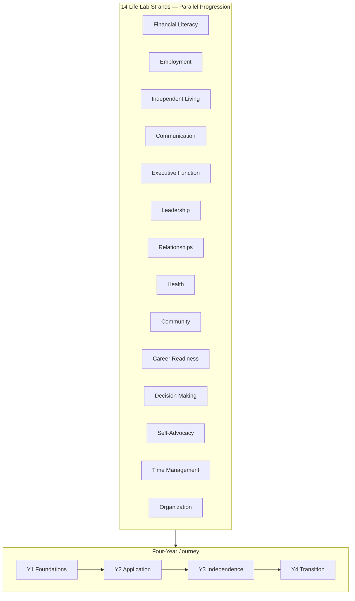

# DOCUMENT 5 — Life Lab™ Curriculum Framework

**Project:** The Academy Way Learning System™  
**Domain Key:** `domain.life_lab`  
**Track:** Academy High School  
**Status:** Implementation Blueprint — Four-Year Curriculum Architecture

---

## 1. Charter

**Life Lab™** prepares students for **successful adult living** — financial independence, employment, health, relationships, self-advocacy, and career readiness — through **evidence-based mastery** across fourteen life strands.

Traditional life skills courses are replaced by a **four-year Personal Academic Journey** with Learning Cycles, real-world application evidence, and portfolio graduation outcomes.

---

## 2. Design Principles

| Principle | Application |
|-----------|-------------|
| **Real-world evidence** | Performance tasks in authentic contexts |
| **Cross-strand integration** | EF, communication, decision-making weave through all strands |
| **Individual pacing** | Mastery-based; cycles provide rhythm not gates |
| **Family partnership** | Parent activities for home generalization |
| **Transition alignment** | College, career, independent living pathways |

---

## 3. Four-Year Progression Overview

| Year | Theme | Emphasis |
|------|-------|----------|
| **Year 1** | **Foundations** | Self-awareness, basic life skills, safety |
| **Year 2** | **Application** | Employment basics, money in practice, health habits |
| **Year 3** | **Independence** | Advanced living skills, career exploration, leadership |
| **Year 4** | **Transition** | Capstone transition plan, self-advocacy, graduation portfolio |

---

## 4. Learning Cycles

| Attribute | Specification |
|-----------|---------------|
| **Duration** | 8 weeks |
| **Cycles/year** | 4 |
| **Integration** | 2–3 strands emphasized per cycle; others maintained |
| **Evidence** | Performance tasks + reflections each cycle |

### Sample Four-Year Cycle Themes

| Year | C1 | C2 | C3 | C4 |
|------|----|----|----|-----|
| **Y1** | Self & Safety | Money Basics | Communication Foundations | Health & Wellness |
| **Y2** | Job Ready | Budget Living | Relationships & Community | EF in Action |
| **Y3** | Career Explore | Independent Tasks | Leadership Project | Decision Intensive |
| **Y4** | Transition Plan | Self-Advocacy | Capstone Living Lab | Portfolio Defense |

---

## 5. Fourteen Strands — Full Framework

Each strand: **Competencies (4–6 per year band)** · **Atomic skills** · **Evidence types** · **Parent activities** · **Success criteria**

---

### 5.1 Financial Literacy — `domain.life_lab.strand.financial_literacy`

| Year | Competencies | Sample Skills |
|------|--------------|---------------|
| **Y1** | Money basics, needs vs wants | `AW-LF-01-001` Identify income/expense; `AW-LF-01-003` Use budgeting template |
| **Y2** | Checking/saving, credit intro | `AW-LF-01-008` Reconcile simple account; `AW-LF-01-010` Explain credit basics |
| **Y3** | Taxes, insurance, investing intro | `AW-LF-01-015` Complete tax forms with support |
| **Y4** | Independent financial plan | `AW-LF-01-020` Maintain 90-day personal budget |

**Evidence:** Budget artifacts, simulations, real transactions (redacted)  
**Parent activities:** Grocery budgeting, utility bill review  
**Cross-link:** Venture Lab finance strand  

---

### 5.2 Employment — `domain.life_lab.strand.employment`

| Year | Competencies | Sample Skills |
|------|--------------|---------------|
| **Y1** | Work readiness, professionalism | `AW-LF-02-001` Complete job application |
| **Y2** | Interview skills, workplace norms | `AW-LF-02-005` Mock interview proficiency |
| **Y3** | Workplace communication, performance | `AW-LF-02-010` Receive/deimplement feedback |
| **Y4** | Sustained employment or internship | `AW-LF-02-015` 60-day work evidence portfolio |

**Evidence:** Applications, supervisor evaluations, work samples  
**Assessment types:** `performance_task`, `workplace_evaluation`  

---

### 5.3 Independent Living — `domain.life_lab.strand.independent_living`

| Year | Focus |
|------|-------|
| **Y1** | Home safety, basic cooking, cleanliness |
| **Y2** | Meal planning, laundry, simple repairs |
| **Y3** | Housing search basics, utilities setup |
| **Y4** | Independent living plan (housing, daily routine) |

**Sample skills:** `AW-LF-03-004` Prepare 3 balanced meals; `AW-LF-03-012` Complete housing comparison matrix  

---

### 5.4 Communication — `domain.life_lab.strand.communication`

| Year | Focus |
|------|-------|
| **Y1** | Verbal/nonverbal basics, active listening |
| **Y2** | Email, phone, professional writing |
| **Y3** | Presentations, conflict resolution |
| **Y4** | Advocacy communication, interviews |

**Cross-link:** LitLab discussion strand, Venture Lab pitch competencies  

---

### 5.5 Executive Function — `domain.life_lab.strand.executive_function`

| Year | Focus |
|------|-------|
| **Y1** | Planning, task initiation |
| **Y2** | Prioritization, flexible thinking |
| **Y3** | Long-term project management |
| **Y4** | Self-directed EF systems |

**Sample skills:** `AW-LF-05-003` Use planner system 4 weeks; `AW-LF-05-009` Break capstone into milestones  

**Cross-link:** All domains; NDL profiles (VI-D) as support evidence, not identity  

---

### 5.6 Leadership — `domain.life_lab.strand.leadership`

| Year | Focus |
|------|-------|
| **Y1** | Team participation |
| **Y2** | Peer leadership roles |
| **Y3** | Project leadership |
| **Y4** | Mentor/lead capstone |

---

### 5.7 Relationships — `domain.life_lab.strand.relationships`

| Year | Focus |
|------|-------|
| **Y1** | Friendship, boundaries |
| **Y2** | Peer pressure, digital citizenship |
| **Y3** | Healthy relationships, diversity |
| **Y4** | Professional relationships, networking |

---

### 5.8 Health — `domain.life_lab.strand.health`

| Year | Focus |
|------|-------|
| **Y1** | Nutrition, sleep, hygiene |
| **Y2** | Mental health awareness, stress management |
| **Y3** | Healthcare navigation, insurance basics |
| **Y4** | Self-managed health plan |

**Integration:** SSIS medical section (operational); no duplicate medical records  

---

### 5.9 Community — `domain.life_lab.strand.community`

| Year | Focus |
|------|-------|
| **Y1** | Community resources awareness |
| **Y2** | Volunteering, civic participation |
| **Y3** | Service project leadership |
| **Y4** | Sustained community engagement portfolio |

---

### 5.10 Career Readiness — `domain.life_lab.strand.career_readiness`

| Year | Focus |
|------|-------|
| **Y1** | Interest exploration |
| **Y2** | Career research, pathways |
| **Y3** | Job shadow, internship prep |
| **Y4** | Post-secondary plan (college, trade, work) |

**Cross-link:** VI Student Success transition services; Venture Lab Y4 capstone optional path  

---

### 5.11 Decision Making — `domain.life_lab.strand.decision_making`

| Year | Focus |
|------|-------|
| **Y1** | Everyday decisions, consequences |
| **Y2** | Information gathering for decisions |
| **Y3** | Ethical decisions, trade-offs |
| **Y4** | Major life decision documentation |

**Evidence:** Decision journals, case analyses, real decision outcomes  

---

### 5.12 Self-Advocacy — `domain.life_lab.strand.self_advocacy`

| Year | Focus |
|------|-------|
| **Y1** | Naming needs and preferences |
| **Y2** | Requesting accommodations appropriately |
| **Y3** | IEP/504 self-advocacy (where applicable) |
| **Y4** | Workplace and post-secondary advocacy |

**Constitutional note:** Advocacy for supports — not label-based identity  

---

### 5.13 Time Management — `domain.life_lab.strand.time_management`

| Year | Focus |
|------|-------|
| **Y1** | Daily schedules, punctuality |
| **Y2** | Weekly planning, deadlines |
| **Y3** | Multi-project time allocation |
| **Y4** | Independent long-range planning |

**Cross-link:** Scheduling Intelligence readiness signals (VII-E §16.3)  

---

### 5.14 Organization — `domain.life_lab.strand.organization`

| Year | Focus |
|------|-------|
| **Y1** | Materials, workspace organization |
| **Y2** | Digital file systems |
| **Y3** | Document management for work/school |
| **Y4** | Personal systems portfolio |

---

## 6. Scope & Sequence Diagram

---

## 7. Assessments

| Type | Use |
|------|-----|
| `life_lab_placement` | Entry pathway |
| `performance_task` | Authentic skill demonstration |
| `portfolio_review` | Cycle and year-end |
| `workplace_evaluation` | Employment strand |
| `transition_plan_review` | Y4 capstone |
| `capstone_defense` | Graduation gate |

---

## 8. Portfolio & Graduation Outcomes

### 8.1 Portfolio Sections

- Living skills evidence (photos, videos, documents — permission-gated)  
- Employment and career artifacts  
- Financial plans (redacted as needed)  
- Reflections and self-assessments  
- Competency mastery map  

### 8.2 Graduation Outcomes (Life Lab Track)

| Outcome | Criteria |
|---------|----------|
| **Core strands** | All 14 strands: required Y1–Y3 competencies at Proficient |
| **Transition plan** | Y4 transition competency mastered |
| **Self-advocacy** | Y4 self-advocacy at Proficient |
| **Capstone** | Living Lab capstone + portfolio defense |
| **Career/post-secondary** | Documented post-secondary plan |

---

## 9. Parent & Family Integration

| Mechanism | Description |
|-----------|-------------|
| **Parent activities** | Per-strand home generalization tasks |
| **Family Portal** | Progress view, home activity logging |
| **Conferences** | Cycle-end optional conferences |
| **Military families** | Relocation-aware transition planning (FIP, Family Journey) |

---

## 10. Platform Integration

| System | Integration |
|--------|-------------|
| **Learning Registry** | Full strand/competency/skill catalog |
| **KEE** | All performance evidence |
| **SSIS** | Medical, transportation, transition — operational links |
| **Scheduling** | HS lab blocks, work-based learning time |
| **FIP** | Scholarship, transition funding |
| **Venture Lab** | Optional dual-track for entrepreneurs |

---

## 11. Intervention & Supports

Stagnation in any strand triggers MTSS workflow — linked via registry `intervention_links`. Supports documented in SSIS; mastery measured by evidence despite accommodations.

---

*End of Document 5 — Life Lab™ Curriculum Framework*
