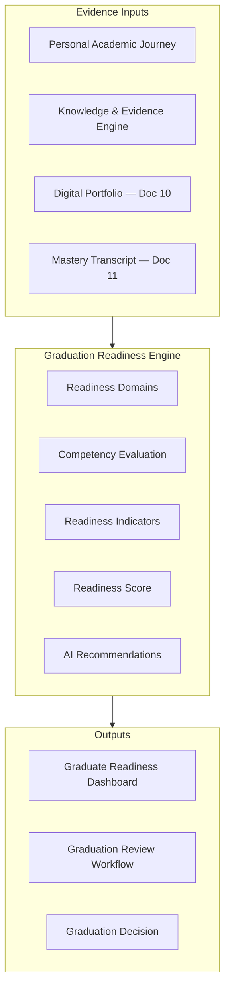

# DOCUMENT 7 — Personal Academic Journey™ Graduation Readiness Engine

**Project:** The Academy Way Learning System™ — Phase 2  
**Status:** Implementation Blueprint — Instructional Architecture Only  
**Extends:** Documents 1, 3, 4, 5, 6 · Part VI Student Success™ · Part VI-F Wilson Framework

---

## 1. Charter

The **Graduation Readiness Engine™** determines when a learner is **truly prepared for graduation** — not when credits are accumulated or a calendar year completes.

Graduation is a **readiness decision** supported by **demonstrated mastery**, **evidence portfolios**, and **human review** across multiple readiness domains.

**Constitutional principles:**
- Time and credits do not determine graduation — **evidence and readiness do** (Document 6)
- Diagnoses inform supports; they do not define readiness labels
- AI recommends readiness status; **educators and leadership approve** graduation

---

## 2. Readiness Architecture



**Registry key:** `graduation_readiness_domain_registry`

---

## 3. Readiness Domain Catalog

Readiness domains group competencies from Learning Registry domains (Docs 2, 4, 5) plus cross-cutting graduate outcomes.

---

### 3.1 Academic Readiness — `readiness.academic`

| Sub-domain | Source Registry | Key Competencies |
|------------|-----------------|------------------|
| **Literacy** | Structured Literacy, LitLab | Wilson Step completion band, reading comprehension, writing craft |
| **Numeracy** | Real-Life Math | Real-world problem solving, financial math application |
| **Communication** | LitLab, Life Lab | Oral/written professional communication |
| **Research** | Earthology, Venture Lab | Inquiry, source evaluation, synthesis |
| **Critical Thinking** | All domains | Analysis, evaluation, evidence-based reasoning |

---

### 3.2 Life Readiness — `readiness.life`

| Sub-domain | Source | Key Competencies |
|------------|--------|------------------|
| **Financial Literacy** | Life Lab §5.1 | Independent budget, credit, taxes basics |
| **Independent Living** | Life Lab §5.3 | Housing, meals, daily living plan |
| **Employment Readiness** | Life Lab §5.2 | Application, interview, sustained work evidence |
| **Executive Function** | Life Lab §5.5 | Self-directed planning systems |
| **Self Advocacy** | Life Lab §5.12 | Post-secondary/workplace advocacy |
| **Health & Wellness** | Life Lab §5.8 | Self-managed health plan |

---

### 3.3 Technology Readiness — `readiness.technology`

| Sub-domain | Source | Key Competencies |
|------------|--------|------------------|
| **AI Literacy** | Venture Lab §5.1 | AI capabilities, limits, ethical use |
| **Digital Citizenship** | LitLab media literacy | Online responsibility, identity |
| **Cyber Safety** | Cross-cutting | Privacy, security, safe practices |

---

### 3.4 Entrepreneurship Readiness — `readiness.entrepreneurship`

| Sub-domain | Source | Key Competencies |
|------------|--------|------------------|
| **Business Creation** | Venture Lab §5.2–5.3 | Validated venture, MVP evidence |
| **Marketing** | Venture Lab §5.5 | Brand, audience, channel basics |
| **Leadership** | Venture Lab §5.7, Life Lab §5.6 | Team leadership, mentorship |
| **Operations** | Venture Lab | Budget, delivery, iteration |

*Optional track:* Required for Venture Lab graduation path; optional for general graduation with elective weight.

---

### 3.5 Professional Skills — `readiness.professional`

| Sub-domain | Competencies |
|------------|--------------|
| **Career Readiness** | Post-secondary plan, career exploration portfolio |
| **College Readiness** | Application readiness, academic self-management |
| **Community Engagement** | Sustained service, civic participation |
| **Ethics** | Ethical decision-making evidence |
| **Problem Solving** | Complex problem performance tasks |
| **Confidence** | Self-efficacy reflections + demonstrated risk-taking |
| **Resilience** | Recovery from setback evidence |
| **Self Management** | Time, organization, goal attainment |

---

## 4. Universal Domain Schema

For **every readiness domain**, the registry defines:

| Element | Description |
|---------|-------------|
| **Competencies[]** | Required competency keys from Learning Registry |
| **Evidence[]** | Required evidence types and minimum counts |
| **Mastery** | Minimum level (typically L3 Proficient) per competency |
| **Readiness Indicators[]** | Observable signals computed from evidence |
| **AI Recommendations[]** | Decision Engine rule keys |
| **Portfolio Artifacts[]** | Required Digital Portfolio sections (Doc 10) |
| **Dashboard Design** | Widgets and views (§8) |

---

## 5. Domain Specifications (Detail)

### 5.1 Example: Literacy Readiness — `readiness.academic.literacy`

| Element | Specification |
|---------|---------------|
| **Competencies** | Wilson Step 12 band OR exit criteria (VI-F); LitLab analysis strand proficient |
| **Evidence** | ORF/spelling probes, writing portfolio, comprehension assessments |
| **Mastery** | Wilson exit metrics + LitLab competencies at L3 |
| **Readiness Indicators** | `indicator.literacy.wilson_exit_met`, `indicator.literacy.transfer_reading`, `indicator.literacy.independent_stamina` |
| **AI Recommendations** | `ai.graduation.literacy_gap`, `ai.graduation.literacy_ready` |
| **Portfolio Artifacts** | Wilson milestone summary, writing samples, reading log |
| **Dashboard** | Literacy readiness gauge, evidence timeline, gap list |

### 5.2 Example: Financial Literacy Readiness — `readiness.life.financial`

| Element | Specification |
|---------|---------------|
| **Competencies** | Life Lab Y1–Y4 financial strand required set at L3 |
| **Evidence** | Budget artifacts, simulation results, 90-day budget maintenance |
| **Mastery** | `AW-LF-01-020` and prerequisites at L3 |
| **Readiness Indicators** | `indicator.finance.budget_sustained`, `indicator.finance.credit_understood` |
| **AI Recommendations** | `ai.graduation.finance_remediation`, `ai.graduation.finance_ready` |
| **Portfolio Artifacts** | Redacted budget plan, reflection |
| **Dashboard** | Life readiness financial sub-gauge |

*(Pattern repeats for all domains in §3.)*

---

## 6. Readiness Indicators Catalog

| Indicator Key | Domain | Computation Concept |
|---------------|--------|---------------------|
| `indicator.readiness.domain_complete` | All | Required competencies at mastery threshold |
| `indicator.readiness.evidence_sufficient` | All | Evidence count + recency met |
| `indicator.readiness.portfolio_complete` | All | Required portfolio artifacts present |
| `indicator.readiness.stagnation_clear` | All | No active stagnation flags |
| `indicator.literacy.wilson_exit_met` | Academic | VI-F exit criteria |
| `indicator.life.transition_plan_approved` | Life | Y4 transition competency mastered |
| `indicator.tech.ai_ethics_proficient` | Technology | Venture Lab ethics competency |
| `indicator.venture.capstone_defense` | Entrepreneurship | Capstone mastered |
| `indicator.professional.post_secondary_plan` | Professional | Documented plan with evidence |

**Readiness Indicator Record:**

| Field | Description |
|-------|-------------|
| `indicator_key` | Registry key |
| `student_id` | Student |
| `status` | `not_met`, `approaching`, `met` |
| `computed_at` | Timestamp |
| `evidence_refs[]` | KEE IDs |
| `confidence` | Model confidence band |

---

## 7. Graduation Readiness Score (GRS)

**Metric key:** `graduation.readiness.score`

```
GRS = Σ (domain_weight × domain_readiness_pct)
```

| Band | Range | Meaning |
|------|-------|---------|
| `not_ready` | 0–59 | Significant gaps; graduation blocked |
| `approaching` | 60–84 | Remediation plan required |
| `ready_pending_review` | 85–99 | Human review triggered |
| `ready` | 100 | All required domains met |

**Org-configurable:** Domain weights, optional entrepreneurship track requirements.

---

## 8. Dashboard Design

### 8.1 Graduate Readiness Dashboard — Student / Teacher

| Widget | Content |
|--------|---------|
| **GRS Summary** | Overall score + band |
| **Domain Radar** | 5 domain cluster visualization |
| **Gap Analysis** | Unmet competencies with next actions |
| **Evidence Sufficiency** | Missing evidence types |
| **Portfolio Checklist** | Doc 10 artifact status |
| **AI Recommendations** | Pending review queue |
| **Timeline** | Projected readiness date (AI projection + confidence) |

### 8.2 Administrator / Counselor View

| Widget | Content |
|--------|---------|
| **Cohort Readiness** | Distribution by band |
| **At-Risk List** | Approaching/not ready with domain gaps |
| **Graduation Pipeline** | Ready pending review queue |
| **Domain Heatmap** | School-wide readiness patterns |
| **Audit Trail** | Placement and mastery history |

### 8.3 Executive View

| Widget | Content |
|--------|---------|
| **Graduation Rate (Readiness-Based)** | % meeting GRS ready |
| **Longitudinal Outcomes** | Post-grad tracking linkage (VI-F.16) |
| **Domain Equity View** | Disaggregated by support tier — not diagnosis |

### 8.4 Parent Portal View

Plain-language readiness summary, home support suggestions, celebration of mastered domains — no comparative peer ranking.

---

## 9. AI Recommendation Model

| Recommendation Type | Trigger | Consumer |
|--------------------|---------|----------|
| **Gap remediation plan** | Domain < approaching | Teacher, student |
| **Accelerated pathway** | Early mastery pattern | Administrator |
| **Graduation timeline projection** | Trend analysis | Counselor, family |
| **Portfolio completion** | Missing artifacts | Student |
| **Review ready** | GRS ≥ ready_pending_review | Graduation committee |

**Requirements:** Explainability, evidence refs, confidence, alternatives (Part VII-E §10). **No auto-graduation.**

---

## 10. Graduation Review Workflow

**Workflow key:** `graduation_readiness_review`

```
GRS reaches ready_pending_review
  → Counselor packet auto-generated (Transcript + Portfolio + Evidence summary)
  → Graduation committee review
  → Decision: approve / defer / remediate
  → SSIS lifecycle transition to `graduated` or `alumni`
  → Event + Activity + KEE audit
```

---

## 11. Integration Map

| System | Role |
|--------|------|
| **PAJ (Doc 1, 3)** | Source mastery state |
| **Learning Registry (Doc 2)** | Competency definitions |
| **Mastery Philosophy (Doc 6)** | Evidence rules |
| **Digital Portfolio (Doc 10)** | Artifact verification |
| **Mastery Transcript (Doc 11)** | Output document |
| **Wilson Framework (VI-F)** | Literacy exit criteria |
| **KEE (Part VIII)** | All evidence lineage |
| **Decision Engine** | AI recommendations |
| **Student Success** | Lifecycle graduation transition |
| **Opportunity Engine (Doc 9)** | Post-grad opportunity fan-out |

---

## 12. Roadmap Placement

| Component | Wave |
|-----------|------|
| Readiness registry + indicators | Wave 3 scaffold |
| GRS computation | Wave 3 + Wave 6 |
| Graduation workflow | Wave 3 |
| AI projections | Wave 6+ |
| Executive longitudinal | Wave 6.5 (ARI) + Wave 9 |

---

*End of Document 7 — Graduation Readiness Engine*
