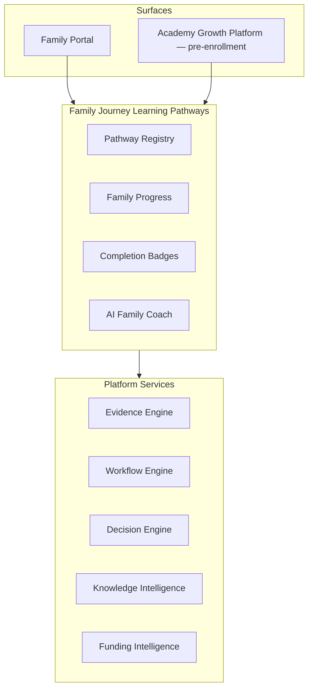

# DOCUMENT 8 — Family Journey™ Learning Pathways

**Project:** The Academy Way Learning System™ — Phase 2  
**Status:** Implementation Blueprint — Family Learning Architecture  
**Extends:** Part V Family Journey™ · Part VI-F.16 Family Engagement · Part VI-D Neurodiverse Profiles · Document 1

---

## 1. Charter

**Families become learners too.**

Family Journey™ extends beyond operational portal access to **personalized Family Learning Pathways** — equipping guardians with knowledge, skills, and resources to support their child's Personal Academic Journey™ at home and in the community.

**Constitutional principles:**
- Plain language — skill and strength framing, not diagnostic identity
- Understanding profiles (dyslexia, ADHD, etc.) as **learning information**, not labels
- AI coaches; parents decide
- All progress contributes to Family Engagement evidence (VI-F.16) → KEE

---

## 2. Architecture

**Registry key:** `family_journey_pathway_registry`

---

## 3. Personalized Family Journey

### 3.1 Family Journey Record

| Field | Description |
|-------|-------------|
| `family_journey_id` | UUID |
| `household_id` | Household |
| `guardian_id` | Primary learner (parent) |
| `linked_student_ids[]` | Children |
| `active_pathways[]` | Enrolled pathway keys |
| `completed_pathways[]` | With completion dates |
| `badges[]` | Earned badge keys |
| `journey_started_at` | Timestamp |

### 3.2 Personalization Inputs

| Input | Source |
|-------|--------|
| Student PAJ domains | Learning Journey |
| Student supports | SSIS (operational) |
| Neurodiverse profile dimensions | VI-D (as learning info) |
| Family preferences | Household Profile (Part V) |
| Military / funding context | FIP, Family Profile |
| Parent-stated goals | Family Journey goals (VI-F.16) |

**Rule:** Personalization uses **observable learning needs and goals** — never "parent of dyslexic child" as identity headline.

---

## 4. Pathway Catalog

Each pathway defines: **learning objectives · resources · videos · activities · home practice · badges · progress · AI coaching**

---

### 4.1 Understanding Learning Differences Pathways

| Pathway Key | Title | Learning Objectives (Summary) |
|-------------|-------|------------------------------|
| `family.pathway.understand_dyslexia` | Understanding Dyslexia | Science of Reading basics; how to support decoding at home; when to celebrate effort |
| `family.pathway.understand_adhd` | Understanding ADHD | Attention patterns; structure strategies; positive behavior support |
| `family.pathway.understand_autism` | Understanding Autism | Communication preferences; sensory awareness; predictable routines |
| `family.pathway.understand_dysgraphia` | Understanding Dysgraphia | Writing supports; keyboard/alternatives; patience with output |
| `family.pathway.understand_dyscalculia` | Understanding Dyscalculia | Number sense supports; real-world math; reduce anxiety |
| `family.pathway.understand_dyspraxia` | Understanding Dyspraxia (DCD) | Motor coordination supports; OT partnership; adaptive strategies |

**Resources:** Org-approved Knowledge Center articles (AGP 4.5), VI-D plain-language summaries  
**Videos:** Orientation modules — org-produced, not proprietary Wilson footage  
**Activities:** Reflection prompts, observation guides  
**Home practice:** Structured support routines (not instruction replacement)  
**Badges:** `badge.family.understand_{profile}` on module completion  
**AI coaching:** Answer parent questions; suggest next module; FAQ → Knowledge Intelligence  

---

### 4.2 Structured Literacy & Wilson Home Pathways

| Pathway Key | Title |
|-------------|-------|
| `family.pathway.structured_literacy_home` | Structured Literacy at Home |
| `family.pathway.wilson_support_home` | Wilson Support at Home |

**Objectives:** Home vs school roles; practice logging; reading minutes; confidence building (VI-F.16)  
**Activities:** Home practice plans linked to student's PAJ; reading logs  
**Home practice:** Teacher-assigned plans — category-coded  
**Badges:** `badge.family.wilson_orientation`, `badge.family.home_practice_30d`  
**Integration:** Wilson Parent Portal (VI-F §8), practice logs → KEE  

---

### 4.3 Support & Life Skills Pathways

| Pathway Key | Title |
|-------------|-------|
| `family.pathway.behavior_support` | Behavior Support at Home |
| `family.pathway.executive_function` | Executive Function for Families |
| `family.pathway.home_organization` | Home Organization |
| `family.pathway.communication` | Family Communication |
| `family.pathway.homework_support` | Homework & Learning Support |
| `family.pathway.technology` | Technology at Home |
| `family.pathway.ai_for_parents` | AI for Parents |

**Objectives:** Consistent with Life Lab strands — family generalization layer  
**AI for Parents:** Ethical AI use, privacy, supporting (not doing) student work  

---

### 4.4 Funding & Opportunity Pathways

| Pathway Key | Title | Integration |
|-------------|-------|-------------|
| `family.pathway.scholarships` | Scholarships | FIP 5.5 |
| `family.pathway.esa` | ESA Programs | FIP state rule packs |
| `family.pathway.state_funding` | State Funding | FIP |
| `family.pathway.military_resources` | Military Resources | EFMP, relocation (FIP, EIP 8.5) |

**Objectives:** Eligibility awareness, application readiness, document collection  
**Activities:** Checklists, deadline trackers  
**AI coaching:** Funding opportunity explanation — not legal advice  

---

### 4.5 Transition & Planning Pathways

| Pathway Key | Title |
|-------------|-------|
| `family.pathway.transition_planning` | Transition Planning |
| `family.pathway.college_planning` | College Planning |
| `family.pathway.career_planning` | Career Planning |
| `family.pathway.community_resources` | Community Resources |
| `family.pathway.financial_planning` | Financial Planning |
| `family.pathway.parent_wellness` | Parent Wellness |

**Objectives:** Align with Doc 7 professional/life readiness — family parallel journey  
**Integration:** Opportunity Engine (Doc 9), Graduation Readiness (Doc 7)  

---

## 5. Universal Pathway Schema

| Field | Type | Description |
|-------|------|-------------|
| `pathway_key` | string | Stable identifier |
| `title` | string | Display name |
| `description` | string | Plain language |
| `audience` | enum | `prospect`, `enrolled`, `all` |
| `learning_objectives[]` | object | `{ objectiveKey, text, measurable }` |
| `modules[]` | object | `{ moduleKey, title, sortOrder, objectives[] }` |
| `recommended_resources[]` | ref | Knowledge Center / FIP / org resources |
| `videos[]` | ref | Approved video keys |
| `activities[]` | object | `{ activityKey, instructions, durationMinutes }` |
| `home_practice[]` | ref | Linked to student PAJ where applicable |
| `completion_badges[]` | badge_key[] | |
| `progress_metrics[]` | metric_key[] | |
| `ai_coaching_enabled` | bool | |
| `estimated_hours` | number | |
| `prerequisites[]` | pathway_key[] | |

---

## 6. Progress Tracking

### 6.1 Family Pathway Progress Record

| Field | Description |
|-------|-------------|
| `progress_id` | UUID |
| `guardian_id` | Parent |
| `pathway_key` | Pathway |
| `modules_completed[]` | Module keys + timestamps |
| `activities_completed[]` | Activity evidence |
| `percent_complete` | Computed |
| `badges_earned[]` | |
| `last_activity_at` | |

### 6.2 Family Engagement Metrics (VI-F.16 Integration)

| Metric | Source |
|--------|--------|
| `wilson.family.orientation_completion` | Pathway modules |
| `wilson.family.parent_confidence` | Post-pathway survey |
| `wilson.family.practice_completion_rate` | Home practice logs |
| `family.journey.pathways_completed` | Count |

---

## 7. Completion Badges

| Badge Key | Criteria |
|-----------|----------|
| `badge.family.pathway_complete` | All modules in pathway |
| `badge.family.home_practice_streak_7` | 7-day practice log streak |
| `badge.family.funding_ready` | Funding pathway + document checklist |
| `badge.family.transition_ready` | Transition pathway complete |
| `badge.family.ai_literate_parent` | AI for Parents module set |

Badges visible in Family Portal; feed Family Engagement Score; **not** student-facing comparison.

---

## 8. AI Family Coach

| Capability | Rule |
|------------|------|
| Answer pathway questions | Knowledge Intelligence retrieval |
| Recommend next module | Based on progress + student PAJ |
| Explain student progress | Plain language from PAJ |
| Suggest home activities | From registry — not proprietary Wilson content |
| Funding guidance | FIP data — disclaim legal/financial advice |

**Governance:** Human-centered AI (Addendum No. 1); FERPA on student data in responses.

---

## 9. Parent Portal Experience

| Surface | Content |
|---------|---------|
| `/portal/family-journey` | Pathway catalog, personalized recommendations |
| `/portal/family-journey/{pathway}` | Module viewer, activities, progress |
| `/portal/family-journey/badges` | Earned badges |
| `/portal/learning` | Student PAJ view (Doc 1) — linked |
| `/portal/wilson` | Wilson home support (VI-F.16) |

---

## 10. Integration Map

| System | Role |
|--------|------|
| **Part V Family Journey** | Household, portal auth, profile |
| **VI-F.16** | Home practice, engagement metrics |
| **VI-D** | Profile understanding pathways |
| **FIP (5.5)** | Funding pathways |
| **Doc 9 Opportunity Engine** | Opportunity recommendations to family |
| **KEE** | Family activity evidence |
| **Knowledge Intelligence** | Articles, FAQ |

---

## 11. Roadmap Placement

| Component | Wave |
|-----------|------|
| Pathway registry + core modules | Wave 3 (with Family Journey completion) |
| Funding pathways | Wave 5.5 |
| AI Family Coach production | Wave 6+ |
| Military/transition depth | Wave 8.5 |

---

*End of Document 8 — Family Journey™ Learning Pathways*
