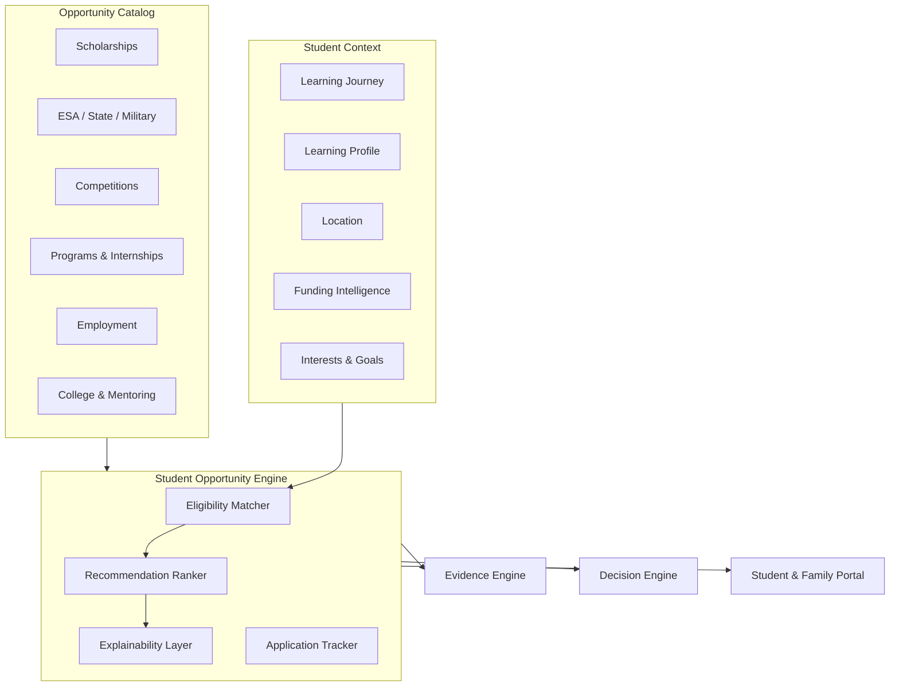

# DOCUMENT 9 — Student Opportunity Engine™

**Project:** The Academy Way Learning System™ — Phase 2  
**Status:** Implementation Blueprint — Opportunity Intelligence Architecture  
**Extends:** Funding Intelligence Platform (5.5) · Academy Growth Platform (4.5) · Part VI Student Success · Document 7 · Document 8

---

## 1. Charter

AcademyOS **continuously discovers and recommends opportunities** for every learner — scholarships, programs, competitions, internships, mentoring, and more — matched to **evidence-based student profiles**, not generic grade-level blasts.

The **Student Opportunity Engine™** is the learner-facing intelligence layer atop **Funding Intelligence Platform™** and external opportunity catalogs.

**Principles:**
- Opportunities matched to **strengths, interests, and eligibility** — not diagnoses
- Recommendations explainable with confidence bands
- Families and students review; no auto-applications without consent
- Every interaction → KEE evidence

---

## 2. Architecture



**Registry key:** `student_opportunity_catalog_registry`

---

## 3. Opportunity Categories

| Category | Examples |
|----------|----------|
| **Scholarships** | Private, foundation, institutional, merit, need-based |
| **ESA** | State education savings accounts |
| **State Funding** | Vouchers, categorical programs |
| **Military Funding** | DoD, EFMP-related, relocation programs |
| **Private Scholarships** | Org-specific, donor-funded |
| **Foundation Scholarships** | Community foundation awards |
| **Grants** | Research, program, project grants (student-eligible) |
| **Competitions** | Science fairs, academic competitions |
| **Science Fairs** | Regional, state, national |
| **Business Competitions** | Pitch, plan, venture competitions |
| **Pitch Competitions** | Startup pitch events |
| **Innovation Challenges** | STEM, entrepreneurship, AI ethics |
| **Leadership Programs** | Youth leadership, civic programs |
| **Volunteer Opportunities** | Community service, skill-building |
| **Internships** | Work-based learning placements |
| **Apprenticeships** | Trade and skilled pathways |
| **Summer Programs** | Academic, enrichment, pre-college |
| **Community Organizations** | Clubs, 4-H, scouting partnerships |
| **Employment** | Age-appropriate job opportunities |
| **College Programs** | Dual enrollment, early college, bridge |
| **Mentoring** | Mentor matching programs |
| **Research Opportunities** | ARI-linked student research (Wave 6.5) |

---

## 4. Opportunity Record Schema

| Field | Description |
|-------|-------------|
| `opportunity_id` | UUID |
| `opportunity_key` | Stable catalog key |
| `category` | From §3 |
| `title` | Display name |
| `description` | Plain language |
| `provider` | Organization name |
| `url` | Application/info link |
| `eligibility_rules` | Structured rule object (age, location, GPA alternative = mastery bands) |
| `deadline` | Application deadline |
| `award_amount` | Optional |
| `location_scope` | national, state, local, virtual |
| `state_codes[]` | If state-specific |
| `military_eligible` | Boolean |
| `age_min` / `age_max` | |
| `interest_tags[]` | Matching tags |
| `skill_tags[]` | Registry skill keys |
| `funding_source_ref` | Link to FIP registry if applicable |
| `status` | active, expired, archived |

---

## 5. Recommendation Intelligence Model

### 5.1 Matching Inputs

| Input | Source |
|-------|--------|
| **Age** | Student record |
| **Interests** | Student profile, Opportunity Engine preferences, Venture Lab focus |
| **Strengths** | PAJ mastery highlights — skill-based |
| **Assessment results** | KEE evidence — not single score identity |
| **Learning Journey** | PAJ domains, pathways, mastery velocity |
| **Location** | Address, state, military base |
| **Funding eligibility** | FIP eligibility matcher |
| **Military status** | Household profile |
| **Career goals** | Life Lab, Venture Lab, student goals |
| **College goals** | Transition planning |
| **Special interests** | Tags, portfolio themes |
| **Learning profile** | VI-A dimensions — supports matching, not labeling |

### 5.2 Matching Pipeline

```
Opportunity Catalog (filtered active + deadline)
  → Hard eligibility filter (age, location, military, funding)
  → Soft match scoring (interests, strengths, skills, goals)
  → Diversity injection (avoid filter bubble)
  → Rank by match_score × urgency (deadline proximity)
  → Explainability payload generation
  → Decision Engine recommendation record
  → Student/Family/Advisor review surfaces
```

### 5.3 Recommendation Record

| Field | Description |
|-------|-------------|
| `recommendation_id` | UUID |
| `student_id` | Student |
| `opportunity_id` | Opportunity |
| `match_score` | 0–100 |
| `confidence` | low / medium / high |
| `explanation` | Why matched — plain language |
| `eligibility_evidence[]` | Rule satisfaction details |
| `trade_offs` | e.g., deadline conflict with schedule |
| `alternatives[]` | Other ranked opportunities |
| `status` | pending, viewed, saved, applied, dismissed |
| `decided_by` | Student, guardian, advisor |

---

## 6. Continuous Discovery

| Source | Update Cadence |
|--------|----------------|
| FIP funding catalog | Real-time sync |
| AGP / external feeds | Integration Hub ingest |
| Manual curation | Opportunity admin |
| Legislative changes | EIP 8.5 → FIP → SOE |
| ARI research programs | Wave 6.5 |

**Automation:** Nightly opportunity refresh; deadline alerts via Automation Engine.

---

## 7. User Surfaces

### 7.1 Student Portal

| Surface | Content |
|---------|---------|
| **Opportunity Feed** | Personalized recommendations |
| **Saved Opportunities** | Bookmarked |
| **Application Tracker** | Status pipeline |
| **Competition Calendar** | Deadlines |
| **Match Explanation** | Why each opportunity fits |

### 7.2 Family Portal

Same feed with guardian view; application consent for minors; funding pathway integration (Doc 8).

### 7.3 Advisor / Teacher View

Recommend opportunities to student; track application support; link to PAJ strengths for recommendation letters (portfolio Doc 10).

### 7.4 Administrator

Opportunity catalog management; match quality analytics; provider partnership tracking.

---

## 8. Application Lifecycle

**Workflow key:** `student_opportunity_application`

```
Recommend → Save → Apply (external or in-platform)
  → Document collection (FIP integration)
  → Submission tracked
  → Outcome recorded (awarded/denied)
  → KEE evidence + Success metrics
```

**Outcome evidence** feeds Funding Intelligence and Graduation Readiness (scholarship secured indicator).

---

## 9. AI Recommendation Rules

| Rule Key | Purpose |
|----------|---------|
| `ai.opportunity.match` | Primary recommendation |
| `ai.opportunity.deadline_urgent` | Deadline within N days |
| `ai.opportunity.funding_align` | FIP eligibility match |
| `ai.opportunity.strength_highlight` | Match to mastery strengths |
| `ai.opportunity.gap_opportunity` | Growth area + enrichment program |

**No auto-apply.** Human consent required for applications sharing PII.

---

## 10. Integration Map

| System | Role |
|--------|------|
| **FIP (5.5)** | Funding opportunities, eligibility |
| **AGP (4.5)** | Pre-enrollment opportunity preview |
| **PAJ / Learning Registry** | Strength/skill matching |
| **Graduation Readiness (Doc 7)** | College/career readiness opportunities |
| **Family Journey (Doc 8)** | Parent funding pathways |
| **Digital Portfolio (Doc 10)** | Application artifacts |
| **KEE** | Application outcomes, evidence |
| **Decision Engine** | Recommendations |
| **EIP (8.5)** | New market program discovery |

---

## 11. Metrics

| Metric Key | Definition |
|------------|------------|
| `opportunity.recommendation.accept_rate` | Saved or applied / recommended |
| `opportunity.application.success_rate` | Awarded / applied |
| `opportunity.match_quality_score` | Post-hoc outcome correlation |
| `opportunity.deadline_miss_rate` | Missed deadlines / saved |

---

## 12. Roadmap Placement

| Component | Wave |
|-----------|------|
| Opportunity catalog + basic matching | Wave 5.5 (with FIP) |
| Student-facing feed | Wave 3–4 |
| AI ranking + explainability | Wave 6+ |
| Research opportunities | Wave 6.5 |
| External catalog integrations | Wave 8 Integration Hub |

---

*End of Document 9 — Student Opportunity Engine™*
