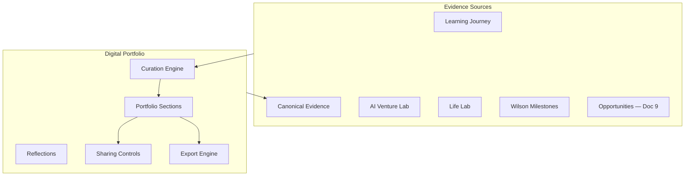

# DOCUMENT 10 — The Academy Way Digital Portfolio™

**Project:** The Academy Way Learning System™ — Phase 2  
**Status:** Implementation Blueprint — Portfolio Architecture  
**Extends:** Documents 1–9 · Part VIII KEE · Graduation Readiness (Doc 7) · Mastery Transcript (Doc 11)

---

## 1. Charter

Every Academy Way learner graduates with a **living Digital Portfolio™** — a curated, evidence-linked collection of mastery proof, projects, and growth narrative that replaces the traditional binder of grades with **demonstrated competency**.

The portfolio is **living** during enrollment and becomes a **portable graduate asset** — shareable with colleges, employers, military recruiters, and scholarship committees.

---

## 2. Architecture

**Artifact principle:** Portfolio items **reference** canonical KEE evidence — not duplicate storage.

---

## 3. Portfolio Record

| Field | Description |
|-------|-------------|
| `portfolio_id` | UUID |
| `student_id` | Owner |
| `status` | `active`, `graduate`, `archived` |
| `visibility_default` | private, school, public_link |
| `sections[]` | Section records |
| `last_curated_at` | Timestamp |
| `graduation_snapshot_id` | Frozen graduate version |

---

## 4. Portfolio Sections & Content Types

| Section Key | Content Types | Source Domains |
|-------------|---------------|----------------|
| `portfolio.projects` | Projects, capstones, MVPs | Venture Lab, Earthology, LitLab |
| `portfolio.presentations` | Slides, pitch decks, videos | Venture Lab, all domains |
| `portfolio.businesses` | Venture documentation, launch evidence | AI Venture Lab |
| `portfolio.ai_products` | AI product demos, ethics reviews | Venture Lab |
| `portfolio.writing` | Essays, reports, creative writing | LitLab, Structured Literacy |
| `portfolio.videos` | Presentations, demonstrations | All |
| `portfolio.photos` | Project photos, community service | Life Lab, community |
| `portfolio.research` | Inquiry projects, science fair | Earthology, ARI |
| `portfolio.community_service` | Service logs, impact evidence | Life Lab community strand |
| `portfolio.leadership` | Leadership project evidence | Life Lab, Venture Lab |
| `portfolio.internships` | Workplace evaluations, work samples | Life Lab employment, Opportunity Engine |
| `portfolio.employment` | Job evidence, references | Life Lab |
| `portfolio.wilson_milestones` | Step advancement summary, growth charts | Wilson Framework — framework metrics only |
| `portfolio.life_lab` | Living skills performance tasks | Life Lab |
| `portfolio.entrepreneurship` | Venture portfolio (Y1–Y4) | AI Venture Lab |
| `portfolio.certificates` | External certificates, awards | Opportunity Engine |
| `portfolio.awards` | Competitions, scholarships won | Opportunity Engine |
| `portfolio.recommendations` | Mentor/teacher recommendations | SSIS, advisors |
| `portfolio.reflections` | Student reflections by cycle/year | Student-authored |
| `portfolio.evidence_links` | Curated KEE evidence index | KEE |

---

## 5. Portfolio Item Schema

| Field | Description |
|-------|-------------|
| `item_id` | UUID |
| `portfolio_id` | Parent portfolio |
| `section_key` | From §4 |
| `title` | Display title |
| `description` | Student or teacher summary |
| `artifact_type` | project, video, document, link, evidence_ref |
| `evidence_id` | KEE canonical ref (preferred) |
| `media_refs[]` | Storage refs — permission-gated |
| `skill_keys[]` | Linked atomic skills |
| `competency_keys[]` | Linked competencies |
| `domain_keys[]` | Learning domains |
| `created_at` | |
| `featured` | Boolean — highlight for export |
| `visibility` | private, school, share_link |

---

## 6. Curation Engine

| Function | Description |
|----------|-------------|
| **Auto-suggest** | Promote recent mastery artifacts to portfolio |
| **Teacher nominate** | Teacher flags exemplary work |
| **Student curate** | Student selects featured items |
| **Graduation pack** | Auto-build graduation snapshot from Doc 7 requirements |
| **Quality check** | PII scan, permission validation before share |

**AI assist (Wave 6+):** Suggest organization, write reflection prompts — student edits required.

---

## 7. Reflections

| Type | When |
|------|------|
| **Cycle reflection** | End of each Learning Cycle |
| **Year reflection** | End of academic year |
| **Capstone reflection** | Venture Lab / Life Lab capstone |
| **Graduation reflection** | Senior synthesis |

Reflections are KEE evidence (`interaction.self_reflection`) linked to portfolio.

---

## 8. Evidence Links

Portfolio maintains an **Evidence Index** — navigable view of all KEE records linked to portfolio items and skills — supporting auditability for Graduation Readiness Engine and Mastery Transcript.

---

## 9. Portfolio Sharing

| Mode | Audience | Controls |
|------|----------|----------|
| **Private** | Student, teachers, parents | Default |
| **School** | Authorized staff | Permission-gated |
| **Share link** | External with token | Expiring URL, section-filtered |
| **College export** | Admissions offices | Doc 11 bundle |
| **Employer export** | Employers | Skills-focused subset |

**FERPA:** External sharing requires guardian consent for minors; audit logged in Activity Engine.

---

## 10. Export Formats

### 10.1 College Export

| Element | Format |
|---------|--------|
| Mastery Transcript summary (Doc 11) | PDF + structured data |
| Featured portfolio items | PDF portfolio |
| Growth narrative | AI-assisted, student-edited |
| Recommendations | Included with permission |
| Evidence appendix | Optional link index |

### 10.2 Employer Export

| Element | Format |
|---------|--------|
| Skills competency summary | 1-page PDF |
| Employment & internship section | Highlight reel |
| Venture evidence | If applicable |
| References | Contact-gated |

### 10.3 Military Recruiter Export

Configurable subset emphasizing discipline, leadership, fitness (from Life Lab health), technical skills — per org template.

### 10.4 Scholarship Committee Export

Mastery highlights + award evidence + financial need context (FIP) — consent-gated.

---

## 11. Dashboard Design

### 11.1 Student View

- Section gallery with featured items  
- Mastery-linked auto-suggestions  
- Reflection journal  
- Share link manager  
- Export wizard  

### 11.2 Teacher View

- Nominate artifacts  
- Review student curation  
- Verify evidence linkage  

### 11.3 Parent View

- Celebrate portfolio growth  
- Consent for external sharing  

### 11.4 Graduation Readiness Integration (Doc 7)

Portfolio checklist widget on Graduate Readiness Dashboard — required artifacts per readiness domain.

---

## 12. Integration Map

| System | Role |
|--------|------|
| **KEE** | Canonical evidence source |
| **PAJ** | Skill/competency linkage |
| **Venture Lab / Life Lab** | Primary project sources |
| **Wilson Framework** | Milestone summaries |
| **Opportunity Engine** | Certificates, awards |
| **Graduation Readiness** | Required artifact verification |
| **Mastery Transcript** | Portfolio highlights section |
| **Family Journey** | Parent view |

---

## 13. Roadmap Placement

| Component | Wave |
|-----------|------|
| Portfolio record + KEE linkage | Wave 3 |
| Section curation UI | Wave 3 |
| Graduation snapshot | Wave 3 + Doc 7 |
| Export engines | Wave 4–6 |
| AI curation assist | Wave 6+ |

---

*End of Document 10 — Digital Portfolio™*
