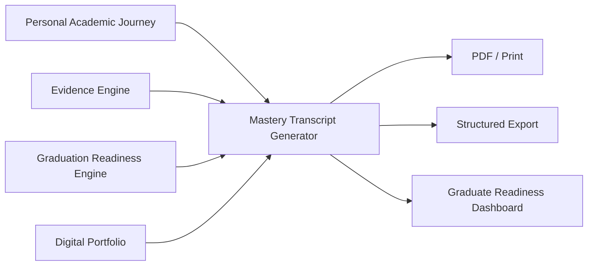

# DOCUMENT 11 — The Academy Way Mastery Transcript™

**Project:** The Academy Way Learning System™ — Phase 2  
**Status:** Implementation Blueprint — Transcript & Reporting Architecture  
**Extends:** Documents 1–10 · Part VI Student Success · Graduation Readiness Engine (Doc 7)

---

## 1. Charter

The **Mastery Transcript™** replaces traditional course-grade transcripts with **evidence-based competency reporting** — showing what a learner knows and can do, supported by verifiable evidence references.

It is the **official academic and readiness record** for Academy Way graduates — interpretable by colleges, employers, military recruiters, apprenticeship programs, and scholarship committees.

**Companion documents:** Digital Portfolio (Doc 10) provides rich artifacts; Mastery Transcript provides **structured competency certification**.

---

## 2. Design Principles

| Principle | Application |
|-----------|-------------|
| **Competency over courses** | Domains and competencies, not course titles and letter grades |
| **Evidence-backed** | Every mastery claim links to KEE evidence IDs |
| **Multi-dimensional** | Academic + life + technology + professional readiness |
| **Growth visible** | Timeline shows progression, not just final state |
| **Externally interpretable** | Include reader's guide for each audience |
| **Dual reporting** | Mastery transcript primary; credit mapping available for compliance (Configuration Studio) |

---

## 3. Transcript Architecture



**Record key:** `mastery_transcript_record`

---

## 4. Transcript Sections

### 4.1 Header & Student Identity

| Field | Content |
|-------|---------|
| Student name, ID | Standard |
| Organization / campus | |
| Program track | Academy Virtual, Academy HS |
| Enrollment period | |
| Graduation date | Readiness-based decision date |
| Transcript version | Semantic version |
| Verification | Digital signature / QR to verify |

---

### 4.2 Academic Mastery

| Domain | Reported Elements |
|--------|-----------------|
| **Wilson Progress** | Current Step band, exit status, growth velocity, fidelity summary — framework metrics only |
| **Literacy (LitLab)** | Strand mastery summary |
| **Real-Life Math** | Competency mastery by strand |
| **Earthology** | Science inquiry competencies |
| **Structured Literacy** | Integrated with Wilson section |

**Format per competency:**
```
Competency: [Name]
Mastery Level: Proficient (L3) | Advanced (L4)
Mastery Date: [Date]
Evidence References: [KEE IDs — count]
```

---

### 4.3 High School Domain Mastery

| Domain | Content |
|--------|---------|
| **Life Lab** | 14 strand summary — proficiency counts |
| **AI Venture Lab** | 8 strand summary; capstone status |

---

### 4.4 Cross-Cutting Competencies

| Area | Source |
|------|--------|
| **Executive Function** | Life Lab strand + cross-domain evidence |
| **Communication** | LitLab + Life Lab |
| **Leadership** | Life Lab + Venture Lab |
| **Financial Literacy** | Life Lab |
| **Career Readiness** | Life Lab + Opportunity Engine outcomes |
| **Entrepreneurship** | Venture Lab (if enrolled) |
| **AI Literacy** | Venture Lab technology strand |

---

### 4.5 Portfolio Highlights

Curated featured items from Digital Portfolio (Doc 10) — titles and evidence refs, not full media embed in PDF.

---

### 4.6 Growth Timeline

Chronological visualization:
- Placement dates per domain  
- Major competency mastery milestones  
- Wilson Step advancements  
- Capstone completions  
- Notable opportunities (awards, internships)  

---

### 4.7 Evidence References

| Element | Description |
|---------|-------------|
| **Evidence index** | Numbered list of KEE evidence IDs with type, date, skill |
| **Verification URL** | Authenticated link for institutions (permission workflow) |
| **Aggregate stats** | Total evidence items, domains mastered, readiness score |

---

### 4.8 Graduate Readiness Dashboard Summary

Embedded summary from Doc 7:
- Graduation Readiness Score at graduation  
- Domain readiness checklist (all required: met)  
- Graduation committee approval ref  

---

## 5. Mastery Transcript Record Schema

| Field | Description |
|-------|-------------|
| `transcript_id` | UUID |
| `student_id` | Student |
| `generated_at` | Timestamp |
| `graduation_decision_id` | Workflow ref |
| `academic_mastery` | JSONB domain summaries |
| `life_mastery` | JSONB |
| `technology_mastery` | JSONB |
| `professional_mastery` | JSONB |
| `portfolio_highlights[]` | Item refs |
| `growth_timeline[]` | Milestone events |
| `evidence_index[]` | KEE refs |
| `grs_at_graduation` | Score snapshot |
| `readers_guide_included` | Boolean |
| `credit_mapping_appendix` | Optional compliance mapping |
| `status` | draft, official, amended |
| `amended_by` | If corrected — new version, lineage preserved |

---

## 6. Mastery Level Reporting Scale

| Level | Transcript Display |
|-------|-------------------|
| L3 Proficient | **Proficient** — meets success criteria |
| L4 Advanced | **Advanced** — exceeds criteria |
| L2 Developing | *Not listed on official transcript unless org opts in for growth reports* |
| L0–L1 | Not reported |

**Official transcript includes Proficient and Advanced only** for external distribution. Internal reports show full progression.

---

## 7. Reader's Guides (By Audience)

### 7.1 For Colleges & Universities

**How to interpret:**
- Mastery Transcript shows **demonstrated competencies** rather than GPA  
- **Wilson Progress** indicates structured literacy attainment on Science of Reading pathway  
- **Growth Timeline** shows multi-year trajectory — valuable for holistic admission  
- **Evidence References** available on request through verification portal  
- **Proficient** = met rigorous, evidence-based success criteria defined in public registry  
- **Concurrent domains** — student may be Advanced in one area, Proficient in another — reflects personalized pacing  

**What to ask for:** Portfolio export (Doc 10), verification link, recommendation letters

---

### 7.2 For Employers

**How to interpret:**
- **Life Lab** and **Venture Lab** sections demonstrate work-ready skills  
- **Employment** and **internship** evidence in portfolio — not just claims  
- **Executive Function** and **Self Management** indicate reliability indicators  
- **Entrepreneurship** section shows initiative and project completion  

**Best for:** Roles valuing demonstrated skills over degree pedigree

---

### 7.3 For Military Recruiters

**How to interpret:**
- **Leadership**, **community engagement**, **health & wellness** strands documented  
- **Self-advocacy** and **communication** competencies listed  
- **Growth Timeline** shows sustained commitment  
- Standard ASVAB/academic requirements mapped via Configuration Studio if required  

**Verification:** Official transcript + MEPS documentation as applicable

---

### 7.4 For Apprenticeship Programs

**How to interpret:**
- **Career readiness** and **employment** competencies align with trade entry  
- **Mathematics (Real-Life Math)** and **problem solving** documented  
- **Portfolio** may include relevant project evidence  

---

### 7.5 For Scholarship Committees

**How to interpret:**
- **Mastery Transcript** supplements — does not replace — application materials  
- **Wilson Progress** and **literacy mastery** relevant for academic scholarships  
- **Opportunity Engine** records show prior award history  
- **Financial need** from separate FIP process — not on transcript  
- **Evidence verification** available for top candidates  

---

## 8. Graduate Readiness Dashboard (Transcript Companion)

Interactive dashboard (not PDF) for students and institutions:

| Widget | Content |
|--------|---------|
| **Live GRS** | Pre-graduation tracking |
| **Domain drill-down** | Competency-level detail |
| **Evidence explorer** | Linked KEE records |
| **Compare to readiness thresholds** | Doc 7 domains |
| **Export center** | Transcript PDF, portfolio, verification link |

Post-graduation: frozen dashboard snapshot linked from transcript QR.

---

## 9. Compliance & Dual Reporting

| Requirement | Solution |
|-------------|----------|
| State requires credit hours | Configuration Studio `credit_mapping_appendix` — maps competencies → Carnegie units |
| State requires letter grades | Optional appendix — derived from mastery, not primary |
| Accreditation | Evidence sufficiency reports for accreditors |
| FERPA | Transcript access permission-gated |

**Primary record:** Mastery Transcript. Compliance mappings are **secondary appendices**, not dual primary systems.

---

## 10. Integration Map

| System | Role |
|--------|------|
| **PAJ + Learning Registry** | Competency source |
| **KEE** | Evidence index |
| **Graduation Readiness (Doc 7)** | GRS, approval workflow |
| **Digital Portfolio (Doc 10)** | Highlights |
| **Wilson Framework** | Literacy section |
| **Opportunity Engine** | Awards, programs |
| **Student Success** | Graduation lifecycle event |
| **Family Portal** | Parent view, share consent |

---

## 11. Events

| Event | Trigger |
|-------|---------|
| `learning.transcript.generated` | Transcript created |
| `learning.transcript.official` | Graduation approved |
| `learning.transcript.verified` | External verification accessed |
| `learning.transcript.amended` | Correction with lineage |

---

## 12. Roadmap Placement

| Component | Wave |
|-----------|------|
| Transcript generator (mastery data) | Wave 3 |
| Reader's guides + PDF template | Wave 3 |
| Verification portal | Wave 4 |
| Credit mapping appendix | Wave 5 Configuration Studio |
| External institution integrations | Wave 8+ |

---

*End of Document 11 — Mastery Transcript™*
