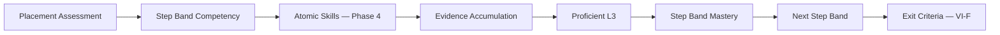

# DOCUMENT 13 — Structured Literacy (Wilson) Registry

**Project:** The Academy Way Learning System™ — Phase 3  
**Domain Key:** `domain.structured_literacy`  
**Status:** Registry Architecture Only — No Wilson Copyrighted Content  
**Constitutional alignment:** Part VI-F Wilson Framework™

---

## 1. Charter

This document defines the **registry architecture** for the Structured Literacy domain — the Academy Way implementation aligned with **Wilson Reading System** as exclusive curriculum (Part VI-F).

**Explicit exclusions:**
- No Wilson lesson content, manuals, worksheets, or proprietary sequences
- No reproduction of Wilson Language Training materials
- **Category mapping and Step band architecture only**

---

## 2. Registry Position in ULR

```
domain.structured_literacy
    └── [Strands — §3]
            └── [Sub-Strands — §4]
                    └── [Competencies — §5]
                            └── [Atomic Skills — Phase 4 only]
```

**Domain code:** `SL`  
**Skill ID prefix:** `AW-SL-{sub_strand}-{skill}`

---

## 3. Strand Architecture

| Strand Key | Name | Purpose |
|------------|------|---------|
| `domain.structured_literacy.strand.phonological_awareness` | Phonological Awareness | Sound structure of language |
| `domain.structured_literacy.strand.phonemic_awareness` | Phonemic Awareness | Phoneme-level manipulation |
| `domain.structured_literacy.strand.alphabetic_principle` | Alphabetic Principle | Sound-symbol correspondence |
| `domain.structured_literacy.strand.decoding` | Decoding | Word reading accuracy |
| `domain.structured_literacy.strand.encoding` | Encoding & Spelling | Spelling and written encoding |
| `domain.structured_literacy.strand.orthographic_mapping` | Orthographic Mapping | Sight word storage |
| `domain.structured_literacy.strand.morphology` | Morphology | Prefixes, suffixes, roots |
| `domain.structured_literacy.strand.fluency` | Fluency | Accurate, automatic, expressive reading |
| `domain.structured_literacy.strand.vocabulary` | Vocabulary | Word meaning and usage |
| `domain.structured_literacy.strand.comprehension` | Comprehension | Text understanding |
| `domain.structured_literacy.strand.writing_connections` | Writing Connections | Literacy writing integration |
| `domain.structured_literacy.strand.wrs_progression` | WRS Step Progression | Framework Step bands |
| `domain.structured_literacy.strand.og_principles` | Orton-Gillingham Principles | Multisensory structured literacy practices |

---

## 4. Sub-Strand Architecture (Pattern)

Each strand contains **2–5 sub-strands** organized by skill progression level — not by proprietary lesson number.

**Example pattern (Decoding strand — structure only):**

| Sub-Strand Key | Name | Scope |
|----------------|------|-------|
| `...decoding.closed_syllables` | Closed Syllable Patterns | Category |
| `...decoding.vowel_consonant_e` | VCE Patterns | Category |
| `...decoding.vowel_teams` | Vowel Team Patterns | Category |
| `...decoding.multisyllabic` | Multisyllabic Decoding | Category |

*Phase 4 populates atomic skills within sub-strands.*

---

## 5. Wilson Step Mapping (Framework Only)

### 5.1 Mapping Model

Wilson Steps map to **competency bands** in `wrs_progression` strand — not to proprietary lesson IDs.

| Registry Concept | Wilson Framework Concept |
|------------------|-------------------------|
| Competency band | Step N mastery band |
| Atomic skills | Skill categories within Step |
| Crosswalk field | `{ wilsonStep, substepBand, skillCategory }` |

### 5.2 Step Band Competency Pattern

```
domain.structured_literacy.strand.wrs_progression
    └── sub_strand.step_{N}
            └── competency.step_{N}_mastery_band
                    └── atomic_skills[] (Phase 4)
```

**Alignment with existing codebase:** `structured_literacy_progress` (levels 1–5, steps 1–10) maps via Configuration Studio crosswalk to ULR Step bands — not replaced ad hoc.

### 5.3 Wilson Category Mapping

| Category Key | Description | Strand Alignment |
|--------------|-------------|------------------|
| `wilson.cat.phoneme_segmentation` | Phoneme tasks | Phonemic awareness |
| `wilson.cat.blending` | Blending | Decoding / PA |
| `wilson.cat.dictation` | Dictation patterns | Encoding |
| `wilson.cat.syllable_types` | Six syllable types | Decoding |
| `wilson.cat.high_frequency` | HF word categories | Orthographic mapping |
| `wilson.cat.morpheme_units` | Morpheme categories | Morphology |
| `wilson.cat.controlled_text` | Controlled reading level band | Fluency / comprehension |

**Rule:** Categories are **Academy Way definitions** — not Wilson trademarked lesson labels.

---

## 6. Orton-Gillingham Principles Strand

Sub-strands reflect **instructional principles** — observable in fidelity monitoring (VI-F.14):

| Sub-Strand | Principle |
|------------|-----------|
| `og.multisensory` | Visual-auditory-kinesthetic integration |
| `og.systematic` | Explicit sequence adherence |
| `og.cumulative` | Review and spiral |
| `og.diagnostic` | Responsive teaching based on evidence |
| `og.direct` | Explicit instruction indicators |

Competencies measure **teacher fidelity and student response** — not proprietary OG materials.

---

## 7. Competency Structure (Per Sub-Strand)

Each competency includes standard ULR fields (Doc 12) plus:

| SL-Specific Field | Description |
|-------------------|-------------|
| `wilson_crosswalk` | Optional Step/category mapping |
| `fidelity_indicator_keys[]` | Links to VI-F.14 fidelity rubric |
| `dosage_minutes_week` | From VI-F.15 |
| `group_size_min` | Academy Way: 2 |

---

## 8. Evidence Architecture

| Evidence Type | Use |
|---------------|-----|
| `observation.instructional` | Teacher observation during WRS session |
| `measurement.progress` | CBM probes, step checks |
| `measurement.assessment` | Placement, retention probes |
| `artifact.product` | Spelling samples, reading recordings |

**KEE linkage:** All Wilson session evidence → `skill_keys[]` + `evidence.source.wilson.session`

**Parent evidence:** Home practice logs (VI-F.16) → linked skills in encoding/fluency sub-strands

---

## 9. Progress Monitoring Architecture

| Monitor Type | Registry Integration |
|--------------|---------------------|
| **Step mastery check** | Competency band assessment method |
| **ORF probe** | Fluency strand skills |
| **Spelling probe** | Encoding strand skills |
| **Retention probe** | Post-exit competency (VI-F.16 LTM) |
| **Dosage tracking** | Domain metric — not skill-level |

Progress monitoring **feeds mastery recalculation** — not separate progress store.

---

## 10. Assessment Integration

| Assessment Method Key | Purpose | Maps To |
|----------------------|---------|---------|
| `assess.wilson.placement` | Initial placement | Step band competency |
| `assess.wilson.step_check` | Step readiness | wrs_progression |
| `assess.orf` | Oral reading fluency | fluency strand |
| `assess.spelling_probe` | Encoding | encoding strand |
| `assess.retention` | Post-exit | wrs_progression exit competency |

Universal Assessment Framework (constitution) registers methods — ULR references keys.

---

## 11. Teacher Observation Framework

| Component | Description |
|-----------|-------------|
| **Observation rubric refs** | Per competency — linked to fidelity strand |
| **Look-fors** | `observation_indicators` on atomic skills (Phase 4) |
| **Common errors** | `common_error_patterns` — category-coded |
| **Session link** | Teacher workspace captures observation → KEE |

Not a separate observation system — extends ULR observation fields.

---

## 12. AI Recommendation Framework

| Rule Key | Trigger | Output |
|----------|---------|--------|
| `ai.wilson.next_skill` | Prerequisite skills L3 | Next atomic skill |
| `ai.wilson.step_advancement` | Step band competencies L3 + fidelity | Step advancement recommendation |
| `ai.wilson.dosage_recovery` | Dosage deficit (VI-F.15) | Schedule adjustment |
| `ai.wilson.regression` | Level decrease | Re-teach recommendation |
| `ai.wilson.grouping` | Placement band | Group composition suggestion |

All via Decision Engine — explainability required. **No auto Step advancement.**

---

## 13. Student Mastery Progression Model



**Independence:** SL domain mastery on PAJ independent of math/life lab domains.

---

## 14. Scheduling Considerations (Domain Defaults)

| Parameter | Value |
|-----------|-------|
| Min group size | 2 |
| Virtual session | Hour start, :50 end |
| Dosage | Per VI-F.15 org config |
| Certified teacher | Required — hard constraint |
| Readiness | Learning Readiness Intel (VII-E §16.3) |

---

## 15. Phase 4 Boundary

Phase 4 will populate atomic skills within this architecture — estimated **400–600 skills** across strands (not enumerated here).

Phase 3 delivers: strands, sub-strand patterns, competency templates, crosswalk schema, integration contracts.

---

*End of Document 13 — Structured Literacy (Wilson) Registry*
