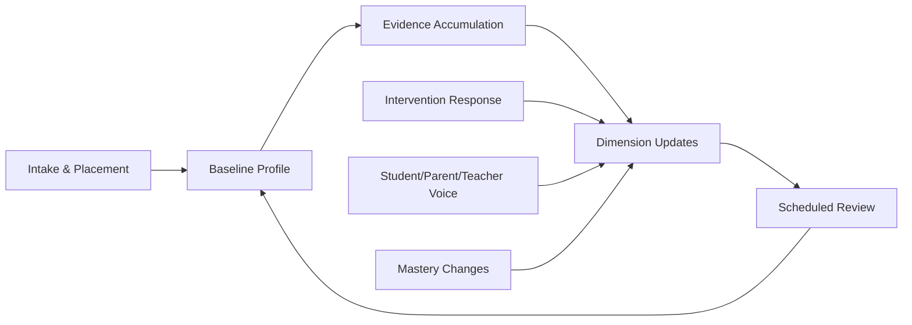

# DOCUMENT 19 — Learning Profile Framework™

**Project:** The Academy Way Learning System™ — Phase 3.5  
**Status:** Implementation Blueprint — Learner Profile Architecture Only  
**Constitutional alignment:** Part VI-D Neurodiverse Learning Profiles™  
**Feeds:** Documents 18, 20, 21, 22, 23; ULR accommodation fields (Doc 12)

---

## 1. Charter

The **Learning Profile Framework™** defines the **complete learner profile** — a living, evidence-informed representation of how each student learns, what they need, and who they are as a learner.

**Profiles are not diagnoses.** Diagnostic information is **evidence**, not identity (Constitution TAW-2).

Profiles inform instruction, scheduling, intervention, and AI — they do **not** gate opportunity or lower expectations without evidence.

---

## 2. Profile Architecture

```
Learning Profile
    ├── Academic Profile
    ├── Cognitive & Processing
    ├── Executive Function & Attention
    ├── Communication & Language
    ├── Sensory & Motor
    ├── Social-Emotional & Motivation
    ├── Interests & Goals
    ├── Strengths & Barriers
    ├── Supports & Accommodations
    ├── Voice (Student / Parent / Teacher)
    └── Profile Metadata (evidence, confidence, history)
```

**One profile per learner on PAJ.** Family members on Family Journey have separate profiles when enrolled as learners (Doc 8).

---

## 3. Profile Dimensions

### 3.1 Academic Profile

| Field | Description | Source |
|-------|-------------|--------|
| `domain_placement[]` | Entry band per learning domain | Placement assessments, transfer records |
| `domain_mastery_summary[]` | Current mastery distribution | PAJ computed from KEE |
| `acceleration_flags[]` | Domains eligible for acceleration protocol | Evidence + educator confirmation |
| `learning_velocity_trend` | Ref Doc 23 | Analytics |
| `prior_schooling_context` | Transfer narrative | Admissions, records |

### 3.2 Learning Preferences

| Field | Description | Source |
|-------|-------------|--------|
| `modality_preference` | Visual, auditory, kinesthetic, multimodal | Observation, student voice |
| `structure_preference` | High structure ↔ open exploration | Student voice, teacher observation |
| `pacing_preference` | Faster/slower within mastery bounds | Evidence trends |
| `group_preference` | Solo, pair, small group, large group | Student voice, observation |
| `feedback_preference` | Immediate/delayed; written/verbal | Student voice |

**Note:** Preferences inform differentiation — they do not replace mastery requirements.

### 3.3 Processing Speed

| Field | Description | Source |
|-------|-------------|--------|
| `relative_processing_speed` | Qualitative band: typical, slower, faster | Timed tasks, observation — not IQ proxy |
| `processing_speed_contexts[]` | Domains where speed varies | Cross-domain evidence |
| `time_extension_eligible` | bool + rationale | Assessment framework (Doc 21) |

### 3.4 Working Memory

| Field | Description | Source |
|-------|-------------|--------|
| `working_memory_demand_tolerance` | Low / moderate / high task length before breakdown | Instructional observation |
| `chunking_effective` | bool | Intervention response |
| `external_memory_tools_used[]` | Checklists, visual schedules, etc. | Accommodations |

### 3.5 Executive Function

| Field | Description | Source |
|-------|-------------|--------|
| `planning` | Qualitative band + evidence notes | Observation, EF rubrics |
| `organization` | Qualitative band | Portfolio, workspace observation |
| `task_initiation` | Qualitative band | Session start patterns |
| `cognitive_flexibility` | Qualitative band | Transition response |
| `impulse_control` | Qualitative band | Behavior observation — not moral judgment |
| `self_monitoring` | Qualitative band | Reflection quality, self-assessment |

**ULR link:** Skills declare `executive_function_demands` — profile informs match.

### 3.6 Attention

| Field | Description | Source |
|-------|-------------|--------|
| `sustained_attention_band` | Session-length guidance | Observation |
| `selective_attention_notes` | Distraction triggers (environmental) | Teacher, parent voice |
| `attention_variability` | Time-of-day, context patterns | Scheduling Intelligence input |
| `break_frequency_recommendation` | Minutes between breaks | Profile + SIE |

### 3.7 Language

| Field | Description | Source |
|-------|-------------|--------|
| `primary_language` | Home/academic language | Intake |
| `additional_languages[]` | Multilingual profile | Intake, student voice |
| ` receptive_language_notes` | Comprehension of complex instruction | Observation |
| `expressive_language_notes` | Oral/written expression patterns | LitLab evidence |
| `wilson_language_path` | If applicable — SL placement | Doc 13 |

### 3.8 Motor

| Field | Description | Source |
|-------|-------------|--------|
| `fine_motor_notes` | Writing, manipulation | Observation |
| `gross_motor_notes` | Movement, PE, field activities | Observation |
| `assistive_motor_tools[]` | Adaptive tools | Accommodations |

### 3.9 Communication

| Field | Description | Source |
|-------|-------------|--------|
| `communication_mode[]` | Verbal, AAC, written primary, etc. | Student, parent, team |
| `social_communication_notes` | Peer interaction patterns | Observation — strengths-based |
| `preferred_communication_with_teacher` | Conference, async, visual | Student voice |

### 3.10 Sensory

| Field | Description | Source |
|-------|-------------|--------|
| `sensory_sensitivities[]` | Light, sound, texture, etc. | Parent, student voice |
| `sensory_seeking[]` | Movement, pressure, etc. | Observation |
| `environmental_modifications[]` | Seating, noise reduction, etc. | Accommodations |

### 3.11 Behavior

| Field | Description | Source |
|-------|-------------|--------|
| `behavior_patterns[]` | **Functional description** — antecedent, behavior, consequence pattern | FBA-style evidence, not label |
| `regulation_strategies_effective[]` | What works | Team observation |
| `behavior_support_plan_ref` | If formal plan exists | Document link |

**Rule:** Behavior fields describe **support needs**, not character.

### 3.12 Motivation

| Field | Description | Source |
|-------|-------------|--------|
| `intrinsic_interests[]` | Topics, activities that energize | Student voice, observation |
| `motivation_triggers[]` | Autonomy, mastery, purpose, connection | Observation |
| `motivation_barriers[]` | Anxiety, past experience, mismatch | Student voice, teacher |
| `engagement_trend` | Ref Doc 23 | Analytics |

### 3.13 Confidence

| Field | Description | Source |
|-------|-------------|--------|
| `domain_confidence[]` | Self-reported per domain | Student voice, surveys |
| `confidence_evidence_gap[]` | Where confidence exceeds or lags mastery | Analytics compare |
| `growth_mindset_indicators` | Qualitative | Reflection, observation |

### 3.14 Interests

| Field | Description | Source |
|-------|-------------|--------|
| `academic_interests[]` | Domains, topics | Student voice |
| `extracurricular_interests[]` | Hobbies, sports, arts | Student voice |
| `venture_interests[]` | Business/AI interests | Venture Lab intake |
| `opportunity_match_tags[]` | For Opportunity Engine (Doc 9) | Derived |

### 3.15 Career Goals

| Field | Description | Source |
|-------|-------------|--------|
| `stated_career_interests[]` | Age-appropriate aspirations | Student voice |
| `career_exploration_activities[]` | Job shadow, mentorship refs | Opportunity Engine |
| `readiness_career_domain` | Ref Doc 7 | Graduation Readiness |

### 3.16 Learning Strengths

| Field | Description | Source |
|-------|-------------|--------|
| `strength_domains[]` | Domains at L3+ or notable gifts | Mastery + observation |
| `strength_skills[]` | Specific skill_ids | PAJ |
| `strength_narrative` | Student/teacher described | Voice fields |
| `acceleration_candidates[]` | Skills eligible for enrichment | Evidence |

### 3.17 Learning Barriers

| Field | Description | Source |
|-------|-------------|--------|
| `barrier_domains[]` | Domains with persistent struggle | Evidence trends |
| `barrier_skill_patterns[]` | Prerequisite gaps, error patterns | KEE analysis |
| `barrier_contextual[]` | Environmental, temporal — not fixed trait | Observation |
| `intervention_history_summary` | Ref Doc 20 | Intervention records |

**Rule:** Barriers are **hypotheses to address**, not ceilings.

### 3.18 Accommodations

| Field | Description | Source |
|-------|-------------|--------|
| `accommodation_list[]` | `{ accommodation, domain_scope, evidence_basis, review_date }` | Team decision |
| `accommodation_effectiveness[]` | What is working | Progress monitoring |
| `legal_document_refs[]` | IEP/504 if applicable — stored securely | Compliance |

### 3.19 Technology Supports

| Field | Description | Source |
|-------|-------------|--------|
| `assistive_technology[]` | Text-to-speech, speech-to-text, etc. | Accommodations |
| `learning_platform_preferences[]` | Device, interface needs | Student, parent |
| `ai_tool_access_level` | Age/policy-gated | Org policy + ethics (Doc 17) |

### 3.20 AI Support Preferences

| Field | Description | Source |
|-------|-------------|--------|
| `ai_assistance_opt_in` | Student/parent consent band | Consent records |
| `ai_feedback_preference` | Draft feedback yes/no | Student voice |
| `ai_practice_preference` | Adaptive drill yes/no | Student voice |
| `ai_explanation_preference` | Alternative explanations | Student voice |

**Rule:** AI preferences respected within safety and mastery evidence requirements.

---

## 4. Voice Dimensions

### 4.1 Student Voice

| Field | Description |
|-------|-------------|
| `what_helps_me_learn` | Free text / structured prompts |
| `what_is_hard` | Free text |
| `goals_i_set` | Student-authored goals |
| `feedback_on_instruction` | Periodic pulse |
| `preferred_adult_allies[]` | Trusted staff |

**Captured:** Onboarding, cycle reflections, ad-hoc — timestamped in KEE.

### 4.2 Parent Voice

| Field | Description |
|-------|-------------|
| `home_observations` | Learning at home |
| `concerns_and_hopes` | Aspirations — not demands for lowering bar |
| `home_practice_capacity` | Time, resources for Doc 20 home practice |
| `cultural_context` | Strengths-based family context |

**Family Journey:** Parents as learners have their own voice fields (Doc 8).

### 4.3 Teacher Voice

| Field | Description |
|-------|-------------|
| `instructional_observations` | Qualitative notes linked to evidence |
| `recommended_strategies[]` | Instructional model recommendations |
| `watch_items[]` | Monitor without alarm |
| `celebration_notes[]` | Strengths to amplify |

**Rule:** Teacher voice informs — does not override evidence for mastery.

---

## 5. Profile Metadata

| Field | Description |
|-------|-------------|
| `profile_version` | Increments on material update |
| `last_review_date` | Scheduled team review |
| `confidence_score` | Data completeness + evidence quality (Doc 23) |
| `evidence_sources[]` | What backs each dimension |
| `contributor_roles[]` | Who added what — audit trail |

---

## 6. Profile Evolution Over Time



### 6.1 Evolution Rules

| Trigger | Profile Response |
|---------|------------------|
| **New placement evidence** | Update academic profile; may shift domain_placement |
| **Mastery L3 on skill** | Update mastery summary; may remove barrier hypothesis |
| **Intervention exit** | Update barriers; archive intervention summary |
| **Student voice submission** | Append to voice fields; flag for review if conflict |
| **Accommodation review date** | Prompt team review — effectiveness data attached |
| **Annual comprehensive review** | Full dimension audit; deprecate stale observations |
| **Diagnostic new information** | Added as evidence — **not** profile label replacement |

### 6.2 What Changes vs. Persists

| Persists | Changes with Evidence |
|----------|----------------------|
| Student voice history (append-only) | Domain mastery summary |
| Audit trail | Barrier hypotheses |
| Consent records | Accommodation effectiveness |
| Career interests (updated by student) | Processing speed band (if new data) |
| Strengths (accumulate) | Engagement/confidence trends |

### 6.3 Profile Confidence

Low-confidence dimensions (single source, stale date) trigger:
- Dashboard indicator for educators
- AI recommendations marked lower prediction confidence (Doc 23)
- No automatic scheduling constraints from low-confidence fields alone

---

## 7. Consumer Integration

| Consumer | Profile Use |
|----------|-------------|
| **Instructional Framework (Doc 18)** | Model selection, differentiation |
| **Intervention Framework (Doc 20)** | Tier assignment, practice plans |
| **Assessment Framework (Doc 21)** | Accommodations, scheduling |
| **Instructional Playbook (Doc 22)** | Differentiation, EF supports |
| **Learning Analytics (Doc 23)** | Confidence gaps, trend context |
| **Scheduling Intelligence** | Attention variability, break frequency, group preference |
| **ULR** | `accommodation_considerations` personalization |
| **PAJ** | Pathway emphasis from interests/goals |
| **Opportunity Engine** | Interest/career matching |
| **Graduation Readiness** | Holistic readiness — not profile label |

---

## 8. Governance

| Rule | Requirement |
|------|-------------|
| **LPF-1** | No profile dimension used to deny access without evidence trail |
| **LPF-2** | Diagnoses stored as evidence artifacts — not profile title |
| **LPF-3** | Student voice required at least once per Learning Cycle |
| **LPF-4** | Parent voice optional but invited — not authoritative over mastery |
| **LPF-5** | Profile export for transitions includes strengths-first narrative |
| **LPF-6** | All profile changes auditable in KEE |

---

*End of Document 19 — Learning Profile Framework™*
