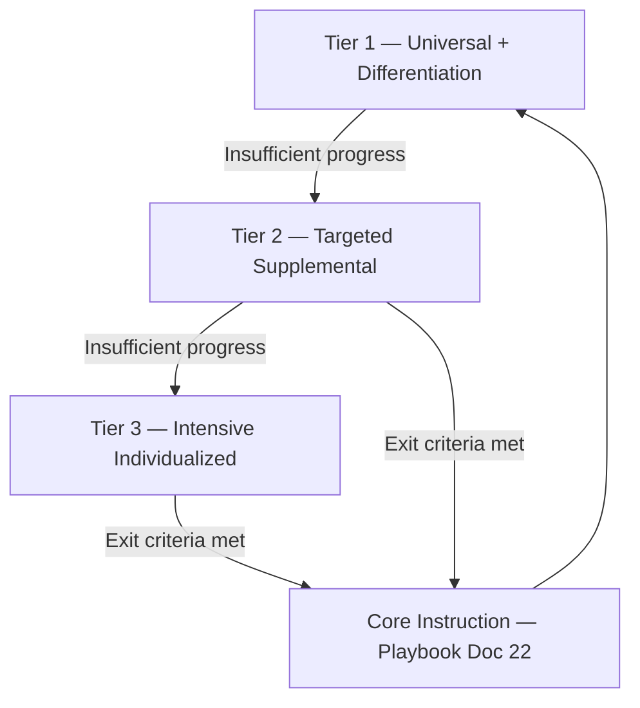

# DOCUMENT 20 — Intervention Framework™

**Project:** The Academy Way Learning System™ — Phase 3.5  
**Status:** Implementation Blueprint — Intervention Architecture Only  
**Integrates:** Documents 6, 18, 19, 21, 23; ULR `intervention_strategies[]` (Doc 12)

---

## 1. Charter

The **Intervention Framework™** defines the **universal intervention architecture** for AcademyOS — how the system responds when learners need acceleration, remediation, or intensive support.

**Intervention is evidence-driven, tiered, and temporary** unless chronic support is documented and reviewed.

Intervention produces **evidence** → KEE → mastery recalculation. It is not a separate progress silo.

---

## 2. Design Principles

| Principle | Statement |
|-----------|-----------|
| **Mastery goal** | All intervention targets defined ULR skills toward L3 |
| **Least restrictive** | Start Tier 1 before Tier 3 |
| **Profile-informed** | Document 19 dimensions guide intensity — not label |
| **Fidelity** | Wilson interventions follow VI-F protocols |
| **Exit by evidence** | Criteria met → intervention ends |
| **Human decision** | AI recommends; educators authorize |

---

## 3. Tiered Supports Architecture



### 3.1 Tier Definitions

| Tier | Name | Intensity | Typical Duration | Who Delivers |
|------|------|-----------|------------------|--------------|
| **1** | Universal + Differentiation | In-class adjustments | Ongoing | Classroom teacher |
| **2** | Targeted Supplemental | Additional practice/coaching | 4–12 weeks | Teacher, specialist, parent coach |
| **3** | Intensive Individualized | 1:1 or very small group daily | 8–20 weeks | Certified specialist, tutor |

### 3.2 Tier Entry Triggers

| Signal | Typical Tier |
|--------|--------------|
| Single skill below L2 after 2+ evidence cycles | Tier 1 boost |
| Competency stalled 4+ weeks with adequate dosage | Tier 2 |
| Prerequisite chain blocked; Wilson Step regression | Tier 2–3 |
| Profile barrier + error pattern persistence | Tier 2 |
| Multiple domains flagged + EF barrier | Tier 3 consideration |
| Acceleration: L3 rapidly + transfer demonstrated | Acceleration track (§4) |

**Trigger source:** Learning Analytics risk scores (Doc 23) + educator judgment — not auto-tier without review.

---

## 4. Acceleration

| Attribute | Definition |
|-----------|------------|
| **Purpose** | Advance learners who demonstrate mastery and transfer ahead of typical sequence |
| **Entry** | L3 on skill + transfer evidence + educator confirmation |
| **Protocol** | Skip redundant instruction; assign next skill/competency; maintain spacing review |
| **Guardrail** | No acceleration past prerequisite gaps; confidence-evidence gap review |
| **Evidence** | Transfer task in novel context required for L4 / acceleration |
| **Wilson** | Step advancement per VI-F — fidelity + step check — not time-based |

---

## 5. Remediation

| Attribute | Definition |
|-----------|------------|
| **Purpose** | Re-teach and rebuild foundation when criteria not met |
| **Entry** | L1–L2 persistence; regression from L3; prerequisite gap detected |
| **Protocol** | Diagnose error pattern → select instructional model (Doc 18) → micro-steps |
| **Wilson** | Error correction protocol; cumulative review emphasis |
| **Exit** | L3 on target skill + reduced error pattern frequency |

---

## 6. Practice Plans

Structured supplemental practice linking ULR skills to activities.

```
Practice Plan
    ├── plan_id
    ├── student_id
    ├── tier_level
    ├── target_skill_keys[]
    ├── duration_weeks
    ├── sessions_per_week
    ├── minutes_per_session
    ├── activities[]          (registry refs — not lesson content)
    ├── evidence_requirements[]
    ├── assigned_to             (student, parent, tutor)
    └── review_date
```

| Plan Type | Use |
|-----------|-----|
| **Daily drill** | Retrieval, Wilson review |
| **Weekly application** | RLM scenario practice |
| **Project slice** | Partial PBL component |
| **Fluency build** | Timed practice with goal |

---

## 7. Home Practice

| Element | Definition |
|---------|-------------|
| **Purpose** | Extend school instruction with family-supported practice |
| **Scope** | ULR `parent_activities[]`; Wilson home practice (VI-F.16) |
| **Assignment** | Practice plan branch — parent as coach |
| **Evidence** | Log, recording, checklist — submitted to KEE |
| **Capacity check** | Profile `home_practice_capacity` — do not overload |
| **Family Journey** | Parent learners may co-practice (Doc 8) |

---

## 8. Parent Coaching

| Element | Definition |
|---------|-------------|
| **Purpose** | Equip parents to support specific skills without becoming teacher |
| **Delivery** | Family Journey pathways; micro-videos; coach sessions |
| **Content** | Skill-specific coaching cards — linked to ULR skill_id |
| **Boundaries** | Coach, not instructor; Wilson certified teacher for WRS |
| **Evidence** | Parent observation logs — weighted lower than educator evidence |

---

## 9. Teacher Coaching

| Element | Definition |
|---------|-------------|
| **Purpose** | Improve instructional delivery for struggling learners |
| **Focus** | Fidelity (Wilson); differentiation; error pattern response |
| **Trigger** | Class-wide error pattern; intervention ineffectiveness metric |
| **Evidence** | Fidelity observation; student outcome trend |
| **Integration** | Professional development registry; not student intervention record |

---

## 10. Micro-Interventions

Brief, targeted adjustments — minutes to days.

| Type | Example | Tier |
|------|---------|------|
| **Immediate re-teach** | 5-min error correction | 1 |
| **Scaffold add** | Visual checklist for session | 1 |
| **Break insert** | EF regulation break | 1 |
| **Peer pairing** | Pair with mentor student | 1 |
| **Strategy swap** | Switch instructional model | 1–2 |

Logged as intervention events in KEE — lightweight, no full plan required.

---

## 11. Intensive Interventions

| Element | Definition |
|---------|------------|
| **Purpose** | High-dosage individualized instruction |
| **Wilson** | 1:1 or pair; dosage per VI-F.15 |
| **Non-Wilson** | 1:1 tutoring block; specialized curriculum supplement |
| **Duration** | Minimum 8 weeks before effectiveness review |
| **Progress monitoring** | Weekly (Doc 21 benchmark methods) |
| **Team** | Case review with parent, teacher, specialist |

---

## 12. Progress Monitoring

| Monitor | Frequency | Method | Action Threshold |
|---------|-----------|--------|------------------|
| **Skill probe** | Weekly (Tier 2–3) | Curriculum-based measure | < target → adjust plan |
| **ORF / fluency** | Biweekly | SL fluency | Trend flat 3 probes → Tier review |
| **Error pattern count** | Per session | Observation | Spike → micro-intervention |
| **Dosage hours** | Weekly | SIE attendance | Deficit → scheduling adjustment |
| **Engagement** | Continuous | Analytics | Drop → profile review |

All monitors produce **KEE evidence** linked to `skill_keys[]`.

---

## 13. Exit Criteria

| Tier | Exit When |
|------|-----------|
| **Tier 1 boost** | L3 on target skill OR error pattern resolved 3 sessions |
| **Tier 2** | L3 on all plan skills + 2 consecutive successful probes |
| **Tier 3** | L3 + maintenance probes 4 weeks + team agreement |
| **Acceleration** | Transfer evidence recorded; spacing review scheduled |
| **Wilson intensive** | Step check pass + fidelity maintained |

**Failed exit:** Plan revision — not indefinite continuation without review.

---

## 14. Evidence Requirements

| Intervention Type | Minimum Evidence for Exit |
|-------------------|---------------------------|
| Remediation | 3+ evidence pieces per skill; 2 types minimum |
| Practice plan | Session logs + 1 performance demonstration |
| Home practice | Parent log + 1 educator verification |
| Intensive | Weekly probes + formative assessment |
| Acceleration | Transfer task + educator sign-off |

Evidence types from ULR `evidence_types[]` — intervention cannot invent alternate mastery path.

---

## 15. AI Recommendations

| Rule Key | Trigger | Output | Human Gate |
|----------|---------|--------|------------|
| `ai.intervention.tier_suggest` | Risk score + stall pattern | Tier 2 recommendation | Educator |
| `ai.intervention.skill_target` | Prerequisite graph gap | Target skill list | Educator |
| `ai.intervention.strategy` | Error pattern match | Instructional model swap | Educator |
| `ai.intervention.practice_plan` | Profile + skill state | Draft practice plan | Educator + parent |
| `ai.intervention.dosage` | Wilson dosage deficit | Schedule recovery | Scheduler + teacher |
| `ai.intervention.exit_ready` | Probe trend L3 | Exit recommendation | Team |

**Explainability:** Every recommendation cites skill_ids, evidence ids, and rule key.

---

## 16. Integration Matrix

| System | Role |
|--------|------|
| **ULR** | Target skills, strategies, evidence types |
| **PAJ** | Active intervention plans on journey |
| **KEE** | All intervention evidence |
| **SIE** | Dosage, tutor blocks, review sessions |
| **Learning Profile** | Barriers, accommodations, home capacity |
| **Instructional Playbook** | Tier 1 differentiation source |
| **Assessment Framework** | Probes and benchmarks |
| **Learning Analytics** | Effectiveness, risk triggers |
| **Research Framework** | Intervention outcome comparison |

---

## 17. Governance

| Rule | Requirement |
|------|-------------|
| **INT-1** | No Tier 3 without documented Tier 2 attempt or emergency protocol |
| **INT-2** | All interventions link to ULR skill_ids |
| **INT-3** | Exit criteria defined at plan creation |
| **INT-4** | Wilson interventions require certified provider |
| **INT-5** | AI cannot activate Tier 3 autonomously |
| **INT-6** | Intervention history travels on transcript as support narrative — optional, strengths-first |

---

*End of Document 20 — Intervention Framework™*
