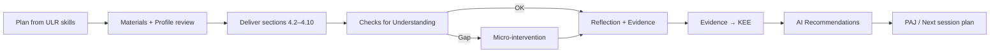

# DOCUMENT 22 — The Academy Way Instructional Playbook™

**Project:** The Academy Way Learning System™ — Phase 3.5  
**Status:** Implementation Blueprint — Canonical Lesson Framework Only  
**Integrates:** Documents 6, 12, 18, 19, 20, 21

---

## 1. Charter

The **Academy Way Instructional Playbook™** defines the **canonical lesson framework** — the required structure every instructional session follows when targeting ULR skills.

**This is the lesson skeleton, not lesson content.**

Curriculum providers (Wilson, projects, ventures) populate the framework. The Playbook ensures consistency, evidence capture, and integration across AcademyOS.

---

## 2. Playbook Philosophy

| Principle | Statement |
|-----------|-----------|
| **Objective-aligned** | Every session targets explicit ULR skill_ids |
| **Criteria-visible** | Students know what success looks like |
| **Evidence-by-design** | Session produces KEE evidence intentionally |
| **Profile-responsive** | Differentiation from Learning Profile — not afterthought |
| **Model-explicit** | Instructional models (Doc 18) declared per section |
| **Family-connected** | Extension activities optional but structured |

---

## 3. Universal Lesson Schema

Every lesson **shall** define the following sections:

```
Lesson
    ├── Metadata
    ├── Learning Objective
    ├── Success Criteria
    ├── Prior Knowledge
    ├── Vocabulary
    ├── Materials
    ├── Teacher Modeling          (I Do)
    ├── Guided Practice           (We Do)
    ├── Independent Practice      (You Do)
    ├── Discussion
    ├── Checks for Understanding
    ├── Common Errors
    ├── Differentiation
    ├── Accommodations
    ├── Executive Function Supports
    ├── Family Extension
    ├── Evidence Collection
    ├── Reflection
    └── AI Recommendations
```

---

## 4. Section Specifications

### 4.1 Metadata

| Field | Required | Description |
|-------|----------|-------------|
| `lesson_id` | Yes | Unique identifier |
| `title` | Yes | Session title |
| `target_skill_keys[]` | Yes | ULR atomic skill IDs |
| `target_competency_keys[]` | If applicable | Parent competencies |
| `learning_domain_key` | Yes | Domain |
| `instructional_models[]` | Yes | Primary models from Doc 18 |
| `estimated_duration_minutes` | Yes | Includes transitions |
| `session_type` | Yes | whole_group, small_group, 1_1, independent, field |
| `wilson_session` | If SL | Fidelity flags per VI-F |
| `cycle_week` | Optional | Learning Cycle position |

---

### 4.2 Learning Objective

| Attribute | Definition |
|-----------|------------|
| **Purpose** | State what learner will be able to do by session end |
| **Format** | "Students will [verb] [content] [context]" |
| **Source** | Derived from ULR `mastery_criteria` — not generic |
| **Visibility** | Shared with students at session start |
| **Alignment** | Maps 1:1 to `target_skill_keys[]` |

---

### 4.3 Success Criteria

| Attribute | Definition |
|-----------|------------|
| **Purpose** | Observable indicators that objective is met |
| **Format** | Checklist — student and teacher facing |
| **Source** | ULR `mastery_criteria` + `observation_indicators` |
| **Mastery link** | Criteria align with L3 evidence requirements |
| **Differentiation** | Tiered criteria optional (approaching / met / exceeded) |

---

### 4.4 Prior Knowledge

| Attribute | Definition |
|-----------|------------|
| **Purpose** | Activate and verify prerequisites |
| **Content** | Prerequisite skill_ids; quick retrieval prompts |
| **Instructional model** | Retrieval Practice (Doc 18) |
| **Action** | If gap detected → micro-intervention or reschedule (Doc 20) |
| **Duration** | 3–7 minutes typical |

---

### 4.5 Vocabulary

| Attribute | Definition |
|-----------|------------|
| **Purpose** | Explicit teaching of session-critical terms |
| **Content** | Term, definition, example, non-example |
| **Source** | ULR skill vocabulary; domain glossary |
| **Wilson** | Wilson category terms — not proprietary script |
| **Evidence** | Vocabulary retrieval in checks |

---

### 4.6 Materials

| Attribute | Definition |
|-----------|------------|
| **Purpose** | List all physical, digital, and human resources |
| **Content** | Materials, manipulatives, tech, print, environment needs |
| **UDL** | Multiple representation options where applicable |
| **Accessibility** | Profile technology supports pre-loaded |
| **Scheduling** | Material prep flag for SIE |

---

### 4.7 Teacher Modeling (I Do)

| Attribute | Definition |
|-----------|------------|
| **Purpose** | Demonstrate expert performance with think-aloud |
| **Instructional models** | Direct Instruction, Explicit, Worked Examples |
| **Content** | Step-by-step demonstration — curriculum-specific |
| **Dual coding** | Visual + verbal where applicable |
| **Duration** | Proportional to complexity — typically 10–20% of session |
| **Evidence** | Optional fidelity observation for Wilson |

---

### 4.8 Guided Practice (We Do)

| Attribute | Definition |
|-----------|------------|
| **Purpose** | Learner attempts with immediate teacher support |
| **Instructional models** | Gradual Release, Scaffolding, Errorless Learning |
| **Content** | Shared practice; teacher prompts and corrects |
| **Group size** | Per SIE assignment — Wilson min 2 |
| **Evidence** | Formative assessment; error pattern capture |
| **Duration** | Typically 30–40% of session |

---

### 4.9 Independent Practice (You Do)

| Attribute | Definition |
|-----------|------------|
| **Purpose** | Learner performs without immediate support |
| **Instructional models** | Independent Practice; may include Collaborative |
| **Content** | Tasks at appropriate difficulty |
| **Evidence** | Primary session evidence toward L2–L3 |
| **Scaffold fade** | Supports removed per profile progression |
| **Duration** | Typically 25–35% of session |

---

### 4.10 Discussion

| Attribute | Definition |
|-----------|------------|
| **Purpose** | Process learning; peer meaning-making |
| **Instructional models** | Collaborative Learning, Metacognition |
| **Structure** | Protocol required — not unstructured talk |
| **Optional** | May merge with reflection in short sessions |
| **Evidence** | Observation rubric for participation quality |

---

### 4.11 Checks for Understanding

| Attribute | Definition |
|-----------|------------|
| **Purpose** | Real-time verification — adjust instruction immediately |
| **Instructional models** | Formative Assessment (Doc 21) |
| **Placement** | Embedded after modeling, during guided, end of independent |
| **Format** | Exit ticket, thumbs, mini-whiteboard, digital pulse |
| **Action rules** | <70% success → re-teach; prerequisite gap → intervention |
| **Evidence** | `measurement.formative` → KEE |

---

### 4.12 Common Errors

| Attribute | Definition |
|-----------|------------|
| **Purpose** | Anticipate and address predictable mistakes |
| **Source** | ULR `common_error_patterns[]` |
| **Response** | Correction protocol — especially Wilson error correction |
| **Instructional use** | Pre-teach error avoidance; analyze errors in discussion |
| **AI link** | Error pattern frequency feeds intervention rules |

---

### 4.13 Differentiation

| Attribute | Definition |
|-----------|------------|
| **Purpose** | Adjust for readiness, profile, and mastery level |
| **Source** | Learning Profile (Doc 19); current mastery levels |
| **Dimensions** | Content depth, process scaffolding, product choice |
| **Instructional model** | Differentiation, UDL |
| **Variants** | `lesson_variants[]` — approaching / on-level / extension |
| **Rule** | Extension ≠ skip objective — enrich or accelerate per Doc 20 |

---

### 4.14 Accommodations

| Attribute | Definition |
|-----------|------------|
| **Purpose** | Implement profile-documented supports |
| **Source** | Profile `accommodation_list[]` |
| **Examples** | Extended time, reduced items, alternate response, breaks |
| **Assessment link** | Same accommodations in checks (Doc 21) |
| **Logging** | Accommodations used → evidence metadata |

---

### 4.15 Executive Function Supports

| Attribute | Definition |
|-----------|------------|
| **Purpose** | Reduce EF load for session success |
| **Source** | ULR `executive_function_demands`; profile EF fields |
| **Supports** | Visual schedule, chunking, timer, checklist, preview |
| **Instructional model** | Scaffolding — fade over time |
| **Scheduling** | Break inserts per profile attention recommendations |

---

### 4.16 Family Extension

| Attribute | Definition |
|-----------|------------|
| **Purpose** | Optional home connection reinforcing session objective |
| **Source** | ULR `parent_activities[]` |
| **Content** | Coaching card — not homework overload |
| **Capacity** | Respect profile `home_practice_capacity` |
| **Evidence** | Optional parent log → KEE |
| **Family Journey** | Link to parent learner pathway if enrolled |

---

### 4.17 Evidence Collection

| Attribute | Definition |
|-----------|------------|
| **Purpose** | Define what evidence this session must produce |
| **Content** | Evidence types, count, rubric refs, capture method |
| **Source** | ULR `evidence_types[]`, `minimum_evidence_count` |
| **KEE** | Auto-suggest evidence template on session close |
| **Quality** | Rubric or checklist attached — not vague "participated" |

**Required block:** No lesson complete without evidence plan.

---

### 4.18 Reflection

| Attribute | Definition |
|-----------|------------|
| **Purpose** | Metacognitive closure — learner processes experience |
| **Instructional model** | Metacognition |
| **Prompts** | What worked? What was hard? What's next? |
| **Student voice** | Captured to profile when substantive |
| **Duration** | 3–5 minutes |

---

### 4.19 AI Recommendations

| Attribute | Definition |
|-----------|------------|
| **Purpose** | Post-session AI suggestions for next steps |
| **Inputs** | Checks data, error patterns, mastery state, profile |
| **Outputs** | Next skill, re-teach, practice plan draft, grouping suggestion |
| **Human gate** | Recommendations — not auto-applied |
| **Explainability** | skill_ids + evidence ids cited |

---

## 5. Session Type Variants

| Session Type | Playbook Emphasis |
|--------------|-------------------|
| **Wilson WRS** | Modeling + guided dominant; fidelity metadata; VI-F rules |
| **Performance block** | Independent + evidence dominant; extended duration |
| **Inquiry block** | Prior knowledge + discussion + project slice |
| **Venture sprint** | Independent + AI recommendations; portfolio evidence |
| **1:1 intervention** | Guided + independent; probe at end |
| **Field experiential** | Observation evidence; reflection dominant |

---

## 6. Lesson Lifecycle



---

## 7. Integration Matrix

| System | Role |
|--------|------|
| **ULR** | Skills, criteria, errors, strategies, parent activities |
| **Instructional Framework** | Model selection per section |
| **Learning Profile** | Differentiation, accommodations, EF |
| **Assessment Framework** | Formative checks, rubrics |
| **Intervention** | CFU-triggered micro-interventions |
| **KEE** | Evidence capture |
| **SIE** | Session scheduling, duration, grouping |
| **Analytics** | Instructional efficiency (Doc 23) |

---

## 8. Governance

| Rule | Requirement |
|------|-------------|
| **PB-1** | No session without `target_skill_keys[]` |
| **PB-2** | Success criteria required before delivery |
| **PB-3** | Evidence collection block mandatory |
| **PB-4** | Wilson sessions include fidelity fields |
| **PB-5** | AI recommendations cannot auto-modify mastery |
| **PB-6** | Playbook template versioned — lessons reference template version |

---

## 9. Relationship to Curriculum

| Layer | Role |
|-------|------|
| **Playbook** | How to teach any session (this document) |
| **Curriculum** | What content fills each section (Wilson, projects, etc.) |
| **ULR** | What skills are targeted |
| **Phase 4 skills** | Atomic skill libraries reference Playbook sections |

---

*End of Document 22 — The Academy Way Instructional Playbook™*
