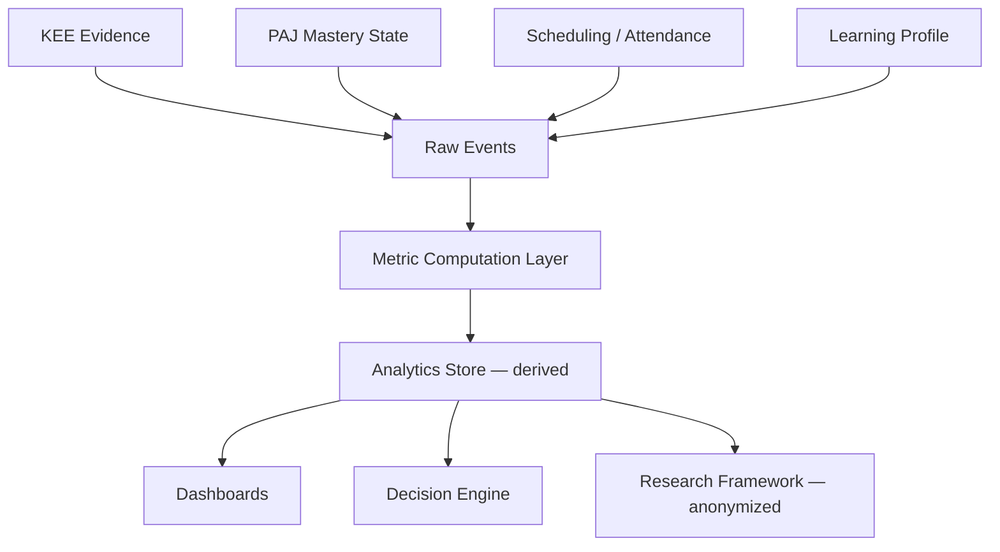

# DOCUMENT 23 — Learning Analytics Framework™

**Project:** The Academy Way Learning System™ — Phase 3.5  
**Status:** Implementation Blueprint — Analytics Architecture Only  
**Integrates:** Documents 6, 12, 19, 20, 21; KEE; PAJ; Decision Engine

---

## 1. Charter

The **Learning Analytics Framework™** defines **every learning metric** in AcademyOS — what it measures, how it is calculated conceptually, and how consumers use it.

**Analytics inform decisions.** They do not declare mastery alone (Document 6).

All metrics derive from **KEE evidence**, **PAJ state**, **scheduling records**, and **profile data** — not parallel data silos.

---

## 2. Metric Design Principles

| Principle | Statement |
|-----------|-----------|
| **Conceptual transparency** | Every metric has plain-language definition |
| **Confidence pairing** | Predictions include confidence intervals |
| **Privacy** | Aggregates for research anonymized (Doc 24) |
| **Actionability** | Metrics link to intervention or scheduling actions |
| **Anti-gaming** | Metrics resist superficial compliance |

---

## 3. Metric Catalog

---

### 3.1 Learning Velocity

| Attribute | Definition |
|-----------|------------|
| **What it measures** | Rate of new skills reaching L2+ over time |
| **Conceptual calculation** | `count(skills reaching L2 or higher in period) / weeks in period` |
| **Inputs** | PAJ mastery state changes; skill_ids; date range |
| **Unit** | Skills per week (rolling 4-week default) |
| **Normalization** | Optional: divide by active instructional hours |
| **Consumers** | PAJ dashboard; educator; parent summary |
| **Caution** | High velocity without L3 may indicate shallow evidence |

---

### 3.2 Mastery Velocity

| Attribute | Definition |
|-----------|------------|
| **What it measures** | Rate of skills reaching L3 Proficient |
| **Conceptual calculation** | `count(skills reaching L3 in period) / weeks in period` |
| **Inputs** | Mastery validation events; KEE evidence bundles |
| **Unit** | Proficient skills per week |
| **Domain scope** | Computed per domain and overall |
| **Consumers** | Graduation Readiness; transcript progress |
| **Caution** | Compare to registry `estimated_instructional_minutes` for reasonableness |

---

### 3.3 Growth Rate

| Attribute | Definition |
|-----------|------------|
| **What it measures** | Change in performance on repeated measures |
| **Conceptual calculation** | `(current_benchmark - prior_benchmark) / time_between` |
| **Inputs** | Benchmark assessments (MAP, probes); screening |
| **Unit** | Scale points per month or percentile change |
| **Consumers** | Intervention effectiveness; parent conferences |
| **Wilson** | ORF words-correct-per-minute trend |
| **MAP** | RIT or percentile growth (Doc 24) |

---

### 3.4 Engagement

| Attribute | Definition |
|-----------|------------|
| **What it measures** | Active participation and persistence in learning |
| **Conceptual calculation** | Weighted composite: attendance rate × session participation score × assignment completion × self-reported interest pulse |
| **Inputs** | SIE attendance; observation; formative completion; student voice |
| **Unit** | 0–100 engagement index |
| **Consumers** | Profile `engagement_trend`; risk scoring |
| **Caution** | Distinguish compliance from cognitive engagement |

---

### 3.5 Instructional Efficiency

| Attribute | Definition |
|-----------|------------|
| **What it measures** | Mastery gained per instructional hour invested |
| **Conceptual calculation** | `mastery_velocity / instructional_hours_in_period` |
| **Inputs** | SIE session logs; mastery validations |
| **Unit** | L3 skills per hour |
| **Consumers** | Scheduling optimization; strategy comparison (Doc 24) |
| **Use** | Compare instructional models (Doc 18) effectiveness |

---

### 3.6 Intervention Effectiveness

| Attribute | Definition |
|-----------|------------|
| **What it measures** | Whether intervention produced target mastery gain |
| **Conceptual calculation** | `(post_intervention_probe - pre_intervention_probe) / weeks` compared to expected gain threshold |
| **Inputs** | Intervention plan; probe evidence; tier level |
| **Unit** | Effect size band: ineffective / moderate / effective |
| **Consumers** | Intervention exit decisions; Doc 20 review |
| **Trigger** | Ineffective at week 4 → plan revision required |

---

### 3.7 Teacher Effectiveness (Instructional Impact)

| Attribute | Definition |
|-----------|------------|
| **What it measures** | Student mastery outcomes under teacher's instruction — context-adjusted |
| **Conceptual calculation** | Compare actual mastery velocity to cohort expected velocity — adjusted for entry placement and profile barriers |
| **Inputs** | Teacher session assignments; student outcomes; profile |
| **Unit** | Impact index relative to expected |
| **Consumers** | Professional development; coaching — **not punitive ranking** |
| **Ethics** | Small n suppression; contextual narrative required |

---

### 3.8 Student Confidence

| Attribute | Definition |
|-----------|------------|
| **What it measures** | Self-reported confidence relative to evidence |
| **Conceptual calculation** | Student confidence survey per domain; compared to mastery level |
| **Inputs** | Student voice; mastery state |
| **Unit** | Confidence index 0–100; gap score = confidence - mastery_normalized |
| **Consumers** | Profile; counseling; intervention for anxiety mismatch |
| **Insight** | High confidence + low mastery → overconfidence; low confidence + high mastery → imposter gap |

---

### 3.9 Skill Retention

| Attribute | Definition |
|-----------|------------|
| **What it measures** | Maintenance of L3 after time delay |
| **Conceptual calculation** | `retention_probe_score / original_mastery_score` at spaced interval |
| **Inputs** | Spaced retrieval assessments; original validation date |
| **Unit** | Retention rate 0–1 per skill |
| **Consumers** | Spacing scheduler; Wilson cumulative review |
| **Trigger** | Retention < 0.70 → scheduled review intervention |

---

### 3.10 Knowledge Transfer

| Attribute | Definition |
|-----------|------------|
| **What it measures** | Application of skill in novel context |
| **Conceptual calculation** | Performance on transfer task linked via `cross_domain_links` or novel scenario |
| **Inputs** | Performance task evidence; L4 advanced validations |
| **Unit** | Transfer success: yes/no or rubric score |
| **Consumers** | Acceleration decisions; L4 assignment |
| **Requirement** | Required for acceleration protocol (Doc 20) |

---

### 3.11 Practice Effectiveness

| Attribute | Definition |
|-----------|------------|
| **What it measures** | Gain from practice activities (retrieval, drills, homework) |
| **Conceptual calculation** | `(post_practice_check - pre_practice_check) / practice_sessions` |
| **Inputs** | Practice plan logs; formative checks |
| **Unit** | Gain per session |
| **Consumers** | Practice plan adjustment; home practice review |
| **Link** | Retrieval Practice model validation (Doc 18) |

---

### 3.12 Spacing Effectiveness

| Attribute | Definition |
|-----------|------------|
| **What it measures** | Retention benefit from spaced vs. massed review |
| **Conceptual calculation** | Compare retention rates for skills reviewed at optimal spacing vs. delayed/massed |
| **Inputs** | SIE review schedule; retention probes |
| **Unit** | Spacing advantage index |
| **Consumers** | SIE spacing algorithm tuning; Research Framework |
| **Link** | Spaced Practice model (Doc 18) |

---

### 3.13 Assessment Confidence

| Attribute | Definition |
|-----------|------------|
| **What it measures** | Trustworthiness of a specific assessment instance |
| **Conceptual calculation** | Method reliability × rater calibration × recency factor × accommodation validity factor × AI validation factor |
| **Inputs** | Doc 21 assessment metadata |
| **Unit** | 0–1 confidence score per evidence record |
| **Consumers** | Mastery validation gate; transcript inclusion |
| **Rule** | L3 requires aggregate confidence ≥ threshold |

---

### 3.14 Prediction Confidence

| Attribute | Definition |
|-----------|------------|
| **What it measures** | Trust in AI/Decision Engine forward predictions |
| **Conceptual calculation** | Model confidence × profile completeness × evidence density × domain familiarity |
| **Inputs** | AI recommendation; profile metadata; historical accuracy |
| **Unit** | 0–1 with low/medium/high band |
| **Consumers** | UI display; suppress auto-actions when low |
| **Rule** | Low confidence → human review mandatory |

---

### 3.15 Risk Scores

| Attribute | Definition |
|-----------|------------|
| **What it measures** | Probability learner fails to progress without support |
| **Conceptual calculation** | Weighted composite: stalled mastery velocity + declining engagement + prerequisite gaps + missed dosage + screening flags + confidence-evidence negative gap |
| **Inputs** | Multiple metrics above; profile barriers |
| **Unit** | 0–100 risk index; tier suggestion bands |
| **Consumers** | Intervention Framework triggers; counselor dashboard |
| **Ethics** | Risk informs support — never exclusion |
| **Human gate** | Tier assignment requires educator |

**Band example:**

| Band | Action |
|------|--------|
| 0–25 | Monitor |
| 26–50 | Tier 1 boost consideration |
| 51–75 | Tier 2 review |
| 76–100 | Team meeting; Tier 3 consideration |

---

### 3.16 Readiness Scores

| Attribute | Definition |
|-----------|------------|
| **What it measures** | Progress toward graduation readiness domains (Doc 7) |
| **Conceptual calculation** | `weighted_sum(competency_mastery in readiness_domain) / required_competencies` |
| **Inputs** | PAJ competency mastery; GRS domain weights |
| **Unit** | 0–100 per readiness domain; overall GRS |
| **Consumers** | Graduation Readiness Engine; family conferences |
| **Distinct from** | Risk score — readiness is aspirational progress; risk is support need |

---

## 4. Metric Computation Architecture

**Rule:** Metrics are **derived** — recomputable from source events.

---

## 5. Time Windows

| Window | Use |
|--------|-----|
| **Session** | Formative, engagement |
| **Weekly** | Learning velocity, dosage |
| **4-week rolling** | Mastery velocity, risk |
| **Cycle** | Growth, readiness, portfolio |
| **Annual** | MAP growth, research aggregates |

---

## 6. Consumer Matrix

| Consumer | Primary Metrics |
|----------|-----------------|
| **Educator** | Mastery velocity, engagement, risk, instructional efficiency |
| **Student** | Progress, confidence gap, next skills |
| **Parent** | Growth, engagement, readiness — plain language |
| **Intervention** | Intervention effectiveness, risk, practice effectiveness |
| **SIE** | Dosage, spacing effectiveness, instructional hours |
| **Graduation** | Readiness scores |
| **Research** | All aggregates — anonymized |
| **AI** | Prediction confidence, risk, velocity trends |

---

## 7. Governance

| Rule | Requirement |
|------|-------------|
| **LAF-1** | No metric used for mastery without Document 6 evidence rules |
| **LAF-2** | Prediction confidence displayed on all AI outputs |
| **LAF-3** | Teacher effectiveness not used for high-stakes employment without context |
| **LAF-4** | Risk scores trigger support — never auto-enrollment change |
| **LAF-5** | Metric definitions versioned; changes logged |
| **LAF-6** | Students/families see explainable metric definitions |

---

*End of Document 23 — Learning Analytics Framework™*
