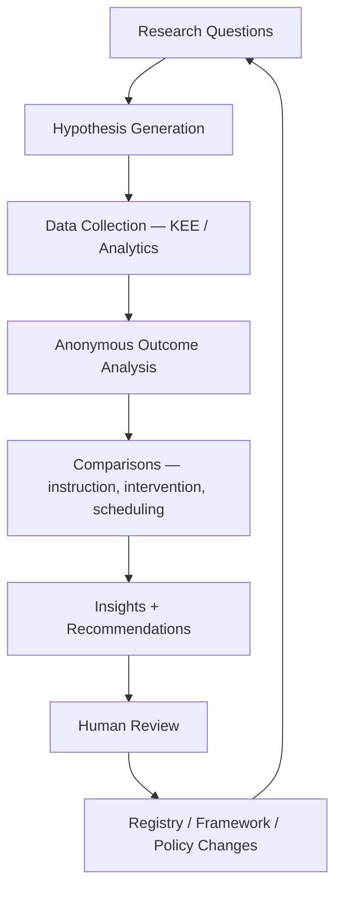
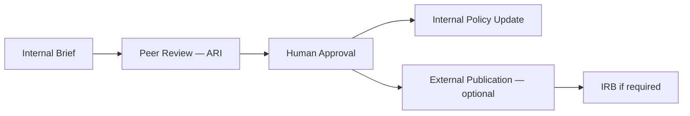

# DOCUMENT 24 — The Academy Way Research Framework™

**Project:** The Academy Way Learning System™ — Phase 3.5  
**Status:** Implementation Blueprint — Continuous Improvement Architecture Only  
**Constitutional alignment:** Wave 6.5 Academy Research Institute (ARI)  
**Integrates:** All Phase 3.5 documents; KEE; Learning Analytics (Doc 23)

---

## 1. Charter

The **Academy Way Research Framework™** defines how AcademyOS **continuously improves** through ethical, evidence-based inquiry — turning institutional learning data into validated instructional refinement.

**Research serves learners.** It does not extract value at the expense of privacy or dignity.

ARI (Wave 6.5) operationalizes this framework. Phase 3.5 defines the architecture only.

---

## 2. Research Philosophy

| Principle | Statement |
|-----------|-----------|
| **Improvement loop** | Practice → evidence → analysis → refinement → practice |
| **Anonymization default** | Published research uses de-identified aggregates |
| **Human review** | No automated policy changes from research alone |
| **Transparency** | Families informed of research participation |
| **Humility** | Hypotheses may fail — failures published internally |
| **Equity** | Disaggregated analysis where sample size permits |

---

## 3. Continuous Improvement Loop

**Output types:** Internal briefs, configuration updates, registry version notes, peer-reviewed publications.

---

## 4. Research Question Categories

| Category | Example Questions |
|----------|-------------------|
| **Instructional models** | Does interleaving improve RLM transfer vs. blocked practice? |
| **Intervention tiers** | What Tier 2 duration optimizes Wilson Step advancement? |
| **Scheduling** | Does morning SL dosage affect retention vs. afternoon? |
| **Profile factors** | Which EF supports correlate with mastery velocity — without labeling? |
| **AI assistance** | Does AI draft feedback reduce time-to-L3 in LitLab writing? |
| **Mastery thresholds** | Are current L3 evidence bundles sufficient for retention at 8 weeks? |
| **Family engagement** | Does parent coaching improve home practice effectiveness? |
| **Program outcomes** | Life Lab Y4 mastery correlation with graduation readiness? |
| **Equity** | Are risk scores equally predictive across learner profiles? |

Questions registered in **Research Question Registry** — prioritized by ARI governance.

---

## 5. Hypothesis Generation

| Step | Process |
|------|---------|
| **1. Observe** | Analytics anomaly, educator report, literature gap |
| **2. Formalize** | `If [intervention] for [population], then [outcome] because [mechanism]` |
| **3. Register** | hypothesis_id, question ref, author, date |
| **4. Pre-register** | Analysis plan before outcomes viewed (where feasible) |
| **5. Power check** | Minimum sample size estimate — suppress if underpowered |

**Hypothesis states:** proposed → active → supported → refuted → inconclusive

---

## 6. Anonymous Outcome Analysis

| Element | Definition |
|---------|-------------|
| **Data source** | KEE evidence (de-identified); PAJ mastery events; analytics aggregates |
| **De-identification** | Remove direct identifiers; use research IDs; k-anonymity thresholds |
| **Minimum n** | Suppress cells with n < org threshold (default 10) |
| **Disaggregation** | By domain, tier, instructional model — not by student name |
| **Retention** | Research datasets time-limited; audit trail maintained |

**Prohibited:** Selling student data; re-identification attempts; research without consent framework.

---

## 7. Comparison Frameworks

### 7.1 Instruction Comparison

| Compare | Method |
|---------|--------|
| Instructional models (Doc 18) | Matched cohorts by entry placement; instructional efficiency metric |
| Playbook variants | A/B at school level — not individual randomization without consent |
| Wilson fidelity levels | Fidelity score vs. Step advancement rate |

### 7.2 Intervention Comparison

| Compare | Method |
|---------|--------|
| Tier 2 vs. Tier 3 dosage | Intervention effectiveness metric |
| Practice plan types | Practice effectiveness |
| Home vs. school practice | Gain per session by setting |

### 7.3 Teacher Strategy Comparison

| Compare | Method |
|---------|--------|
| Strategy adoption vs. outcomes | Context-adjusted teacher impact index |
| Coaching participation | Before/after mastery velocity |

**Ethics:** Never public individual teacher rankings; internal PD use only.

### 7.4 Scheduling Comparison

| Compare | Method |
|---------|--------|
| Block length | Mastery per hour by session duration |
| Spacing intervals | Spacing effectiveness metric |
| Group size | Outcomes Wilson min-2 vs. larger groups |
| Time of day | Engagement + retention by slot |

---

## 8. Domain Outcome Research Programs

### 8.1 Wilson Outcome Research

| Focus | Metrics |
|-------|---------|
| Step advancement rate | Time to Step band mastery |
| Dosage compliance | Hours vs. VI-F.15 target |
| Fidelity correlation | Fidelity rubric vs. ORF growth |
| Retention post-exit | Retention probes at 3/6/12 months |
| Error pattern reduction | Common errors over intervention |

**Boundary:** No proprietary Wilson content in publications — outcomes and categories only.

### 8.2 MAP Outcome Research

| Focus | Metrics |
|-------|---------|
| MAP growth vs. PAJ mastery | Crosswalk validity |
| Predictive validity | MAP screen → intervention need |
| Growth to readiness | MAP trajectory vs. GRS |

**Crosswalk maintenance:** Configuration Studio; validated annually.

### 8.3 Life Lab Outcome Research

| Focus | Metrics |
|-------|---------|
| Y1–Y4 progression | Competency mastery by year band |
| Independent living transfer | Performance task success in authentic settings |
| EF scaffold fade | Mastery velocity as scaffolds removed |
| Graduation readiness | Life Lab competencies vs. GRS domains |

### 8.4 AI Venture Lab Outcome Research

| Focus | Metrics |
|-------|---------|
| Venture cycle completion | Phase advancement rates |
| AI tool usage | Correlation with product quality — ethics-monitored |
| Career readiness | Portfolio + opportunity placement |
| Business finance link | RLM cross-domain mastery |

---

## 9. Publication Pipeline

| Stage | Output |
|-------|--------|
| **Internal brief** | 2–5 pages; actionable recommendations |
| **Registry amendment proposal** | ULR or framework change |
| **Conference poster/paper** | De-identified aggregates |
| **Peer-reviewed journal** | Full study — IRB when human subjects |
| **Family summary** | Plain-language annual research report |

---

## 10. Ethics

| Rule | Requirement |
|------|-------------|
| **Consent** | Research participation disclosed; opt-out where individual-level |
| **Beneficence** | Research should benefit participating community |
| **Justice** | Equitable burden and benefit |
| **Respect** | No stigmatizing publications |
| **Minimize harm** | Risk scores, labels never in external publications |
| **Student assent** | Age-appropriate assent for involved youth |
| **Data minimization** | Collect only what analysis requires |

---

## 11. IRB Considerations

| Activity | IRB Likely Required |
|----------|---------------------|
| Aggregate de-identified outcome analysis | Usually exempt — legal review |
| Individual randomization of instruction | Likely required |
| Surveys on sensitive topics | Review required |
| Qualitative interviews with students | Required |
| External publication with identifiable org | Review recommended |
| Partnership with university | IRB per institution |

**Process:** ARI maintains IRB submission templates; no research bypass.

---

## 12. Human Review

| Review Body | Role |
|-------------|--------|
| **ARI Research Council** | Approve active hypotheses; publication clearance |
| **Instructional Leadership** | Approve framework/registry changes |
| **Ethics Review** | Flag equity and privacy concerns |
| **Family Advisory** | Optional review of family-facing summaries |
| **Constitutional Amendment** | Required for baseline philosophy changes |

**Rule:** Analytics insights → recommendation → human approval → change. Never auto-deploy instructional policy.

---

## 13. Continuous Improvement Outputs

| Insight Type | Action |
|--------------|--------|
| Instructional model ineffective | Update Doc 18 recommendations; ULR strategy refs |
| Intervention duration suboptimal | Update Doc 20 defaults |
| Assessment reliability low | Update Doc 21 method metadata |
| Metric misleading | Revise Doc 23 definition |
| Skill criteria too weak | Phase 4 skill library revision |
| Scheduling pattern superior | SIE configuration update |
| Wilson crosswalk drift | Configuration Studio recalibration |

---

## 14. Integration Matrix

| System | Research Role |
|--------|---------------|
| **KEE** | Primary evidence corpus |
| **Learning Analytics** | Metric computation |
| **ULR** | Skill/competency definitions under study |
| **Learning Profile** | Covariates — anonymized |
| **Intervention / Assessment** | Comparison arms |
| **Scheduling Intelligence** | Scheduling experiments |
| **Graduation Readiness** | Outcome endpoint |
| **ARI (Wave 6.5)** | Operational host |

---

## 15. Governance

| Rule | Requirement |
|------|-------------|
| **RF-1** | All external publications cleared by ARI |
| **RF-2** | Pre-registration for confirmatory hypotheses |
| **RF-3** | No individual student data in external outputs |
| **RF-4** | Failed hypotheses documented — not hidden |
| **RF-5** | Research cannot override mastery evidence rules |
| **RF-6** | Annual public research summary to community |

---

## 16. Phase Sequence

| Phase | Research Capability |
|-------|---------------------|
| **Phase 3.5** | Framework defined (this document) |
| **Wave 1** | KEE enables evidence corpus |
| **Wave 6** | Skill libraries enable fine-grained analysis |
| **Wave 6.5** | ARI operational; full loop active |
| **Ongoing** | Continuous improvement permanent |

---

*End of Document 24 — The Academy Way Research Framework™*
