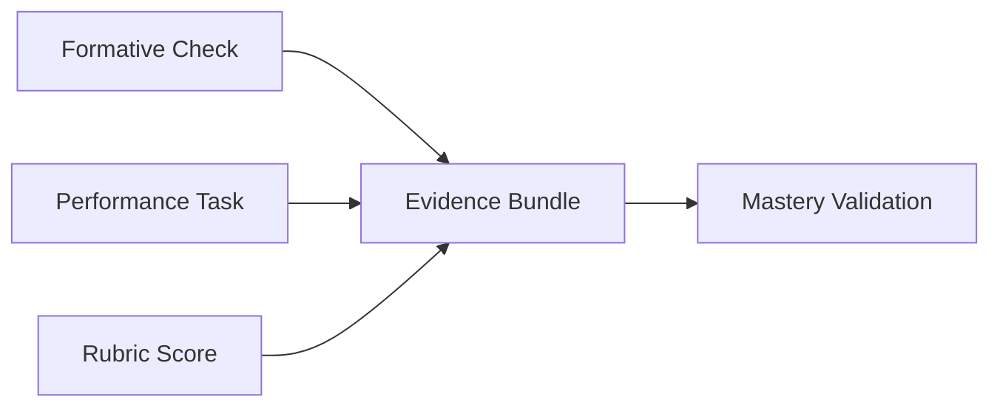

# DOCUMENT 27 — Evidence Standard™

**Project:** The Academy Way Learning System™ — Phase 4  
**Status:** Implementation Blueprint — Evidence Taxonomy & Classification Only  
**Integrates:** Part VIII KEE · Document 6 Mastery Philosophy · Documents 25–26

---

## 1. Charter

The **Evidence Standard™** defines how **every piece of evidence** is classified, quality-scored, related, and linked to competencies in the Knowledge & Evidence Engine™.

**Evidence determines mastery.** Classification ensures evidence is **trustworthy, traceable, and composable**.

No evidence records are created in this phase — taxonomy and rules only.

---

## 2. Evidence Philosophy

| Principle | Statement |
|-----------|-----------|
| **Typed** | Every record has `evidence_type_key` from taxonomy |
| **Linked** | Every record carries `skill_keys[]` and/or `competency_keys[]` |
| **Attributed** | Source role documented — teacher, student, parent, system, AI |
| **Confidence-scored** | Every instance has confidence metadata |
| **Quality-scored** | Every instance has quality metadata |
| **Time-bound** | Expiration rules where applicable |
| **Relational** | Evidence links to other evidence — bundles, supersession |
| **Immutable audit** | Corrections append — do not silent-delete |

---

## 3. Evidence Taxonomy Architecture

```
EvidenceCategory
    └── EvidenceType
            └── EvidenceSubtype (optional)
                    └── Required Metadata Schema
```

**Registry host:** Platform Registry Framework + KEE (Part VIII)

---

## 4. Evidence Categories & Types

### 4.1 Observation

| Type Key | Description | Typical Source |
|----------|-------------|--------------|
| `observation.instructional` | Teacher observation during instruction | Educator |
| `observation.checklist` | Structured checklist completion | Educator |
| `observation.conference` | Teacher/student conference record | Educator |
| `observation.parent` | Parent structured observation | Parent |
| `observation.field` | Field trip / community observation | Educator |
| `observation.fidelity` | Wilson / program fidelity | Educator, coach |
| `observation.discussion` | Seminar, debate participation | Educator |

### 4.2 Measurement

| Type Key | Description | Typical Source |
|----------|-------------|--------------|
| `measurement.formative` | Exit ticket, quick check | Educator / system |
| `measurement.summative` | Cycle or unit assessment | Educator |
| `measurement.diagnostic` | Placement diagnostic | System |
| `measurement.placement` | Domain entry placement | System |
| `measurement.screening` | Risk screen | System |
| `measurement.benchmark` | MAP, interim benchmark | System |
| `measurement.progress` | CBM probe, step check | Educator |
| `measurement.running_record` | Oral reading record | Educator |
| `measurement.rubric` | Rubric-scored work | Educator |
| `measurement.retention` | Spaced retention probe | Educator / system |
| `measurement.ai_draft` | AI-scored pending validation | AI → educator |

### 4.3 Artifact — Student Work

| Type Key | Description | Typical Source |
|----------|-------------|--------------|
| `artifact.writing` | Writing sample | Student |
| `artifact.reading_log` | Reading response | Student |
| `artifact.presentation` | Slides, recording | Student |
| `artifact.research` | Notes, bibliography | Student |
| `artifact.performance` | Performance task product | Student |
| `artifact.calculation` | Math work shown | Student |
| `artifact.budget` | Budget document | Student |
| `artifact.product` | General academic product | Student |
| `artifact.portfolio` | Curated collection | Student |

### 4.4 Artifact — Wilson / Structured Literacy

| Type Key | Description | Typical Source |
|----------|-------------|--------------|
| `evidence.wilson.session` | WRS session record | Educator |
| `evidence.wilson.check` | Wilson check / step probe | Educator |
| `evidence.wilson.spelling` | Spelling sample | Student |
| `evidence.wilson.reading` | Controlled reading sample | Student |

**Note:** Category-coded — no proprietary Wilson content in metadata.

### 4.5 Artifact — Venture & Life

| Type Key | Description | Typical Source |
|----------|-------------|--------------|
| `artifact.business_plan` | Venture business plan | Student |
| `artifact.venture_pitch` | Pitch deck / video | Student |
| `artifact.product_mvp` | Digital or physical MVP | Student |
| `artifact.financial` | P&L, personal budget | Student |
| `artifact.life_skill_demo` | Life Lab demonstration | Student / video |

### 4.6 Multimedia

| Type Key | Description | Typical Source |
|----------|-------------|--------------|
| `media.video` | Student video | Student |
| `media.audio` | Audio recording | Student |
| `media.photo` | Photo documentation | Student, parent |
| `media.screen_capture` | Digital work capture | Student |

### 4.7 Reflection & Feedback

| Type Key | Description | Typical Source |
|----------|-------------|--------------|
| `self.reflection` | Student reflection | Student |
| `peer.review` | Structured peer feedback | Peer |
| `parent.feedback` | Parent narrative feedback | Parent |
| `mentor.feedback` | External mentor | Mentor |

### 4.8 External & Authentic

| Type Key | Description | Typical Source |
|----------|-------------|--------------|
| `external.map_result` | MAP Growth result | System import |
| `external.transcript` | Prior school transcript | Admissions |
| `external.certification` | External credential | Verification |
| `community.project` | Service project documentation | Student |
| `internship.verification` | Internship completion | Host org |
| `employment.verification` | Employment / job shadow | Employer attestation |
| `volunteer.verification` | Volunteer hours | Organization |
| `evidence.ai_project` | AI-enabled project deliverable | Student |

### 4.9 Mastery & Validation

| Type Key | Description | Typical Source |
|----------|-------------|--------------|
| `mastery.validation` | Formal L3 confirmation event | Educator |
| `mastery.regression` | Documented level decrease | Educator / system |

---

## 5. Universal Evidence Record Schema (Conceptual)

Every KEE evidence record **shall** include:

| Field | Required | Description |
|-------|----------|-------------|
| `evidence_id` | Yes | UUID |
| `evidence_type_key` | Yes | From §4 |
| `skill_keys[]` | Conditional | Min one skill or competency |
| `competency_keys[]` | Conditional | |
| `student_id` | Yes | |
| `captured_at` | Yes | UTC |
| `captured_by_role` | Yes | teacher, student, parent, system, ai, mentor |
| `source_context` | Yes | session_id, assessment_item_key, etc. |
| `locale` | Yes | Language of artifact |
| `jurisdiction_keys[]` | Yes | Doc A |
| `artifact_refs[]` | Conditional | Media, files |
| `scores[]` | Conditional | From assessment item |
| `narrative` | Optional | Observer notes |
| `accommodations_applied[]` | Yes | May be empty |
| `evidence_confidence` | Yes | 0–1 — §6 |
| `evidence_quality` | Yes | 0–1 — §7 |
| `expires_at` | Optional | §8 |
| `relationships[]` | Optional | §9 |
| `supersedes_evidence_id` | Optional | Correction chain |
| `ai_assisted` | Yes | bool + validation status |

---

## 6. Evidence Confidence

**Definition:** Trust that this record accurately represents the claimed performance.

| Factor | Weight Direction |
|--------|------------------|
| Assessment item reliability (Doc 26) | Higher → higher |
| Human validation of AI | Required for full weight |
| Rater calibration | Higher → higher |
| Recency | Decay for retention decisions |
| Accommodations | Noted — may adjust validity argument |
| Source role | Educator > parent for L3 sole-source rules |

| Band | Meaning |
|------|---------|
| 0.85–1.0 | High — strong L3 contribution |
| 0.70–0.84 | Moderate — combine in bundle |
| < 0.70 | Low — formative or supplementary |

**Aggregate rule:** Competency L3 validation requires bundle confidence ≥ org threshold (default 0.75).

---

## 7. Evidence Quality

**Definition:** Richness, authenticity, and alignment to success criteria — distinct from confidence.

| Dimension | Description |
|-----------|-------------|
| **Alignment** | Matches success criteria closely |
| **Authenticity** | `simulated`, `semi_authentic`, `authentic` |
| **Completeness** | Full vs. partial demonstration |
| **Independence** | Independent vs. heavily scaffolded |
| **Depth** | Surface vs. deep understanding signal |

| Score | Descriptor |
|-------|------------|
| 0.9–1.0 | Exemplary — portfolio-worthy |
| 0.7–0.89 | Proficient quality |
| 0.5–0.69 | Developing — not L3 alone |
| < 0.5 | Insufficient for mastery |

---

## 8. Evidence Expiration

| Evidence Class | Expiration Rule |
|----------------|-----------------|
| **Formative checks** | 90 days for mastery — unless superseded |
| **Summative / performance** | 24 months — or until regression |
| **Benchmark (MAP)** | 12 months for placement; growth uses history |
| **Wilson step check** | 6 months for advancement decision |
| **Retention probes** | Triggers re-review if fail |
| **Employment / internship** | 36 months for transcript |
| **Portfolio artifacts** | No expiration — historical |
| **Mastery validation** | Permanent — regression creates new event |

**Expired evidence:** Retained in KEE — excluded from active mastery calculation unless renewed.

---

## 9. Evidence Relationships

| Relationship Type | Description |
|-------------------|-------------|
| `bundle_member` | Part of required evidence bundle |
| `supports` | Corroborates another record |
| `contradicts` | Triggers review — regression workflow |
| `supersedes` | Replaces prior record |
| `derived_from` | AI summary of primary artifact |
| `translation_of` | Linked locale translation |
| `prerequisite_for` | Ordered evidence chain |



---

## 10. Evidence Bundle Rules (Competency L3)

Default bundle pattern (overridable in Doc 25 per competency):

| Rule | Default |
|------|---------|
| Minimum records | 2 |
| Minimum types | 2 distinct `evidence_type_key` |
| Minimum quality | Each ≥ 0.7 |
| Minimum confidence | Aggregate ≥ 0.75 |
| Educator validation | At least 1 educator-sourced |
| AI-only prohibition | AI draft cannot complete bundle alone |

---

## 11. Source Role Weighting

| Role | L3 Weight | Notes |
|------|-----------|-------|
| **Educator** | Full | Primary |
| **System (validated assessment)** | Full | MAP, published instruments |
| **Student self** | Supplementary | Never sole L3 |
| **Parent** | Supplementary | Home practice — verify for L3 |
| **Peer** | Supplementary | |
| **AI (unvalidated)** | None for L3 | Draft only |
| **AI (human validated)** | Moderate | Per Doc 26 cap until validated |
| **External verified** | Full | Internship, employment with verification |

---

## 12. Integration Matrix

| System | Role |
|--------|------|
| **KEE** | Storage and lineage |
| **Doc 25** | `evidence_type_keys[]` on competency |
| **Doc 26** | Item → evidence mapping |
| **Doc 21** | Assessment types |
| **Doc 23** | Retention, confidence analytics |
| **Doc 10 Portfolio** | High-quality artifacts |
| **Doc 11 Transcript** | Validated evidence only |
| **Doc 29 AI Coach** | Evidence collection recommendations |

---

## 13. Governance Rules

| Rule | Requirement |
|------|-------------|
| **EVS-1** | No evidence without `evidence_type_key` |
| **EVS-2** | Unknown type → Diagnostics queue |
| **EVS-3** | Supersession never deletes — audit trail |
| **EVS-4** | Expiration computed automatically — flagged before mastery calc |
| **EVS-5** | Wilson evidence uses category types only |
| **EVS-6** | Cross-border evidence carries jurisdiction metadata |

---

*End of Document 27 — Evidence Standard™*
