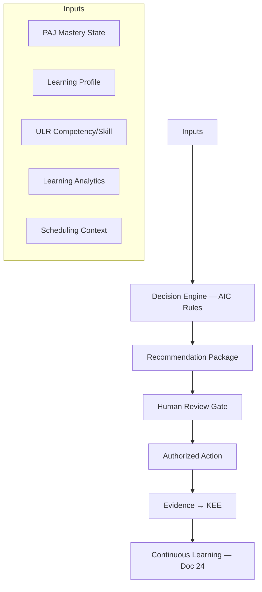

# DOCUMENT 29 — AI Instructional Coach™

**Project:** The Academy Way Learning System™ — Phase 4  
**Status:** Implementation Blueprint — AI Recommendation Architecture Only  
**Integrates:** Part VI-A Learning Intelligence™ · Documents 18–28 · Decision Engine · Document 24 Research Framework

---

## 1. Charter

The **AI Instructional Coach™ (AIC)** defines how AcademyOS AI **recommends instructional actions** — strategies, grouping, scheduling, practice, interventions, and evidence collection — under **human oversight**.

**AI recommends. Educators decide. Evidence confirms.**

No AI implementation in this phase — architecture and rule taxonomy only.

---

## 2. Constitutional Boundaries

| Rule | Statement |
|------|-----------|
| **No auto-mastery** | AI never sets L3 without human validation |
| **No auto-tier-3** | Intensive intervention requires educator authorization |
| **No Wilson auto-advance** | Step advancement recommendation only — certified teacher decides |
| **Explainability** | Every recommendation cites evidence and rules |
| **Confidence displayed** | Low confidence → human review mandatory |
| **Profile respect** | Recommendations use profile — not labels |
| **Global ethics** | Doc D — jurisdiction AI rules apply |

---

## 3. AI Instructional Coach Architecture

---

## 4. Recommendation Categories

The AI shall recommend across all categories below. Each category maps to **rule keys** registered in `ulr_ai_rule_catalog` and competency `ai_coaching_rule_keys[]` (Doc 25).

---

### 4.1 Instructional Strategies

| Rule Pattern | Trigger | Output |
|--------------|---------|--------|
| `aic.strategy.primary` | New skill; low prior mastery | Doc 18 model — e.g., explicit, gradual release |
| `aic.strategy.switch` | Error pattern persistence | Alternate model — e.g., errorless learning |
| `aic.strategy.fade_scaffold` | L2 with scaffold — 3 successes | Reduce scaffold level |
| `aic.wilson.fidelity` | SL session | Fidelity checklist emphasis |

**Inputs:** skill state, `common_error_patterns`, instructional history, profile EF.

---

### 4.2 Grouping

| Rule Pattern | Trigger | Output |
|--------------|---------|--------|
| `aic.group.skill_band` | Shared prerequisite level | Small group roster suggestion |
| `aic.group.wilson` | SL placement band | Min-2 group composition |
| `aic.group.heterogeneous` | PBL, discussion | Mixed mastery with roles |
| `aic.group.solo` | EF overload, Tier 3 | 1:1 recommendation |

**Constraints:** Academy Way min class size; SIE capacity; never group by diagnostic label.

---

### 4.3 Scheduling

| Rule Pattern | Trigger | Output |
|--------------|---------|--------|
| `aic.schedule.session` | Next skill ready | Duration, time slot, modality |
| `aic.schedule.spacing` | L3 achieved | Review session date |
| `aic.schedule.dosage_recovery` | Wilson dosage deficit | Additional SL block |
| `aic.schedule.timezone_fair` | Global team | Rotating meeting suggestion |
| `aic.schedule.break` | Attention profile | Break insertion |

**Integration:** Scheduling Intelligence executes authorized schedules — AIC proposes.

---

### 4.4 Practice

| Rule Pattern | Trigger | Output |
|--------------|---------|--------|
| `aic.practice.retrieval` | Post-L3 | Spaced retrieval plan |
| `aic.practice.interleave` | Related skills L3 | Mixed practice set |
| `aic.practice.home` | Family capacity; skill type | Home practice plan (Doc 20) |
| `aic.practice.resource` | Skill gap | Doc 28 resource refs |

---

### 4.5 Interventions

| Rule Pattern | Trigger | Output |
|--------------|---------|--------|
| `aic.intervention.tier_suggest` | Risk score; stall | Tier 2 draft plan |
| `aic.intervention.skill_target` | Prerequisite gap | Target skill list |
| `aic.intervention.micro` | Session error spike | Micro-intervention (Doc 20) |
| `aic.intervention.exit_ready` | Probe trend | Exit recommendation |

**Human gate:** Tier 2+ plans require educator approval.

---

### 4.6 Accommodations

| Rule Pattern | Trigger | Output |
|--------------|---------|--------|
| `aic.accommodation.apply` | Profile + skill EF demand | Suggested accommodations for session |
| `aic.accommodation.review` | Ineffectiveness signal | Review accommodation list |
| `aic.accommodation.assessment` | Upcoming assessment | Assessment accommodations (Doc 21) |

**Rule:** AI suggests — does not modify legal IEP/504 without human workflow.

---

### 4.7 Enrichment

| Rule Pattern | Trigger | Output |
|--------------|---------|--------|
| `aic.enrich.acceleration` | L3 + transfer evidence | Next advanced skill |
| `aic.enrich.project` | Interest + readiness | Extension project (Doc 28) |
| `aic.enrich.opportunity` | Mastery + profile | Opportunity Engine match (Doc 9) |

---

### 4.8 Family Activities

| Rule Pattern | Trigger | Output |
|--------------|---------|--------|
| `aic.family.activity` | Skill with parent look-fors | Family activity resource |
| `aic.family.coaching` | Wilson home practice | VI-F.16 coaching card |
| `aic.family.pathway` | Family Journey gap | Pathway suggestion (Doc 8) |

**Language:** Family communication locale (Doc A/C).

---

### 4.9 Projects

| Rule Pattern | Trigger | Output |
|--------------|---------|--------|
| `aic.project.ready` | Prerequisite competencies L3 | PBL project launch |
| `aic.project.team` | Venture / Earthology | Team composition |
| `aic.project.milestone` | In-progress project | Next milestone |

---

### 4.10 Assessment Timing

| Rule Pattern | Trigger | Output |
|--------------|---------|--------|
| `aic.assess.formative` | End of lesson segment | CFU item suggestion |
| `aic.assess.summative` | Cycle week | Summative window |
| `aic.assess.mastery_ready` | Evidence bundle near complete | Mastery validation prompt |
| `aic.assess.retention` | Spacing interval elapsed | Retention probe schedule |

---

### 4.11 Evidence Collection

| Rule Pattern | Trigger | Output |
|--------------|---------|--------|
| `aic.evidence.gap` | Missing type for bundle | Evidence type to collect |
| `aic.evidence.quality` | Low quality score | Re-demonstration suggestion |
| `aic.evidence.portfolio` | High quality artifact | Portfolio inclusion prompt |
| `aic.evidence.capture_method` | Modality match | Observation vs. artifact recommendation |

---

## 5. Recommendation Package Schema

Every AI recommendation **shall** include:

| Field | Required | Description |
|-------|----------|-------------|
| `recommendation_id` | Yes | UUID |
| `rule_key` | Yes | From catalog |
| `category` | Yes | §4 category |
| `student_id` | Yes | |
| `skill_keys[]` / `competency_keys[]` | Yes | |
| `summary` | Yes | Plain language — educator facing |
| `rationale` | Yes | Why this recommendation |
| `evidence_citations[]` | Yes | evidence_ids supporting trigger |
| `suggested_actions[]` | Yes | Structured action list |
| `confidence_score` | Yes | 0–1 — §6 |
| `explainability_payload` | Yes | Feature weights / rule conditions met |
| `human_review_required` | Yes | bool |
| `expires_at` | Yes | Stale recommendations expire |
| `locale` | Yes | Output language |

---

## 6. Confidence Score

| Factor | Effect |
|--------|--------|
| Profile completeness | Higher → higher confidence |
| Evidence density on skill | Higher → higher |
| Rule historical accuracy | Doc 24 feedback loop |
| Prediction novelty | New rule → lower until validated |
| Cross-domain recommendation | Lower — more review |
| AI-generated content involved | Cap until human validates |

| Band | UI Treatment |
|------|--------------|
| ≥ 0.80 | Suggest prominently — light review |
| 0.60–0.79 | Display — educator review recommended |
| < 0.60 | Suppress auto-surface — manual query only |

---

## 7. Explainability

| Element | Requirement |
|---------|-------------|
| **Plain language summary** | Educator-readable — no raw model jargon |
| **Trigger conditions** | Which inputs fired the rule |
| **Evidence links** | Clickable evidence_ids |
| **Alternative options** | At least 1 alternative when applicable |
| **What AI cannot see** | Gaps acknowledged — e.g., incomplete profile |
| **Wilson** | Category-coded rationale — no proprietary content |

**Student/family view:** Simplified explanation when recommendation affects them.

---

## 8. Human Review

| Recommendation Type | Review Required |
|---------------------|-----------------|
| Instructional strategy | Optional — educator discretion |
| Grouping / scheduling | Optional — default accept with edit |
| Tier 2 intervention | **Required** |
| Tier 3 intervention | **Required** + specialist |
| Mastery validation prompt | **Required** — educator confirms |
| Wilson Step advancement | **Required** — certified teacher |
| Accommodation change | **Required** |
| Assessment high-stakes | **Required** |
| AI-only evidence path | **Blocked** |

**Workflow:** Accept · Modify · Dismiss · Defer — all logged in KEE.

---

## 9. Continuous Learning

| Loop | Mechanism |
|------|-----------|
| **Outcome tracking** | Accepted recommendations vs. mastery velocity change |
| **Dismissal analysis** | Why educators reject — rule refinement |
| **Research Framework** | Doc 24 — anonymized strategy comparison |
| **Rule versioning** | `rule_key` semver; A/B at org level with consent |
| **Bias audit** | Periodic — recommendation equity by profile dimension |
| **Model retraining gate** | Human approval before production model update |

**Rule:** Continuous learning **never** bypasses human review gates for high-stakes actions.

---

## 10. Integration Matrix

| System | Role |
|--------|------|
| **Decision Engine** | Rule execution host |
| **Doc 25** | `ai_coaching_rule_keys[]` per competency |
| **Doc 18–22** | Recommended actions content |
| **Doc 23** | Triggers from analytics |
| **Doc 27** | Evidence citations |
| **Doc 30** | Rule publish governance |
| **Intelligence Graph** | Prerequisite / next skill context |

---

## 11. Governance Rules

| Rule | Requirement |
|------|-------------|
| **AIC-1** | Every recommendation has confidence + explainability |
| **AIC-2** | No mastery state change from AIC alone |
| **AIC-3** | Dismissals logged — min 90-day retention |
| **AIC-4** | Wilson recommendations require certified teacher audience |
| **AIC-5** | Family recommendations in family locale |
| **AIC-6** | Rule catalog changes require Doc 30 approval |

---

*End of Document 29 — AI Instructional Coach™*
