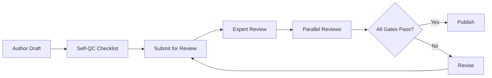

# DOCUMENT 30 — Competency Library Governance™

**Project:** The Academy Way Learning System™ — Phase 4  
**Status:** Implementation Blueprint — Governance & Quality Architecture Only  
**Authority:** Enforces Documents 25–29 for all competency library population  
**First library:** Structured Literacy (Wilson / OG aligned) — gold standard

---

## 1. Charter

**Competency Library Governance™ (CLG)** defines how competency libraries **evolve, are reviewed, published, deprecated, and audited** in AcademyOS.

Thousands of competencies and atomic skills require **industrial-grade authoring governance** — not ad-hoc edits.

**No competencies are populated in this phase.** Governance standards only.

---

## 2. Governance Philosophy

| Principle | Statement |
|-----------|-----------|
| **Published is immutable** | Keys never reused; changes version forward |
| **Gold standard first** | SL library sets quality bar for all domains |
| **Multi-lens review** | Expert, accessibility, international, AI — not single reviewer |
| **Evidence-linked quality** | Research validates thresholds (Doc 24) |
| **Transparent audit** | Every change traceable |
| **Safe retirement** | Deprecation preserves learner history |

---

## 3. Library Scope

| Library Key | Domain | Priority | Status |
|-------------|--------|----------|--------|
| `library.structured_literacy` | Wilson / OG aligned SL | **1 — Gold Standard** | First population post-Phase 4 |
| `library.real_life_math` | RLM | 2 | After SL quality bar met |
| `library.litlab` | LitLab | 3 | |
| `library.earthology` | Earthology | 4 | |
| `library.life_lab` | Life Lab | 5 | |
| `library.ai_venture_lab` | AI Venture Lab | 6 | |

**Rule:** Library N+1 cannot enter `published` until Library N meets minimum quality metrics (§15).

---

## 4. Versioning

### 4.1 Version Scheme

| Object | Version Type |
|--------|--------------|
| Competency | semver `MAJOR.MINOR.PATCH` |
| Atomic Skill | semver — MAJOR on criteria change |
| Assessment Item | semver |
| Instructional Resource | semver |
| AI Rule | semver |
| Library (aggregate) | `library.{domain}-v{MAJOR}` |

### 4.2 Version Semantics

| Change | Bump |
|--------|------|
| Typo, non-substantive clarity | PATCH |
| Added look-fors, resources, optional fields | MINOR |
| Success criteria, prerequisites, mastery rules | MAJOR |
| Skill deprecation / supersession | MAJOR + migration map |

### 4.3 Immutability

| State | Key Behavior |
|-------|--------------|
| `published` | `competency_key` / `skill_id` frozen |
| `deprecated` | Read-only; `superseded_by` required |
| `archived` | Hidden from new assignments; history retained |

---

## 5. Review Cycles

| Cycle | Frequency | Scope |
|-------|-----------|-------|
| **Continuous** | Ongoing | Draft → in_review queue |
| **Quarterly** | Every 3 months | Published library spot audit (5% sample) |
| **Annual** | Yearly | Full library meta-review |
| **Research-triggered** | Ad hoc | Doc 24 refutation or ineffectiveness |
| **Regulatory-triggered** | Ad hoc | Jurisdiction law change (Doc A) |
| **Wilson program update** | As announced | SL crosswalk review — category only |

---

## 6. Review Types

### 6.1 Expert Review

| Attribute | Definition |
|-----------|------------|
| **Purpose** | Domain accuracy and pedagogical soundness |
| **Reviewers** | Subject matter experts — min 2 per competency batch |
| **SL library** | Wilson certified trainer + structured literacy researcher |
| **Checklist** | Doc 25 §6 quality checklist |
| **Output** | `expert_review_status`: passed / revise / reject |

### 6.2 Wilson Review

| Attribute | Definition |
|-----------|------------|
| **Purpose** | SL alignment without copyrighted content |
| **Scope** | `library.structured_literacy` only — mandatory |
| **Checks** | Step/category crosswalk; fidelity; no proprietary text |
| **Reviewers** | Wilson certified + legal clearance |
| **Output** | `wilson_review_status` |

### 6.3 Academic Review

| Attribute | Definition |
|-----------|------------|
| **Purpose** | Cross-domain coherence, graduation alignment |
| **Reviewers** | Curriculum director, Doc 7 readiness owner |
| **Checks** | Prerequisites acyclic; graduation mappings; no duplication |
| **Output** | `academic_review_status` |

### 6.4 International Review

| Attribute | Definition |
|-----------|------------|
| **Purpose** | Global by Design compliance (Doc A/D) |
| **Reviewers** | International education lead per active country pack |
| **Checks** | Cultural neutrality; locale overlays; currency examples |
| **Output** | `international_review_status` |

### 6.5 Accessibility Review

| Attribute | Definition |
|-----------|------------|
| **Purpose** | UDL, WCAG, EF demands accuracy |
| **Reviewers** | Accessibility specialist |
| **Checks** | Doc 25 accommodations; Doc 26–28 accessibility fields |
| **Output** | `accessibility_review_status` |

### 6.6 Translation Review

| Attribute | Definition |
|-----------|------------|
| **Purpose** | Localized content quality |
| **Reviewers** | Native speaker educator per locale |
| **Checks** | Glossary consistency; parent look-fors plain language |
| **Output** | `translation_review_status` per locale |

### 6.7 AI Review

| Attribute | Definition |
|-----------|------------|
| **Purpose** | AI coaching rules safe, explainable, bounded |
| **Reviewers** | AI ethics + instructional designer |
| **Checks** | Doc 29 boundaries; no auto-mastery paths |
| **Output** | `ai_review_status` |

### 6.8 Research Validation

| Attribute | Definition |
|-----------|------------|
| **Purpose** | Empirical validation of mastery thresholds |
| **Source** | Doc 24 ARI studies |
| **Action** | Adjust criteria via MINOR/MAJOR version |
| **Output** | `research_validation_ref` |

---

## 7. Publication Requirements

A competency batch **may publish** only when:

| # | Gate |
|---|------|
| 1 | All Doc 25 required fields complete |
| 2 | Linked assessment items pass Doc 26 (min primary method) |
| 3 | Evidence types registered Doc 27 |
| 4 | Expert review passed |
| 5 | Academic review passed |
| 6 | Accessibility review passed |
| 7 | Wilson review passed (SL only) |
| 8 | International review passed (if locale overlays) |
| 9 | AI rules reviewed (if `ai_coaching_rule_keys` non-empty) |
| 10 | Library quality metrics ≥ threshold (§15) |

---

## 8. Retirement Policy

| Trigger | Action |
|---------|--------|
| Superseded by improved competency | `deprecated` + `superseded_by` |
| Research invalidates criteria | MAJOR version or deprecate |
| Regulatory conflict | Immediate deprecate + migration |
| Wilson program structural change | SL crosswalk update |
| Unused 24+ months | Review for archive candidacy |

**Learner protection:** Active PAJ assignments complete on deprecated version; new assignments use successor.

---

## 9. Deprecation

```
deprecated → migration_map published → grace_period (default 180 days) → archived
```

| Field | Required |
|-------|----------|
| `superseded_by` | Successor key |
| `migration_notes` | Educator guidance |
| `evidence_equivalency` | Old evidence counts toward new? explicit |
| `deprecation_date` | |
| `archive_date` | |

---

## 10. Audit History

Every object maintains:

| Field | Description |
|-------|-------------|
| `audit_log[]` | append-only |
| Entry shape | `{ timestamp, actor, action, from_version, to_version, rationale }` |
| `contributor_ids[]` | Authors |
| `reviewer_ids[]` | Approvers |
| `publish_date` | |
| `publish_authority` | Role that authorized |

**Storage:** Platform Registry audit + KEE governance records.

---

## 11. Quality Metrics

### 11.1 Object-Level Metrics

| Metric | Target |
|--------|--------|
| Field completeness | 100% required fields |
| Prerequisite acyclicity | 100% |
| Assessment linkage | ≥ 1 primary per competency |
| Evidence type diversity | ≥ 2 types |
| Bias review pass rate | 100% |
| Accessibility pass rate | 100% |

### 11.2 Library-Level Metrics

| Metric | SL Gold Standard | Other Libraries |
|--------|------------------|-----------------|
| Expert review coverage | 100% | 100% |
| Pilot validation items | ≥ 10% sampled | ≥ 5% |
| Educator usability score | ≥ 4.0/5 | ≥ 3.8/5 |
| AI dismissal rate | < 30% | < 35% |
| Mastery validation dispute rate | < 5% | < 8% |
| Research alignment | ≥ 1 citation per strand | recommended |

**Library 2+ gate:** SL library must hit all SL targets before RLM publish begins.

---

## 12. Contribution Workflow



### 12.1 Roles

| Role | Permission |
|------|------------|
| **Author** | Create draft |
| **Domain lead** | Submit batch |
| **Expert reviewer** | Approve domain content |
| **Wilson reviewer** | SL only |
| **Accessibility reviewer** | Approve a11y |
| **International reviewer** | Approve locale |
| **Library curator** | Publish authority |
| **ARI liaison** | Research validation link |

### 12.2 Batch Size

| Parameter | Default |
|-----------|---------|
| Min batch | 5 competencies |
| Max batch | 50 competencies |
| SL initial wave | Sub-strand units |

---

## 13. Approval Workflow

| Stage | Approver | SLA |
|-------|----------|-----|
| Expert review | 2 experts | 10 business days |
| Wilson review | Certified reviewer | 10 business days |
| Academic review | Curriculum director | 5 business days |
| Parallel reviews | Specialists | 10 business days |
| Final publish | Library curator | 2 business days |

**Escalation:** Dispute → Library Governance Council within 5 days.

---

## 14. Structured Literacy — Gold Standard Protocol

First populated library **must** complete:

| Phase | Deliverable |
|-------|-------------|
| **GS-1** | One complete sub-strand end-to-end (competency + skills + assessments + evidence + resources) |
| **GS-2** | Full review cycle per §6–7 on GS-1 |
| **GS-3** | Pilot with educators — usability metrics |
| **GS-4** | ARI sign-off on sample mastery validations |
| **GS-5** | Gold Standard Declaration — authorizes domain library scale-up |
| **GS-6** | Document exemplar keys in registry as `gold_standard_refs[]` |

All other libraries **reference** SL exemplars for authoring style.

---

## 15. Integration Matrix

| Document | Governance Role |
|----------|-----------------|
| **Doc 25** | Schema enforced |
| **Doc 26** | Assessment publish gates |
| **Doc 27** | Evidence type registration |
| **Doc 28** | Resource publish gates |
| **Doc 29** | AI rule review |
| **Doc 24** | Research validation |
| **Doc A–D** | International review |
| **Configuration Studio** | Publish target environment |

---

## 16. Governance Rules

| Rule | Requirement |
|------|-------------|
| **CLG-1** | No competency publish without full review chain |
| **CLG-2** | SL library is mandatory first population |
| **CLG-3** | Deprecated keys never reassigned |
| **CLG-4** | Audit log append-only |
| **CLG-5** | Quality metric failure blocks library expansion |
| **CLG-6** | Wilson copyrighted content prohibited in registry |
| **CLG-7** | Emergency deprecate requires 24h governance notice |

---

## 17. Post-Phase 4 Sequence

| Step | Action |
|------|--------|
| 1 | Phase 4 specification complete (Docs 25–30) |
| 2 | Author SL gold standard sub-strand (Phase 4.1) |
| 3 | Gold Standard Declaration |
| 4 | Scale SL library |
| 5 | Remaining domains per §3 priority |

---

*End of Document 30 — Competency Library Governance™*
