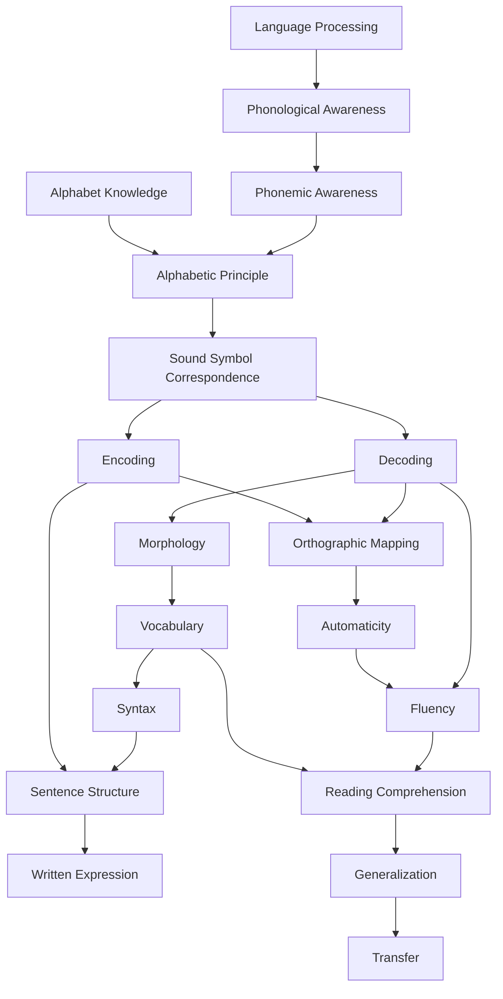
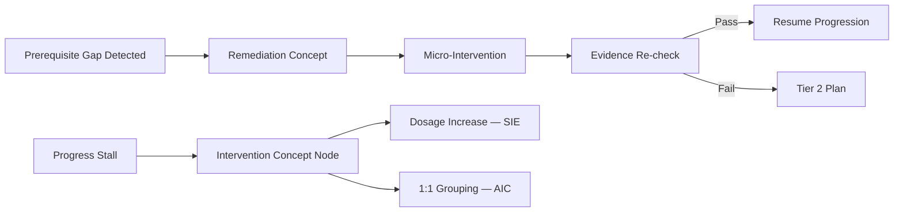

# DOCUMENT 39 — Structured Literacy Learning Relationships™

**Project:** The Academy Way Learning System™ — Phase 4.1  
**Domain Key:** `domain.structured_literacy`  
**Status:** Gold Standard Reference Implementation — Graph Architecture Only  
**Integrates:** Document 38 · Document 13 · Intelligence Graph · Docs 29–30

---

## 1. Charter

**Structured Literacy Learning Relationships™ (SLLR)** maps how concept areas (Doc 38) connect — the **directed knowledge graph** AcademyOS traverses for placement, progression, intervention, AI recommendations, and scheduling.

**No competencies or skills in this document** — relationship architecture only.

---

## 2. Graph Architecture

```
Intelligence Graph — SL Subgraph
    ├── Nodes: SL-CONCEPT-* (Doc 38)
    ├── Edges: Relationship types (§3)
    └── Traversal engines: PAJ, AIC, SIE, Intervention
```

**Edge ID convention:** `SL-EDGE-{FROM}-{TO}-{TYPE}`

---

## 3. Relationship Types

| Type Key | Semantics | Traversal Use |
|----------|-----------|---------------|
| `requires` | Hard prerequisite — must be proficient before unlock | Placement, next concept |
| `supports` | Soft boost — accelerates learning if present | Enrichment path |
| `strengthens` | Bidirectional practice benefit | Spacing, interleaving |
| `depends_upon` | Functional dependency — downstream needs upstream | Gap analysis |
| `transfers_to` | Cross-concept or cross-domain application | LitLab, acceleration |
| `often_confused_with` | Diagnostic disambiguation — not prerequisite | Error analysis, AI |
| `common_error_causes` | Error pattern → concept link | Intervention targeting |
| `intervention_relationship` | Intervention concept → target concept | Tier 2–3 plans |
| `cross_domain` | SL concept → other domain concept | Opportunity, transcript |

---

## 4. Core Literacy Progression Graph



**Note:** Executive function (`SL-CONCEPT-EXECUTIVE_FUNCTION`) attaches as **cross-cutting support** to all nodes — not shown for clarity.

---

## 5. Relationship Catalog (Selected Critical Edges)

### 5.1 Requires (Hard Prerequisites)

| From | To | Rationale |
|------|-----|-----------|
| Phonemic Awareness | Phonological Awareness | Phoneme work requires syllable/word awareness |
| Alphabetic Principle | Phonemic Awareness + Alphabet Knowledge | Mapping requires sounds and letters |
| Sound Symbol | Alphabetic Principle | Operational mapping follows concept |
| Decoding | Sound Symbol + Phonemic blending | Cannot decode without mapping |
| Encoding | Phonemic segmentation + Sound Symbol | Spelling requires segmenting |
| Orthographic Mapping | Decoding accuracy on pattern | Words mapped after decode path |
| Fluency | Decoding accuracy + OM on text level | Speed without accuracy harmful |
| Reading Comprehension | Fluency + Vocabulary | Comprehension needs automatic word access |
| Morphology | Multisyllabic decoding entry | Affix reading requires syllable skills |
| Written Expression | Encoding + Sentence Structure | Composition requires spelling + syntax |
| Generalization | Proficiency on source concept | Cannot generalize unmastered skill |
| Transfer | Generalization within SL | Cross-domain transfer follows internal generalization |

### 5.2 Supports (Soft)

| From | To | Effect |
|------|-----|--------|
| Encoding | Decoding | Spelling reinforces reading |
| Decoding | Encoding | Reading reinforces spelling |
| Vocabulary | Comprehension | Meaning support |
| Morphology | Vocabulary | Word family growth |
| Oral language | All PA concepts | Listening foundation |

### 5.3 Strengthens (Practice Links)

| Pair | Scheduling Implication |
|------|------------------------|
| Decoding ↔ Orthographic Mapping | Interleaved word work |
| Encoding ↔ Decoding | Dictation + reading pairs |
| Fluency ↔ Automaticity | Repeated reading + retrieval |
| Vocabulary ↔ Morphology | Morpheme + meaning drills |

### 5.4 Depends Upon (Downstream Dependency)

| Dependent | Depends On |
|-----------|------------|
| Reading Comprehension | Fluency, Vocabulary, Syntax |
| Written Expression | Encoding, Sentence Structure, EF |
| Transfer | Generalization, Reading Comprehension |
| Step band advancement (metadata) | Decoding + Encoding + Fluency cluster |

### 5.5 Transfers To (Cross-Concept / Cross-Domain)

| From (SL) | To | Type |
|-----------|-----|------|
| Reading Comprehension | LitLab reading strand | cross_domain |
| Written Expression | LitLab writing strand | cross_domain |
| Vocabulary | LitLab vocabulary | cross_domain |
| Fluency | Earthology primary sources | cross_domain |
| Executive Function (literacy) | Life Lab EF strand | cross_domain |
| Decoding proficiency | Graduation readiness literacy | readiness |

---

## 6. Often Confused With

| Concept A | Concept B | Disambiguation |
|-----------|-----------|----------------|
| Phonological Awareness | Phonemic Awareness | PA = larger units; PM = phonemes |
| Alphabetic Principle | Alphabet Knowledge | Principle = system; Knowledge = letter ID |
| Fluency | Automaticity | Fluency includes prosody; automaticity = effort |
| Decoding | Reading Comprehension | Decode ≠ understand |
| Encoding | Written Expression | Spelling ≠ composition |
| Vocabulary | Morphology | Meaning vs. structure |
| Generalization | Transfer | Within SL vs. cross-domain |

**AI use:** When error pattern matches confusion pair → recommend disambiguation re-teach, not skip prerequisite.

---

## 7. Common Error Causes (Edge Type)

| Error Pattern Category | Likely Source Concept | Intervention Direction |
|------------------------|----------------------|------------------------|
| Guessing from first letter | Weak phonemic blending | Phonemic awareness |
| Vowel confusion in spelling | Sound-symbol gap | SSC re-teach |
| Slow labored reading | Decoding accuracy | Pattern-specific decoding |
| No expression while reading | Fluency prosody | Model + repeated reading |
| Reads words; cannot retell | Comprehension / vocabulary | Vocabulary + comp strategy |
| Spells phonetically only on complex words | Morphology gap | Morpheme instruction |
| Session melt-down mid-task | EF overload | Scaffold, break, reduce load |

Edges: `common_error_causes` → `{ errorPatternKey, sourceConcept, targetIntervention }`

---

## 8. Intervention Relationships



| Intervention Node | Targets Concepts |
|-------------------|------------------|
| PA boost | Phonological → Phonemic gap |
| SSC rebuild | Sound-symbol errors |
| Decoding pattern re-teach | Specific syllable type |
| Encoding dictation cycle | Spelling errors |
| Fluency build | Accuracy + ORF |
| Comprehension scaffold | Vocabulary + strategy |
| EF scaffold pack | Cross-cutting |

---

## 9. Cross-Domain Relationships

| SL Concept | External Domain | Relationship |
|------------|-----------------|--------------|
| Reading Comprehension | LitLab reading | transfers_to |
| Written Expression | LitLab writing | transfers_to |
| Vocabulary | LitLab, Earthology research | supports |
| Fluency | LitLab oral reading | requires (for text access) |
| Executive Function | Life Lab, Learning Profile | cross_domain |
| Decoding | Wilson session (delivery) | metadata link only — VI-F |

**Rule:** LitLab does not duplicate decoding instruction — `requires` edge from LitLab reading to SL decoding proficiency.

---

## 10. Graph Traversal — AcademyOS Engines

### 10.1 Placement Traversal

```
1. Start at diagnostic evidence → assign concept bands
2. Walk `requires` edges backward → find earliest gap
3. Set PAJ entry concept + competency band
4. Do NOT skip hard `requires` edges
```

### 10.2 Progression Traversal

```
1. Current concept at L3 (via competencies mapped to concept)
2. Follow `requires` forward to candidates where all prerequisites L3
3. Rank by `supports` / typical_progression
4. AI (Doc 41) proposes; educator confirms
5. SIE schedules next session
```

### 10.3 Intervention Traversal

```
1. Risk score or error pattern fires
2. Walk `common_error_causes` backward to source concept
3. Check `requires` chain for gap
4. Select `intervention_relationship` target
5. Generate practice plan (Doc 20)
```

### 10.4 Spacing / Review Traversal

```
1. Concept achieved L3 → schedule `strengthens` pairs for review
2. Follow OM → AUTO → FLU chain for retention probes
3. SIE inserts spaced sessions per Doc 23 spacing metric
```

### 10.5 Cross-Domain Traversal

```
1. LitLab skill unlocked when SL `transfers_to` concept at L3
2. Opportunity Engine matches when transfer + interest align
3. Graduation readiness aggregates SL + transfer concepts
```

### 10.6 Cycle Detection

**Governance:** Graph must remain **DAG** on `requires` edges — validated at publish (Doc 30).

---

## 11. Graph Storage Model (Conceptual)

```
SLGraphEdge
    ├── edge_key
    ├── from_concept_key
    ├── to_concept_key
    ├── relationship_type
    ├── strength              (0–1 for soft edges)
    ├── rationale
    ├── bidirectional         (bool — for strengthens)
    ├── cross_domain_key      (optional)
    └── version
```

Hosted in **Intelligence Graph** — Platform Kernel (Part II).

---

## 12. Gold Standard Reference

Every future domain knowledge base publishes:
- Typed relationship catalog (§3)
- Progression subgraph
- Confusion pairs
- Error cause edges
- Cross-domain edges
- Engine traversal contracts (§10)

---

## 13. Governance

| Rule | Requirement |
|------|-------------|
| **SLLR-1** | `requires` edges acyclic |
| **SLLR-2** | Every concept has ≥1 path to comprehension or expression |
| **SLLR-3** | Confusion pairs require disambiguation note |
| **SLLR-4** | Cross-domain edges bidirectionally documented |
| **SLLR-5** | Graph changes — Doc 30 review |

---

*End of Document 39 — Structured Literacy Learning Relationships™*
