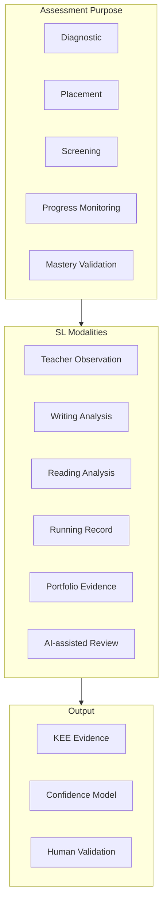

# DOCUMENT 40 — Structured Literacy Assessment Framework™

**Project:** The Academy Way Learning System™ — Phase 4.1  
**Domain Key:** `domain.structured_literacy`  
**Status:** Gold Standard Reference Implementation — SL Assessment Architecture Only  
**Integrates:** Doc 21 · Doc 26 · Doc 27 · Doc 38 · Part VI-F (metadata only)

---

## 1. Charter

The **Structured Literacy Assessment Framework™ (SLAF)** defines the **domain-specific assessment architecture** for Structured Literacy — how diagnostics, progress monitoring, observations, and mastery validation produce evidence without reproducing copyrighted Wilson instruments.

**Assessment produces KEE evidence** linked to concept keys (Doc 38) and future competencies (Doc 25).

**No assessment items populated in this phase.**

---

## 2. SL Assessment Philosophy

| Principle | SL Application |
|-----------|----------------|
| **Multi-method** | No single probe declares mastery |
| **Fidelity-aware** | Session observations include delivery quality metadata |
| **Confidence-scored** | Every instance weighted (Doc 27) |
| **Human-validated AI** | AI drafts never sole L3 path |
| **Category-coded** | Wilson alignment via Step/category metadata — not proprietary items |
| **Continuous monitoring** | Progress over episodic high-stakes |

---

## 3. Assessment Architecture



---

## 4. Assessment by Purpose

### 4.1 Diagnostic

| Attribute | SL Definition |
|-----------|---------------|
| **Purpose** | Map concept-level strengths and gaps across SL Knowledge Map |
| **When** | Enrollment; return from extended absence; post-Tier 3 exit |
| **Concept coverage** | PA through decoding entry minimum; extend by age/placement |
| **Methods** | Academy-authored diagnostic protocol — not Wilson copyrighted |
| **Output** | Concept band assignment; PAJ seed |
| **Evidence types** | `measurement.diagnostic` |
| **Reliability target** | ≥ 0.80 after pilot |
| **Human gate** | Educator reviews band assignment |

### 4.2 Placement

| Attribute | SL Definition |
|-----------|---------------|
| **Purpose** | Assign WRS Step band (metadata) and concept entry point |
| **When** | Pre-instruction; post-diagnostic |
| **Methods** | Placement protocol + prior records crosswalk |
| **Wilson boundary** | Step **band** assignment — certified teacher administers authorized external placement per VI-F |
| **Output** | `domain_placement` on profile; concept graph entry node |
| **Evidence types** | `measurement.placement` |
| **Human gate** | Certified Wilson teacher confirms Step band |

### 4.3 Screening

| Attribute | SL Definition |
|-----------|---------------|
| **Purpose** | Quick risk flag — not diagnosis |
| **When** | Cycle start; quarterly |
| **Duration** | ≤ 15 minutes |
| **Methods** | PA quick probe OR ORF sample OR encoding sample — rotated |
| **Output** | Risk flag → follow-up diagnostic or Tier 1 boost |
| **Evidence types** | `measurement.screening` |
| **Rule** | Screen positive ≠ label — triggers support |

### 4.4 Progress Monitoring

| Attribute | SL Definition |
|-----------|---------------|
| **Purpose** | Track rate of improvement on target concepts |
| **When** | Weekly Tier 2–3; biweekly Tier 1; post-L3 retention |
| **Methods** | CBM probes by concept cluster |
| **Probe types** | Phoneme segmentation, nonsense word decode, ORF, spelling probe |
| **Decision rules** | Flat trend 3 probes → intervention review |
| **Evidence types** | `measurement.progress`, `evidence.wilson.check` (metadata) |
| **Growth metric** | Doc 23 growth rate |

### 4.5 Mastery Validation

| Attribute | SL Definition |
|-----------|---------------|
| **Purpose** | Confirm L3 on concept/competency per Doc 6 |
| **When** | Evidence bundle complete |
| **Methods** | Multi-method bundle — min 2 types, 2 sources |
| **Requirements** | Educator confirmation; aggregate confidence ≥ 0.75 |
| **Evidence types** | `mastery.validation` |
| **Step advancement** | Separate Step band check — certified teacher; not auto |

---

## 5. Assessment Modalities (SL-Specific)

### 5.1 Teacher Observation

| Element | Specification |
|---------|---------------|
| **Use** | PA, SSC, session fidelity, EF during literacy |
| **Protocol** | Structured look-fors from Doc 38 concept |
| **Instrument type** | Doc 26 `observation` |
| **Fidelity rubric** | OG principles strand — VI-F.14 categories |
| **Scoring** | Checklist or scale |
| **Confidence** | High when calibrated observer |
| **Evidence** | `observation.instructional`, `observation.fidelity` |

### 5.2 Writing Analysis

| Element | Specification |
|---------|---------------|
| **Use** | Encoding, sentence structure, written expression |
| **Analysis dimensions** | Spelling pattern, syntax, cohesion — rubric |
| **Instrument type** | Doc 26 `artifact_review` + rubric |
| **AI role** | Draft error pattern detection — human validates |
| **Evidence** | `artifact.writing`, `measurement.rubric` |

### 5.3 Reading Analysis

| Element | Specification |
|---------|---------------|
| **Use** | Decoding, fluency, comprehension on text |
| **Analysis dimensions** | Accuracy, rate, comp questions |
| **Text level** | Controlled band — qualitative complexity |
| **Instrument type** | Doc 26 composite |
| **Evidence** | `evidence.wilson.reading`, `measurement.running_record` |

### 5.4 Running Records

| Element | Specification |
|---------|---------------|
| **Use** | Fluency + comprehension; miscue analysis |
| **Coding** | Errors, self-corrections, meaning/structural/visual |
| **Duration** | Standardized minutes oral reading |
| **Wilson boundary** | Academy protocol — not Wilson copyrighted form |
| **Evidence** | `measurement.running_record` |
| **Links concepts** | Decoding, fluency, comprehension |

### 5.5 Portfolio Evidence

| Element | Specification |
|---------|---------------|
| **Use** | Growth over time; generalization; transfer |
| **Artifacts** | Reading recordings, writing samples, reflections |
| **Review** | Cycle-end portfolio conference |
| **Evidence** | `artifact.portfolio`, `artifact.presentation` |
| **Transcript** | High-quality samples for mastery transcript |

### 5.6 AI-Assisted Review

| Element | Specification |
|---------|---------------|
| **Use** | Draft miscue summary; spelling pattern clustering; probe scoring assist |
| **Prohibited** | Sole L3 determination; Step advancement |
| **Confidence cap** | 0.70 until human validates |
| **Workflow** | AI draft → educator review → finalized evidence |
| **Evidence** | `measurement.ai_draft` → validated → full weight |

---

## 6. SL Assessment Method Registry (Conceptual Keys)

| Method Key | Purpose | Modality |
|------------|---------|----------|
| `assess.sl.diagnostic` | Diagnostic | Multi-concept |
| `assess.sl.placement` | Placement | Band assignment |
| `assess.sl.screen.pa` | Screening | PA quick |
| `assess.sl.screen.orf` | Screening | ORF sample |
| `assess.sl.probe.phoneme` | Progress | PM |
| `assess.sl.probe.nwf` | Progress | PM |
| `assess.sl.probe.orf` | Progress | PM |
| `assess.sl.probe.spelling` | Progress | PM |
| `assess.sl.step_band_check` | Progress / placement | Metadata band |
| `assess.sl.running_record` | Reading analysis | RR |
| `assess.sl.writing_rubric` | Writing analysis | Rubric |
| `assess.sl.observation.fidelity` | Observation | Fidelity |
| `assess.sl.retention` | Post-mastery | Retention |
| `assess.sl.transfer` | Generalization | Performance |
| `assess.sl.mastery_bundle` | Mastery validation | Composite |

---

## 7. Confidence Model (SL-Specific)

### 7.1 Base Weights by Modality

| Modality | Base Confidence |
|----------|-----------------|
| Calibrated observation | 0.90 |
| Published probe (pilot-validated) | 0.85 |
| Running record | 0.85 |
| Writing rubric (calibrated) | 0.80 |
| Parent observation | 0.55 |
| AI draft unvalidated | 0.40 |
| AI human-validated | 0.75 |

### 7.2 SL Modifiers

| Factor | Adjustment |
|--------|------------|
| Wilson certified administrator | +0.05 on placement/step check |
| Fidelity below threshold | −0.15 on session evidence |
| Accommodations applied | Noted — validity argument |
| Text level mismatch | −0.20 |
| Expired probe (> 90 days for mastery) | Exclude from active calc |

### 7.3 Mastery Bundle Confidence

```
bundle_confidence = weighted_mean(evidence_confidence[])
require bundle_confidence >= 0.75 for mastery.validation
require >= 1 educator-sourced evidence
require >= 2 distinct evidence_type_keys
```

---

## 8. Human Validation Requirements

| Assessment Event | Human Required |
|------------------|----------------|
| Diagnostic band assignment | Yes |
| Placement / Step band | Yes — Wilson certified |
| Screening follow-up decision | Yes |
| Progress probe → intervention change | Yes |
| Mastery validation | Yes |
| Step band advancement | Yes — certified |
| AI miscue analysis final | Yes |
| Portfolio inclusion for transcript | Yes |

---

## 9. Concept & Evidence Mapping

Every SL assessment instrument **shall** declare:

| Field | Description |
|-------|-------------|
| `target_concept_keys[]` | Doc 38 |
| `target_competency_keys[]` | Future — Doc 25 |
| `evidence_type_key` | Doc 27 |
| `evidence_bundle_role` | primary, supplementary, formative |

---

## 10. Integration Matrix

| System | Role |
|--------|------|
| **Doc 38** | Concept targets |
| **Doc 39** | Gap → assessment selection via graph |
| **Doc 41** | Assessment Coach recommendations |
| **Doc 42** | Parent observation protocols |
| **Doc 26** | Item authoring when populated |
| **KEE** | Evidence storage |
| **Doc 23** | Growth, retention metrics |

---

## 11. Gold Standard Reference

Future domains publish parallel **Domain Assessment Framework** with:
- Purpose taxonomy (§4 pattern)
- Modality catalog (§5 pattern)
- Method key registry (§6 pattern)
- Confidence model (§7 pattern)
- Human validation matrix (§8)

---

## 12. Governance

| Rule | Requirement |
|------|-------------|
| **SLAF-1** | No copyrighted Wilson assessment items in registry |
| **SLAF-2** | Step references are band metadata only |
| **SLAF-3** | AI never sole path to mastery validation |
| **SLAF-4** | All methods map to concept_keys before publish |
| **SLAF-5** | Pilot data required before reliability claim ≥ 0.85 |

---

*End of Document 40 — Structured Literacy Assessment Framework™*
