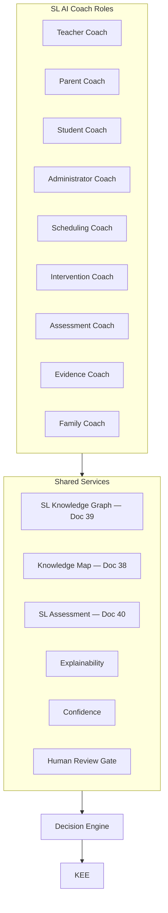

# DOCUMENT 41 — Structured Literacy AI Coach™

**Project:** The Academy Way Learning System™ — Phase 4.1  
**Domain Key:** `domain.structured_literacy`  
**Status:** Gold Standard Reference Implementation — SL AI Architecture Only  
**Extends:** Document 29 AI Instructional Coach™ · Doc 38–40 · Part VI-F

---

## 1. Charter

The **Structured Literacy AI Coach™ (SLAIC)** defines **domain-specific AI support roles** for Structured Literacy — extending the platform AI Instructional Coach (Doc 29) with SL knowledge graph, assessment, and Wilson delivery constraints.

**AI coaches; humans decide; evidence confirms.**

**No copyrighted Wilson content in AI outputs.**

---

## 2. Coach Role Architecture

---

## 3. Universal SL Recommendation Schema

Extends Doc 29 package with:

| Field | SL-Specific |
|-------|-------------|
| `concept_keys[]` | Doc 38 targets |
| `step_band_context` | Metadata only — not proprietary |
| `fidelity_consideration` | bool |
| `wilson_certified_required` | bool |
| `coach_role` | From §4 |

---

## 4. Coach Roles

### 4.1 Teacher Coach

| Attribute | Definition |
|-----------|------------|
| **Audience** | Wilson-certified and SL educators |
| **Recommends** | Instructional strategies (Doc 18 SL models), grouping, CFU items, error correction approach, fidelity reminders |
| **Inputs** | Session plan, student mastery, error patterns, concept graph |
| **Outputs** | Pre-session brief; post-session debrief; re-teach suggestion |
| **Wilson boundary** | References authorized materials externally — does not reproduce |
| **Human gate** | Recommendations only |
| **Rule keys** | `sl.aic.teacher.strategy`, `sl.aic.teacher.error`, `sl.aic.teacher.fidelity` |

### 4.2 Parent Coach

| Attribute | Definition |
|-----------|------------|
| **Audience** | Families — Family Journey (Doc 42) |
| **Recommends** | Home practice type, reading routine, celebration, when to pause |
| **Inputs** | Home practice capacity, concept progress, parent voice |
| **Outputs** | Plain-language coaching cards — family locale |
| **Prohibited** | Replacing WRS instruction; diagnosing |
| **Human gate** | Escalation to teacher on struggle |
| **Rule keys** | `sl.aic.parent.practice`, `sl.aic.parent.routine`, `sl.aic.parent.celebrate` |

### 4.3 Student Coach

| Attribute | Definition |
|-----------|------------|
| **Audience** | Students — age-appropriate |
| **Recommends** | Practice focus, self-check strategies, reflection prompts, motivation |
| **Inputs** | Mastery level, student voice, engagement |
| **Outputs** | Encouragement + next practice step — not answers to assessments |
| **Prohibited** | Decoding answers during probes; Step advancement |
| **Human gate** | Teacher visibility on all threads |
| **Rule keys** | `sl.aic.student.practice`, `sl.aic.student.reflect`, `sl.aic.student.motivate` |

### 4.4 Administrator Coach

| Attribute | Definition |
|-----------|------------|
| **Audience** | School leaders, compliance |
| **Recommends** | Dosage compliance aggregates, fidelity trends, staffing for groups |
| **Inputs** | Org-level analytics — anonymized |
| **Outputs** | Operational briefs — not individual student labels |
| **Human gate** | Leadership decision |
| **Rule keys** | `sl.aic.admin.dosage`, `sl.aic.admin.fidelity`, `sl.aic.admin.capacity` |

### 4.5 Scheduling Coach

| Attribute | Definition |
|-----------|------------|
| **Audience** | SIE + educators |
| **Recommends** | Session times, group composition, dosage recovery, spacing reviews, break insertion |
| **Inputs** | Timezone, attention profile, concept readiness, min group 2 |
| **Outputs** | Schedule proposals for SIE |
| **Wilson** | Dosage targets from VI-F.15 org config |
| **Human gate** | Scheduler/educator approve |
| **Rule keys** | `sl.aic.schedule.session`, `sl.aic.schedule.dosage`, `sl.aic.schedule.spacing` |

### 4.6 Intervention Coach

| Attribute | Definition |
|-----------|------------|
| **Audience** | Educators, specialists |
| **Recommends** | Tier suggestion, target concept from graph, micro-intervention, practice plan draft |
| **Inputs** | Risk score, error cause edges (Doc 39), stall duration |
| **Outputs** | Intervention plan draft |
| **Human gate** | **Required** Tier 2+ |
| **Rule keys** | `sl.aic.intervention.tier`, `sl.aic.intervention.concept`, `sl.aic.intervention.micro` |

### 4.7 Assessment Coach

| Attribute | Definition |
|-----------|------------|
| **Audience** | Educators |
| **Recommends** | Which probe, when to assess, mastery bundle readiness, retention schedule |
| **Inputs** | Evidence gaps, concept state, Doc 40 methods |
| **Outputs** | Assessment timing + method suggestion |
| **Human gate** | Mastery validation always human |
| **Rule keys** | `sl.aic.assess.timing`, `sl.aic.assess.probe`, `sl.aic.assess.mastery_ready` |

### 4.8 Evidence Coach

| Attribute | Definition |
|-----------|------------|
| **Audience** | Educators |
| **Recommends** | Missing evidence types, quality improvement, portfolio candidates |
| **Inputs** | Bundle rules Doc 27, current KEE records |
| **Outputs** | Evidence collection checklist |
| **Human gate** | Capture confirmation |
| **Rule keys** | `sl.aic.evidence.gap`, `sl.aic.evidence.quality`, `sl.aic.evidence.portfolio` |

### 4.9 Family Coach

| Attribute | Definition |
|-----------|------------|
| **Audience** | Whole family unit — Doc 42 |
| **Recommends** | Family pathway activities, sibling support, progress celebrations, communication with teacher |
| **Inputs** | Family Journey progress, multilingual preference |
| **Outputs** | Unified family dashboard suggestions |
| **Integration** | Doc 8 pathways + Doc C global support |
| **Rule keys** | `sl.aic.family.pathway`, `sl.aic.family.progress`, `sl.aic.family.connect` |

---

## 5. Explainability (SL-Specific)

| Element | Requirement |
|---------|-------------|
| **Concept citation** | Which `SL-CONCEPT-*` triggered rule |
| **Graph path** | Prerequisites checked — pass/fail |
| **Evidence citation** | evidence_ids from KEE |
| **Plain language** | Role-appropriate — parent vs. teacher |
| **Wilson disclaimer** | When Step band mentioned — metadata only |
| **Alternatives** | Min 1 other approach when feasible |
| **Unknown gaps** | "Profile incomplete" when low data |

---

## 6. Confidence Model

| Factor | SL Weight |
|--------|-----------|
| Concept proficiency data density | High |
| Wilson fidelity score on recent sessions | High |
| Certified teacher validation present | +0.10 |
| Parent-only evidence trigger | Cap 0.65 |
| AI-only chain | Block L3 recommendations |
| Cross-domain (LitLab) transfer | Moderate — lower until SL L3 |

| Band | Coach Behavior |
|------|----------------|
| ≥ 0.80 | Surface proactively |
| 0.60–0.79 | Suggest with review flag |
| < 0.60 | On-demand query only |

---

## 7. Human Review Matrix

| Coach Role | Auto-Execute | Review Required |
|------------|--------------|-----------------|
| Teacher Coach | Never | Educator discretion |
| Parent Coach | Never | Teacher visibility |
| Student Coach | Never | Teacher visibility |
| Administrator Coach | Never | Leadership |
| Scheduling Coach | Never | Scheduler approve |
| Intervention Coach | Never | **Always** Tier 2+ |
| Assessment Coach | Never | **Always** mastery |
| Evidence Coach | Never | Educator confirm capture |
| Family Coach | Never | Optional family accept |

**Hard blocks:**
- Step band advancement recommendation without certified teacher recipient
- Tier 3 without specialist workflow
- Mastery validation without educator

---

## 8. Continuous Learning (SL)

| Signal | Action |
|--------|--------|
| Recommendation accepted + L3 achieved | Increase rule confidence |
| Recommendation dismissed | Log reason — ARI review |
| Error pattern misprediction | Refine `common_error_causes` edges |
| Dosage recovery success rate | Tune scheduling coach |
| Parent coach engagement | Refine Family pathways |

Doc 24 Research Framework — SL outcome studies.

---

## 9. Integration Matrix

| System | Role |
|--------|------|
| **Doc 29** | Platform AIC base |
| **Doc 38–39** | Concept + graph |
| **Doc 40** | Assessment methods |
| **Doc 42** | Parent/Family coach content |
| **Decision Engine** | Rule execution |
| **SIE** | Scheduling coach output |
| **Family Journey** | Parent/Family coach surfaces |

---

## 10. Gold Standard Reference

Future domains implement **Domain AI Coach** with:
- Role catalog (educator, parent, student, admin, scheduling, intervention, assessment, evidence, family)
- Explainability + confidence + human review matrices
- Domain-specific rule key namespace

---

## 11. Governance

| Rule | Requirement |
|------|-------------|
| **SLAIC-1** | No Wilson copyrighted text in AI outputs |
| **SLAIC-2** | Student coach never gives assessment answers |
| **SLAIC-3** | All roles log to KEE audit |
| **SLAIC-4** | Confidence displayed on every recommendation |
| **SLAIC-5** | Rule keys registered in Doc 30 before activate |

---

*End of Document 41 — Structured Literacy AI Coach™*
