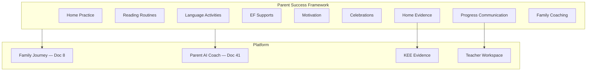

# DOCUMENT 42 — Structured Literacy Parent Success Framework™

**Project:** The Academy Way Learning System™ — Phase 4.1  
**Domain Key:** `domain.structured_literacy`  
**Status:** Gold Standard Reference Implementation — Family Layer Only  
**Integrates:** Part V Family Journey™ · Part VI-F.16 · Doc 8 · Doc 38 · Doc 41 · Global Doc C

---

## 1. Charter

The **Structured Literacy Parent Success Framework™ (SLPSF)** defines how AcademyOS equips **parents and guardians** to support Structured Literacy at home — without replacing Wilson-certified instruction or reproducing copyrighted materials.

**Parents are coaches, not Wilson instructors.**

Every parent activity links to **concept keys** (Doc 38), future **competencies**, and **evidence types** (Doc 27).

---

## 2. Parent Success Philosophy

| Principle | Statement |
|-----------|-----------|
| **Coach not teach** | Parents reinforce — certified teachers deliver WRS |
| **Plain language** | No jargon without glossary; multilingual via Doc A/C |
| **Strengths-first** | Celebrate effort and growth — not deficit framing |
| **Capacity-aware** | Respect `home_practice_capacity` on profile |
| **Evidence-optional** | Home logs supplement — never sole L3 |
| **Voice honored** | Parent observations inform — do not override educator mastery |

---

## 3. Parent Success Architecture



---

## 4. Home Practice

### 4.1 Purpose
Reinforce concepts taught in WRS sessions through brief, structured home activities.

### 4.2 Design Rules

| Rule | Requirement |
|------|-------------|
| **Duration** | Default ≤ 15 minutes |
| **Frequency** | 3–5× per week when assigned — not daily overload |
| **Alignment** | Maps to current `concept_key` on PAJ |
| **Materials** | Household or digital — no proprietary Wilson worksheets |
| **Assignment** | Teacher or practice plan (Doc 20) — not AI alone |

### 4.3 Practice Types (Concept-Linked)

| Practice Type | Target Concepts | Parent Role |
|---------------|-----------------|-------------|
| **Sound listening walk** | Phonological awareness | Name environmental sounds |
| **Rhyme time** | PA, phonemic entry | Play rhyme games |
| **Letter-sound hunt** | Alphabet, sound-symbol | Find letters in environment |
| **Decodable echo** | Decoding | Listen to child read assigned decodable text |
| **Spelling dictation support** | Encoding | Call out teacher-assigned word list |
| **Repeated reading listen** | Fluency | Time and encourage — not correct every error |
| **Vocabulary conversation** | Vocabulary | Use new words at dinner |
| **Retell practice** | Comprehension | Ask who/what/where after reading |

### 4.4 Evidence
`observation.parent`, optional `media.audio` — weight supplementary (Doc 40).

---

## 5. Reading Routines

### 5.1 Purpose
Establish predictable literacy rhythms that support motivation and habit.

### 5.2 Routine Templates

| Routine | Structure | Concepts Supported |
|---------|-----------|-------------------|
| **Read-aloud daily** | 10–20 min parent reads | Vocabulary, comprehension, language processing |
| **Child read-aloud** | Post-decoding entry | Fluency, decoding generalization |
| **Bedtime phoneme game** | 2 min | Phonemic awareness |
| **Weekend library visit** | Extended | Motivation, vocabulary |
| **Audiobook + follow** | Parallel listen/read | Fluency, comprehension |

### 5.3 Customization
Profile: timezone, family schedule, multilingual home — routines adapt via Parent AI Coach.

---

## 6. Language Activities

| Activity | Description | Concepts |
|----------|-------------|----------|
| **Storytelling** | Oral narrative | Language processing, sentence structure |
| **Word play** | Riddles, tongue twisters | PA, phonemic |
| **Meaning chat** | Discuss word origins casually | Morphology, vocabulary |
| **Multilingual bridge** | Connect home language to English literacy | Language processing — strength framing |
| **Direction games** | Follow multi-step oral directions | EF, language processing |

**Global:** Doc C translation; activities available in family communication language with English literacy bridge notes.

---

## 7. Executive Function Supports (Home)

| Support | Application |
|---------|-------------|
| **Visual schedule** | Literacy practice time visible |
| **Timer** | Bounded practice sessions |
| **Checklist** | Step-by-step home practice |
| **Break cards** | Child requests break without failure framing |
| **Organized reading space** | Reduce distraction |
| **Preview** | Tell child what practice will involve |

Linked to `SL-CONCEPT-EXECUTIVE_FUNCTION` and Learning Profile EF fields (Doc 19).

---

## 8. Motivation

| Strategy | Implementation |
|----------|----------------|
| **Growth language** | "You're building new pathways" — not "you're behind" |
| **Choice** | Pick decodable book or practice game when options exist |
| **Goal charts** | Visual concept progress — not competitive ranking |
| **Interest connection** | Tie reading to child interests on profile |
| **Effort celebration** | See §9 |

**Prohibited:** Shame, comparison to siblings, grade-level shaming.

---

## 9. Celebrations

| Trigger | Celebration Type |
|---------|------------------|
| Concept L3 (notified by teacher) | Family celebration ritual — parent chooses |
| Streak of home practice | Badge on Family Journey |
| First full decodable book | Portfolio moment |
| Step band advancement (teacher confirmed) | Milestone message — metadata only |
| Generalization evidence | Share recording with family |

Celebrations logged as Family Engagement evidence → KEE (VI-F.16).

---

## 10. Progress Communication

### 10.1 Parent-Facing Progress

| Element | Format |
|---------|--------|
| **Concept progress map** | Visual — plain language concept names |
| **Mastery levels** | Doc 6 scale — translated glossary |
| **Next focus** | Current concept + what parent can reinforce |
| **Teacher messages** | Async — family locale |
| **Avoid** | Raw probe scores without context |

### 10.2 Two-Way Communication

| Channel | Use |
|---------|------|
| **Parent → teacher** | Concern, observation, capacity update |
| **Teacher → parent** | Practice assignment, celebration, conference request |
| **AI summary draft** | Teacher-reviewed — not auto-sent |

### 10.3 Conference Triggers
Stall 4+ weeks; Tier 2 start; Step band change; parent request.

---

## 11. Home Evidence

### 11.1 Accepted Home Evidence

| Type | Capture | Weight |
|------|---------|--------|
| **Practice log** | Checkbox + minutes | Low |
| **Parent observation form** | Structured look-fors | Moderate-low |
| **Audio recording** | Child reading | Moderate — teacher verifies |
| **Photo** | Written work | Low |
| **Reflection** | Parent narrative | Supplementary |

### 11.2 Submission Workflow
Parent submits → KEE tagged `observation.parent` → teacher notification → educator validates before mastery weight.

### 11.3 Privacy
Recordings visible to educators and parents only — not peer-shared unless consent.

---

## 12. Family Coaching

### 12.1 Coaching Delivery

| Mode | Description |
|------|-------------|
| **Coaching cards** | One-page concept-specific guides |
| **Micro-videos** | Academy-authored — not Wilson |
| **Family Journey pathways** | Doc 8 SL modules |
| **Parent AI Coach** | Doc 41 — plain language Q&A |
| **Live coach sessions** | Optional org offering |

### 12.2 Coaching Topics

| Topic | Audience |
|-------|----------|
| Understanding dyslexia as learning profile | All — VI-D framing |
| What Wilson sessions look like (overview) | No proprietary detail |
| How to help without correcting every error | Decoding/fluency parents |
| When to ask for teacher help | All |
| Military/relocating families | Transfer continuity |

### 12.3 Wilson Boundary
Coaching explains **what** happens in sessions and **how** parents support — never reproduces lesson scripts or materials.

---

## 13. Parent Activity Registry (Conceptual)

```
SLParentActivity
    ├── activity_key
    ├── title (localized)
    ├── concept_keys[]
    ├── duration_minutes
    ├── materials[]
    ├── coaching_card_ref
    ├── evidence_type_key
    ├── capacity_requirement    (low, medium)
    ├── wilson_session_required (bool — child must be in WRS)
    └── family_pathway_ref
```

Populated with competencies in next phase — schema defined here.

---

## 14. Integration Matrix

| System | Role |
|--------|------|
| **Doc 38** | Concept linkage |
| **Doc 41** | Parent/Family AI Coach |
| **Doc 8** | Family Journey pathways |
| **Doc 20** | Home practice plans |
| **Doc 27** | Evidence types |
| **Doc C** | Global family resources |
| **VI-F.16** | Family engagement evidence |

---

## 15. Gold Standard Reference

Future domains publish **Domain Parent Success Framework**:
- Home practice rules
- Routines + language activities
- EF + motivation + celebrations
- Progress communication
- Home evidence workflow
- Family coaching boundaries

---

## 16. Governance

| Rule | Requirement |
|------|-------------|
| **SLPSF-1** | Parents never assigned Wilson instruction delivery |
| **SLPSF-2** | Home evidence never sole L3 |
| **SLPSF-3** | All activities link concept_keys |
| **SLPSF-4** | Plain language readability review |
| **SLPSF-5** | Multilingual packs for active country configs |
| **SLPSF-6** | No copyrighted Wilson content in coaching materials |

---

*End of Document 42 — Structured Literacy Parent Success Framework™*
