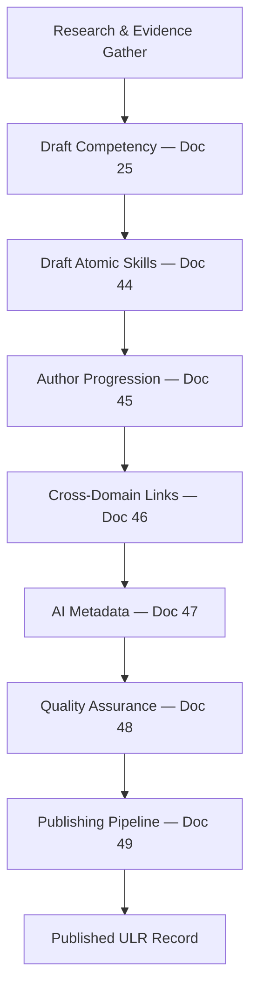
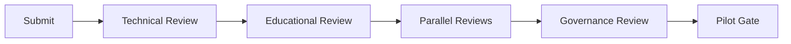

# DOCUMENT 43 — Competency Authoring Methodology™

**Project:** The Academy Way Learning System™ — Phase 4.1A  
**Status:** Implementation Blueprint — Universal Authoring Process Only  
**Authority:** Governs all competency population beginning Phase 4.2  
**Integrates:** Doc 25 · Doc 30 · Docs 38–42 · Docs 18–29

---

## 1. Charter

The **Competency Authoring Methodology™ (CAM)** defines the **complete universal process** for creating every competency in the Universal Learning Registry™.

**This is NOT curriculum. This is NOT a competency library.** It is the **authoring framework** that guarantees consistency across Structured Literacy, Real-Life Math, LitLab, Earthology, Life Lab, AI Venture Lab, and all future Academy programs.

One process. Every domain. Gold standard quality.

---

## 2. Authoring Philosophy

| Principle | Statement |
|-----------|-----------|
| **Evidence-first design** | Competencies authored from observable outcomes — not textbook chapters |
| **Schema-complete** | Doc 25 required fields before any review |
| **Knowledge-linked** | Domain knowledge base concepts (e.g., Doc 38) declared on every competency |
| **Multi-stakeholder** | Teacher, parent, student voice in review — not afterthought |
| **Global-ready** | International review at authoring — not retrofit |
| **AI-by-design** | AI metadata (Doc 47) authored with competency — not bolted on |
| **No copyrighted curriculum** | Wilson and third-party content referenced externally — not embedded |

---

## 3. Authoring Lifecycle Overview

---

## 4. Research Sources

Every competency **shall** document research basis in `research_sources[]`:

| Source Category | Examples | Use |
|-----------------|----------|-----|
| **Learning science** | Doc 18 models; cognitive science literature | Instructional strategy selection |
| **Domain standards** | Structured literacy research; financial literacy frameworks | Scope validation |
| **Academy Way blueprints** | Docs 1–42; constitution VI-B, VI-F | Alignment |
| **Assessment research** | Doc 21, 26; psychometric literature | Method selection |
| **Neurodiversity-informed** | Doc 19; VI-D principles | Accommodations, EF |
| **International frameworks** | Global Doc A/D; UNESCO SDG where relevant | Localization scope |
| **Institutional data** | ARI Doc 24 — anonymized outcome studies | Threshold calibration |
| **Expert practitioner knowledge** | Wilson certified trainers; domain leads | SL fidelity — category only |

**Rule:** `research_sources[]` minimum 1 entry; SL competencies minimum 2 including structured literacy research category.

---

## 5. Evidence Requirements (Authoring-Time)

Before draft completion, author defines:

| Element | Standard |
|---------|----------|
| **Evidence types** | Min 2 from Doc 27 — assigned in Doc 25 |
| **Assessment methods** | Min 1 primary from Doc 26 / domain framework (Doc 40) |
| **Bundle rules** | How evidence combines for L3 |
| **Minimum count** | Default ≥ 2 records |
| **Source roles** | Educator-sourced required for L3 |
| **Confidence threshold** | Default aggregate ≥ 0.75 |
| **Pilot evidence plan** | What pilot will collect (Doc 49) |

Author **cannot** submit for review without evidence plan complete.

---

## 6. Development Process

### Phase 1 — Scope & Concept Mapping

| Step | Action | Output |
|------|--------|--------|
| 1.1 | Select domain library + strand/sub-strand | Registry placement |
| 1.2 | Map to knowledge base `concept_keys[]` | Doc 38 or domain equivalent |
| 1.3 | Verify prerequisites in graph | Doc 39 or domain relationships |
| 1.4 | Draft competency purpose + why it matters | Plain language |
| 1.5 | Assign graduation/career/venture connections | Doc 25 §4.7 |

### Phase 2 — Competency Draft

| Step | Action | Output |
|------|--------|--------|
| 2.1 | Complete Doc 25 full schema | `competency_key` draft |
| 2.2 | Write success criteria — observable only | No vague "understands" |
| 2.3 | Author teacher/student/parent look-fors | Min counts per Doc 25 |
| 2.4 | Define misconceptions + error patterns | Intervention hooks |
| 2.5 | Assign instructional + intervention strategies | Doc 18, 20 refs |

### Phase 3 — Atomic Skills

| Step | Action | Output |
|------|--------|--------|
| 3.1 | Decompose competency into atomic skills | Doc 44 guide |
| 3.2 | Assign skill IDs — preview namespace | Doc 12 convention |
| 3.3 | Map skills to progression position | Doc 45 |
| 3.4 | Complete per-skill metadata | Doc 44 |

### Phase 4 — Connections & Intelligence

| Step | Action | Output |
|------|--------|--------|
| 4.1 | Author cross-domain links | Doc 46 |
| 4.2 | Complete AI metadata block | Doc 47 |
| 4.3 | Link assessment instruments (draft refs) | Doc 26 |
| 4.4 | Link instructional resources (draft refs) | Doc 28 |

### Phase 5 — Self-QC

| Step | Action | Output |
|------|--------|--------|
| 5.1 | Run Doc 25 §6 checklist | Pass/fail |
| 5.2 | Run Doc 48 pre-QA checklist | Ready for review |
| 5.3 | Submit batch to Publishing Pipeline | Doc 49 — status `draft` → `review` |

---

## 7. Review Process

### 7.1 Review Stages (Sequential + Parallel)

### 7.2 Parallel Reviews (After Educational Pass)

Run concurrently:
- Accessibility review
- International review
- AI review
- Wilson review (SL only)
- Evidence review
- Parent review
- Teacher review
- Student review (age-appropriate sample)

Detail: §8–§13 and Doc 48.

---

## 8. Expert Validation

| Attribute | Definition |
|-----------|------------|
| **Purpose** | Domain accuracy and pedagogical soundness |
| **Reviewers** | Min 2 subject matter experts per batch |
| **SL requirement** | Wilson certified trainer + literacy researcher |
| **Checklist** | Doc 25 §6 + domain knowledge map alignment |
| **Output** | `expert_validation_status`: passed / revise / reject |
| **Revise loop** | Max 3 cycles before escalation to Library Governance Council |

---

## 9. Accessibility Review

| Attribute | Definition |
|-----------|------------|
| **Purpose** | UDL, WCAG content, EF demands accuracy |
| **Reviewer** | Certified accessibility specialist |
| **Checks** | Accommodations field; EF level; look-for clarity; plain language |
| **Output** | `accessibility_review_status` |
| **Block** | Cannot proceed without `passed` or documented compensating plan |

---

## 10. International Review

| Attribute | Definition |
|-----------|------------|
| **Purpose** | Global by Design compliance (Doc A) |
| **Reviewer** | International education lead per active locale |
| **Checks** | Cultural neutrality; locale overlay plan; currency/units (RLM); example bias |
| **Output** | `international_review_status` |
| **When required** | All competencies; full locale review when overlays authored |

---

## 11. AI Review

| Attribute | Definition |
|-----------|------------|
| **Purpose** | AI metadata safe, bounded, explainable |
| **Reviewer** | AI ethics + instructional designer |
| **Checks** | Doc 47 complete; no auto-mastery paths; confidence thresholds; human review triggers |
| **Output** | `ai_review_status` |
| **Block** | Non-empty `ai_coaching_rule_keys` require AI review pass |

---

## 12. Parent Review

| Attribute | Definition |
|-----------|------------|
| **Purpose** | Parent look-fors usable; home activities realistic |
| **Reviewers** | Family advisory panel — min 3 parents |
| **Checks** | Plain language; capacity-aware; not instructing Wilson delivery |
| **Output** | `parent_review_status` + optional revision notes |
| **SL** | Doc 42 alignment |

---

## 13. Teacher Review

| Attribute | Definition |
|-----------|------------|
| **Purpose** | Classroom/practice feasibility |
| **Reviewers** | Min 5 practicing educators in domain |
| **Checks** | Success criteria observable; time estimates; look-fors actionable |
| **Output** | `teacher_review_status`; usability score 1–5 |
| **Pilot gate** | Average usability ≥ 4.0 for gold standard batch |

---

## 14. Student Review

| Attribute | Definition |
|-----------|------------|
| **Purpose** | Student look-fors and success criteria comprehensible |
| **Reviewers** | Student panel — age-band matched |
| **Checks** | Language level; self-assessment prompts clear |
| **Output** | `student_review_status` |
| **Scope** | Sample review — not every competency individually |

---

## 15. Publication Workflow

Full state machine: **Document 49 Publishing Pipeline™**

Summary gates before `published`:
1. All Doc 48 QA reviews passed  
2. Pilot complete (where required)  
3. Library curator approval  
4. Configuration Studio publish record  

---

## 16. Roles & Responsibilities

| Role | Responsibility |
|------|----------------|
| **Competency Author** | Draft complete schema |
| **Domain Lead** | Batch submission; scope authority |
| **Expert Reviewer** | Domain validation |
| **Accessibility Specialist** | A11y pass |
| **International Lead** | Global review |
| **AI Reviewer** | Metadata safety |
| **Family Advisor** | Parent review |
| **Educator Panel** | Teacher review |
| **Student Panel** | Student review |
| **Evidence Analyst** | Evidence plan validation |
| **Library Curator** | Final publish authority |
| **Wilson Reviewer** | SL only |

---

## 17. Integration Matrix

| Document | Role in CAM |
|----------|-------------|
| **25** | Competency schema |
| **44** | Skill authoring |
| **45** | Progression |
| **46** | Cross-domain |
| **47** | AI metadata |
| **48** | QA gates |
| **49** | Pipeline states |
| **50** | SL reference template |
| **30** | Governance authority |

---

## 18. Governance Rules

| Rule | Requirement |
|------|-------------|
| **CAM-1** | No competency outside this methodology |
| **CAM-2** | All reviews logged before publish |
| **CAM-3** | SL first batch follows Doc 50 reference |
| **CAM-4** | Student/parent review required per library — not optional globally |
| **CAM-5** | Research sources field mandatory |
| **CAM-6** | Authoring tool agnostic — process is canonical |

---

*End of Document 43 — Competency Authoring Methodology™*
