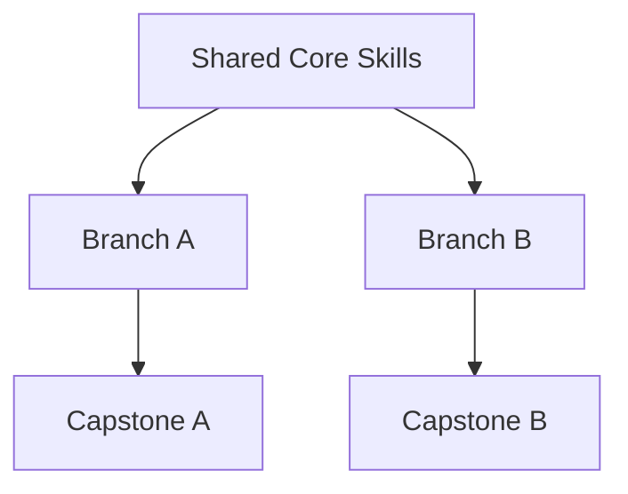

# DOCUMENT 45 — Progression Authoring Guide™

**Project:** The Academy Way Learning System™ — Phase 4.1A  
**Status:** Implementation Blueprint — Progression Design Standard Only  
**Integrates:** Document 39 · Document 43 · Document 12 Intelligence Graph

---

## 1. Charter

The **Progression Authoring Guide™ (PAG)** defines how **learning progressions** are authored within and across competencies — linear, spiral, recursive, branching, acceleration, and intervention paths.

Progressions are **graph definitions** — not calendar schedules.

---

## 2. Progression Types

### 2.1 Linear Progression

| Attribute | Definition |
|-----------|------------|
| **Structure** | A → B → C → D — single path |
| **Use** | Prerequisite chains — decoding patterns, RLM money → banking |
| **Graph edge** | `requires` only |
| **Authoring** | Declare `next_skills[]` sequential; validate acyclic |
| **PAJ behavior** | Default path when no profile override |

```
Skill_A --requires--> Skill_B --requires--> Skill_C
```

### 2.2 Spiral Progression

| Attribute | Definition |
|-----------|------------|
| **Structure** | Revisit concepts at increasing complexity |
| **Use** | Vocabulary, morphology, Earthology inquiry lenses |
| **Graph edge** | `strengthens` + `requires` on advanced variant |
| **Authoring** | Same concept_key; tier field increases |
| **PAJ behavior** | Spacing scheduler inserts review before advance tier |

```
Tier1_Vocab --strengthens--> Tier2_Vocab --requires--> Tier1_Vocab
```

### 2.3 Recursive Progression

| Attribute | Definition |
|-----------|------------|
| **Structure** | Cumulative review embedded in every advance step |
| **Use** | Wilson OG principle; SL cumulative review |
| **Graph edge** | Every new skill `strengthens` prior cluster |
| **Authoring** | `review_skill_cluster[]` on each competency |
| **SIE behavior** | Dosage splits new instruction vs. review |

### 2.4 Branching Pathways

| Attribute | Definition |
|-----------|------------|
| **Structure** | Learner selects emphasis after shared foundation |
| **Use** | LitLab genre tracks; Venture Lab cycles; PAJ pathway |
| **Graph edge** | Shared trunk + branch nodes |
| **Authoring** | `pathway_key` on skills; branches require shared prerequisites |
| **Rule** | Branches reunite for graduation readiness where required |



### 2.5 Alternative Prerequisite Paths

| Attribute | Definition |
|-----------|------------|
| **Structure** | Multiple paths satisfy same prerequisite |
| **Use** | Placement from transfer; equivalent prior learning |
| **Graph edge** | OR-group on `requires` — `prerequisite_group_id` |
| **Authoring** | Document equivalency rationale |
| **PAJ behavior** | Any path at L3 unlocks downstream |

```
(Skill_X OR Skill_Y) --requires--> Skill_Z
```

### 2.6 Acceleration Paths

| Attribute | Definition |
|-----------|------------|
| **Structure** | Skip redundant instruction when transfer demonstrated |
| **Use** | Doc 20 acceleration; L4 generalization |
| **Graph edge** | `acceleration_eligible` flag + transfer assessment ref |
| **Authoring** | `acceleration_gate`: transfer task + educator confirmation |
| **Rule** | Never skip hard safety/foundational competencies without assessment |

### 2.7 Intervention Paths

| Attribute | Definition |
|-----------|------------|
| **Structure** | Lateral re-entry to prerequisite or parallel remedial track |
| **Use** | Tier 2–3; error pattern response |
| **Graph edge** | `intervention_relationship` from Doc 39 |
| **Authoring** | `intervention_entry_skills[]`; `exit_criteria` link Doc 20 |
| **PAJ behavior** | Temporary path — rejoins main on exit |

```
Main_Path -->|stall| Intervention_Track -->|exit L3| Main_Path
```

---

## 3. Progression Object Schema

```
ProgressionDefinition
    ├── progression_key
    ├── progression_type          (linear, spiral, recursive, branching, alt_prereq, acceleration, intervention)
    ├── domain_key
    ├── competency_keys[]         (ordered or graph)
    ├── skill_sequence[]          (ordered skill_ids — linear only)
    ├── graph_edges[]             (full graph types)
    ├── pathway_definitions[]     (branching)
    ├── prerequisite_groups[]     (alternative paths)
    ├── acceleration_gates[]      (acceleration)
    ├── intervention_tracks[]     (intervention)
    ├── review_cluster_rules[]    (recursive/spiral)
    ├── version
    └── status
```

---

## 4. Authoring Process

| Step | Action |
|------|--------|
| 1 | Identify progression type(s) for sub-strand |
| 2 | Map concept graph (Doc 39) to skill sequence |
| 3 | Author linear trunk first |
| 4 | Add spiral/recursive review links |
| 5 | Define branches with shared core |
| 6 | Document alternative prerequisite OR-groups |
| 7 | Define acceleration gates with transfer tasks |
| 8 | Define intervention re-entry/exit points |
| 9 | Validate DAG on `requires` edges |
| 10 | Submit with competency batch — Doc 43 |

---

## 5. Domain Patterns

| Domain | Primary Progression Types |
|--------|---------------------------|
| **Structured Literacy** | Linear + recursive + intervention |
| **Real-Life Math** | Linear tiers + branching emphasis |
| **LitLab** | Spiral genres + branching pathways |
| **Earthology** | Spiral inquiry lenses + branching projects |
| **Life Lab** | Linear Y1–Y4 bands |
| **Venture Lab** | Branching cycle phases |

---

## 6. PAJ & SIE Integration

| System | Progression Use |
|--------|-----------------|
| **PAJ** | Current position on graph; next skill candidates |
| **SIE** | Review session insertion — spiral/recursive |
| **AIC Doc 29/41** | Path recommendation with explainability |
| **Intervention Doc 20** | Intervention track activation |

---

## 7. Governance

| Rule | Requirement |
|------|-------------|
| **PAG-1** | `requires` edges acyclic |
| **PAG-2** | Branching paths document reunion or readiness impact |
| **PAG-3** | Acceleration never bypasses without transfer evidence |
| **PAG-4** | Intervention paths declare exit criteria |
| **PAG-5** | Progression versioned with competency MAJOR changes |

---

*End of Document 45 — Progression Authoring Guide™*
