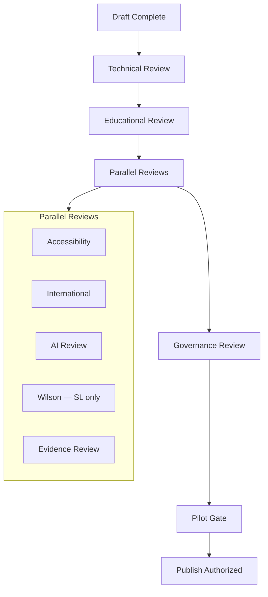

# DOCUMENT 48 — Quality Assurance Framework™

**Project:** The Academy Way Learning System™ — Phase 4.1A  
**Status:** Implementation Blueprint — QA Architecture Only  
**Integrates:** Document 43 · Document 30 · Documents 25–29 · Docs 38–42

---

## 1. Charter

The **Quality Assurance Framework™ (QAF)** defines **every review gate** a competency batch must pass before entering the Publishing Pipeline (Doc 49).

**Quality is gated — not assumed.**

---

## 2. QA Philosophy

| Principle | Statement |
|-----------|-----------|
| **Zero bypass** | No publish without full gate passage or documented waiver |
| **Separation of duties** | Author ≠ sole reviewer |
| **Evidence-based QA** | Checklists + rubrics — not opinion alone |
| **Waivers expire** | Max 90 days; Library Governance Council only |
| **Fail forward** | Reject returns with actionable revision codes |

---

## 3. QA Gate Architecture

---

## 4. Technical Review

| Attribute | Definition |
|-----------|------------|
| **Purpose** | Schema completeness, ID validity, graph integrity |
| **Reviewer** | Registry technical lead |
| **Checklist** | |
| ☐ | Doc 25 all required fields |
| ☐ | competency_key / skill_id namespace valid |
| ☐ | semver assigned |
| ☐ | Prerequisites acyclic |
| ☐ | Cross-domain targets exist or same batch |
| ☐ | concept_keys[] valid |
| ☐ | Doc 44 skill metadata complete |
| ☐ | Doc 47 ai_metadata block present |
| ☐ | No duplicate keys |
| **Output** | `technical_review_status` |
| **SLA** | 3 business days per batch |

---

## 5. Educational Review

| Attribute | Definition |
|-----------|------------|
| **Purpose** | Pedagogical soundness and Academy Way alignment |
| **Reviewers** | Min 2 — domain lead + curriculum director |
| **Checklist** | |
| ☐ | Success criteria observable |
| ☐ | Mastery aligns Doc 6 |
| ☐ | Instructional strategies appropriate Doc 18 |
| ☐ | Progression type valid Doc 45 |
| ☐ | Misconceptions and errors documented |
| ☐ | Graduation mapping Doc 7 |
| ☐ | Not curriculum — competency outcome focused |
| **Output** | `educational_review_status` |
| **SLA** | 5 business days |

---

## 6. Accessibility Review

| Attribute | Definition |
|-----------|------------|
| **Purpose** | UDL, WCAG, EF, plain language |
| **Reviewer** | Accessibility specialist |
| **Checklist** | |
| ☐ | Accommodations field meaningful |
| ☐ | EF demand accurate |
| ☐ | Student/parent look-fors readable |
| ☐ | No disability-as-barrier framing |
| ☐ | Assessment a11y refs Doc 26 |
| **Output** | `accessibility_review_status` |
| **Block** | Must pass |

---

## 7. International Review

| Attribute | Definition |
|-----------|------------|
| **Purpose** | Global by Design (Doc A) |
| **Reviewer** | International lead |
| **Checklist** | |
| ☐ | Examples culturally neutral or localized |
| ☐ | locale_overlay plan if needed |
| ☐ | No US-only assumptions in rationale |
| ☐ | Currency/units flagged for RLM |
| **Output** | `international_review_status` |

---

## 8. Wilson Review (SL Only)

| Attribute | Definition |
|-----------|------------|
| **Purpose** | VI-F alignment without copyrighted content |
| **Reviewer** | Wilson certified + legal clearance |
| **Checklist** | |
| ☐ | No proprietary Wilson text |
| ☐ | Step/category crosswalk metadata only |
| ☐ | Fidelity indicators category-coded |
| ☐ | Certified teacher constraints present |
| ☐ | Parent rules don't instruct WRS delivery |
| **Output** | `wilson_review_status` |
| **Block** | SL cannot publish without pass |

---

## 9. AI Review

| Attribute | Definition |
|-----------|------------|
| **Purpose** | AI metadata safety |
| **Reviewer** | AI ethics + instructional designer |
| **Checklist** | |
| ☐ | Doc 47 complete |
| ☐ | human_review_triggers mapped |
| ☐ | auto_action_ceiling = 0 |
| ☐ | Explainability templates exist |
| ☐ | Student coach constraints for SL decoding |
| **Output** | `ai_review_status` |

---

## 10. Evidence Review

| Attribute | Definition |
|-----------|------------|
| **Purpose** | Evidence plan viability |
| **Reviewer** | Assessment/evidence lead |
| **Checklist** | |
| ☐ | Min 2 evidence types Doc 27 |
| ☐ | Assessment methods registered Doc 26 |
| ☐ | Bundle rules coherent |
| ☐ | Confidence thresholds realistic |
| ☐ | Parent evidence supplementary only |
| ☐ | Pilot plan defines evidence collection |
| **Output** | `evidence_review_status` |

---

## 11. Governance Review

| Attribute | Definition |
|-----------|------------|
| **Purpose** | Library-level policy compliance |
| **Reviewer** | Library curator + Doc 30 authority |
| **Checklist** | |
| ☐ | All parallel reviews passed or waived |
| ☐ | Batch size within limits |
| ☐ | Gold standard sequence respected |
| ☐ | Audit trail complete |
| ☐ | Research sources documented |
| ☐ | Waiver documentation if any |
| **Output** | `governance_review_status` |
| **Authority** | Authorizes pilot or publish |

---

## 12. Stakeholder Reviews (Doc 43)

| Review | Minimum | Metric |
|--------|---------|--------|
| **Teacher review** | 5 educators | Usability ≥ 4.0/5 avg |
| **Parent review** | 3 parents | Comprehension pass |
| **Student review** | Sample panel | Look-for clarity pass |

Recorded as `stakeholder_review_status` — required per library release.

---

## 13. Waiver Policy

| Condition | Authority | Max Duration |
|-----------|-----------|--------------|
| International overlay pending | Library curator | 90 days |
| Pilot data extension | Governance Council | 1 cycle |
| Wilson reviewer unavailable | Deputy + legal note | 30 days |

Waivers **never** apply to: Wilson copyright, auto-mastery AI, missing evidence plan.

---

## 14. Revision Codes

| Code | Meaning |
|------|---------|
| `REV-SCHEMA` | Technical field fix |
| `REV-CRITERIA` | Success criteria rewrite |
| `REV-EVIDENCE` | Evidence plan fix |
| `REV-AI` | AI metadata fix |
| `REV-A11Y` | Accessibility fix |
| `REV-INTL` | International fix |
| `REV-WILSON` | SL compliance fix |
| `REV-CROSS` | Cross-domain fix |
| `REV-REJECT` | Fundamental redesign |

---

## 15. Quality Metrics (Batch)

| Metric | Target |
|--------|--------|
| First-pass yield | ≥ 70% |
| Revision cycles | ≤ 2 average |
| Review SLA compliance | ≥ 95% |
| Post-publish defect rate | < 2% within 90 days |

---

## 16. Governance

| Rule | Requirement |
|------|-------------|
| **QAF-1** | No gate skipped without waiver |
| **QAF-2** | Wilson review mandatory for SL |
| **QAF-3** | All checklists archived |
| **QAF-4** | Author cannot approve own batch |
| **QAF-5** | Defect triggers version bump — not silent edit |

---

*End of Document 48 — Quality Assurance Framework™*
