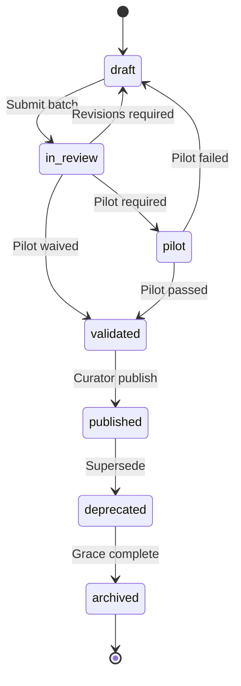

# DOCUMENT 49 — Publishing Pipeline™

**Project:** The Academy Way Learning System™ — Phase 4.1A  
**Status:** Implementation Blueprint — Publication State Machine Only  
**Integrates:** Document 30 · Document 43 · Document 48 · Configuration Studio

---

## 1. Charter

The **Publishing Pipeline™ (PP)** defines how competencies, atomic skills, and attached artifacts move through **lifecycle states** from draft to archive — the authoritative publication state machine for the Universal Learning Registry™.

**Publication is a governed event — not a database insert.**

---

## 2. Lifecycle States

```
Draft
    ↓
Review
    ↓
Pilot
    ↓
Validated
    ↓
Published
    ↓
Deprecated
    ↓
Archived
```

| State | Key | Description |
|-------|-----|-------------|
| **Draft** | `draft` | Authoring in progress — not visible to PAJ |
| **Review** | `in_review` | QA gates active — Doc 48 |
| **Pilot** | `pilot` | Limited org deployment — evidence collection |
| **Validated** | `validated` | Pilot success — publish approval pending |
| **Published** | `published` | Live in ULR — immutable keys |
| **Deprecated** | `deprecated` | Superseded — no new assignments |
| **Archived** | `archived` | Hidden — historical reference only |

---

## 3. State Definitions

### 3.1 Draft

| Attribute | Value |
|-----------|-------|
| **Visibility** | Authors, domain leads only |
| **PAJ** | Not assignable |
| **Editable** | All fields |
| **Exit criteria** | Doc 25 schema complete; Doc 43 self-QC pass |
| **Next state** | `in_review` on submission |

### 3.2 Review

| Attribute | Value |
|-----------|-------|
| **Visibility** | Reviewers + authors |
| **Editable** | Revision fields only — locked during active review |
| **Activities** | Doc 48 all gates; stakeholder reviews Doc 43 |
| **Exit criteria** | All required reviews `passed` |
| **Failure** | Return to `draft` with revision codes |
| **Next state** | `pilot` or `validated` (see §5) |

### 3.3 Pilot

| Attribute | Value |
|-----------|-------|
| **Visibility** | Pilot org(s) — Configuration Studio scoped |
| **PAJ** | Assignable within pilot cohort only |
| **Purpose** | Collect real evidence; usability; reliability data |
| **Duration** | Min 4 weeks; max 12 weeks |
| **Metrics** | Doc 48 §15; assessment pilot Doc 26 |
| **Exit criteria** | Pilot report approved |
| **Next state** | `validated` or return `draft` |

### 3.4 Validated

| Attribute | Value |
|-----------|-------|
| **Visibility** | Library curator + leadership |
| **Editable** | PATCH-level only — typos, clarity |
| **Activities** | Final governance sign-off |
| **Exit criteria** | Library curator publish authorization |
| **Next state** | `published` |

### 3.5 Published

| Attribute | Value |
|-----------|-------|
| **Visibility** | All authorized orgs per rollout plan |
| **PAJ** | Fully assignable |
| **Immutable** | Keys, success criteria (MAJOR change = new version) |
| **Editable** | MINOR/PATCH via new version workflow |
| **Configuration Studio** | Publish record + changelog |
| **Next state** | `deprecated` when superseded |

### 3.6 Deprecated

| Attribute | Value |
|-----------|-------|
| **Visibility** | Read-only — educators see successor link |
| **PAJ** | No new assignments; active learners continue |
| **Required** | `superseded_by`, migration map, grace period |
| **Grace period** | Default 180 days |
| **Next state** | `archived` after grace + zero active assignments |

### 3.7 Archived

| Attribute | Value |
|-----------|-------|
| **Visibility** | Audit, transcript history, research only |
| **PAJ** | Not visible in forward paths |
| **KEE** | Historical evidence retained — linked |
| **Reversible** | Only via Governance Council exception |

---

## 4. Pipeline Flow Diagram



---

## 5. Pilot Requirement Matrix

| Batch Type | Pilot Required |
|------------|----------------|
| SL gold standard first sub-strand | **Yes — mandatory** |
| SL subsequent batches | Yes — until Gold Standard Declaration |
| New domain library first batch | **Yes** |
| MINOR version batch | Optional |
| PATCH only | No — direct validated if review passed |
| Assessment instrument new | Yes — reliability data |
| AI rule MAJOR change | Yes — dismissal rate check |

**Pilot waiver:** Library Governance Council only — documented.

---

## 6. Publish Authorization

| Step | Actor | Action |
|------|-------|--------|
| 1 | Library curator | Verify all gates |
| 2 | Domain lead | Sign domain accuracy |
| 3 | Configuration Studio | Create publish package |
| 4 | Platform Registry | Activate version |
| 5 | Changelog | Public to educators |
| 6 | Rollout plan | Org-by-org or global |

**SL first publish:** Requires Gold Standard Declaration (Doc 30 §14).

---

## 7. Version & Publish Package

```
PublishPackage
    ├── package_id
    ├── library_key
    ├── version
    ├── competency_keys[]
    ├── skill_ids[]
    ├── assessment_instrument_keys[]
    ├── resource_keys[]
    ├── ai_rule_keys[]
    ├── cross_domain_links[]
    ├── changelog
    ├── migration_map              (if deprecating)
    ├── pilot_report_ref
    ├── review_artifacts[]
    └── published_at
```

---

## 8. Rollback Policy

| Scenario | Action |
|----------|--------|
| Critical error post-publish | Emergency `deprecated` — successor or revert package |
| Assessment reliability fail | Deprecate instrument — not whole competency if isolated |
| AI rule harmful pattern | Disable rule — PATCH publish |
| Wilson compliance issue | Immediate deprecate + legal review |

**No silent rollback** — audit + changelog required.

---

## 9. Object-Type Coordination

| Object | States independently | Publish rule |
|--------|---------------------|--------------|
| Competency | Yes | Parent before skills OR same package |
| Atomic Skill | Yes | Must reference published-or-same-package competency |
| Assessment instrument | Yes | Referenced before mastery use |
| Resource | Yes | Optional at competency publish |
| AI rule | Yes | Must exist before competency references |

**Preferred:** Atomic publish package — competency + skills + primary assessment together.

---

## 10. Integration Matrix

| System | Role |
|--------|------|
| **Doc 43** | Submission triggers `in_review` |
| **Doc 48** | Gates between states |
| **Doc 30** | Governance authority |
| **Configuration Studio** | Publish target |
| **Platform Registry** | Version host |
| **KEE** | Pilot evidence |
| **PAJ** | Assignment by state |

---

## 11. Governance

| Rule | Requirement |
|------|-------------|
| **PP-1** | No `published` without audit trail |
| **PP-2** | Pilot mandatory for SL gold standard |
| **PP-3** | Deprecated keys never reassigned |
| **PP-4** | Publish packages immutable once released |
| **PP-5** | Emergency deprecate within 24h notification |

---

*End of Document 49 — Publishing Pipeline™*
