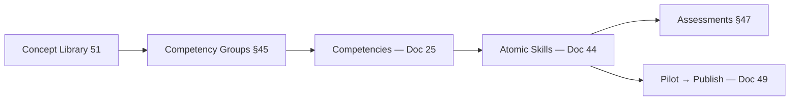

# DOCUMENT 51 — Concept Library: Phonological Awareness

**Project:** The Academy Way Learning System™ — Phase 4.2 · Enhanced Phase 4.2A  
**Library Key:** `concept_library.phonological_awareness`  
**Concept Key:** `SL-CONCEPT-PHONOLOGICAL_AWARENESS` (Doc 38)  
**Domain:** `domain.structured_literacy`  
**Version:** 1.1.0 (Enhanced)  
**Status:** Permanent Concept Library — Enhanced Template Exemplar  
**Authority:** Source document for future competency and atomic skill authoring (Docs 43–50)  
**Enhancement Standards:** Docs 52–56 · CLQS checklist Doc 56

---

## Constitutional & Content Boundaries

| Rule | Requirement |
|------|-------------|
| **No Wilson copyrighted content** | No lesson scripts, manuals, worksheets, or proprietary assessments |
| **Permitted sources** | Educational science, Orton-Gillingham principles, publicly available research, AcademyOS architecture |
| **Neurodiversity framing** | Learning profile information — not diagnostic identity (Constitution VI-D, TAW-2) |
| **Not yet authored** | Competencies, atomic skills, assessment items — future derivation only |

---

## 1. Definition

**Phonological Awareness (PA)** is the **explicit awareness of and ability to manipulate the sound structure of spoken language** at levels larger than the individual phoneme — including words, syllables, and onset-rime units — without reliance on print.

Phonological awareness is **auditory and oral**. It precedes and supports phonemic awareness (phoneme-level manipulation) and the alphabetic principle (sound-symbol mapping).

| Distinction | Phonological Awareness | Related Concept |
|-------------|------------------------|-----------------|
| **Unit size** | Words, syllables, onset-rime | Phonemic awareness = phonemes |
| **Modality** | Listening and speaking | Decoding = print |
| **Required for reading?** | Foundational — not sufficient alone | Requires phonemic + alphabetic layers |

**AcademyOS canonical definition ID:** `SL-CL-PA-DEF-001`

---

## 2. Purpose

| Stakeholder | Purpose |
|-------------|---------|
| **Learner** | Hear and manipulate language sounds — foundation for reading and spelling |
| **Educator** | Deliver explicit, sequential PA instruction aligned to evidence |
| **Parent** | Reinforce sound play at home without teaching proprietary curriculum |
| **Platform** | Canonical knowledge asset linking assessment, evidence, AI, scheduling, and future competencies |
| **AcademyOS** | First permanent Concept Library — template for all SL and domain concept libraries |

PA instruction in AcademyOS exists to **prevent and remediate reading difficulty** by establishing sound-structure competence before and alongside print instruction.

---

## 3. Educational Importance

| Dimension | Importance |
|-----------|------------|
| **Reading acquisition** | PA is among the strongest kindergarten predictors of later reading achievement (National Reading Panel; meta-analytic literature) |
| **Dyslexia risk reduction** | Weak PA often precedes decoding difficulty; early PA instruction reduces risk when delivered explicitly |
| **Spelling foundation** | Syllable and onset-rime awareness supports later encoding |
| **Oral language** | Strengthens metalinguistic attention to language form |
| **Equity** | Explicit PA instruction benefits learners regardless of prior exposure — open entry (Doc 6) |
| **Structured Literacy** | PA is first pillar in OG-informed sequence — hearing before symbol (Doc 13, 38) |

**Mastery philosophy alignment:** Evidence of PA competence is **observable in performance tasks** — not age alone (Doc 6).

---

## 4. Developmental Progression

### 4.1 Typical Progression Sequence (Guidance — Not Gates)

| Stage | Skill Focus | Example Task |
|-------|-------------|--------------|
| **1** | Sentence segmentation | Clap words in a sentence |
| **2** | Syllable blending | "Pen-cil" → pencil |
| **3** | Syllable segmentation | "Basketball" → bas-ket-ball |
| **4** | Syllable deletion | "Say cupcake without cup" → cake |
| **5** | Onset-rime blending | /c/ + at → cat |
| **6** | Onset-rime segmentation | cat → /c/ + at |
| **7** | Phoneme readiness | Transition bridge to phonemic awareness library |
| **8** | Phoneme isolation (initial) | First sound in "sun" — handoff to PM library |

**Rule:** Stages are **instructional sequence** — not grade-level locks. Placement uses evidence (Doc 40).

### 4.2 Progression Type (Doc 45)

Primary: **Linear** with **recursive** cumulative review of prior stages.

---

## Part II — Concept Library Enhancement Profiles (Phase 4.2A)

*Mandatory sections per Docs 52–55. All future Concept Libraries replicate this structure.*

---

### A. Cognitive Science Profile (Doc 52)

#### Primary Cognitive Processes

| Process | Role in Phonological Awareness |
|---------|-------------------------------|
| **Phonological processing** | Analyze and manipulate sound structure of language |
| **Auditory discrimination** | Distinguish similar sounds and word boundaries |
| **Metalinguistic awareness** | Reflect on language as object separate from meaning |

#### Secondary Cognitive Processes

| Process | Role |
|---------|------|
| **Semantic activation** | Word meaning supports word-level tasks |
| **Sequential processing** | Order sounds/syllables correctly |
| **Subvocal rehearsal** | Hold units in phonological loop during blend/segment |
| **Pattern recognition** | Rhyme and onset-rime patterns |

#### Demand Summary

| Demand Domain | Level | Notes |
|---------------|-------|-------|
| **Working memory** | **High** | Phonological loop heavily loaded; 2–4 units typical |
| **Long-term memory** | Moderate | Procedural routines for clap/segment; declarative rhyme rules |
| **Retrieval** | Moderate | Cued recall of syllable boundaries; recognition in rhyme tasks |
| **Attention** | **High** | Sustained auditory focus 10–15 min |
| **Executive function** | **Moderate** | Task initiation, inhibition of guessing, cognitive flexibility between tasks |
| **Language** | **High** | Receptive instruction; expressive oral response |
| **Visual processing** | **Low** | Optional anchors — not required |
| **Auditory processing** | **High** | Core modality — discrimination and sequencing |
| **Motor** | **Low** | Clapping/tapping optional — not required for evidence |
| **Metacognitive** | Low–moderate | Emerging "I can clap syllables" self-check |

#### Instructional Implications

- Limit sessions to 10–15 minutes to respect WM and attention load  
- Use chunking: one PA task type per micro-block  
- External anchors (tap, blocks) reduce WM load  
- Spaced retrieval of prior stages (Doc 18)  
- Multilingual PA strengthens metalinguistic processing — not confusion  
- Avoid simultaneous print introduction during initial PA stages  

---

### B. Brain Development Profile (Doc 53)

#### Brain Systems Involved

| System | Role | Research Basis |
|--------|------|----------------|
| **Temporal lobe — auditory cortex** | Speech sound processing | Established language neuroscience |
| **Left perisylvian language network** | Phonological processing (typical left bias; individual variation) | Dyslexia research literature — instructional not diagnostic |
| **Prefrontal cortex** | Working memory, attention, task switching | EF research |
| **Broca's area (motor speech)** | Subvocal rehearsal during manipulation | Phonological loop models |
| **Cerebellum** | Timing/coordination of speech-motor patterns | Emerging literacy-motor research |

#### Developmental Considerations

- PA sensitivity to **language exposure** and **explicit instruction** — experience-dependent  
- Emergence varies widely across ages 3–7+ — **instructional response** preferred over wait-to-fail  
- Multilingual exposure supports phonological flexibility  
- Consolidation benefits from sleep and spaced practice (high-level)  

#### Neuroplasticity Implications

- Repeated explicit PA practice strengthens phonological processing pathways  
- Intensive instruction produces measurable gains in struggling readers (research consensus)  
- Multisensory engagement (OG) may recruit multiple pathways — auditory primary for PA  
- Individual response rate varies — dosage adjustment not ability ceiling  

#### Typical Developmental Variability

- Some learners consolidate syllable awareness quickly; others need extended recursive review  
- Temporary plateaus are common — not permanent limits  
- EF and attention profiles modify **rate**, not necessarily **ceiling** with appropriate instruction  

#### Common Developmental Patterns (Instructional — Not Diagnostic)

| Pattern | Instructional Response |
|---------|------------------------|
| Late syllable segmentation | Extended Stage 2–3 with errorless learning |
| Slow rhyme production | Auditory discrimination boost |
| Attention-mediated inconsistency | Shorter sessions, breaks |
| Bilingual sequential development | PA in both languages — strength framing |

#### Implications for Intervention

- Increase **dosage** (4–5× weekly) before reducing **expectations**  
- Tier 2–3 when probes flat despite adequate dosage  
- Quiet auditory environment for neuroplasticity-focused practice  
- Family home practice reinforces consolidation (Doc 42)  

**Citations (public):** National Reading Panel (2000); meta-analyses on phonological awareness instruction; OG principle literature.

---

### C. Instructional Decision Model (Doc 54)

#### When to Teach

- Learner has **oral language exposure** sufficient to understand words used in tasks  
- **No print decoding** required — PA is pre-alphabetic  
- Enrollment, screen fail, or placement indicates PA gap  
- Can concurrent with alphabet **introduction** — but PA does not require letter knowledge  
- Before or alongside phonemic awareness — PA stages 1–6 precede PM handoff  

#### When NOT to Teach

- **Do not** skip to phonemic tasks when syllable/onset-rime unstable (guessing risk downstream)  
- **Do not** extend session when EF shutdown observed — pause and reschedule  
- **Do not** withhold PA from older struggling readers — age is not a blocker  
- **Avoid** concurrent intro decoding intensive block same day as initial PA if WM overloaded  

#### Readiness Indicators

- Responds to oral language in conversation  
- Attends to short oral tasks (2–3 min)  
- Imitates clapping/rhythm play  
- Prerequisite concept: language processing exposure met  

#### Warning Signs

- Random syllable clapping — Stage 2 not established  
- Flat probe trend 3+ sessions — Tier review  
- Frustration/shutdown < 5 min — EF overload  
- Persistent rhyme confusion — discrimination work needed  
- Absent dosage — scheduling recovery  

#### Pacing Recommendations

| Parameter | Recommendation |
|-----------|----------------|
| Minutes per session | 10–15 PA-focused |
| Sessions per week | 4–5 when PA is active target |
| Weeks to proficiency (typical range) | 4–12 depending on entry stage |
| Review ratio | 70% new stage : 30% cumulative review |
| Spacing interval | Review prior stages every 2–3 sessions |

#### Grouping Recommendations

| Parameter | Value |
|-----------|-------|
| Default | Pairs or small group (3–6) |
| Homogeneity | skill_band on PA stage |
| 1:1 trigger | Tier 3, severe EF overload |
| Wilson context | Min 2 when paired with WRS block metadata |

#### Independent Practice Readiness

- **Ready:** L2 developing on stage — structured home games with parent  
- **Not ready:** Cannot perform with teacher model — stay in guided oral practice  
- Home practice: 5–10 min rhyme/syllable play — supplementary evidence only  

#### Generalization Readiness

- L3 on stage in structured setting + performance in **2 varied contexts** (e.g., classroom + home)  
- Evidence: observation + optional audio  

#### Advancement Readiness

- L3 on onset-rime segmentation + educator confirmation → handoff to **Phonemic Awareness** concept library  
- Prerequisite graph: Doc 39 `requires` chain satisfied  

**Decision rule refs (future):** `sl.aic.pa.readiness`, `sl.aic.pa.advance`, `sl.schedule.pa.daily_burst`

---

### D. AI Reasoning Profile (Doc 55)

#### Indicators of Mastery

| Indicator | Threshold | Confidence Weight | Human Validate |
|-----------|-----------|-------------------|----------------|
| Syllable segmentation probe | ≥ 4/5 | 0.85 | Yes |
| Onset-rime blend probe | ≥ 4/5 | 0.85 | Yes |
| Observation checklist pass | 100% critical items | 0.90 | Yes |
| Retention probe at 2-week spacing | ≥ 4/5 | 0.80 | Yes |

#### Indicators of Struggle

| Indicator | Severity | Typical Cause |
|-----------|----------|---------------|
| Probe flat 3 sessions | Red | Instruction mismatch or dosage |
| Random clapping pattern | Amber | Stage skipped |
| Session abandonment | Red | EF overload |
| Prerequisite oral language gap | Red | Language processing |

#### Confidence Factors

| Increase | Decrease |
|----------|----------|
| Calibrated educator observation | AI-only evidence |
| Multiple probe sessions | Stale evidence (> 90 days) |
| Complete learning profile | Low profile completeness |
| Parent log + teacher verify | Parent log alone |

- **Floor for recommendation:** 0.60  
- **Floor for mastery suggestion:** 0.75  
- **Ceiling without human:** 0.70  

#### Scheduling Implications (AI)

- Dosage deficit → suggest recovery session  
- Spacing interval elapsed → suggest review cluster  
- EF profile high → suggest break before PA block  

#### Intervention Triggers

| Condition | AI Suggestion | Human Gate |
|-----------|---------------|------------|
| Red struggle × 2 | Tier 2 PA plan | Educator |
| Prerequisite gap | Language processing support | Educator |
| Error pattern: rhyme confusion | Discrimination micro-intervention | Educator |

#### Family Coaching Triggers

- PA stage L2 → assign rhyme time activity  
- L3 milestone → celebration draft  
- Home struggle log → escalate to teacher  

#### Portfolio Relevance

- **portfolio_eligible_concept:** optional (foundational)  
- **Artifacts:** audio rhyme performance, student reflection  
- **Threshold:** quality ≥ 0.7  

#### Transcript Relevance

- **transcript_eligible_concept:** false (foundational internal)  
- **Readiness narrative:** included in literacy readiness summary  
- **External visibility:** internal_progress + reader's guide note  

#### Rule Key Registry

| Rule Key | Coach Role | Human Review |
|----------|------------|--------------|
| `sl.aic.pa.strategy` | Teacher | Optional |
| `sl.aic.pa.intervention` | Intervention | Required Tier 2+ |
| `sl.aic.pa.parent` | Parent | Teacher visibility |
| `sl.aic.pa.schedule` | Scheduling | Scheduler |
| `sl.aic.pa.assess` | Assessment | Required mastery |

---

## 5. Brain Systems Involved (Summary)

*Full profile: §B Brain Development Profile (Doc 53).*

PA primarily engages **auditory cortex**, **phonological processing networks**, **working memory**, and **attention systems**. See §B for developmental and intervention implications.

---

## 6. Language Systems Involved

| System | PA Interaction |
|--------|----------------|
| **Phonology** | Core — sound structure of language |
| **Lexicon (vocabulary store)** | Word meanings support sentence/word level tasks |
| **Morphology (emerging)** | Syllable patterns relate to morpheme boundaries later |
| **Syntax** | Sentence segmentation requires syntactic word boundaries |
| **Pragmatics** | Listening in context — classroom, home |
| **Orthography (later)** | PA transfers to print — not taught simultaneously at intro |

**Multilingual learners:** PA in **all languages** strengthens metalinguistic skill — cross-linguistic transfer documented in research; AcademyOS treats multilingualism as strength (Doc A/D).

---

## 7. Connections to Reading (Decoding Pathway)


| Connection | Type | Description |
|------------|------|-------------|
| PA → phonemic awareness | **requires** (Doc 39) | Word/syllable awareness before phoneme manipulation |
| PA → decoding | **indirect** | Through phonemic layer and alphabetic principle |
| PA → fluency | **distant support** | Accurate decoding enables fluency |

**Without adequate PA:** Phoneme tasks fail; decoding instruction produces guessing and frustration.

---

## 8. Connections to Writing (Encoding Pathway)

| Connection | Description |
|------------|-------------|
| PA → encoding | Syllable awareness supports spelling segmentation |
| PA → written expression | Indirect — oral language foundation |
| Onset-rime → spelling patterns | Rime families (cat, bat, hat) preview orthographic patterns |

Encoding library depends on PA + phonemic awareness — not PA alone.

---

## 9. Connections to Executive Function

*Full cognitive load: §A Cognitive Science Profile (Doc 52).*

| EF Component | PA Demand |
|--------------|-----------|
| **Working memory** | High — see §A |
| **Attention** | High — sustained auditory |
| **Task initiation** | Moderate |
| **Cognitive flexibility** | Moderate — switch blend/segment/delete |
| **Composite EF demand** | **Moderate** (concept-level) |

**EF demand level for concept:** `moderate` (Doc 25, 44)

**Supports:** Chunk tasks, visual/kinesthetic anchors (tap syllables), preview, breaks (Doc 42 EF).

---

## 10. Connections to Speech

| Connection | Description |
|------------|-------------|
| **Articulation** | Clear speech production supports accurate sound discrimination — unclear articulation may affect performance |
| **Speech therapy coordination** | PA instruction complements — does not replace — speech-language services |
| **Subvocal rehearsal** | Blending often uses internal speech |

**Profile note:** Speech production differences are **support considerations** — not barriers to PA instruction with accommodations.

---

## 11. Connections to Listening

| Connection | Description |
|------------|-------------|
| **Active listening** | PA is fundamentally a listening skill |
| **Auditory discrimination** | Distinguish similar words (bear/pear) |
| **Following directions** | Multi-step oral PA tasks |
| **Background noise sensitivity** | Environmental accommodation — quiet space |

---

## 12. Connections to Vocabulary

| Connection | Description |
|------------|-------------|
| **Word-level PA** | Requires known or learnable word meanings |
| **Novel words** | Nonsense syllables isolate PA from vocabulary — used in assessment |
| **Rich oral language** | Home and classroom language exposure strengthens word-level tasks |
| **Future vocabulary library** | PA supports morphological analysis later |

---

## 13. Connections to Decoding

| Connection | Type |
|------------|------|
| Direct | None — PA is pre-print |
| Indirect | **supports** via phonemic awareness and alphabetic principle |
| Risk signal | Persistent PA weakness predicts decoding intervention need |

Cross-domain Doc 46: No LitLab decoding — SL canonical path only.

---

## 14. Connections to Encoding

| Connection | Description |
|------------|-------------|
| Syllable segmentation | Direct support for spelling by syllable |
| Onset-rime | Supports spelling patterns in rime families |
| Handoff | Full encoding library requires phonemic segmentation |

---

## 15. Connections to Fluency

| Connection | Description |
|------------|-------------|
| **Distant** | PA does not directly produce fluent reading |
| **Pathway** | PA → decoding accuracy → automaticity → fluency |
| **Oral reading fluency** | Strong PA reduces word-level struggle downstream |

---

## 16. Connections to Comprehension

| Connection | Description |
|------------|-------------|
| **Indirect** | Comprehension requires fluent word access |
| **Sentence segmentation** | Supports parsing written sentences later |
| **Listening comprehension** | Parallel oral language development |

---

## 17. Connections to Orthographic Mapping

| Connection | Description |
|------------|-------------|
| **Prerequisite chain** | PA → phonemic awareness → decoding → orthographic mapping |
| **No direct mapping** | PA does not store sight words |

---

## 18. Connections to Morphology

| Connection | Description |
|------------|-------------|
| **Syllable awareness** | Morphemes often align with syllable boundaries |
| **Later integration** | Morphology library builds on established PA/PM |

---

## 19. Connections to Dyslexia

| Framing | AcademyOS Approach |
|---------|-------------------|
| **Not identity** | Dyslexia-related patterns are **learning profile evidence** — not student label (VI-D) |
| **Instructional response** | Explicit, systematic PA instruction is evidence-based for learners with dyslexia profiles |
| **Intensity** | May require increased dosage, smaller groups, errorless learning (Doc 18) |
| **Persistence** | PA weakness may require extended recursive review |
| **Assessment** | Screen early; progress monitor weekly if Tier 2 |

**Never:** Delay PA because of profile — accelerate explicit instruction.

---

## 20. Connections to Dysgraphia

| Connection | Description |
|------------|-------------|
| **Modality separation** | PA is oral — **no handwriting required** for core PA evidence |
| **Support** | Learners with dysgraphia profiles can demonstrate PA without written output |
| **Later encoding** | Encoding library addresses dysgraphia supports separately |

---

## 21. Connections to Dyscalculia

| Connection | Description |
|------------|-------------|
| **Limited direct** | PA is language — not quantity |
| **Shared EF load** | Working memory supports both — EF accommodations may help both domains |
| **Cross-domain** | Doc 46 — phonemic awareness **supports** RLM word problems (language of math) |

---

## 22. Connections to ADHD

| Connection | Description |
|------------|-------------|
| **Attention demand** | Shorter PA sessions; movement breaks |
| **Task structure** | Explicit routines; visual schedules (Doc 42) |
| **Response mode** | Reduce wait time pressure; allow physical tapping |
| **Not inability** | PA instruction effective with EF scaffolds |

Profile field: `attention_variability` informs scheduling (Doc 19).

---

## 23. Connections to Autism

| Connection | Description |
|------------|-------------|
| **Explicit instruction** | Clear, predictable PA routines benefit many learners |
| **Sensory** | Quiet environment; reduce overlapping speech |
| **Pragmatics** | PA games may need explicit social rules |
| **Strengths** | Pattern recognition in onset-rime tasks |
| **Individual variation** | Profile-driven — no universal autism PA rule |

---

## 24. Connections to Dyspraxia

| Connection | Description |
|------------|-------------|
| **Oral-motor** | Some PA tasks use clapping/tapping — offer alternative modes |
| **No handwriting** | PA evidence oral/physical — not fine motor dependent |
| **Speech coordination** | May affect oral response timing — extended time OK |

---

## 25. Typical Developmental Sequence

See §4.1. Summary table:

| Age Band (Guidance) | Typical Capabilities |
|---------------------|---------------------|
| **3–4** | Enjoy rhyme, word play; emerging syllable clapping |
| **4–5** | Syllable segmentation with support; rhyme recognition |
| **5–6** | Onset-rime with instruction; sentence segmentation |
| **6–7** | Consolidate syllable/onset-rime; phoneme readiness |
| **7+** | If gaps persist — **instructional response**, not retention |

**Academy Way:** Open entry at any stage with evidence-based placement — age is guidance only.

---

## 26. Common Misconceptions

| Misconception | Correction | Reteach Strategy |
|---------------|------------|------------------|
| "PA means knowing letter names" | PA is **oral** — no letters required | Separate alphabet knowledge library |
| "Rhyming alone is enough" | Rhyming is one PA subskill — full sequence needed | Broaden to syllable/onset-rime |
| "Child can't do PA — not ready to read" | Provide **explicit PA instruction** — don't wait | Tier 2 PA boost |
| "PA is only for young children" | Older struggling readers need PA if gap exists | Age-neutral placement |
| "Multilingual children are confused by PA" | PA in any language supports metalinguistic skill | Leverage home language |
| "Guessing words is PA" | Guessing bypasses sound analysis | Return to segmentation |

---

## 27. Common Error Patterns

| Error Pattern | Look-For | Likely Cause | Intervention Direction |
|---------------|----------|--------------|------------------------|
| **Syllable over/under segmentation** | "Cat" → 2 syllables | Syllable concept weak | Explicit syllable types intro |
| **Rhyme false positives** | cat/car as rhyme | Vowel/consonant confusion | Auditory discrimination tasks |
| **Blend collapse** | "b-at" → bat but loses sounds | Working memory load | Shorter units; slower pace |
| **Onset-rime conflation** | Cannot separate /c/ from at | Onset-rime stage skipped | Recursive onset-rime |
| **Sentence word boundary errors** | Claps wrong word count | Syntax/listening | Sentence segmentation games |
| **Guessing from context** | N/A at PA — but precursor habit | Premature print emphasis | Pause decoding; strengthen PA |

Stored for future `common_error_patterns[]` on competencies (Doc 25).

---

## 28. Observable Behaviors

### 28.1 Proficient Signals (Concept Level)

| Behavior | Context | Frequency |
|----------|---------|-----------|
| Claps correct syllables in 4-syllable words | Oral prompt | 4/5 trials |
| Blends syllables orally without prompt delay | Teacher says separated syllables | 4/5 trials |
| Segments sentence into words | 5-word sentence | 4/5 trials |
| Identifies rhyme pairs | Oral word pairs | 4/5 trials |
| Performs onset-rime blend | /m/ + op → mop | 4/5 trials |

### 28.2 Not-Yet Signals

| Behavior | Indicates |
|----------|-----------|
| Random clapping | Syllable concept not established |
| No response after 5+ sec | WM overload or attention — not refusal |
| Consistent rhyme errors | Need discrimination work |
| Frustration / shutdown | EF overload — reduce demand |

---

## 29. Assessment Approaches

Aligned with Doc 40 SL Assessment Framework — **AcademyOS-authored protocols only**.

| Purpose | Approach | Method Key (Future) |
|---------|----------|---------------------|
| **Screening** | Syllable + rhyme quick probe | `assess.sl.screen.pa` |
| **Diagnostic** | Full PA sequence placement | `assess.sl.diagnostic.pa` |
| **Progress monitoring** | Weekly syllable/onset-rime probe | `assess.sl.probe.pa` |
| **Formative** | End-of-session clap/blend check | `measurement.formative` |
| **Mastery validation** | Multi-method bundle | `assess.sl.mastery_bundle` |

**Modality:** Observation checklist, oral performance — no proprietary instruments.

**Reliability target:** ≥ 0.80 after pilot (Doc 26).

---

## 30. Evidence Collection

| Evidence Type (Doc 27) | Use for PA |
|------------------------|------------|
| `observation.instructional` | Teacher observes oral PA task |
| `observation.checklist` | Structured PA checklist |
| `measurement.progress` | Probe scores over time |
| `measurement.formative` | Session exit check |
| `media.audio` | Optional recording of oral performance |
| `observation.parent` | Home rhyme/syllable activity log |

**Bundle rule (future):** Min 2 types; educator-sourced required for concept mastery validation.

**Confidence:** Oral observation ≥ 0.85 when calibrated (Doc 40).

---

## 31. Parent Observations

| Observable | Parent Look-For |
|------------|-----------------|
| Rhyme enjoyment | Child notices/finishes rhymes in books/songs |
| Syllable play | Claps name, claps words while playing |
| Word awareness | Can repeat words slowly, separately |
| Home capacity | 5–10 min sound play without fatigue |

**Weight:** Supplementary — teacher verification for mastery (Doc 27, 42).

**Activities (future group):** Sound listening walk, rhyme time, syllable clapping name (Doc 42 §4.3).

---

## 32. Teacher Observations

| Indicator | Proficient | Not Yet |
|-----------|------------|---------|
| Syllable segmentation | Accurate on 4/5 | ≤ 2/5 |
| Syllable blending | Immediate blend | Cannot combine |
| Rhyme production | Generates rhyme | Cannot |
| Onset-rime separation | Correct split | Whole word only |
| Engagement | Persists 10 min | Shutdown < 5 min |

Future: `teacher_look_fors[]` on competencies (Doc 25).

---

## 33. AI Observations

| Capability | Permitted | Prohibited |
|------------|-----------|------------|
| Pattern detection on probe scores | Yes | — |
| Error pattern clustering | Yes — educator validates | Auto-tier without human |
| Session audio analysis draft | Yes — human validates | Sole mastery evidence |
| Recommend next PA stage | Yes — explainability | Skip prerequisite stages |
| Parent plain-language summary | Yes | Diagnose dyslexia |

**Rule keys (future):** `sl.aic.teacher.error`, `sl.aic.intervention.concept`, `sl.aic.parent.practice` (Doc 41).

**Confidence floor:** 0.65 for intervention; 0.75 for mastery suggestion (Doc 47).

---

## 34. Scheduling Implications

| Parameter | Recommendation |
|-----------|----------------|
| **Session duration** | 10–15 minutes PA-focused segment within literacy block |
| **Frequency** | 4–5× per week minimum when PA is active target |
| **Group size** | 2–6 for oral round-robin; pairs for practice |
| **Modality** | In-person or synchronous virtual — oral required |
| **Time of day** | Profile-aware — avoid low-attention slots |
| **Breaks** | 2-min break per 10 min for high EF load |
| **Cumulative review** | 3–5 min review prior stages each session (recursive) |
| **Wilson session** | PA may precede WRS block — metadata link only |

**SIE rules (future):** `sl.schedule.pa.daily_burst`, `sl.schedule.pa.review_cluster`

---

## 35. Intervention Implications

| Trigger | Tier | Action |
|---------|------|--------|
| Screen fail | Tier 1 boost | Daily PA games + teacher differentiation |
| Stall 3 probes | Tier 2 | Supplemental PA plan 4–8 weeks |
| Persistent gap + decoding fail | Tier 2–3 | Intensive PA + phonemic bridge |
| EF shutdown | Tier 1 micro | Shorter tasks; movement; preview |

**Intervention strategies (Doc 18, 20):** Explicit instruction, errorless learning, small group, 1:1 if Tier 3.

**Exit criteria:** 4/5 on stage probe × 2 consecutive weeks + educator confirmation.

---

## 36. Accommodation Implications

| Accommodation | Application |
|---------------|-------------|
| Extended response time | Oral PA tasks |
| Quiet environment | Reduce auditory distraction |
| Visual/kinesthetic anchor | Tap, blocks for syllables |
| Reduced item set | Fewer trials per session — same criteria |
| Preview instruction | Visual schedule of task steps |
| Multilingual support | PA in home language + English bridge |

**Not accommodations:** Lowering success criteria without evidence; skipping PA entirely.

---

## 37. Executive Function Implications

See §9. Authoring defaults for future competencies:

- `executive_function_demand`: `moderate`
- `ef_support_hints`: chunking, preview, timer, tap-to-track
- `break_frequency_recommendation`: every 10 minutes for struggling profiles

---

## 38. Cross-Domain Implications

| Domain | Implication |
|--------|-------------|
| **Structured Literacy** | Foundational — first concept library |
| **LitLab** | Listening, oral language — no PA duplication |
| **Real-Life Math** | Minimal direct; shared EF/working memory |
| **Earthology** | Oral discussion benefits from sentence/word awareness |
| **Life Lab** | Following multi-step oral directions |
| **AI Venture Lab** | Presentation oral segmentation — distant |
| **Communication** | Supports all domains — `supports` edge (Doc 46) |

---

## 39. Real-Life Math Implications

| Link | Description |
|------|-------------|
| **Language of word problems** | Strong sentence segmentation supports parsing math stories |
| **Future cross-domain** | Phonemic awareness library links to RLM word problems — PA is prerequisite chain |
| **EF overlap** | WM accommodations benefit both |

No RLM competencies authored from PA library directly.

---

## 40. LitLab Implications

| Link | Description |
|------|-------------|
| **Pre-reading** | PA precedes LitLab independent reading |
| **Listening strand** | Parallel development |
| **Hard rule** | LitLab does not teach PA — `requires` SL PA/PM for reading entry (Doc 46) |

---

## 41. Earthology Implications

| Link | Description |
|------|-------------|
| **Oral inquiry** | Sentence segmentation supports discussion |
| **Vocabulary** | Shared oral language development |
| **Distant** | No direct Earthology competency from PA |

---

## 42. Life Lab Implications

| Link | Description |
|------|-------------|
| **Following directions** | Multi-step oral tasks |
| **Communication strand** | Oral clarity |
| **EF** | Shared accommodation patterns |

---

## 43. AI Venture Lab Implications

| Link | Description |
|------|-------------|
| **Distant** | Pitch oral delivery benefits from language confidence |
| **No direct competency** | Venture library independent |

---

## 44. Research Summary

| Source Category | Key Findings | Application |
|-----------------|--------------|-------------|
| **National Reading Panel (2000)** | PA instruction improves reading outcomes; explicit instruction effective | Explicit sequential PA in AcademyOS |
| **Meta-analyses (PA → reading)** | Moderate to large effects when taught explicitly | Dosage and systematic delivery |
| **OG principles** | Multisensory, sequential, cumulative, diagnostic, direct | Doc 13 OG strand; instruction models Doc 18 |
| **Dyslexia research** | PA deficits common in dyslexia profiles; instruction helps | Intensive response — not wait |
| **Multilingual literacy** | PA transfers across languages | Strength-based multilingual profiles |
| **Working memory literature** | PA tasks load WM | EF supports, session length |
| **ARI (future Doc 24)** | Academy outcome validation | Pilot data from Phase 4.2 publish |

**Research registry refs (future):** `research.sl.pa.nrp2000`, `research.sl.pa.og_principles`

---

## 45. Future Competency Groups

*Not authored in this document — derivation plan for Doc 43 authoring.*

| Competency Group Key | Title Pattern | Maps to Progression Stage |
|----------------------|---------------|---------------------------|
| `pa.competency.sentence_segmentation` | Segment spoken sentences into words | Stage 1 |
| `pa.competency.syllable_blend` | Blend spoken syllables into words | Stage 2 |
| `pa.competency.syllable_segment` | Segment words into syllables | Stage 3 |
| `pa.competency.syllable_manipulate` | Delete/add syllables | Stage 4 |
| `pa.competency.rhyme_recognition` | Recognize and produce rhyme | Embedded 2–6 |
| `pa.competency.onset_rime_blend` | Blend onset and rime | Stage 5 |
| `pa.competency.onset_rime_segment` | Segment onset and rime | Stage 6 |
| `pa.competency.phoneme_readiness` | Bridge to phonemic awareness library | Stage 7–8 |

**Estimated count:** 8 competency groups → ~24–32 competencies when sub-divided by mastery tier.

---

## 46. Future Atomic Skill Groups

| Skill Group | Example Skill Pattern | Count Estimate |
|-------------|----------------------|----------------|
| `pa.skill.syllable_segment.2syllable` | Segment 2-syllable words | 3–5 skills |
| `pa.skill.syllable_segment.3syllable` | Segment 3-syllable words | 3–5 skills |
| `pa.skill.onset_rime.blend` | Blend onset-rime units | 4–6 skills |
| `pa.skill.rhyme.identify` | Identify rhyming pairs | 2–4 skills |
| `pa.skill.sentence.words` | Count words in sentence | 2–3 skills |

**ID prefix:** `AW-SL-PA-{SEQ}` (Doc 44)

**Estimated total PA atomic skills:** 35–50 (authored in competency phase).

---

## 47. Future Assessment Groups

| Assessment Group | Method Keys | Instruments (Future) |
|------------------|-------------|---------------------|
| `pa.assess.screen` | `assess.sl.screen.pa` | PA Quick Screen v1 |
| `pa.assess.diagnostic` | `assess.sl.diagnostic.pa` | PA Placement Protocol v1 |
| `pa.assess.probe.syllable` | `assess.sl.probe.pa` | Syllable Probe v1 |
| `pa.assess.probe.rhyme` | `assess.sl.probe.pa` | Rhyme Probe v1 |
| `pa.assess.observation` | `assess.sl.observation` | PA Observation Checklist v1 |

Doc 26 item authoring follows pilot in Publishing Pipeline (Doc 49).

---

## 48. Future Intervention Groups

| Intervention Group | Tier | Target |
|--------------------|------|--------|
| `pa.intervention.tier1_boost` | 1 | Daily PA games in class |
| `pa.intervention.tier2_plan` | 2 | 4–8 week supplemental PA |
| `pa.intervention.tier3_intensive` | 3 | Daily 1:1/pair PA |
| `pa.intervention.micro.ef` | 1 | EF scaffold pack |
| `pa.intervention.micro.reteach` | 1 | Stage-specific 5-min re-teach |

Linked to error patterns §27.

---

## 49. Future Parent Activity Groups

| Activity Group Key | Doc 42 Ref | Duration |
|--------------------|------------|----------|
| `pa.parent.rhyme_time` | Rhyme games | 5–10 min |
| `pa.parent.syllable_clap` | Name/clap syllables | 5 min |
| `pa.parent.sound_walk` | Environmental sounds | 10 min |
| `pa.parent.read_aloud_rhythm` | Rhythmic read-aloud | 15 min |

Registry: `SLParentActivity` schema (Doc 42 §13).

---

## 50. Future AI Coaching Groups

| Rule Group | Coach Role | Doc 41 |
|------------|------------|--------|
| `sl.aic.pa.strategy` | Teacher Coach | Explicit/model selection |
| `sl.aic.pa.intervention` | Intervention Coach | Tier + concept target |
| `sl.aic.pa.parent` | Parent Coach | Home activity match |
| `sl.aic.pa.schedule` | Scheduling Coach | Dosage + review |
| `sl.aic.pa.assess` | Assessment Coach | Probe timing |

Full `ai_metadata` block per competency group (Doc 47).

---

## 51. Future Scheduling Rules

| Rule Key | Behavior |
|----------|----------|
| `sl.schedule.pa.daily_burst` | Schedule 10–15 min PA segment |
| `sl.schedule.pa.review_cluster` | Insert cumulative review |
| `sl.schedule.pa.group_min_2` | Wilson-aligned pair minimum when paired with WRS block |
| `sl.schedule.pa.break_ef` | Auto-suggest break when EF profile high |

---

## 52. Future Evidence Rules

| Rule | Definition |
|------|------------|
| **PA-L3-bundle** | ≥ 2 evidence types; ≥ 1 educator observation; aggregate confidence ≥ 0.75 |
| **PA-expiry** | Formative 90 days; probe 90 days for active mastery |
| **PA-parent-weight** | Max 0.55 confidence alone |
| **PA-audio** | Optional supplement — educator validates |

Registry in Doc 27 evidence taxonomy — PA-specific bundle in competency authoring.

---

## 53. Future Portfolio Artifacts

| Artifact Type | Eligibility |
|---------------|-------------|
| Audio recording — rhyme performance | `portfolio_eligible` — optional |
| Video — syllable clapping activity | With consent |
| Reflection — "I can clap my name in syllables" | Student voice |

Digital Portfolio (Doc 10) — typically higher tiers; PA foundational artifacts optional.

---

## 54. Future Transcript Relationships

| Transcript Element | PA Relationship |
|--------------------|-----------------|
| **Mastery transcript** | PA competencies `transcript_eligible: false` typically — foundational internal |
| **Readiness narrative** | "Demonstrates phonological awareness foundational skills" |
| **Graduation readiness** | Indirect — via decoding/comprehension domains (Doc 7) |
| **Reader's guide** | Plain-language PA summary for transitions |

Foundational PA may appear on **internal progress reports** more than external transcript.

---

## 55. Concept Library Metadata

```
ConceptLibraryRecord
    ├── library_key: concept_library.phonological_awareness
    ├── concept_key: SL-CONCEPT-PHONOLOGICAL_AWARENESS
    ├── version: 1.1.0
    ├── status: enhanced_blueprint          (CLQS review pending)
    ├── enhancement_standards: Docs 52–56
    ├── strand_key: domain.structured_literacy.strand.phonological_awareness
    ├── document_ref: DOCUMENT-51
    ├── gold_standard: true
    ├── enhanced_template_exemplar: true
    ├── wilson_content: none
    ├── research_sources[]: §44
    ├── future_derivation: §45–54 (Part I)
    └── enhancement_profiles: Part II §A–D
```

---

## 56. Concept Library Quality Standard (Doc 56)

| Review | Status | Notes |
|--------|--------|-------|
| Educational review | Ready for panel | v1.1.0 enhanced |
| Neuroscience review | Ready for panel | BDP §B complete |
| Cognitive science review | Ready for panel | CSP §A complete |
| Accessibility review | Ready for panel | |
| International review | Ready for panel | Multilingual §A |
| Parent usability review | Ready for panel | Doc 42 aligned |
| Teacher usability review | Ready for panel | IDM §C complete |
| AI explainability review | Ready for panel | AIRP §D complete |

**Gate:** `published_blueprint` requires all CLQS checks passed (Doc 56 §5).

---

## 57. Derivation Workflow (When Competency Authoring Begins)



**Gate:** Remaining SL concept libraries (Phonemic Awareness through Transfer) must use **enhanced template (Docs 52–56)** and reach `published_blueprint` before bulk competency authoring.

---

## 58. Remaining Structured Literacy Concept Libraries

| Order | Concept | Concept Key | Status |
|-------|---------|-------------|--------|
| **1** | Phonological Awareness | `SL-CONCEPT-PHONOLOGICAL_AWARENESS` | **Enhanced v1.1.0 (Doc 51)** |
| 2 | Phonemic Awareness | `SL-CONCEPT-PHONEMIC_AWARENESS` | Pending |
| 3 | Alphabetic Principle | `SL-CONCEPT-ALPHABETIC_PRINCIPLE` | Pending |
| 4 | Sound-Symbol Correspondence | `SL-CONCEPT-SOUND_SYMBOL` | Pending |
| 5 | Decoding | `SL-CONCEPT-DECODING` | Pending |
| 6 | Encoding | `SL-CONCEPT-ENCODING` | Pending |
| 7 | Orthographic Mapping | `SL-CONCEPT-ORTHOGRAPHIC_MAPPING` | Pending |
| 8 | Morphology | `SL-CONCEPT-MORPHOLOGY` | Pending |
| 9 | Fluency | `SL-CONCEPT-FLUENCY` | Pending |
| 10 | Vocabulary | `SL-CONCEPT-VOCABULARY` | Pending |
| 11 | Syntax | `SL-CONCEPT-SYNTAX` | Pending |
| 12 | Comprehension | `SL-CONCEPT-READING_COMPREHENSION` | Pending |
| 13 | Written Expression | `SL-CONCEPT-WRITTEN_EXPRESSION` | Pending |
| 14 | Automaticity | `SL-CONCEPT-AUTOMATICITY` | Pending |
| 15 | Generalization | `SL-CONCEPT-GENERALIZATION` | Pending |
| 16 | Transfer | `SL-CONCEPT-TRANSFER` | Pending |

**Rule:** Competency authoring begins only after all 16 concept libraries are complete.

---

## 59. Governance

| Rule | Requirement |
|------|-------------|
| **CL-PA-1** | First permanent Concept Library in AcademyOS |
| **CL-PA-2** | No Wilson copyrighted content |
| **CL-PA-3** | Source for all PA competency derivation |
| **CL-PA-4** | Enhanced template exemplar for libraries 2–16 (Docs 52–56) |
| **CL-PA-5** | Version changes via Doc 30 MAJOR if success criteria shift |
| **CL-PA-6** | CLQS pass required before `published_blueprint` (Doc 56) |

---

*End of Document 51 — Concept Library: Phonological Awareness*

*First permanent Concept Library within AcademyOS. Competencies and Atomic Skills derived in a later phase.*
