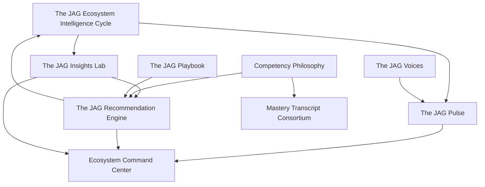

# Constitutional Amendment — The JAG™ Ecosystem Intelligence™

**AcademyOS Constitution v2.0 — Amendment No. 3 (Ecosystem Intelligence)**  
**Status:** Constitutional Architecture — No Implementation  
**Version:** 1.0  
**Effective:** June 28, 2026  
**Amends:** AcademyOS Constitution v2.0 · Master Implementation Roadmap v3.0 (future wave alignment)

---

## Amendment Summary

This amendment establishes **The JAG™ Ecosystem Intelligence™** as the permanent constitutional foundation for how The JAG Learning Ecosystem™ continuously learns, measures, understands, recommends, validates, and improves.

This amendment is **not** an AI specification, **not** a reporting specification, and **not** an implementation directive. It defines the **intelligence philosophy** of the ecosystem.

---

## Permanent Renames (Constitutional)

| Former Name | Constitutional Name | Role |
|-------------|---------------------|------|
| The JAG Improvement Cycle™ | **The JAG™ Ecosystem Intelligence Cycle™** | Permanent enterprise intelligence cycle |
| Mission Control™ | **The JAG™ Ecosystem Command Center™** | Executive operating center of the ecosystem |

Renames are **constitutional**. Implementation may retain legacy identifiers in code until an authorized alignment wave; user-facing and governance language shall adopt constitutional names.

---

## Amendment Documents

| Document | Title | File |
|----------|-------|------|
| **EI-1** | The JAG™ Ecosystem Intelligence Constitution | `THE-JAG-ECOSYSTEM-INTELLIGENCE-CONSTITUTION.md` |

---

## Document Scope Summary

| Domain | Governs |
|--------|---------|
| **Ecosystem Intelligence Cycle** | Observe → Measure → Understand → Recommend → Implement → Measure Again → Learn → Improve → Observe (never-ending) |
| **The JAG™ Pulse™** | Enterprise health index; multi-dimensional synthesis; temporal and organizational drill-down |
| **The JAG™ Voices™** | Student, Family, Educator, Leadership, Community Voice systems (continuous, not survey-only) |
| **The JAG™ Recommendation Engine™** | Evidence-backed, explainable, human-validated recommendations (never automatic decisions) |
| **The JAG™ Playbook™** | Validated practices as permanent organizational knowledge |
| **The JAG™ Insights Lab™** | What / Why / What next / Historical improvement / Evidence |
| **Competency Philosophy** | Competencies → Evidence → Mastery (not grades) |
| **Mastery Transcript Consortium** | Authoritative internal record; MTC as export, not source |
| **Ecosystem Command Center** | Consumes intelligence; does not duplicate runtime services |

---

## Relationship to Existing Constitution

| Existing Part / Document | Ecosystem Intelligence Relationship |
|--------------------------|-------------------------------------|
| **Part VIII — Knowledge & Evidence Engine™** | Authoritative evidence layer for Understand, Recommend, Learn |
| **Personal Learning Journey™ (PAJ)** | Competency progression; Mastery determinations |
| **Universal Learning Registry™ (ULR)** | Competency and domain definitions |
| **The JAG Operational Loop™** | Implement phase of enterprise lifecycle |
| **Continuous Improvement Loop (instruction)** | Learn → Improve at instructional layer |
| **The JAG Work™** | Recommendation and priority surfacing |
| **Rules Engine™** | Validation and gating for recommendations |
| **Executive Intelligence / EDI** | Measure Again; Pulse dimension inputs |
| **Global Learning Framework (Doc D)** | Competency model alignment; multilingual evidence |
| **Mastery Philosophy (Blueprint Doc 6)** | Foundational; this amendment elevates to constitutional law |
| **Mission Control (runtime)** | Future alignment to Ecosystem Command Center (consumption only) |

---

## Dependency Graph

---

## Implementation Status

| Status | Statement |
|--------|-----------|
| **This amendment** | Documentation only — no code, migrations, runtime services, or UI |
| **Pulse / Voices / Playbook / Insights Lab** | Constitutional definition — future authorized waves |
| **Ecosystem Command Center rename** | Constitutional — runtime may retain Mission Control identifiers until alignment |
| **Ecosystem Intelligence Cycle rename** | Constitutional — supersedes Improvement Cycle in governance language |

---

## Governance

Changes to **EI-1** or the permanent renames require **Constitutional Amendment**.

Delegated maintenance (without amendment) may include:

- Pulse dimension weight calibration (Configuration Studio, authorized wave)
- Voice prompt libraries and role templates
- Playbook catalog curation from validated outcomes
- Recommendation display templates (not recommendation authority)

Changes to **constitutional principles** (evidence requirement, human final decision, no automatic decisions) require full amendment process.

---

*End of Constitutional Amendment — The JAG™ Ecosystem Intelligence™*
