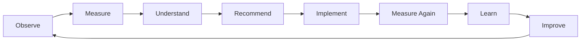
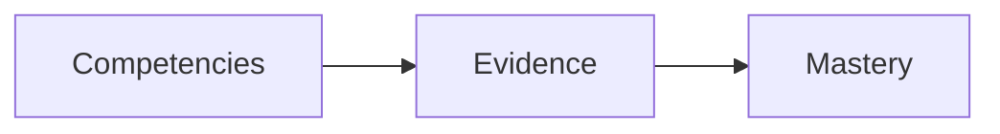
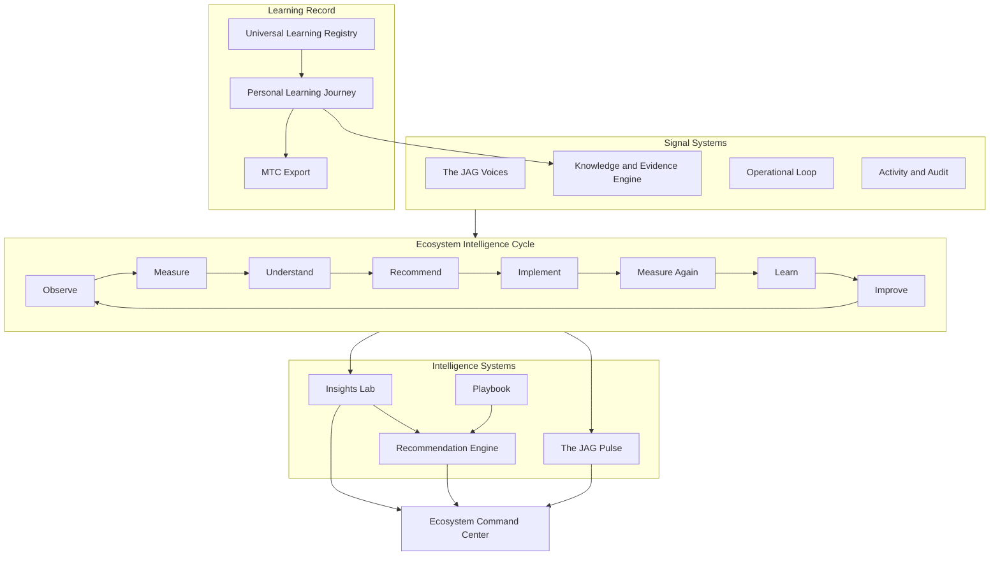

# CONSTITUTIONAL DOCUMENT EI-1 — The JAG™ Ecosystem Intelligence™ Constitution

**AcademyOS Constitution — Amendment: Ecosystem Intelligence™**  
**Status:** Constitutional Architecture — No Implementation  
**Version:** 1.0  
**Effective:** June 28, 2026  
**Parent:** Constitutional Amendment Index — Ecosystem Intelligence™  
**Supersedes (governance language):** The JAG Improvement Cycle™ · Mission Control™ (see renames)

---

## 1. Charter

**The JAG™ Ecosystem Intelligence™** defines how The JAG Learning Ecosystem™ continuously:

- **Learns** from every interaction  
- **Measures** what matters across time and context  
- **Understands** patterns, causes, and constraints  
- **Recommends** evidence-backed actions for human decision  
- **Validates** outcomes before organizational memory is updated  
- **Improves** through closed loops that never terminate  

This document is the **intelligence philosophy** of the ecosystem.

It is **not** an AI product specification.  
It is **not** a reporting or dashboard specification.  
It does **not** authorize implementation, infrastructure, or runtime services.

It establishes **what the ecosystem believes** about intelligence, evidence, mastery, recommendation, and executive operation — and **how named constitutional systems relate** to one another.

---

## 2. Constitutional Principles

These principles are **non-negotiable** within The JAG Learning Ecosystem™.

| # | Principle | Statement |
|---|-----------|-----------|
| **EI-P1** | Continuous learning | The ecosystem continuously learns. Learning is not a project phase; it is permanent operating law. |
| **EI-P2** | Interaction contributes knowledge | Every interaction contributes knowledge — instructional, operational, financial, relational, and organizational. |
| **EI-P3** | Evidence required | Recommendations require evidence. Recommendations without evidentiary foundation are not recommendations; they are speculation and shall not carry organizational authority. |
| **EI-P4** | Explainability | Recommendations are explainable. Stakeholders shall be able to answer *why* a recommendation exists. |
| **EI-P5** | Validation | Recommendations are validated. Projected impact must be tested against outcomes; validation feeds Learn and Improve. |
| **EI-P6** | Human final decision | Human leadership always makes final decisions. The ecosystem informs; it does not usurp governance, fiduciary duty, or professional judgment. |
| **EI-P7** | Validated improvement | The ecosystem improves through validated outcomes. Improvement claims require measured evidence of change, not narrative alone. |

---

## 3. The JAG™ Ecosystem Intelligence Cycle™

### 3.1 Permanent Rename

**Former name:** The JAG Improvement Cycle™  
**Constitutional name:** **The JAG™ Ecosystem Intelligence Cycle™**

This is the **permanent enterprise intelligence cycle**. It applies to the whole ecosystem — not only instruction, not only operations, not only finance.

### 3.2 Cycle Definition

The cycle **never ends**. Each completion returns to Observe.

| Phase | Constitutional Meaning |
|-------|-------------------------|
| **Observe** | The ecosystem perceives events, interactions, signals, and exceptions across all domains — without waiting for scheduled reports. |
| **Measure** | Observations become quantified, comparable, and time-bounded indicators aligned to mission and competency. |
| **Understand** | Measurement is interpreted — causality, context, constraints, and confidence are established. |
| **Recommend** | Understanding produces **proposed** actions for human review — never automatic execution at constitutional authority. |
| **Implement** | Authorized humans and governed workflows enact decisions — including instruction, placement, communication, and policy. |
| **Measure Again** | Outcomes of implementation are measured against prior baseline and recommendation claims. |
| **Learn** | Validated deltas update organizational knowledge — what worked, what failed, under what conditions. |
| **Improve** | Learning changes practice, playbooks, thresholds, and priorities — then the cycle returns to Observe. |

### 3.3 Relationship to Other Loops

| Loop | Relationship to Ecosystem Intelligence Cycle |
|------|---------------------------------------------|
| **The JAG Operational Loop™** | Primarily spans **Implement** across the student and family lifecycle (Admissions through Billing and repeat). |
| **Continuous Improvement (instructional)** | Primarily spans **Learn → Improve** at session and learner grain. |
| **The JAG™ Ecosystem Intelligence Cycle™** | **Meta-loop** — governs how all domain loops connect and how enterprise intelligence matures over time. |

No loop may bypass **Measure Again** or **Learn** when claiming organizational improvement.

---

## 4. The JAG™ Pulse™

### 4.1 Definition

**The JAG™ Pulse™** is the **enterprise health index** for the entire ecosystem.

The Pulse is a **synthesis** — it shall not reduce ecosystem health to any single metric, score, or dashboard tile.

### 4.2 Required Dimensions

At minimum, the Pulse shall synthesize:

| Dimension | Constitutional Scope |
|-----------|---------------------|
| **Learning** | Competency growth, evidence quality, mastery progression, domain balance |
| **Operational Health** | Loop completion, handoff integrity, scheduling capacity, exception rates |
| **Family Experience** | Communication timeliness, engagement, satisfaction signals, support burden |
| **Educator Experience** | Workload sustainability, compliance burden, instructional readiness, retention risk |
| **Student Experience** | Engagement, belonging, progress clarity, support adequacy |
| **Financial Sustainability** | Revenue, collections, scholarships, unit economics, cash position |
| **Organizational Capacity** | Staffing, coverage, training, leadership span, decision latency |
| **Community Engagement** | Partnerships, participation, reputation, pipeline contribution |
| **Innovation** | Experimentation yield, adoption of validated practices, time-to-playbook |
| **Research** | Evidence generation, outcome studies, external alignment (e.g., structured literacy research base) |
| **Mission Alignment** | Strategic goal progress, values adherence, equity of access and outcome |

Dimensions may be weighted by governance policy; no dimension may be omitted from constitutional consideration when declaring enterprise health.

### 4.3 Drill-Down Authority

The Pulse shall support interpretation at:

**Temporal grain:** Year · Semester · Learning Cycle™ · Month · Week · Day · Hour  

**Organizational grain:** School · Program · Teacher · Student Group  

**Learning grain:** Competency · Learning Domain  

Drill-down is **constitutional right of leadership** — aggregate health without decomposition is insufficient for decision-quality intelligence.

---

## 5. The JAG™ Voices™

### 5.1 Philosophy

Traditional periodic surveys are **insufficient** as the primary voice of the ecosystem.

**The JAG™ Voices™** replace survey-centric models with **continuous, adaptive Voice systems** that respect role, development, and context.

### 5.2 Voice Systems

| Voice | Primary Constituency |
|-------|---------------------|
| **Student Voice™** | Learners — developmentally appropriate, dignity-preserving |
| **Family Voice™** | Guardians and household stakeholders |
| **Educator Voice™** | Teachers, specialists, and instructional staff |
| **Leadership Voice™** | School and enterprise leaders |
| **Community Voice™** | Partners, alumni, employers, and civic stakeholders |

### 5.3 Voice Requirements

Each Voice shall be:

| Requirement | Statement |
|-------------|-----------|
| **Brief** | Respects time; high signal, low burden |
| **Adaptive** | Responds to context — not identical prompts for every respondent every time |
| **Role-specific** | Questions and framing match authority and experience |
| **Developmentally appropriate** | Especially for Student Voice™ |
| **Pulse-contributing** | Voice signals feed The JAG™ Pulse™ — not isolated satisfaction spreadsheets |

Voice data contributes to **Understand** and **Measure Again**; it does not alone determine mastery or automatic action.

---

## 6. The JAG™ Recommendation Engine™

### 6.1 Authority Boundary

**Recommendations shall never be automatic decisions.**

The Recommendation Engine produces **proposals for human review**. Implementation requires explicit human or governed workflow authorization consistent with **EI-P6**.

### 6.2 Required Recommendation Disclosure

Every recommendation presented at constitutional authority shall display:

| Element | Purpose |
|---------|---------|
| **Why it exists** | Triggering condition, rule, or pattern |
| **Supporting evidence** | Linked evidence records, metrics, or Voice signals |
| **Confidence** | Epistemic confidence — not false precision |
| **Expected impact** | Projected effect on Pulse dimensions and competencies |
| **Estimated implementation effort** | Human and operational cost |
| **Estimated time to improvement** | Realistic horizon for Measure Again |
| **Historical success patterns** | Prior validated outcomes in similar contexts |
| **Related competencies** | ULR / PAJ linkage |
| **Related Knowledge Assets** | JAG Knowledge System references |
| **Related Playbooks** | See Section 7 |
| **Related Learning Domains** | Instructional context |
| **Related Operational Domains** | Admissions, scheduling, finance, etc. |

Recommendations failing **EI-P3** or **EI-P4** shall not be issued as organizational recommendations.

### 6.3 Validation

Recommendations enter **Measure Again** when implemented. Invalidated recommendations shall not become Playbooks.

---

## 7. The JAG™ Playbook™

### 7.1 Definition

**The JAG™ Playbook™** is the corpus of **validated practices** that have become **permanent organizational knowledge**.

Playbooks are not opinion documents. They are **outcome-validated** through the Ecosystem Intelligence Cycle.

### 7.2 Generation

Playbooks shall be generated from **validated outcomes** — not from anecdote, vendor marketing, or unmeasured pilot enthusiasm.

### 7.3 Use

Every recommendation **may** reference one or more Playbooks. Playbooks shorten **Understand** and increase confidence in **Recommend** — they do not remove human decision authority.

Playbooks connect to:

- Instructional Playbook (Blueprint Doc 22) at delivery layer  
- JAG Knowledge System asset classification  
- Rules Engine™ where automated **gating** (not automatic action) is authorized  

---

## 8. The JAG™ Insights Lab™

### 8.1 Purpose

**The JAG™ Insights Lab™** is the constitutional mandate for **analytic depth** — the ecosystem must continuously answer:

| Question | Cycle Phase |
|----------|-------------|
| **What happened?** | Observe · Measure |
| **Why did it happen?** | Understand |
| **What is likely to happen next?** | Understand · Recommend |
| **What has historically improved similar situations?** | Learn · Playbook |
| **What evidence supports that conclusion?** | All phases — especially Recommend and Validate |

The Insights Lab is **not** a product name for a single dashboard. It is the **intellectual obligation** of Ecosystem Intelligence — fulfilled through Knowledge Graph™, Rules Engine™, PAJ analytics, operational diagnostics, and governed research.

### 8.2 Boundary

Insights without evidence are hypotheses. Hypotheses may inform inquiry; they shall not carry recommendation authority until evidence-backed.

---

## 9. Competency Philosophy

### 9.1 Foundational Statement

**The JAG Learning Ecosystem™ does not define learners by grades.**

Grades may exist as **reporting or export artifacts**. They are **not** the authoritative model of learner state.

The ecosystem defines learning through:

### 9.2 Mastery Determination

Mastery determinations shall be based upon:

- Evidence gathered **over time**  
- Evidence gathered **across contexts**  
- ULR-aligned competency definitions  
- Educator confirmation where constitutionally required (e.g., PAJ advance gates)  

**Time does not determine mastery. Evidence determines mastery.**  
(Consistent with Academy Way Mastery Philosophy — Blueprint Doc 6; elevated herein to constitutional law.)

### 9.3 Authoritative Record

The **Personal Learning Journey™**, **Knowledge & Evidence Engine™**, and **Universal Learning Registry™** jointly maintain the authoritative competency and evidence record.

---

## 10. Mastery Transcript Consortium (MTC)

### 10.1 Internal Supremacy

The **internal learning record shall be richer than any transcript.**

The JAG Learning Ecosystem™ maintains the **authoritative** competency and evidence record.

### 10.2 Export Model

**Mastery Transcript Consortium (MTC) transcripts shall be generated from the authoritative record** — not the reverse.

| Layer | Authority |
|-------|-----------|
| **Internal PAJ + KEE record** | Authoritative — full evidence, context, recommendations, instructional history |
| **MTC export** | Interoperability and college/career presentation — derived, lossy-by-necessity |
| **Traditional grade reports** | Optional export artifacts — non-authoritative for mastery claims |

### 10.3 Compatibility Obligation

The internal model shall remain **fully compatible with MTC** while preserving richer instructional, evidence, and recommendation data internally.

No external transcript format shall force reduction of internal evidence below constitutional requirements.

---

## 11. The JAG™ Ecosystem Command Center™

### 11.1 Permanent Rename

**Former name:** Mission Control™  
**Constitutional name:** **The JAG™ Ecosystem Command Center™**

### 11.2 Role

The Ecosystem Command Center is the **executive operating center** of the ecosystem.

It is the primary operational interface for executives, school leaders, and operational staff when **enterprise intelligence must become action-oriented awareness**.

### 11.3 Consumption Law

The Ecosystem Command Center **consumes intelligence**. It **does not duplicate runtime services**.

| It shall surface | It shall not re-implement |
|------------------|---------------------------|
| Pulse and dimension drill-down | Business logic owned by domain modules |
| Priorities from JAG Work™, Rules, Loop | Duplicate scoring engines |
| Activity and loop transitions | Parallel event systems |
| Recommendations for human decision | Automatic decision execution |
| Alerts and exceptions | Alert generation rules at domain layer |

Runtime implementations may temporarily use legacy identifiers (e.g., Mission Control) until an authorized alignment wave. Constitutional and governance language shall use **Ecosystem Command Center**.

---

## 12. Constitutional System Map

---

## 13. Relationship to Runtime (Non-Authorizing)

This constitution **names and binds philosophy**. It **does not authorize** code, schema, or service creation.

Future implementation waves may **align** existing runtime to these names and obligations:

| Constitutional System | Illustrative Runtime Alignment (future, not mandated herein) |
|-----------------------|---------------------------------------------------------------|
| Ecosystem Intelligence Cycle | Meta-loop documentation; executive reporting cadence |
| Pulse | Enterprise scorecard, OEI, multi-dimensional health synthesis |
| Voices | Portal micro-prompts; adaptive check-ins; Pulse inputs |
| Recommendation Engine | EDI decisions, JAG Work items, Rules Engine gates |
| Playbook | Instructional Playbook, knowledge assets, validated outcome registry |
| Insights Lab | Executive intelligence, diagnostics, graph analytics |
| Ecosystem Command Center | Mission Control compose layer — consumption only |
| Competency / MTC | PAJ, KEE, ULR; MTC export generation |

Absence of alignment does not weaken constitutional law; it indicates **implementation debt**.

---

## 14. Amendment and Governance

| Change Type | Process |
|-------------|---------|
| Principles EI-P1 through EI-P7 | Full constitutional amendment |
| Permanent renames | Full constitutional amendment |
| Pulse dimension set | Amendment or delegated Configuration Studio (authorized wave) |
| Voice prompt libraries | Delegated maintenance |
| Playbook catalog | Delegated curation from validated outcomes |
| Recommendation display fields | Delegated UX — authority rules unchanged |

---

## 15. Effective Statement

Upon effective date, **The JAG™ Ecosystem Intelligence™ Constitution** is the permanent foundation for ecosystem intelligence philosophy within The JAG Learning Ecosystem™.

All future intelligence, recommendation, mastery, transcript, and executive operating specifications shall **conform** to this document unless amended constitutionally.

---

*End of Constitutional Document EI-1 — The JAG™ Ecosystem Intelligence™ Constitution*
