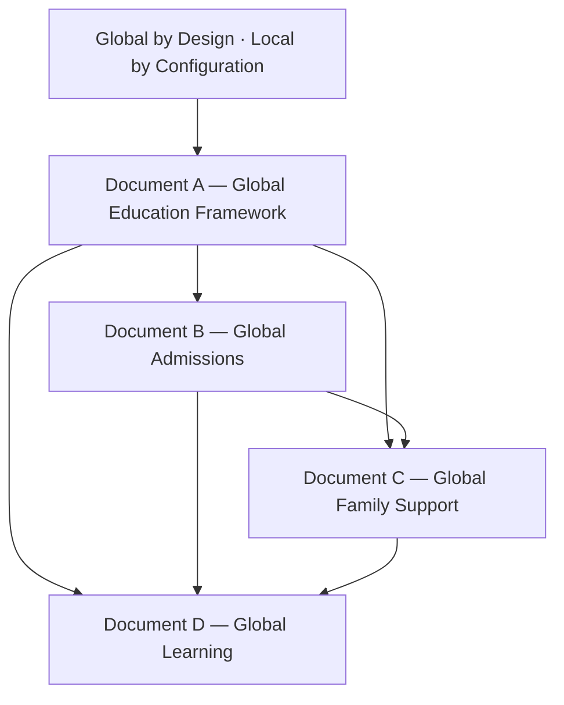

# Constitutional Amendment — Global Education Framework™

**AcademyOS Constitution v2.0 — Amendment No. 2 (Global Education)**  
**Status:** Constitutional Architecture — No Implementation  
**Version:** 1.0  
**Effective:** June 27, 2026  
**Amends:** AcademyOS Constitution v2.0 · Master Implementation Roadmap v3.0 (future wave alignment)

---

## Amendment Summary

This amendment establishes **Global Education Framework™** as a foundational constitutional layer for international operation of AcademyOS, The Academy Virtual™, and The Academy High School™.

---

## New Constitutional Principle

> **AcademyOS shall be GLOBAL BY DESIGN. LOCAL BY CONFIGURATION.**

The platform shall **never assume** that learners reside in a single country, speak a single language, use a single currency, follow a single educational system, or qualify for a single funding model.

All localization shall occur through **configurable frameworks** while preserving **one unified Education Operating System**.

---

## Amendment Documents

| Document | Title | File |
|----------|-------|------|
| **A** | Global Education Framework™ | `A-GLOBAL-EDUCATION-FRAMEWORK.md` |
| **B** | Global Admissions Framework™ | `B-GLOBAL-ADMISSIONS-FRAMEWORK.md` |
| **C** | Global Family Support Framework™ | `C-GLOBAL-FAMILY-SUPPORT-FRAMEWORK.md` |
| **D** | Global Learning Framework™ | `D-GLOBAL-LEARNING-FRAMEWORK.md` |

---

## Document Scope Summary

| Document | Governs |
|----------|---------|
| **A** | Global/local architecture, compliance, country/region config, language, curriculum/assessment/funding/reporting localization, timezone, currency, translation, accessibility |
| **B** | Worldwide admissions, geographic entities, mobility profiles, transcripts, verification, translation, military/expat/homeschool/partner pathways |
| **C** | Worldwide family support, funding, scholarships, government/military/SEND/therapy resources, embassies, NGOs, universities, AI localization |
| **D** | Instructional adaptation, multilingual learning, localized domains, global citizenship, collaboration, Global Opportunity Intelligence™ |

---

## Relationship to Existing Constitution

| Existing Part | Global Amendment Relationship |
|---------------|------------------------------|
| **Part II — Platform Kernel** | Configuration Studio extended for country/region packs |
| **Part V — Family Journey™** | Document C extends worldwide; Document B admissions intake |
| **Part VI — Student Success™** | Global Opportunity Intelligence extends Doc 9 |
| **Part VI-D — Neurodiverse Profiles** | Global resource framing; no US-only SEND assumption |
| **Part VI-F — Wilson Framework** | English instruction; multilingual family/support surfaces |
| **Part VII-E — Scheduling Intelligence** | Timezone-global scheduling mandatory |
| **Part VIII — KEE** | Multilingual evidence; jurisdiction metadata |
| **Wave 4.5 — Academy Growth Platform** | Global inquiry and admissions |
| **Wave 5.5 — Funding Intelligence** | Document C funding catalogs |
| **Academy Way Blueprint (Docs 1–24)** | Document D; ULR locale overlays (Doc 12) |

---

## Dependency Graph

---

## Implementation Status

| Status | Statement |
|--------|-----------|
| **This amendment** | Documentation only — no code, migrations, or module changes |
| **Configuration Studio** | Country packs — future authorized wave |
| **Phase 4 ULR** | Locale overlays reference Document A/D |
| **Atomic Skill Libraries** | Deferred — unchanged from Phase 3/3.5 |

---

## Governance

Changes to the Global Education Framework require **Constitutional Amendment** unless expressly delegated to Configuration Studio for:

- Country pack content updates  
- Resource catalog maintenance  
- Translation pack revisions  
- Funding program additions  

Changes to **GEF-1 through GEF-6** (Document A) or the core principle require full amendment process.

---

*End of Constitutional Amendment — Global Education Framework™*
