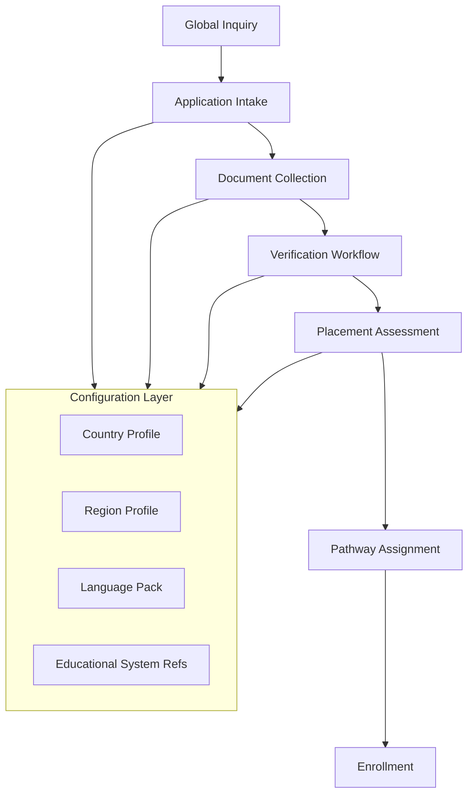
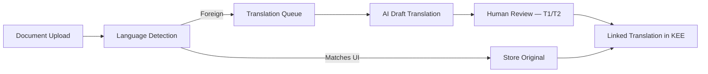

# CONSTITUTIONAL DOCUMENT B — Global Admissions Framework™

**AcademyOS Constitution — Amendment: Global Education Framework™**  
**Status:** Constitutional Architecture — No Implementation  
**Version:** 1.0  
**Effective:** June 27, 2026  
**Parent:** Document A — Global Education Framework™  
**Integrates:** Part V Family Journey™ · Wave 4.5 Academy Growth Platform™

---

## 1. Charter

The **Global Admissions Framework™ (GAF)** defines how AcademyOS supports **worldwide enrollment** for The Academy Virtual™, The Academy High School™, and partner organizations — without assuming a single national admissions model.

**Admissions is the front door to the Personal Academic Journey™.** Every family, regardless of country, language, or prior schooling context, receives an equitable, evidence-informed path to enrollment.

---

## 2. Constitutional Principles

| Principle | Statement |
|-----------|-----------|
| **Global intake** | One admissions architecture; local requirements via configuration |
| **No geographic exclusion by design** | Country availability governed by legal/compliance activation — not platform assumption |
| **Language-inclusive** | Application and support in family's preferred language where pack available |
| **Evidence over pedigree** | Placement from demonstrated learning — not school brand alone |
| **Mobile families first-class** | Military, expat, digital nomad, homeschool — explicit support |
| **Document integrity** | International verification workflow — not US-transcript-only |

---

## 3. Admissions Architecture



---

## 4. Geographic Scope Model

### 4.1 Supported Geographic Entities

| Entity Type | Configuration Key | Examples |
|-------------|-------------------|----------|
| **Country** | `country_code` ISO 3166-1 | US, CA, MX, GB, DE, AE, SG, AU, JP, BR |
| **State / Province** | `region_code` | US-CA, CA-ON, AU-NSW |
| **Territory** | `region_code` | US-PR, FR-GP |
| **Region (custom)** | `region_code` | US-MIL-EU, APAC-EXPAT |
| **Language (application)** | BCP 47 | Independent of residence |

### 4.2 Enrollment Availability States

| State | Meaning |
|-------|---------|
| **Open** | Active enrollment for country/region |
| **Waitlist** | Interest captured; compliance or capacity pending |
| **Restricted** | Specific programs only (e.g., async-only) |
| **Suspended** | Legal/compliance hold |
| **Partner-only** | Via accredited partner org |

---

## 5. Applicant & Family Classification

### 5.1 Residency & Citizenship

| Field | Purpose |
|-------|---------|
| `country_of_residence` | Primary legal residence |
| `region_of_residence` | State/province where applicable |
| `countries_of_citizenship[]` | May be multiple |
| `residency_status` | Citizen, permanent resident, temporary, diplomatic, military, undocumented (where legally enrollable), other |
| `prior_countries[]` | Relocation history — supports mobile families |

**Rule:** Citizenship and residency captured for **compliance and support** — not discriminatory exclusion unless legally required and disclosed.

### 5.2 Family Mobility Profiles

| Profile Key | Description | Admissions Support |
|-------------|-------------|-------------------|
| `mobility.stationary` | Stable residence | Standard pathway |
| `mobility.military` | Active duty, DoDEA, NATO | Transfer-friendly; deployment-aware scheduling notes |
| `mobility.expat` | Working abroad; non-local citizenship | International transcript emphasis; embassy resources link |
| `mobility.digital_nomad` | Mobile residence | Flexible document timing; timezone capture |
| `mobility.refugee_displaced` | Displaced from home country | Alternative documentation pathway; humanitarian review |
| `mobility.cross_border` | Daily or weekly border crossing | Multi-jurisdiction compliance check |

---

## 6. Educational Systems Recognition

### 6.1 Educational System Registry

```
EducationalSystem
    ├── system_key
    ├── country_code
    ├── system_name              (e.g., "UK National Curriculum", "IB", "US K-12")
    ├── grade_level_mapping[]    (to Academy placement bands — not grade gates)
    ├── typical_entry_ages[]
    ├── credential_types[]
    └── transcript_format_refs[]
```

### 6.2 Prior Schooling Types

| Type | Intake Handling |
|------|-----------------|
| **International private school** | Standard transcript + verification |
| **International homeschool** | Portfolio + parent affidavit per jurisdiction |
| **National public school** | Transcript + translation if needed |
| **Montessori / Waldorf / alternative** | Competency narrative + assessment |
| **Microschool / pod** | Guardian attestation + placement assessment |
| **No prior formal schooling** | Diagnostic placement — open entry (Doc 6) |
| **Gap year / break** | Timeline narrative; refresh assessment |

**Rule:** No single "valid" school type globally — placement uses **evidence**.

---

## 7. Graduation Pathways (Admissions Context)

At inquiry, families receive **pathway information** for their jurisdiction:

| Pathway Element | Source |
|-----------------|--------|
| **Academy graduation** | Graduation Readiness Engine (Doc 7) — global |
| **Local equivalency** | Country/region pack — e.g., US diploma, UK IGCSE/A-Level alignment notes |
| **Transfer credits** | Not credit-based — **competency crosswalk** from prior learning |
| **University recognition** | Informational — jurisdiction-specific supplements on transcript |

Admissions sets **expectations** — does not guarantee third-party recognition.

---

## 8. Application Intake

### 8.1 Universal Application Fields

| Section | Global Fields |
|---------|---------------|
| **Student** | Legal name, preferred name, DOB, languages, timezone |
| **Family** | Guardians, contact, preferred language |
| **Residence** | Country, region, address format per locale |
| **Prior education** | System, school name, dates, credentials |
| **Mobility profile** | Optional classification (§5.2) |
| **Support needs** | Learning information — not diagnostic gate |
| **Program interest** | Academy Virtual vs. High School; domains of interest |

### 8.2 Country-Specific Extensions

Activated via `admissions_requirements_key` on Country Profile:

- National ID formats  
- Compulsory education declarations  
- Homeschool registration numbers (where required)  
- Local guardian consent rules (age of consent varies)  

---

## 9. International Transcripts

### 9.1 Accepted Credential Types

| Type | Handling |
|------|----------|
| **Official transcript** | PDF/upload; original language preserved |
| **Report cards** | Multi-year aggregation accepted |
| **Exam results** | IGCSE, IB, AP, national exams — crosswalk to placement |
| **Portfolio** | Homeschool, alternative — structured upload |
| **Competency narrative** | Educator or parent — triggers assessment |
| **Micro-credential / badge** | Linked evidence — validated where issuer known |

### 9.2 Transcript Evaluation Philosophy

| Step | Action |
|------|--------|
| **1. Receive** | Original + metadata (language, system, dates) |
| **2. Translate** | If needed — workflow §10 |
| **3. Map** | Educational system → placement band hypothesis |
| **4. Assess** | Placement assessment confirms — not transcript alone |
| **5. Record** | Prior learning evidence → KEE; informs PAJ start |

**Mastery philosophy:** Transcript informs placement — does not auto-assign mastery.

---

## 10. Translation Workflow



| Document Class | Translation Requirement |
|----------------|------------------------|
| **Legal / identity** | Certified translation where jurisdiction requires |
| **Academic transcript** | Professional or human-reviewed AI |
| **Informal narrative** | AI-assisted + admissions review |
| **Family correspondence** | Real-time AI + glossary |

Original always retained; translation marked with `translator_type`, `review_date`.

---

## 11. International Document Verification

### 11.1 Verification Tiers

| Tier | Method | Use |
|------|--------|-----|
| **V1 Self-attestation** | Guardian upload + declaration | Initial homeschool; provisional |
| **V2 Institutional confirm** | Email/domain verification to school | Standard private/public |
| **V3 Credential service** | WES, ENIC-NARIC, ICAS, etc. integration | High-stakes placement |
| **V4 Manual review** | Admissions specialist | Complex cases |

### 11.2 Document Types

| Document | Global Support |
|----------|----------------|
| Birth certificate / national ID | Country format templates |
| Passport | MRZ metadata capture; photo ID |
| Prior enrollment proof | School letter |
| Immunization / health | Jurisdiction-dependent — not universal gate |
| Custody / guardianship | Legal document upload |
| Homeschool affidavit | Region-specific template |

### 11.3 Passport Support

| Feature | Description |
|---------|-------------|
| **Passport capture** | Secure upload; expiry tracking for international travel programs |
| **Name alignment** | Match legal name across documents |
| **Visa field (optional)** | Visa type, expiry — for program planning only |
| **Privacy** | Restricted access; compliance with identity document rules |

**Rule:** Visa information is **optional** — collected only where relevant to program or family request; never immigration enforcement.

---

## 12. International Recommendations

| Source | Workflow |
|--------|----------|
| **Teacher recommendation** | Secure link; multilingual form |
| **Counselor / head of school** | Institutional email verification |
| **Tutor / specialist** | Optional; Wilson provider for SL placement |
| **Peer (Venture Lab)** | Not for admissions — post-enrollment |

Recommendations stored in KEE — linked to admissions record until enrollment converts to student profile.

---

## 13. Segment-Specific Pathways

### 13.1 Military Families

| Support | Description |
|---------|-------------|
| **Mobility profile** | `mobility.military` |
| **Transfer acceleration** | Prior Academy or DoDEA records fast-track |
| **Deployment scheduling** | Notes for SIE — async options |
| **Resources** | Doc C military catalog |
| **Region codes** | Military region virtual configs |

### 13.2 Expat Families

| Support | Description |
|---------|-------------|
| **Multi-country history** | Prior schools in multiple countries |
| **Embassy resources** | Doc C embassy links |
| **Timezone** | Primary scheduling zone capture |
| **Repatriation pathway** | Home country graduation supplement info |

### 13.3 Digital Nomad Families

| Support | Description |
|---------|-------------|
| **Flexible address** | Current location + "nomadic" flag |
| **Document timing** | Extended upload windows |
| **Async emphasis** | Scheduling Intelligence preference |
| **Connectivity attestation** | Technical readiness check |

### 13.4 International Homeschool Families

| Support | Description |
|---------|-------------|
| **Portfolio intake** | Structured homeschool evidence upload |
| **Jurisdiction compliance** | Country pack homeschool registration rules |
| **Parent as educator** | Family Journey linkage — not teacher replacement for Wilson |
| **Placement assessment** | Required for domain entry |

### 13.5 International Private Schools (Partner)

| Support | Description |
|---------|-------------|
| **B2B enrollment** | Org-level contract; bulk student intake |
| **Credential alignment** | Partner crosswalk to ULR |
| **White-label portal** | Org configuration |
| **Shared evidence** | Transfer between partner and Academy with consent |

---

## 14. Placement & Enrollment Completion

| Stage | Output |
|-------|--------|
| **Placement assessment** | Domain band assignments on PAJ |
| **Learning Profile seed** | Doc 19 baseline from intake |
| **Language configuration** | UI + family communication language |
| **Timezone / currency** | Profile defaults |
| **Compliance consents** | Jurisdiction-specific — captured |
| **Family Journey activation** | Onboarding pathways (Doc 8) |
| **Funding surfacing** | Doc C programs eligible by profile |

---

## 15. Integration Matrix

| System | Role |
|--------|------|
| **Document A** | Country/region/language config |
| **Document C** | Post-inquiry family support |
| **Document D** | Instructional language + localization |
| **Academy Growth Platform** | Pre-enrollment marketing + inquiry |
| **KEE** | Documents, translations, verification evidence |
| **Workflow Engine** | Admissions pipeline states |
| **Configuration Studio** | Country admissions packs |
| **PAJ** | Placement → journey start |

---

## 16. Governance

| Rule | Requirement |
|------|-------------|
| **GAF-1** | No country excluded by UI default — only by explicit config state |
| **GAF-2** | Original language documents always preserved |
| **GAF-3** | Visa data optional and purpose-limited |
| **GAF-4** | Placement requires assessment — transcript alone insufficient for mastery |
| **GAF-5** | Military and displaced families have alternative documentation paths |
| **GAF-6** | Admissions decisions auditable; bias review periodic |

---

*End of Constitutional Document B — Global Admissions Framework™*
