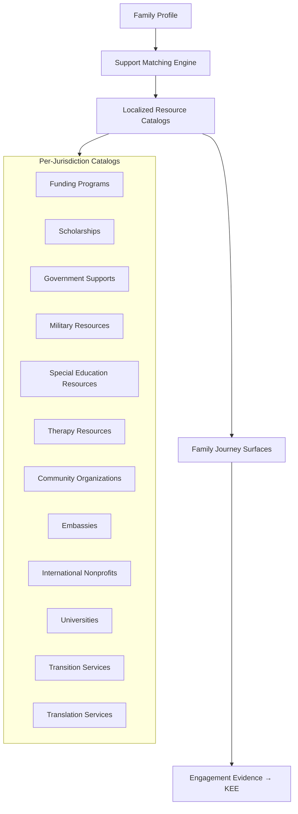

# CONSTITUTIONAL DOCUMENT C — Global Family Support Framework™

**AcademyOS Constitution — Amendment: Global Education Framework™**  
**Status:** Constitutional Architecture — No Implementation  
**Version:** 1.0  
**Effective:** June 27, 2026  
**Parent:** Document A — Global Education Framework™  
**Integrates:** Part V Family Journey™ · Wave 5.5 Funding Intelligence Platform™ · Document 8 · Document 20

---

## 1. Charter

The **Global Family Support Framework™ (GFSF)** defines how AcademyOS delivers **worldwide family support** — connecting families to funding, services, community resources, and localized guidance without assuming US-only programs or English-only communication.

**Families are partners in the Personal Academic Journey™.** Support is **surfaced intelligently**, **localized by configuration**, and **respectful of jurisdiction**.

---

## 2. Constitutional Principles

| Principle | Statement |
|-----------|-----------|
| **Inform, not advise legally** | Platform surfaces resources — families consult professionals for legal, tax, immigration, medical decisions |
| **Country-aware** | Resources filtered by residence, citizenship, and mobility profile |
| **Strengths-first** | Support framing aligns with VI-D — not deficit |
| **Accessible language** | Family language preference drives content delivery |
| **Evidence-linked** | Family engagement with resources → KEE (VI-F.16) |
| **No pay-to-access support info** | Core resource directory free to enrolled and inquiry families |

---

## 3. Support Architecture



**Matching inputs:** `country_code`, `region_code`, `mobility_profile`, `languages[]`, learner profile support needs, program enrollment.

---

## 4. Country-Specific Funding

### 4.1 Funding Program Catalog

```
FundingProgram
    ├── program_key
    ├── program_name (localized)
    ├── jurisdiction_scope[]      (country, region)
    ├── program_type              (voucher, ESA, tax_credit, grant, subsidy, employer)
    ├── eligible_population       (description)
    ├── eligibility_rules[]       (configurable rule refs)
    ├── application_url
    ├── application_deadlines[]
    ├── currency
    ├── max_benefit_amount
    ├── stacks_with[]             (other program keys)
    ├── documentation_required[]
    ├── status                    (active, seasonal, deprecated)
    └── disclaimer_key            (legal disclaimer ref)
```

### 4.2 Funding Intelligence Integration

| Capability | Description |
|------------|-------------|
| **Eligibility surfacing** | Rule engine matches family profile to programs |
| **Deadline alerts** | Workflow notifications |
| **Application tracking** | Family-managed status — not submitted on family's behalf without authorization |
| **Academy scholarships** | Org-level + global scholarship registry |
| **Currency display** | Local currency per Document A |

**Examples (configuration — not hard-coded):**

| Jurisdiction | Program Types Surfaced |
|--------------|------------------------|
| **United States** | State ESAs, vouchers, 529, employer tuition |
| **Canada** | Provincial supports where catalogued |
| **UK** | Local authority guidance links |
| **UAE / SG / AU** | Expat and national programs as catalogued |
| **EU** | Country-specific — GDPR-compliant data handling |

**Rule:** Catalog maintained by Configuration Studio + legal review — not scraped without verification.

---

## 5. Scholarships

### 5.1 Scholarship Registry

| Type | Scope |
|------|-------|
| **Academy global** | The Academy Virtual / High School merit and need |
| **Academy regional** | Geographic or mission-based |
| **Partner** | Third-party scholarships accepting Academy enrollment |
| **External** | Directory links — application external |
| **Military** | Dedicated military family scholarships |
| **Neurodiversity / learning difference** | Strength-based eligibility framing |

### 5.2 Scholarship Matching

| Input | Match |
|-------|-------|
| Residence / citizenship | Geographic eligibility |
| Mastery / readiness | Merit criteria where applicable |
| Mobility profile | Military, expat-specific |
| Family Journey progress | Engagement-based optional criteria |
| Financial attestation | Need-based — privacy-protected |

---

## 6. Government Supports

| Category | Examples | Delivery |
|----------|----------|----------|
| **Education subsidies** | National tuition support | Link + eligibility checker |
| **Disability / SEND** | National disability entitlements | Informational pathways |
| **Housing / relocation** | Military housing, expat allowances | Military/expat profiles |
| **Tax benefits** | Education tax credits | Informational + disclaimer |
| **Homeschool registration** | Required filings | Jurisdiction checklist |
| **School choice programs** | Vouchers, ESAs | Funding catalog |

**Disclaimer:** AcademyOS provides **information aggregation** — not tax, legal, or benefits advice.

---

## 7. Military Resources

| Resource Type | Description |
|---------------|-------------|
| **DoDEA / MIC3** | Interstate Compact links; transfer guidance |
| **Installation services** | MWR, education offices — geo-linked where available |
| **Deployment support** | Scheduling flexibility documentation for SIE |
| **Tuition assistance** | Military TA programs by branch — catalog |
| **Purple Star / school liaison** | Transition support contacts |
| **NATO / allied forces** | Partner nation military family resources |

**Profile link:** `mobility.military` triggers military catalog priority surfacing.

---

## 8. Special Education Resources

| Resource Type | Global Framing |
|---------------|----------------|
| **National SEND systems** | UK SEND, US IDEA links, equivalent by country |
| **Advocacy organizations** | Decoding Dyslexia (international chapters), local dyslexia associations |
| **Evaluation guidance** | How to obtain learning assessments by jurisdiction |
| **Accommodation templates** | Request letter guides — localized |
| **Wilson / structured literacy** | Provider directories where available |

**Constitutional alignment:** VI-D — resources support **learning profiles**, not labels.

---

## 9. Therapy Resources

| Resource Type | Notes |
|---------------|-------|
| **Educational therapy** | Orton-Gillingham tutors, speech, OT directories |
| **Teletherapy** | International providers where licensed |
| **Insurance / funding** | Jurisdiction-specific coverage info — informational |
| **School-based vs. private** | Guidance by country |
| **Crisis resources** | Country-specific crisis lines — T1 translated |

**Rule:** Therapy recommendations are **directory links** — not medical referrals from platform.

---

## 10. Community Organizations

| Organization Type | Examples |
|-------------------|----------|
| **Local homeschool associations** | By country/region |
| **Cultural community centers** | Diaspora communities |
| **Faith-based education support** | Optional filter |
| **STEM / maker spaces** | Opportunity Engine overlap |
| **Youth entrepreneurship** | Venture Lab community |
| **Sports / arts** | Whole-child scheduling context |

Geo-matching by residence + optional radius for in-person resources.

---

## 11. Embassies & Consulates

| Service | Description |
|---------|-------------|
| **Education officer contacts** | For expat families |
| **Document authentication** | Apostille guidance links |
| **Citizenship services** | Informational — not legal advice |
| **Emergency contact** | Crisis routing |

Surfaced when `mobility.expat` or multi-citizenship profile detected.

---

## 12. International Nonprofits

| Category | Examples |
|----------|----------|
| **Global education** | UNESCO resources, education NGOs |
| **Refugee / displaced education** | UNHCR education links |
| **Girls' education / equity** | Mission-aligned orgs |
| **Learning difference global** | International Dyslexia Association, etc. |
| **Digital access** | Device and connectivity programs |

Vetted catalog — Configuration Studio managed.

---

## 13. Universities

| Resource Type | Description |
|---------------|-------------|
| **Admissions requirements** | By country — links to official sources |
| **Homeschool / non-traditional acceptance** | Country guides |
| **International student pathways** | For expat students applying to third countries |
| **Early college / dual enrollment** | Where legally available — region config |
| **Scholarship databases** | External links |

**Integration:** Graduation Readiness (Doc 7) + Opportunity Engine (Doc 9) — post-secondary matching.

---

## 14. Transition Services

| Transition | Support |
|------------|---------|
| **School to school** | Transfer packet; transcript; PAJ continuity |
| **Academy to post-secondary** | Readiness report; portfolio; transcript reader's guide |
| **Country relocation mid-year** | Compliance checklist; document export |
| **Military PCS** | Accelerated records transfer |
| **Age-out / graduation** | Alumni Family Journey pathways |
| **Wilson exit → maintenance** | VI-F.16 long-term monitoring resources |

---

## 15. Translation Services

| Service Tier | Use |
|--------------|-----|
| **Platform UI** | Locale packs (Document A) |
| **Family Journey content** | Translated pathways |
| **Document translation** | Admissions workflow (Document B) |
| **Live interpretation** | Partner referrals for conferences — catalog |
| **Sign language** | Accessibility resources by region |
| **Glossary** | Academy Way terms per locale |

---

## 16. AI-Powered Localization

| Capability | Guardrails |
|------------|------------|
| **Resource summarization** | Summarize external program in family language |
| **Eligibility explanation** | Plain-language eligibility — disclaimer attached |
| **Chat support** | Family AI coach in preferred language |
| **Funding Q&A** | Informational only — escalate to human for legal/tax |
| **Cultural adaptation** | Examples localized — not stereotypes |
| **Glossary enforcement** | Branded terms consistent |

| Rule | Requirement |
|------|-------------|
| **Human escalation** | Legal, immigration, medical, crisis → human |
| **No fabricated programs** | AI cites catalog keys only — no invented funding |
| **Confidence display** | Low-confidence localization flagged |
| **Review queue** | New country AI content human-sampled |

---

## 17. Family Journey Integration

| Pathway Category | Global Extension |
|------------------|------------------|
| **Funding literacy** | Country-specific "Understanding your options" |
| **Advocacy** | Local SEND/advocacy resources |
| **Wilson home support** | VI-F.16 — multilingual parent guides |
| **Military transition** | PCS preparation pathway |
| **Expat settling** | New country education orientation |
| **Homeschool compliance** | Jurisdiction registration pathway |

All pathways contribute to Family Engagement evidence → KEE.

---

## 18. Privacy & Data

| Rule | Requirement |
|------|-------------|
| **Minimum data for matching** | Only fields needed for eligibility |
| **Sensitive data** | Income, disability — optional, encrypted, consent |
| **Third-party links** | Clear exit notice when leaving platform |
| **GDPR / local privacy** | Compliance packs per Document A |
| **No selling data** | Resource partners do not receive family PII without consent |

---

## 19. Governance

| Rule | Requirement |
|------|-------------|
| **GFSF-1** | Every funding resource has jurisdiction scope and disclaimer |
| **GFSF-2** | Resources reviewed annually — deprecated programs removed |
| **GFSF-3** | Military and displaced families receive priority catalog curation |
| **GFSF-4** | AI never invents government programs |
| **GFSF-5** | Crisis resources localized and tested per country pack |
| **GFSF-6** | Family support accessible in family language where pack exists |

---

*End of Constitutional Document C — Global Family Support Framework™*
